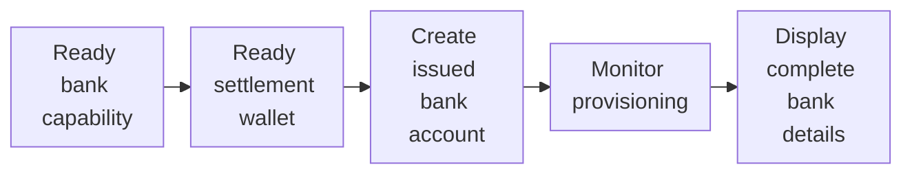

Utiliza una cuenta bancaria emitida cuando el cliente necesite datos bancarios reutilizables. Para instrucciones de financiación de un solo uso vinculadas a un importe específico, utiliza en su lugar [Recibir fondos](/es/integration/receive-funds).


```mermaid
%%{init: {"flowchart": {"rankSpacing": 20, "nodeSpacing": 16, "wrappingWidth": 80, "padding": 8}}}%%
flowchart LR
  A["Ready bank capability"] --> B["Ready settlement wallet"]
  B --> C["Create issued bank account"]
  C --> D["Monitor provisioning"]
  D --> E["Display complete bank details"]
```

## Antes de empezar

Necesitas un ID de cliente, una capacidad bancaria lista para el método y moneda previstos y una cartera emitida lista propiedad del mismo cliente. Con `allowPending`, puedes guardar la solicitud mientras el banco seleccionado todavía revisa al cliente. Completa el trabajo abierto mediante [Capacidades y tareas](/es/integration/onboarding/capabilities-and-requirements).

## 1. Crea o selecciona la cartera de liquidación

Crea una cartera emitida mediante [Cuentas y carteras](/es/integration/accounts#create-the-account) y vuelve a leerla. Continúa solo cuando su estado actual permita la liquidación.

Guarda el `data.id` derivado de la respuesta como `SETTLEMENT_WALLET_ID`. No utilices una cartera externa para `settlement.accountId`.

## 2. Crea la cuenta bancaria emitida

Utiliza [`POST /v3/customers/{customerId}/accounts`](/api-reference/accounts/post-v3-customers-by-customer-id-accounts) con estas cabeceras:

```http
X-API-Key: ${SWIPELUX_API_KEY}
Idempotency-Key: issued-bank-account-001
Content-Type: application/json
```

Envía este cuerpo de solicitud:

```json
{
  "origin": "issued",
  "type": "bank",
  "method": "ach",
  "country": "US",
  "currency": "USD",
  "settlement": {
    "accountId": "${SETTLEMENT_WALLET_ID}"
  },
  "label": "USD account"
}
```

Guarda el `data.id` devuelto como `BANK_ACCOUNT_ID`. Conserva también `data.status`, `data.openTaskIds`, `data.details` y la relación de liquidación.

Campos opcionales de la solicitud:

| Campo | Se aplica a | Comportamiento |
| --- | --- | --- |
| `institution` | `ach`, `wire` y `swift` emitidas | Selecciona exactamente este banco. Swipelux no recurre a otro banco. Utiliza un ID de institución devuelto por la respuesta de capacidades admitidas. |
| `allowPending` | `ach`, `wire` y `swift` emitidas | Establécelo en `true` para guardar la solicitud mientras la aplicación del banco seleccionado espera aprobación. Requiere `institution`. |
| `settlement.currency` | Cuentas bancarias emitidas | `USDC` o `USDT`. Define la stablecoin que se entrega a la cartera de liquidación. |

### Elige el banco {#choose-the-bank}

Envía `institution` cuando el cliente necesite datos bancarios de un banco específico. Swipelux reserva una cuenta emitida por cliente, método, moneda e institución. Una solicitud sin `institution` devuelve `409 conflict` si el cliente ya tiene una cuenta emitida para ese método y moneda en cualquier banco. Una solicitud con `institution` devuelve `409 conflict` solo si ya existe una cuenta para ese banco.

Las lecturas de la cuenta devuelven el banco seleccionado como `institution` con `id`, `name` y `bic`. `bic` puede ser `null`.

La idempotencia se aplica al banco seleccionado. Repetir la misma solicitud devuelve la cuenta original. Cambiar `institution` con la misma `Idempotency-Key` devuelve `409 idempotency_conflict`.

### Guarda la solicitud antes de la aprobación del banco {#save-the-request-before-bank-approval}

De forma predeterminada, Swipelux acepta una solicitud de cuenta bancaria emitida solo cuando la capacidad bancaria está lista. Para recopilar antes la configuración de la cuenta del cliente, envía `allowPending: true` junto con `institution`:

```json
{
  "origin": "issued",
  "type": "bank",
  "method": "wire",
  "country": "US",
  "currency": "USD",
  "institution": "${INSTITUTION_ID}",
  "allowPending": true,
  "settlement": {
    "accountId": "${SETTLEMENT_WALLET_ID}"
  },
  "label": "USD wire account"
}
```

Mientras la aplicación del banco está en revisión, la cuenta devuelve `status: "in_review"` con `statusReason.code` establecido en `waiting_for_approval`. La respuesta también incluye `applicationId` y los `openTaskIds` de la aplicación. Completa esas tareas mediante [Capacidades y tareas](/es/integration/onboarding/capabilities-and-requirements).

La solicitud guardada conserva su ID de cuenta, su cartera de liquidación y su plaza de cuenta. Cuando la aplicación y la capacidad estén listas, Swipelux aprovisiona los datos bancarios con el mismo `BANK_ACCOUNT_ID`. Sigue leyendo ese ID. No crees otra solicitud.

Si la aplicación se rechaza, se cancela o se archiva antes, la cuenta pasa a `rejected`. Ya no ocupa la plaza de cuenta.

### Elige la moneda de liquidación {#choose-the-settlement-currency}

De forma predeterminada, los depósitos se liquidan en la moneda de la cartera de liquidación. Establece `settlement.currency` en `USDC` o `USDT` para elegir el activo entregado independientemente de la moneda de la cartera:

```json
{
  "settlement": {
    "accountId": "${SETTLEMENT_WALLET_ID}",
    "currency": "USDT"
  }
}
```

`USDT` requiere una cuenta `USD` y una cartera de liquidación en una red que admita la entrega de USDT. De lo contrario, la solicitud devuelve `400 invalid_settlement_target`. Las lecturas de la cuenta devuelven la opción guardada, también mientras la cuenta se está aprovisionando.

El ID de la cuenta bancaria y el ID de la cartera tienen roles distintos. Lee el aprovisionamiento y los datos bancarios mediante el ID de la cuenta bancaria. Utiliza el ID de la cartera de liquidación para identificar dónde se acreditan los depósitos.

## 3. Monitorea el aprovisionamiento

Lee [`GET /v3/customers/{customerId}/accounts/{accountId}`](/api-reference/accounts/get-v3-customers-by-customer-id-accounts-by-account-id) tras la creación y después de cada webhook relevante.

Mantén la interfaz del cliente en pendiente mientras `details` esté ausente. Si `openTaskIds` no está vacío, completa las últimas tareas y vuelve a obtener la cuenta. No infieras la disponibilidad a partir del tiempo transcurrido.

Si la cuenta se guardó con `allowPending: true`, permanece en `in_review` con `statusReason.code` establecido en `waiting_for_approval` hasta que el banco aprueba la aplicación.

Si el último `statusReason.code` es `awaiting_assignment`, crea el primer cobro para el mismo cliente, capacidad y cartera de liquidación mediante [Recibir fondos](/es/integration/receive-funds) y luego vuelve a leer la cuenta bancaria. Sigue esta ruta solo cuando la cuenta actual lo solicite.

## 4. Presenta los datos bancarios de forma segura

Muestra únicamente los datos completos devueltos por la última lectura de la cuenta. Cuando `details.referenceRequired` sea true, muestra el `details.reference` exacto y hazlo copiable. Cuando sea false, no inventes una referencia.

Para las cuentas `swift` emitidas, muestra `details.bankName`, `details.swiftCode` (el BIC del banco receptor), `details.accountNumber`, `details.accountHolderName` y `details.accountHolderAddress` cuando se devuelvan. Los remitentes deben copiar la dirección del beneficiario exactamente en la transferencia internacional. Muestra también `details.bankAddress` y cualquier campo de banco intermediario que devuelva la cuenta.

Estos datos bancarios son reutilizables. No los reemplaces con coordenadas de financiación de un cobro cotizado, que pertenecen únicamente a esa transferencia.

A continuación, añade [Webhooks](/es/integration/webhooks) para que las actualizaciones de aprovisionamiento lleguen a tu aplicación sin mantener al cliente en una pantalla de sondeo.
