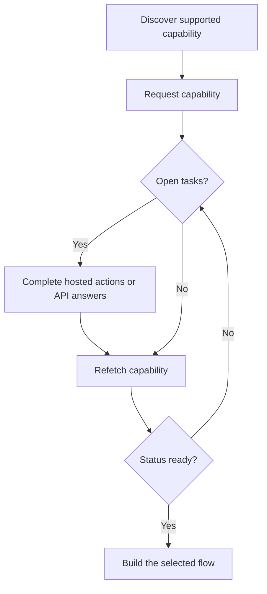

Una capacidad te indica si un cliente puede utilizar un resultado, método de pago y dirección específicos. Las tareas abiertas te indican lo que debe ocurrir antes de que esa capacidad o un recurso relacionado pueda avanzar.



```bash
export API_BASE='https://platform.swipelux.com'
export SWIPELUX_API_KEY='replace-with-your-api-key'
```

## Descubre las capacidades soportadas

Lee las opciones actuales del cliente con [`GET /v3/customers/{customerId}/capabilities/supported`](/api-reference/capabilities/get-v3-customers-by-customer-id-capabilities-supported):

```bash
curl --request GET \
  "${API_BASE}/v3/customers/${CUSTOMER_ID}/capabilities/supported" \
  --header "X-API-Key: ${SWIPELUX_API_KEY}"
```

Elige una entrada de la respuesta que coincida con los `directions`, `method` y `accountType` previstos. Continúa solo cuando `availability` sea `available` o `beta` y `eligibility.eligible` sea `true`. Si se devuelven `institutions`, selecciona únicamente un ID de esa respuesta.

Guarda el `data[].id` seleccionado como `CAPABILITY_ID`. Nunca copies un ID de capacidad de otro cliente o entorno.

### Tipos de cuenta pooled vs named

Las capacidades bancarias vienen en dos variantes, codificadas como el campo `accountType` y el sufijo del ID de la capacidad (por ejemplo, `ach_pooled`, `wire_named`):

- **`pooled`**: cuenta bancaria compartida de Swipelux. Cada cobro utiliza una referencia única para enrutar los fondos. Elige esta opción para transferencias de una sola vez.
- **`named`**: datos bancarios dedicados para el cliente (IBAN virtual, cuenta ACH dedicada). Reutilizables y compartibles con cualquier pagador. Requerido para [cuentas bancarias emitidas](/es/integration/issue-bank-account).

Por defecto usa `pooled`. Usa `named` solo cuando el cliente necesite datos bancarios reutilizables. Consulta la respuesta de `supported` para ver qué variantes están disponibles.

## Solicita la capacidad

Solicita la opción seleccionada con [`POST /v3/customers/{customerId}/capabilities/{capabilityId}`](/api-reference/capabilities/post-v3-customers-by-customer-id-capabilities-by-capability-id):

```bash
curl --request POST \
  "${API_BASE}/v3/customers/${CUSTOMER_ID}/capabilities/${CAPABILITY_ID}" \
  --header "X-API-Key: ${SWIPELUX_API_KEY}" \
  --header "Idempotency-Key: capability-request-001" \
  --header "Content-Type: application/json" \
  --data '{}'
```

Utiliza un array `institutions` explícito solo cuando necesites seleccionar de entre los IDs devueltos por la respuesta de capacidades soportadas.

Guarda `data.status` como `CAPABILITY_STATUS`, `data.openTaskIds` como `OPEN_TASK_IDS` y cada `data.applications[].id` en `APPLICATION_IDS`.

## Completa las tareas actuales {#complete-current-tasks}

Lista las tareas con [`GET /v3/customers/{customerId}/tasks`](/api-reference/tasks/list-customer-tasks), selecciona los IDs de `OPEN_TASK_IDS` y luego lee cada tarea actual con [`GET /v3/customers/{customerId}/tasks/{taskId}`](/api-reference/tasks/get-customer-task):

```bash
curl --request GET \
  "${API_BASE}/v3/customers/${CUSTOMER_ID}/tasks/${TASK_ID}" \
  --header "X-API-Key: ${SWIPELUX_API_KEY}"
```

Usa la última `data.revision` y `data.requirements`. Vuelve a obtener la tarea justo antes de enviar si alguno de estos puede haber cambiado.

### Acciones alojadas

En la respuesta de detalle de la tarea, cada entrada de `verificationSessions` y `tosSessions` incluye un objeto `action`. Las respuestas de la lista de tareas no incluyen estos enlaces de acción. Guarda el `id` de cada sesión y lee `action.kind` antes de enviar al cliente; no deduzcas la disponibilidad del enlace a partir del `status` de la sesión.

- `action.kind: "available"` incluye `action.url` y `action.expiresAt` (actualmente siempre `null`). Guarda `action.url`, envía allí al cliente y vuelve a leer la tarea. Los campos `url` y `expiresAt` de la sesión contienen los mismos valores.
- `action.kind: "unavailable"` significa que no se debe presentar ningún enlace. Los campos `url` y `expiresAt` de la sesión no aparecen. El `status` de una sesión por sí solo no determina qué tipo de acción recibirás.

```json
{
  "data": {
    "verificationSessions": [
      {
        "id": "vfy_000000000000000003",
        "key": "identity_verification",
        "type": "identity_verification",
        "status": "action_required",
        "action": {
          "kind": "available",
          "url": "https://platform.swipelux.com/kyc/redirect/cus_000000000000000001/tsk_000000000000000002/vfy_000000000000000003",
          "expiresAt": null
        },
        "url": "https://platform.swipelux.com/kyc/redirect/cus_000000000000000001/tsk_000000000000000002/vfy_000000000000000003",
        "expiresAt": null
      }
    ],
    "tosSessions": [
      {
        "id": "vfy_000000000000000004",
        "key": "terms_of_service",
        "type": "terms_of_service",
        "status": "completed",
        "action": { "kind": "unavailable" }
      }
    ]
  }
}
```

Estas son acciones con ámbito de tarea, no un ciclo de vida independiente de verificación del cliente.

### Sube documentos {#upload-documents}

Cuando un requisito solicite un documento, súbelo con [`POST /v3/customers/{customerId}/documents`](/api-reference/documents/post-v3-customers-by-customer-id-documents):

```bash
export DOCUMENT_PATH='/absolute/path/to/requested-document.pdf'

curl --request POST \
  "${API_BASE}/v3/customers/${CUSTOMER_ID}/documents" \
  --header "X-API-Key: ${SWIPELUX_API_KEY}" \
  --header "Idempotency-Key: customer-document-001" \
  --form "file=@${DOCUMENT_PATH}"
```

Guarda el `data.id` devuelto como `DOCUMENT_ID` antes de enviar la respuesta que lo referencia.

### Respuestas por API

Envía un conjunto completo de respuestas para la revisión actual con [`POST /v3/customers/{customerId}/tasks/{taskId}/submissions`](/api-reference/task-submissions/create-customer-task-submission):

```bash
curl --request POST \
  "${API_BASE}/v3/customers/${CUSTOMER_ID}/tasks/${TASK_ID}/submissions" \
  --header "X-API-Key: ${SWIPELUX_API_KEY}" \
  --header "Idempotency-Key: task-submission-001" \
  --header "Content-Type: application/json" \
  --data @- <<'JSON'
{
  "taskRevision": 3,
  "answers": [
    {
      "requirementId": "req_from_current_task",
      "answer": {
        "type": "text",
        "value": "Current answer"
      }
    }
  ]
}
JSON
```

Toma cada ID de requisito y tipo de respuesta de la última tarea. Si la API informa de que la tarea cambió, vuelve a obtenerla y reconstruye el envío a partir de la nueva revisión.

### Prerrequisito de beneficiario final para empresas {#beneficial-owner-prerequisite-for-businesses}

Solicitar una capacidad de empresa que necesita evidencia de beneficiario final tiene éxito incluso cuando el cliente todavía no tiene ningún propietario que califique. La capacidad se crea como `restricted` con `statusReason.code: tasks_due`, y la tarea de intake de la empresa solicita los hechos de propiedad faltantes, incluida la estructura de propiedad.

La misma tarea contiene un requisito `resource_reference` cuya solicitud incluye `qualification: "beneficial_owner"`:

```json
{
  "type": "resource_reference",
  "prompt": "Add or select a qualifying beneficial owner.",
  "required": true,
  "resourceType": "related_party",
  "qualification": "beneficial_owner"
}
```

Una parte relacionada califica cuando es una parte `person` activa del mismo cliente con `ownership.declared: true` o un porcentaje de propiedad proporcionado de al menos 25.

El requisito se deriva del listado actual de partes relacionadas, por lo que normalmente no lo respondes directamente:

- Crear o actualizar una parte relacionada que califique cumple el requisito en la misma reevaluación y abre el trabajo de perfil y documentos propio de ese propietario. Consulta [Añade partes relacionadas de la empresa](/es/integration/onboarding/customers#add-business-related-parties).
- También puedes referenciar explícitamente una parte que califique con una respuesta `resource_reference` que incluya su `relatedPartyId`.
- El requisito permanece listado en la tarea actual después de cumplirse. Cuando no queda ninguna otra obligación abierta, la tarea pasa a `satisfied`.
- Archivar la última parte que califica, o eliminar los hechos que la calificaban, reabre el requisito, incluso después de que la tarea haya quedado `satisfied`.

## Continúa cuando la capacidad esté lista

Vuelve a leer la capacidad con [`GET /v3/customers/{customerId}/capabilities/{capabilityId}`](/api-reference/capabilities/get-v3-customers-by-customer-id-capabilities-by-capability-id):

```bash
curl --request GET \
  "${API_BASE}/v3/customers/${CUSTOMER_ID}/capabilities/${CAPABILITY_ID}" \
  --header "X-API-Key: ${SWIPELUX_API_KEY}"
```

Reemplaza el estado y los IDs de tarea almacenados con la última respuesta. Continúa solo cuando el estado actual de la capacidad permita la cuenta, cotización o transferencia que planeas crear.

A continuación, elige la ruta correspondiente en [Flujos comunes](/es/integration/common-flows).
