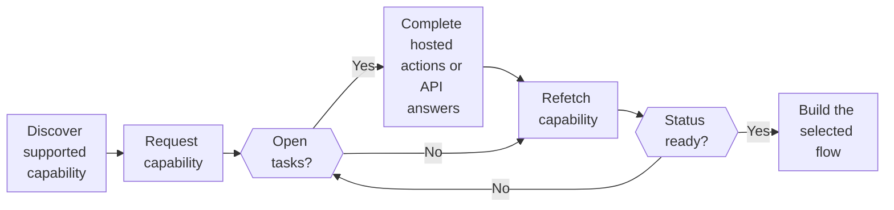

Una capacidad te indica si un cliente puede utilizar un resultado, método de pago y dirección específicos. Las tareas abiertas te indican lo que debe ocurrir antes de que esa capacidad o un recurso relacionado pueda avanzar.


```mermaid
%%{init: {"flowchart": {"rankSpacing": 20, "nodeSpacing": 16, "wrappingWidth": 80, "padding": 8}}}%%
flowchart LR
  A["Discover supported capability"] --> B["Request capability"]
  B --> C{{"Open tasks?"}}
  C -->|"Yes"| D["Complete hosted actions or API answers"]
  D --> E["Refetch capability"]
  C -->|"No"| E
  E --> F{{"Status ready?"}}
  F -->|"No"| C
  F -->|"Yes"| G["Build the selected flow"]
```

```bash
export API_BASE='https://platform.swipelux.com'
export SWIPELUX_API_KEY='replace-with-your-api-key'
```

## Descubre las capacidades soportadas

Lee las opciones actuales del cliente con [`GET /v3/customers/{customerId}/capabilities/supported`](/api-reference/capabilities/get-v3-customers-by-customer-id-capabilities-supported):

```bash
curl --request GET \
  "${API_BASE}/v3/customers/${CUSTOMER_ID}/capabilities/supported" \
  --header "X-API-Key: ${SWIPELUX_API_KEY}"
```

Elige una entrada de la respuesta que coincida con los `directions`, `method` y `accountType` previstos. Continúa solo cuando `availability` sea `available` o `beta` y `eligibility.eligible` sea `true`. Si se devuelven `institutions`, selecciona únicamente un ID de esa respuesta.

Cada entrada de institución incluye un `logoUrl` y un indicador `isDefault`. Usa `logoUrl` para mostrar el logotipo del banco en una interfaz de selección de banco y muestra tu propio icono genérico de banco cuando sea `null`. `isDefault` se aplica solo a este cliente y a esta capacidad, no a la institución de forma global. [`GET /v3/institutions`](/api-reference/institutions/get-v3-institutions) devuelve el mismo `logoUrl` que admite valores nulos. Los IDs de institución son opacos, así que gestiona los IDs nuevos sin cambios de código.

```json
{
  "institutions": [
    {
      "id": "jpmorgan",
      "name": "JPMorgan Chase",
      "bic": "CHASUS33",
      "logoUrl": "https://wallet.swipelux.com/bank-logos/jpmorgan.png",
      "countries": ["US"],
      "isDefault": true
    }
  ]
}
```

Guarda el `data[].id` seleccionado como `CAPABILITY_ID`. Nunca copies un ID de capacidad de otro cliente o entorno.

### Tipos de cuenta pooled vs named

Las capacidades bancarias vienen en dos variantes, codificadas como el campo `accountType` y el sufijo del ID de la capacidad (por ejemplo, `ach_pooled`, `wire_named`):

- **`pooled`**: cuenta bancaria compartida de Swipelux. Cada cobro utiliza una referencia única para enrutar los fondos. Elige esta opción para transferencias de una sola vez.
- **`named`**: datos bancarios dedicados para el cliente (IBAN virtual, cuenta ACH dedicada). Reutilizables y compartibles con cualquier pagador. Requerido para [cuentas bancarias emitidas](/es/integration/issue-bank-account).

Por defecto usa `pooled`. Usa `named` solo cuando el cliente necesite datos bancarios reutilizables. Consulta la respuesta de `supported` para ver qué variantes están disponibles.

Para recibir depósitos SWIFT o emitir datos bancarios SWIFT, usa `swift_named`. `swift_pooled` solo admite pagos, así que consulta los `directions` de cada opción en la respuesta de capacidades soportadas. Una cuenta SWIFT named devuelve datos de recepción reutilizables, incluidos el BIC del banco, una referencia cuando sea necesaria y la dirección del beneficiario cuando el banco la proporcione.

Para cuentas emitidas de ACH, Wire y SWIFT, puedes elegir un banco exacto con `institution` y guardar la solicitud de cuenta antes de que el banco apruebe al cliente. Consulta [Emitir una cuenta bancaria](/es/integration/issue-bank-account#choose-the-bank).

## Solicita la capacidad

Solicita la opción seleccionada con [`POST /v3/customers/{customerId}/capabilities/{capabilityId}`](/api-reference/capabilities/post-v3-customers-by-customer-id-capabilities-by-capability-id):

```bash
curl --request POST \
  "${API_BASE}/v3/customers/${CUSTOMER_ID}/capabilities/${CAPABILITY_ID}" \
  --header "X-API-Key: ${SWIPELUX_API_KEY}" \
  --header "Idempotency-Key: capability-request-001" \
  --header "Content-Type: application/json" \
  --data '{}'
```

Utiliza un array `institutions` explícito solo cuando necesites seleccionar de entre los IDs devueltos por la respuesta de capacidades soportadas.

Guarda `data.status` como `CAPABILITY_STATUS`, `data.accountProvisioning` como `ACCOUNT_PROVISIONING_STATUS`, `data.openTaskIds` como `OPEN_TASK_IDS` y cada `data.applications[].id` en `APPLICATION_IDS`.

### Aplicaciones compartidas por banco {#shared-applications-per-bank}

Para las capacidades bancarias named, cada cliente tiene un caso de aplicación por banco. Las capacidades pooled y de plataforma usan casos sin banco. Swipelux comparte un caso entre todas las capacidades compatibles que solicites:

- Una aprobación puede cubrir varias capacidades. Por ejemplo, un caso aprobado en un banco puede dejar en `ready` tanto una capacidad ACH como una de transferencia bancaria (wire).
- Una solicitud posterior que coincide con un caso existente lo reutiliza. Swipelux no abre una segunda aplicación ni añade tareas duplicadas.
- Los casos en bancos distintos son independientes. Un rechazo en un banco no afecta a un caso en otro banco.

La respuesta de la solicitud te indica qué caso usó Swipelux:

- `201` significa que la solicitud abrió un nuevo caso de aplicación.
- `200` significa que la solicitud se resolvió en un caso de aplicación que el cliente ya tenía, por ejemplo una solicitud repetida de una capacidad bancaria que el cliente ya tiene, o una solicitud de una capacidad cancelada. Una solicitud repetida de `card` o `stablecoin_transfers` sigue devolviendo [`409 capability_already_exists`](/integration/errors#capability-already-exists).
- `selectedApplicationId` es un campo de nivel superior junto a `data` con el ID del caso que la solicitud seleccionó o abrió. Swipelux lo omite cuando la solicitud no seleccionó ningún caso. Una repetición idempotente devuelve el mismo valor.

Respuesta abreviada:

```json
{
  "data": {
    "id": "ach_named",
    "status": "pending",
    "openTaskIds": ["tsk_000000000000000002"],
    "applications": [{ "id": "apl_000000000000000005", "status": "in_review" }]
  },
  "selectedApplicationId": "apl_000000000000000005"
}
```

Para las capacidades named, vuelve a enviar la misma lista `institutions` para seleccionar el mismo caso, o envía un único ID de institución para dirigirte a ese banco. Se omite un banco que haya rechazado al cliente de forma definitiva. Cuando indicas solo ese banco, o todos los bancos elegibles han rechazado al cliente, la solicitud devuelve [`409 capability_terminally_rejected`](/integration/errors#capability-terminally-rejected). Para probar con otro banco después de un rechazo, vuelve a solicitar la capacidad con el ID de institución de ese banco.

El estado de una capacidad refleja todos los casos relacionados del cliente. Para una capacidad named, basta con un caso `ready` cuya aprobación la cubra para que quede `ready`, independientemente de lo que informen otros bancos. Una capacidad pooled también espera a su comprobación del método, que se informa en `probes` en la lista de aplicaciones del cliente.

#### Lista las aplicaciones del cliente {#list-the-customers-applications}

Lista todos los casos de aplicación del cliente con [`GET /v3/customers/{customerId}/applications`](/api-reference/capabilities/get-v3-customers-by-customer-id-applications). Los resultados se paginan con `nextCursor` y `hasMore`, y aceptan `updatedAfter`:

```bash
curl --request GET \
  "${API_BASE}/v3/customers/${CUSTOMER_ID}/applications" \
  --header "X-API-Key: ${SWIPELUX_API_KEY}"
```

Cada entrada incluye los campos de aplicación devueltos en `applications[]` de una capacidad, además de:

- `scope`: `named` para un caso en un banco, `provider_pooled` o `platform` para casos sin banco, o `null` para un caso histórico sin clasificar. `institution` no aparece en los casos `provider_pooled` y `platform`.
- `requestedScope[]`: las claves de capacidad solicitadas para el caso, cada una con su primer `requestedAt`. Las entradas nunca se eliminan.
- `coverage[]`: las claves de capacidad que cubre la aprobación del caso, cada una con `grantedAt` y `source`. La cobertura registra el alcance, no la autorización. Lee la capacidad para conocer su estado actual.
- `probes[]`: comprobaciones del método para las claves de capacidad pooled que cubre el caso, cada una con `capabilityKey`, `status` y `reason`. Las claves named nunca requieren una comprobación.
- `generation`, `predecessorApplicationId` y `supersededByApplicationId`: enlaces de sucesión. Cuando `supersededByApplicationId` está definido, el caso fue reemplazado. Sigue ese ID hasta el caso actual.

Respuesta abreviada:

```json
{
  "data": [
    {
      "id": "apl_000000000000000005",
      "status": "ready",
      "scope": "named",
      "institution": { "id": "jpmorgan", "name": "JPMorgan Chase", "bic": "CHASUS33" },
      "requestedScope": [
        { "capabilityKey": "ach_named", "requestedAt": "2026-09-20T10:00:00.000Z" }
      ],
      "coverage": [
        { "capabilityKey": "ach_named", "grantedAt": "2026-09-22T12:00:00.000Z", "source": "approval" },
        { "capabilityKey": "wire_named", "grantedAt": "2026-09-22T12:00:00.000Z", "source": "approval" }
      ],
      "probes": [],
      "generation": 1,
      "predecessorApplicationId": null,
      "supersededByApplicationId": null
    }
  ],
  "nextCursor": null,
  "hasMore": false
}
```

## Completa las tareas actuales {#complete-current-tasks}

Lista las tareas con [`GET /v3/customers/{customerId}/tasks`](/api-reference/tasks/list-customer-tasks), selecciona los IDs de `OPEN_TASK_IDS` y luego lee cada tarea actual con [`GET /v3/customers/{customerId}/tasks/{taskId}`](/api-reference/tasks/get-customer-task):

```bash
curl --request GET \
  "${API_BASE}/v3/customers/${CUSTOMER_ID}/tasks/${TASK_ID}" \
  --header "X-API-Key: ${SWIPELUX_API_KEY}"
```

Usa la última `data.revision` y `data.requirements`. Vuelve a obtener la tarea justo antes de enviar si alguno de estos puede haber cambiado.

### Evidencia de perfil reutilizada {#reused-profile-evidence}

En las tareas de intake de la aplicación que aceptan el envío directo por API, Swipelux reutiliza la información que el cliente ya proporcionó. Cuando se crea o se concilia una tarea de este tipo, Swipelux revisa el perfil del cliente y los documentos que el propio cliente ha subido. Los requisitos elegibles que ya están respaldados por un valor de perfil o un documento utilizable pasan a `in_review` en lugar de seguir siendo accionables. Las actualizaciones del perfil y las nuevas subidas de documentos activan la misma comprobación para las tareas existentes.

Solo los valores ausentes o incompatibles siguen siendo accionables. La reutilización no aprueba la evidencia. Swipelux sigue revisándola. Las solicitudes explícitas de corrección y los requisitos ya respondidos siguen siendo accionables. Los documentos de propietarios y de partes relacionadas no se reutilizan, y los requisitos que solo se recopilan mediante una sesión alojada mantienen su flujo normal.

### Renderiza los requisitos {#render-requirements}

Construye los formularios a partir de los metadatos que devuelve cada requisito, no a partir de las claves de requisito. Un requisito puede incluir un `title` corto opcional, y cada `request` incluye un `prompt` para mostrar debajo del encabezado.

Los requisitos con `request.type: "profile"` identifican el campo de perfil con `profilePointer` y añaden metadatos de entrada:

- `allowedValues`: los valores permitidos para un campo escalar, o para cada elemento de un campo de tipo array. Envía estos valores, no etiquetas de visualización traducidas.
- `valueSchema`: un documento JSON Schema Draft 7 autocontenido que describe la forma de la entrada, las propiedades anidadas, los campos obligatorios y las restricciones estructurales. Los enums de objetos aparecen en la propiedad correspondiente, por ejemplo `valueSchema.items.properties.type.enum` para los identificadores fiscales. Swipelux sigue aplicando la validación entre campos y la de revisión después del envío, por lo que un valor que supera el esquema aún puede ser rechazado.
- `valueType: "country"`, o `itemValueType: "country"` para arrays: el campo acepta códigos ISO 3166-1 alpha-2 en mayúsculas. Las propiedades de país anidadas en `valueSchema` usan `format: "iso-3166-1-alpha-2"`. Usa una lista de países estándar para las etiquetas localizadas.

```json
{
  "id": "req_000000000000000010",
  "key": "account_purposes",
  "title": "Account purpose",
  "status": "action_required",
  "request": {
    "type": "profile",
    "prompt": "Select every purpose that applies.",
    "required": true,
    "profilePointer": "/financialProfile/accountPurposes",
    "valueType": "array",
    "itemValueType": "string",
    "allowedValues": ["business_expenses", "ecommerce", "payroll"],
    "valueSchema": {
      "$schema": "http://json-schema.org/draft-07/schema#",
      "type": "array",
      "items": { "enum": ["business_expenses", "ecommerce", "payroll"] }
    }
  }
}
```

Este ejemplo acorta el catálogo de valores; la API devuelve todos los valores permitidos. Algunos requisitos de perfil no tienen un esquema publicado y omiten `valueSchema` y `allowedValues`. Renderízalos a partir de `prompt` y `valueType`.

Cada tarea abierta incluye una marca de tiempo `dueAt`. Cuando Swipelux crea una tarea sin una fecha de vencimiento explícita, `dueAt` toma por defecto exactamente 31 días después del `createdAt` de la tarea. Trata `dueAt` como informativo: no puedes definirlo a través de la API y no desencadena ninguna transición automática del ciclo de vida. Solo el campo separado `deadline`, cuando está presente, provoca una transición automática.

### Acciones alojadas

En la respuesta de detalle de la tarea, cada entrada de `verificationSessions` y `tosSessions` incluye un objeto `action`. Las respuestas de la lista de tareas no incluyen estos enlaces de acción. Guarda el `id` de cada sesión y lee `action.kind` antes de enviar al cliente; no deduzcas la disponibilidad del enlace a partir del `status` de la sesión.

- `action.kind: "available"` incluye `action.url` y `action.expiresAt` (actualmente siempre `null`). Guarda `action.url`, envía allí al cliente y vuelve a leer la tarea. Los campos `url` y `expiresAt` de la sesión contienen los mismos valores.
- `action.kind: "unavailable"` significa que no se debe presentar ningún enlace. Los campos `url` y `expiresAt` de la sesión no aparecen. El `status` de una sesión por sí solo no determina qué tipo de acción recibirás.

```json
{
  "data": {
    "verificationSessions": [
      {
        "id": "vfy_000000000000000003",
        "key": "identity_verification",
        "type": "identity_verification",
        "status": "action_required",
        "action": {
          "kind": "available",
          "url": "https://platform.swipelux.com/kyc/redirect/cus_000000000000000001/tsk_000000000000000002/vfy_000000000000000003",
          "expiresAt": null
        },
        "url": "https://platform.swipelux.com/kyc/redirect/cus_000000000000000001/tsk_000000000000000002/vfy_000000000000000003",
        "expiresAt": null
      }
    ],
    "tosSessions": [
      {
        "id": "vfy_000000000000000004",
        "key": "terms_of_service",
        "type": "terms_of_service",
        "status": "completed",
        "action": { "kind": "unavailable" }
      }
    ]
  }
}
```

Estas son acciones con ámbito de tarea, no un ciclo de vida independiente de verificación del cliente.

### Sube documentos {#upload-documents}

Cuando un requisito solicite un documento, súbelo con [`POST /v3/customers/{customerId}/documents`](/api-reference/documents/post-v3-customers-by-customer-id-documents):

```bash
export DOCUMENT_PATH='/absolute/path/to/requested-document.pdf'

curl --request POST \
  "${API_BASE}/v3/customers/${CUSTOMER_ID}/documents" \
  --header "X-API-Key: ${SWIPELUX_API_KEY}" \
  --header "Idempotency-Key: customer-document-001" \
  --form "file=@${DOCUMENT_PATH}"
```

Guarda el `data.id` devuelto como `DOCUMENT_ID` antes de enviar la respuesta que lo referencia.

Para recuperar un archivo almacenado más tarde, llama a [`GET /v3/customers/{customerId}/documents/{documentId}/download`](/api-reference/documents/get-v3-customers-by-customer-id-documents-by-document-id-download). Swipelux devuelve una `url` que descarga el archivo como adjunto y expira después de una hora. Los documentos archivados devuelven `404`.

### Respuestas por API

Envía un conjunto completo de respuestas para la revisión actual con [`POST /v3/customers/{customerId}/tasks/{taskId}/submissions`](/api-reference/task-submissions/create-customer-task-submission):

```bash
curl --request POST \
  "${API_BASE}/v3/customers/${CUSTOMER_ID}/tasks/${TASK_ID}/submissions" \
  --header "X-API-Key: ${SWIPELUX_API_KEY}" \
  --header "Idempotency-Key: task-submission-001" \
  --header "Content-Type: application/json" \
  --data @- <<'JSON'
{
  "taskRevision": 3,
  "answers": [
    {
      "requirementId": "req_from_current_task",
      "answer": {
        "type": "text",
        "value": "Current answer"
      }
    }
  ]
}
JSON
```

Toma cada ID de requisito y tipo de respuesta de la última tarea. Si la API informa de que la tarea cambió, vuelve a obtenerla y reconstruye el envío a partir de la nueva revisión.

### Prerrequisito de beneficiario final para empresas {#beneficial-owner-prerequisite-for-businesses}

Solicitar una capacidad de empresa que necesita evidencia de beneficiario final tiene éxito incluso cuando el cliente todavía no tiene ningún propietario que califique. La capacidad se crea como `restricted` con `statusReason.code: tasks_due`, y la tarea de intake de la empresa solicita los hechos de propiedad faltantes, incluida la estructura de propiedad.

La misma tarea contiene un requisito `resource_reference` cuya solicitud incluye `qualification: "beneficial_owner"`:

```json
{
  "type": "resource_reference",
  "prompt": "Add or select a qualifying beneficial owner.",
  "required": true,
  "resourceType": "related_party",
  "qualification": "beneficial_owner"
}
```

Una parte relacionada califica cuando es una parte `person` activa del mismo cliente con `ownership.declared: true` o un porcentaje de propiedad proporcionado de al menos 25.

El requisito se deriva del listado actual de partes relacionadas, por lo que normalmente no lo respondes directamente:

- Crear o actualizar una parte relacionada que califique cumple el requisito en la misma reevaluación y abre el trabajo de perfil y documentos propio de ese propietario. Consulta [Añade partes relacionadas de la empresa](/es/integration/onboarding/customers#add-business-related-parties).
- También puedes referenciar explícitamente una parte que califique con una respuesta `resource_reference` que incluya su `relatedPartyId`.
- El requisito permanece listado en la tarea actual después de cumplirse. Cuando no queda ninguna otra obligación abierta, la tarea pasa a `satisfied`.
- Archivar la última parte que califica, o eliminar los hechos que la calificaban, reabre el requisito, incluso después de que la tarea haya quedado `satisfied`.

## Continúa cuando la capacidad esté lista

Vuelve a leer la capacidad con [`GET /v3/customers/{customerId}/capabilities/{capabilityId}`](/api-reference/capabilities/get-v3-customers-by-customer-id-capabilities-by-capability-id):

```bash
curl --request GET \
  "${API_BASE}/v3/customers/${CUSTOMER_ID}/capabilities/${CAPABILITY_ID}" \
  --header "X-API-Key: ${SWIPELUX_API_KEY}"
```

Reemplaza el estado, el estado de aprovisionamiento de cuenta y los IDs de tarea almacenados con la última respuesta. El `status` de la capacidad indica si el derecho está aprobado. Para una capacidad que emite una cuenta, `accountProvisioning` indica por separado si esa cuenta está `not_started`, `in_progress`, `issued` o `failed`; una capacidad que no emite una cuenta devuelve `not_applicable`.

Continúa solo cuando el estado actual de la capacidad permita la cuenta, cotización o transferencia que planeas crear. Cuando el flujo necesite una cuenta emitida, espera también a que `accountProvisioning` pase a `issued`.

A continuación, elige la ruta correspondiente en [Flujos comunes](/es/integration/common-flows).
