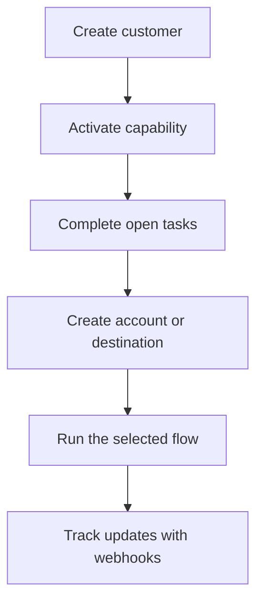

Swipelux ofrece a tu backend los componentes necesarios para incorporar clientes y mover dinero sin exponer la infraestructura de pagos en tu producto.

## Qué puedes construir

<CardGroup cols={3}>
  <Card title="Recibir fondos" icon="arrow-down-to-line" href="/es/integration/receive-funds">
    Crea instrucciones de financiación en fiat de un solo uso y liquida en stablecoin dentro de una cartera.
  </Card>
  <Card title="Enviar fondos" icon="arrow-up-from-line" href="/es/integration/send-funds">
    Envía desde una cartera del cliente a una cuenta propia o a un destino de terceros.
  </Card>
  <Card title="Emitir una cuenta bancaria" icon="building-columns" href="/es/integration/issue-bank-account">
    Aprovisiona datos bancarios reutilizables vinculados a una cartera de liquidación.
  </Card>
</CardGroup>

## Cómo funciona una integración

Un cliente es la persona física o empresa propietaria del flujo. Las capacidades describen qué resultados puede utilizar ese cliente. Las tareas abiertas te indican lo que se debe completar antes de que la capacidad o el recurso pueda avanzar.

## Míralo en acción

Explora [demo.swipelux.com](https://demo.swipelux.com) para probar una experiencia simulada de neobanco. También puedes [clonar el starter](https://github.com/swipelux/neobank-starter) y personalizar su interfaz de producto.

La demo y el starter son referencias de producto e interfaz. No sustituyen a estas guías ni al contrato actual de la API.

## Empieza a construir

<CardGroup cols={3}>
  <Card title="Quickstart" icon="rocket" href="/es/integration/quickstart">
    Crea un cliente y ejecuta un flujo en sandbox.
  </Card>
  <Card title="Flujos comunes" icon="route" href="/es/integration/common-flows">
    Compara la configuración necesaria para cada resultado.
  </Card>
  <Card title="Referencia de la API" icon="code" href="/es/api-reference/introduction">
    Lee las convenciones de solicitud e inspecciona cada operación de la API.
  </Card>
</CardGroup>
