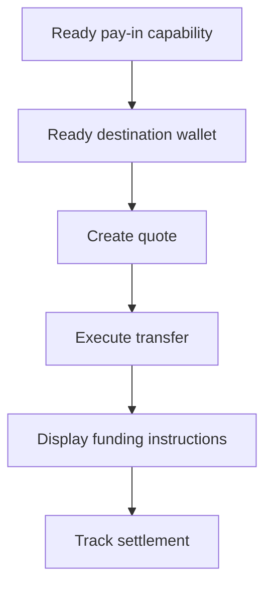

Utiliza un cobro cotizado cuando el cliente necesite financiar un importe específico. La transferencia liquida stablecoin en una cartera emitida.



## Antes de empezar

Necesitas una capacidad de cobro lista y una cartera de destino emitida lista para el mismo cliente. Completa cualquier trabajo abierto mediante [Capacidades y tareas](/es/integration/onboarding/capabilities-and-requirements) y luego vuelve a obtener ambos recursos.

## 1. Crea una cotización

Crea el precio con [`POST /v3/quotes`](/api-reference/money-movement/post-v3-quotes). Envía estas cabeceras:

```http
X-API-Key: ${SWIPELUX_API_KEY}
Idempotency-Key: payin-quote-001
Content-Type: application/json
```

```json
{
  "customerId": "${CUSTOMER_ID}",
  "capabilityId": "${CAPABILITY_ID}",
  "externalId": "payin-order-123",
  "in": {
    "amount": "150.00",
    "currency": "USD"
  },
  "destinationId": "${SETTLEMENT_WALLET_ID}",
  "out": {
    "currency": "USDC"
  }
}
```

Guarda `data.id` como `QUOTE_ID`. Presenta los importes y comisiones devueltos en lugar de reconstruirlos a partir de la tasa.

## 2. Ejecuta la cotización

Ejecuta la cotización actual antes de su expiración con [`POST /v3/transfers`](/api-reference/money-movement/post-v3-transfers). Utiliza una nueva clave para esta transferencia prevista:

```http
X-API-Key: ${SWIPELUX_API_KEY}
Idempotency-Key: payin-transfer-001
Content-Type: application/json
```

```json
{
  "quoteId": "${QUOTE_ID}"
}
```

Guarda el `data.id` de la transferencia como `TRANSFER_ID` y conserva su estado actual.

## 3. Recupera las instrucciones de financiación

Lee [`GET /v3/transfers/{transferId}/instructions`](/api-reference/money-movement/get-v3-transfers-by-transfer-id-instructions). Renderiza la variante `data.instructions` devuelta sin asumir su tipo.

Estos datos son específicos de la transferencia. Nunca reutilices las coordenadas bancarias, el código, la URL alojada, el importe, la referencia ni la expiración de una transferencia para otro cobro.

Para instrucciones bancarias, cuando `reference.required` sea true, muestra el `reference.value` exacto junto a las coordenadas bancarias y hazlo copiable. Muestra el importe y la moneda devueltos del mismo conjunto de instrucciones.

Una cuenta bancaria emitida es distinta: proporciona datos reutilizables para depósitos posteriores. Consulta [Emitir una cuenta bancaria](/es/integration/issue-bank-account) cuando esa sea la experiencia prevista.

## 4. Monitorea la liquidación

Lee [`GET /v3/transfers/{transferId}`](/api-reference/money-movement/get-v3-transfers-by-transfer-id) tras la ejecución y después de cada evento. Impulsa el estado visible al cliente a partir del último `data.state`.

Utiliza `data.stateDetail` y `data.openTaskIds` cuando la transferencia necesite otra acción. No la marques como completada a partir de un calendario esperado.

A continuación, añade [Webhooks](/es/integration/webhooks) y mantén el estado de la transferencia sincronizado hasta que alcance un resultado que tu producto gestione.
