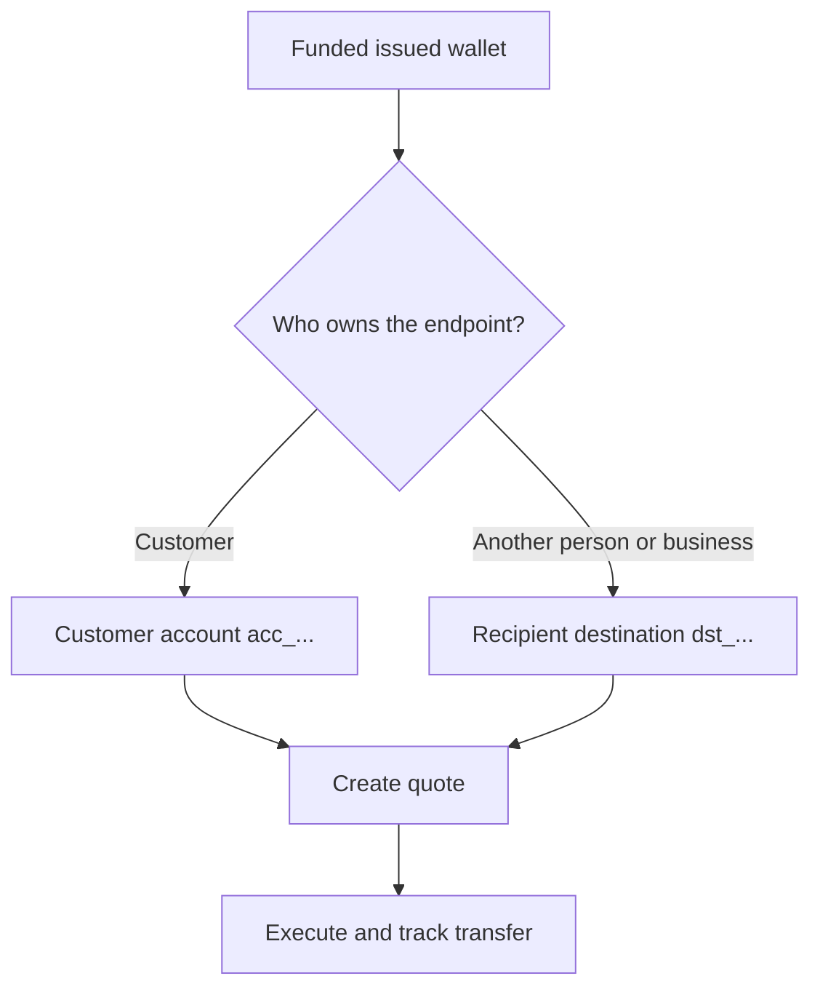

Cada pago parte de una cartera emitida lista y con fondos. El modelo de destino depende de quién sea propietario del endpoint.



## Antes de empezar

Vuelve a obtener la cartera de origen. Confirma que su estado actual permite el pago y que su saldo disponible cubre el importe de origen previsto. Guarda su ID derivado de la respuesta como `SOURCE_WALLET_ID`.

También necesitas una capacidad de pago lista para el cliente actual y el destino seleccionado.

## 1. Prepara el destino

<Tabs>
  <Tab title="Propio">

Utiliza una cuenta bancaria externa propiedad del cliente cuando el cliente sea el propietario del endpoint. Créala con [`POST /v3/customers/{customerId}/accounts`](/api-reference/accounts/post-v3-customers-by-customer-id-accounts) y estas cabeceras:

```http
X-API-Key: ${SWIPELUX_API_KEY}
Idempotency-Key: payout-account-001
Content-Type: application/json
```

```json
{
  "origin": "external",
  "type": "bank",
  "methods": ["ach", "wire"],
  "country": "US",
  "currency": "USD",
  "details": {
    "routingNumber": "021000021",
    "accountNumber": "123456789",
    "accountType": "checking",
    "bankName": "Example Bank",
    "accountHolderName": "Acme Payments SAS"
  },
  "label": "Customer operating account"
}
```

Léela con [`GET /v3/customers/{customerId}/accounts/{accountId}`](/api-reference/accounts/get-v3-customers-by-customer-id-accounts-by-account-id). Continúa solo cuando su estado actual permita el pago. Guarda su ID `acc_` como `PAYOUT_DESTINATION_ID`.

  </Tab>
  <Tab title="Terceros">

Crea la persona o empresa y su endpoint bancario o de cartera mediante [Destinatarios y destinos](/es/integration/recipients). Continúa solo cuando el destino esté listo.

Guarda el ID `dst_` devuelto como `PAYOUT_DESTINATION_ID`. No utilices el ID `rcp_` del destinatario como destino de la cotización.

  </Tab>
</Tabs>

## 2. Crea la cotización del pago

Utiliza [`POST /v3/quotes`](/api-reference/money-movement/post-v3-quotes) con estas cabeceras:

```http
X-API-Key: ${SWIPELUX_API_KEY}
Idempotency-Key: payout-quote-001
Content-Type: application/json
```

```json
{
  "customerId": "${CUSTOMER_ID}",
  "capabilityId": "${CAPABILITY_ID}",
  "in": {
    "amount": "150.00",
    "currency": "USDC",
    "accountId": "${SOURCE_WALLET_ID}"
  },
  "destinationId": "${PAYOUT_DESTINATION_ID}",
  "out": {
    "currency": "USD"
  }
}
```

Guarda `data.id` como `QUOTE_ID` y presenta el precio y las comisiones devueltos.

## 3. Ejecuta el pago

Crea la transferencia con [`POST /v3/transfers`](/api-reference/money-movement/post-v3-transfers). Utiliza una nueva clave para esta ejecución prevista:

```http
X-API-Key: ${SWIPELUX_API_KEY}
Idempotency-Key: payout-transfer-001
Content-Type: application/json
```

```json
{
  "quoteId": "${QUOTE_ID}"
}
```

Guarda el `data.id` de la transferencia como `TRANSFER_ID`. Una creación exitosa inicia el pago; no demuestra la entrega.

## 4. Monitorea la entrega

Lee [`GET /v3/transfers/{transferId}`](/api-reference/money-movement/get-v3-transfers-by-transfer-id) tras la creación y después de cada evento. Utiliza el último `data.state`, `data.stateDetail` y `data.openTaskIds` para decidir si esperar, actuar o mostrar un resultado terminal.

A continuación, revisa [Cotizaciones y transferencias](/es/integration/quotes-and-transfers) para conocer los importes exactos, la recuperación segura de ejecuciones y las tareas de transferencia.
