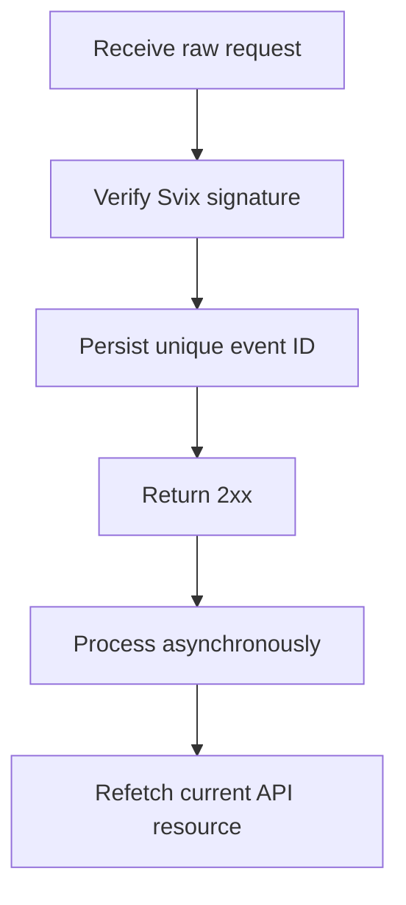

Utiliza los webhooks para reaccionar a los cambios asíncronos. La entrega es al menos una vez, por lo que los eventos duplicados, retrasados y fuera de orden son normales.



## Registra solo los eventos que necesitas

Crea un endpoint con [`POST /v3/webhooks`](/api-reference/webhooks/post-v3-webhooks). Suscríbete solo a eventos documentados que impulsen tu integración. Este ejemplo utiliza [`transfer.state_changed`](/api-reference/webhooks/transfer-state-changed).

```bash
export API_BASE='https://platform.swipelux.com'
export SWIPELUX_API_KEY='replace-with-your-api-key'

curl --request POST \
  "${API_BASE}/v3/webhooks" \
  --header "X-API-Key: ${SWIPELUX_API_KEY}" \
  --header "Idempotency-Key: webhook-endpoint-001" \
  --header "Content-Type: application/json" \
  --data @- <<'JSON'
{
  "url": "https://example.com/webhooks/swipelux",
  "events": ["transfer.state_changed"]
}
JSON
```

Guarda `data.id` de la respuesta como `WEBHOOK_ID`. Abre el portal devuelto por [`GET /v3/webhooks/portal`](/api-reference/webhooks/get-v3-webhooks-portal), obtén el secreto de firma de este endpoint y guárdalo por separado de tu clave de API en un gestor de secretos.

## Verifica antes de analizar

Swipelux entrega las nuevas integraciones de webhooks mediante Svix. Verifica el cuerpo bruto de la solicitud con el secreto de firma de tu endpoint y estas cabeceras:

- `svix-id`
- `svix-timestamp`
- `svix-signature`

No analices el JSON ni provoques efectos secundarios antes de que la verificación tenga éxito.

```javascript
import { Webhook } from "svix";

const verifier = new Webhook(process.env.SWIPELUX_WEBHOOK_SECRET);

export async function handleSwipeluxWebhook(request) {
  const rawBody = await request.text();
  const event = verifier.verify(rawBody, {
    "svix-id": request.headers.get("svix-id"),
    "svix-timestamp": request.headers.get("svix-timestamp"),
    "svix-signature": request.headers.get("svix-signature"),
  });

  await webhookInbox.insertIfAbsent({
    id: event.id,
    payload: event,
    status: "pending",
  });

  return new Response(null, { status: 204 });
}
```

Rechaza las solicitudes con firmas ausentes o inválidas. Mantén disponible el cuerpo bruto hasta que se complete la verificación.

## Persiste, reconoce y luego procesa

Coloca una restricción de unicidad sobre el `id` del envelope. Persiste el envelope verificado, devuelve `2xx` con prontitud y luego procésalo de forma asíncrona.

Si el ID del evento ya existe, reconoce la entrega sin repetir los efectos secundarios completados. Reanuda el trabajo local pendiente o fallido mediante tu propia cola de reintentos. No utilices el campo `attempt` del envelope como clave de deduplicación ni como contador de reintentos de transporte.

## Vuelve a obtener el estado actual

El orden de los webhooks no es un historial autoritativo del recurso. Utiliza `resource.type` y `resource.id` para localizar el objeto y luego obtén su estado actual antes de actualizar tu sistema.

Para un evento de transferencia, llama a [`GET /v3/transfers/{transferId}`](/api-reference/money-movement/get-v3-transfers-by-transfer-id):

```bash
curl --request GET \
  "${API_BASE}/v3/transfers/${TRANSFER_ID}" \
  --header "X-API-Key: ${SWIPELUX_API_KEY}"
```

Impulsa el estado visible al cliente y las acciones posteriores a partir de la respuesta actual de la API. Diseña los efectos secundarios para que se mantengan seguros si dos workers procesan eventos relacionados en un orden distinto.

## Recupera las entregas

Utiliza [`GET /v3/webhooks/portal`](/api-reference/webhooks/get-v3-webhooks-portal) para abrir los registros de entrega, reintentar entregas fallidas o iniciar un replay manual.

Cada replay debe pasar por la misma verificación de firma y el mismo buzón durable. Para recuperarte tras una caída, replaya la ventana afectada y vuelve a obtener cada recurso referenciado. Los IDs de evento completados siguen siendo no-ops; los registros incompletos se reanudan de forma asíncrona.

A continuación, verifica las entregas duplicadas y fuera de orden en sandbox y completa la lista de comprobación de [Go live](/es/integration/go-live).
