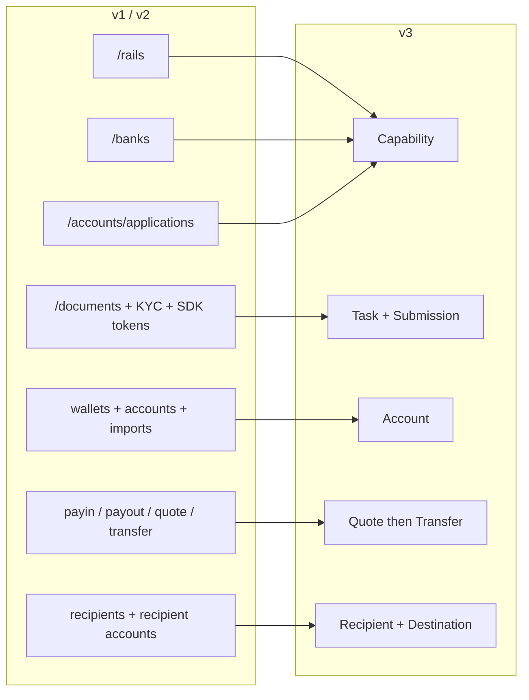
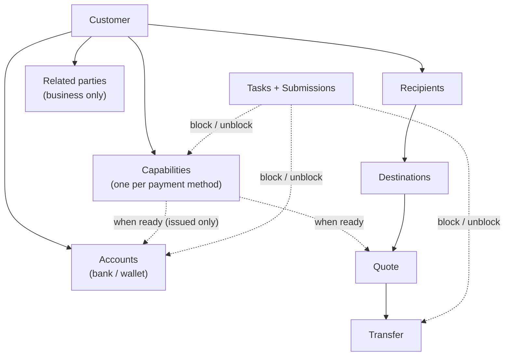
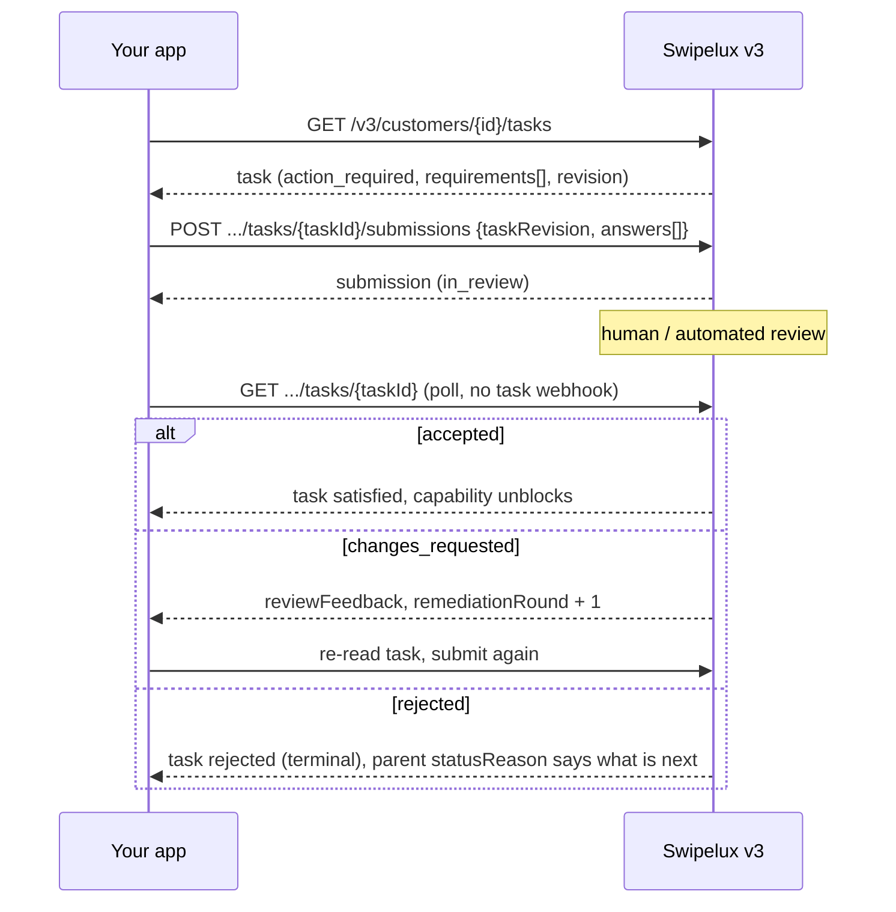
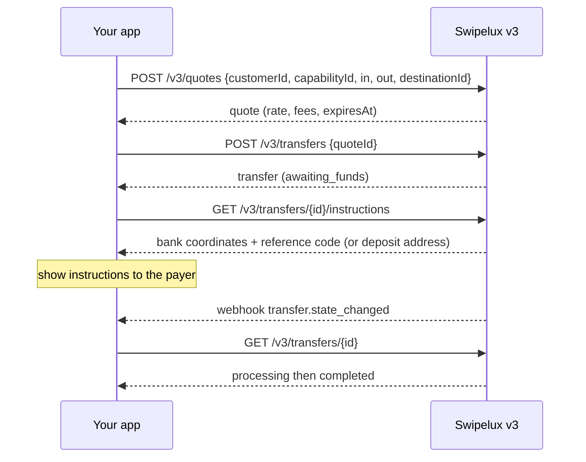
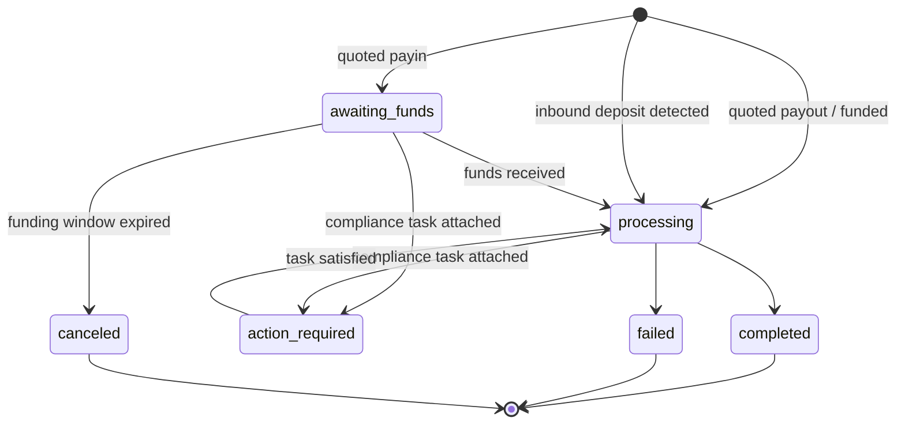
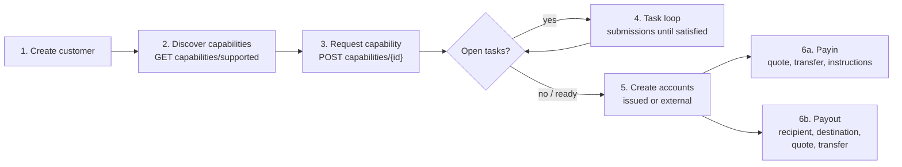

Migroi integraatiosi API v1:stä ja v2:sta v3:een kahdessa vaiheessa:

- **Osa 1, konsepti.** Lue tämä ensin. v3 on uudelleensuunnittelu, ei uudelleennimeäminen: jos yhdistät vanhat päätepisteet yksi yhteen, taistelet APIa vastaan. Kymmenen minuuttia täällä säästää sinulta päiviä myöhemmin.
- **Osa 2, API.** Päätepiste kerrallaan -kartoitus, esimerkkipyynnöt, tilakoneet ja migraation tarkistuslista.

Perustuu tuotannon OpenAPI-määrittelyyn ([platform.swipelux.com/openapi.json](https://platform.swipelux.com/openapi.json)). v1 ja v2 ovat edelleen aktiivisia eikä niitä ole vielä merkitty vanhentuneiksi; kaikki uudet capability-, vastaanottaja-, task- ja quoting-toiminnot toimitetaan vain v3:ssa. Tilaa webhook-tapahtuma `api.deprecation` saadaksesi käytöstäpoistoilmoitukset.

<Info>
  **Sisältö.** Osa 1: 1.1 miksi v3 on olemassa, 1.2 objektimalli, 1.3 valmius per capability, 1.4 task-silmukka, 1.5 rahansiirto, 1.6 tilakoneet, 1.7 käytännöt, 1.8 kultainen polku. Osa 2: 2.1 asiakkaat, 2.2 capabilities, 2.3 tasks ja submissions, 2.4 tilit, 2.5 vastaanottajat ja destinations, 2.6 quotes ja transfers, 2.7 webhookit, 2.8 sandbox, 2.9 vanhat päätepisteet, 2.10 migraatiojärjestys, 2.11 sudenkuoppien tarkistuslista.
</Info>

---

## Osa 1, konsepti

### 1.1 Miksi v3 on olemassa

v1 ja v2 kasvattivat neljä päällekkäistä tapaa saattaa asiakas maksuvalmiiksi: `/rails`, `/banks`, `/accounts/applications` ja yritysten `rail-applications`-pinta, kullakin oma tilasanastonsa. Asiakirjankeruu (`/documents`, KYC-tuonnit, verifiointi-SDK-tokenit) oli irrallaan siitä, minkä sen piti todella avata. v3 tiivistää kaiken tämän kuudeksi resurssiksi, asiakas plus viisi asiaa, jotka se omistaa:



| Resurssi | Yhden rivin määritelmä |
| --- | --- |
| **Customer** | Henkilö tai yritys. Sillä **ei ole julkista tilakenttää**, valmius sijaitsee capabilityissa. |
| **Capability** | Yksi maksutapa, jota asiakas voi käyttää (`sepa`, `ach`, `swift`, `stablecoin_transfers` ja niin edelleen), omalla tilallaan. Korvaa `/rails`-, `/banks`- ja tilihakemuksen aloituspisteet. |
| **Task** | Työyksikkö, jonka Swipelux tarvitsee (tiedot, asiakirjat, verifiointi), johon vastataan **Submissionilla**. Korvaa asiakirja- ja KYC-pinnan. |
| **Account** | Rahoituspäätepiste, jonka asiakas omistaa: `bank` tai `wallet`, Swipeluxin `issued` tai `external`. |
| **Recipient / Destination** | Maksun edunsaaja (kuka) ja hänen pankki- tai wallet-päätepisteensä (minne). |
| **Quote / Transfer** | Kaikki rahansiirto. Transfer suorittaa tallennetun quoten; quoteista irrallisia transfereita ei enää ole. |

### 1.2 Objektimalli



Kaksi rakenteellista sääntöä sisäistettäväksi:

1. **Capabilities ohjaavat kaikkea.** Tilit alustetaan `ready`-tilaisen capabilityn alle; quotet hinnoitellaan capabilitya vasten. Onboarding tarkoittaa tarvittavien capabilityjen saattamista `ready`-tilaan.
2. **Taskit voivat liittyä mihin tahansa.** Capability, tili tai käynnissä oleva transfer voi kantaa `openTaskIds`-arvoa. Missä ikinä näetkin niitä, silmukka on sama: lue task, lähetä vastaukset, odota arviointia, lue vanhempi uudelleen.

### 1.3 Valmius on capability-kohtainen, ei asiakaskohtainen

v1 sekoitti `/rails`-valmiuden asiakaslaajuiseen KYC-porttiin. v3:ssa ei ole asiakaskohtaista tilaa: asiakas voi olla täysin käyttökelpoinen `stablecoin_transfers`-toiminnossa, kun taas hänen `sepa`-capabilityllaan on vielä avoimia taskeja. Yhteispoolattujen tilien capabilityt saavuttavat yleensä `ready`-tilan nopeammin kuin nimetyt, joten aloita transaktiot sillä, mikä on `ready`, sen sijaan että odottaisit kaikkea.

Jos v1- tai v2-koodisi ohjaa käyttöliittymämerkkejä asiakkaan verifiointitilan mukaan, kirjoita se uudelleen:

- "Voiko hän tehdä transaktioita X:llä?" muuttuu muotoon capability X `status == "ready"`.
- "Pitääkö hänen tehdä jotain?" muuttuu muotoon mikä tahansa task tilassa `action_required` (capability näyttää tyypillisesti `restricted` ja `statusReason.resolution: "complete_tasks"`).
- "Odotammeko Swipeluxia?" muuttuu muotoon tasks `in_review`, capability `pending`.

### 1.4 Task-silmukka

Kaikki, mitä vanha asiakirja- ja KYC-pinta teki, on nyt tämä yksi silmukka:



Keskeisiä ominaisuuksia:

- Task kantaa `requirements[]`-taulukon, eli yksittäiset pyynnöt. Kullakin on task-kohtainen `requirementId`, vakaa `key`, joka nimeää pyynnön (esimerkiksi osoitteentodistus, dedupliko käyttöliittymäsi sillä), ja tyypitetty `request`, joka kuvaa täsmälleen millaista syötettä halutaan (teksti, päivämäärä, valinta, asiakirja, vakuutus ja niin edelleen).
- Lähettäminen on **arviointi-ohjattua**: se ei koskaan muuta capabilityn tai tilin tilaa suoraan, hyväksyminen tekee sen. Yksi poikkeus: `profile`-vastaukset kirjoittavat lähetyshetkellä läpi asiakasprofiiliin (2.3). Lähettämisen jälkeen pollaa taskia tai vanhempiresurssia.
- `taskRevision` (taskin `revision`-arvon kaiku) on samanaikaisuuden suoja: jos task on muuttunut sen jälkeen kun luit sen, lue uudelleen ja rakenna vastauksesi uudelleen.
- `absence` on täysivaltainen vastaus ("Minulla ei ole tätä, koska ..."), käytä sitä sen sijaan että jättäisit pyynnöt roikkumaan.

### 1.5 Rahansiirto

Yksi virtaus payineille, payouteille ja stablecoin-siirroille. **Suuntaparametria ei ole**, et koskaan ilmoita payinia vs. payoutia. Sisään- ja ulostulovaluuttojen muodot johtavat vain luettavan `direction`-arvon quoteen ja transferiin: `fiat_to_stablecoin` (payin), `stablecoin_to_fiat` (payout) tai `stablecoin_move`.



### 1.6 Yksi tilakone per resurssi

Jokaisella tilaa kantavalla resurssilla on oma enum, ja jokainen ei-onnellinen tila kantaa jäsenneltyä syytä. Tilit, applicationit ja transferit jakavat muodon `{ code, message, actor, retryable }`: tilit ja applicationit paljastavat sen nimellä `statusReason`, transferit nimellä `stateDetail`. `actor` kertoo, kenen täytyy toimia (`customer`, `developer`, `provider`, `network`, `swipelux`), `retryable` kertoo, voiko uudelleenyrittäminen auttaa. Capabilities käyttävät muotoa `{ code, resolution, message }`, jossa `resolution` (`complete_tasks`, `wait`, `contact_support`, `none`) kertoo, mikä vie capabilitya eteenpäin. `code`-arvot muodostavat avoimen, vain kasvavan luettelon: haaraudu `resolution`-arvon (tai `actor` plus `retryable`) perusteella ja siedä koodeja, joita et ole koskaan aiemmin nähnyt.

| Resurssi | Tilat |
| --- | --- |
| Capability | `pending`, `restricted`, `ready`, `rejected`, `canceled` |
| Application (yritys per pyyntö capabilityn alla, 2.2) | `requested`, `in_review`, `action_required`, `ready`, `rejected`, `disabled`, `canceled` |
| Task | `action_required`, `in_review`, `satisfied`, `rejected`, `canceled` |
| Submission | `in_review`, `accepted`, `changes_requested`, `rejected` |
| Account | `provisioning`, `in_review`, `ready`, `action_required`, `suspended`, `rejected`, `archived` |
| Quote | `active`, `executed`, `expired`, `failed` |
| Transfer | `awaiting_funds`, `processing`, `action_required`, `completed`, `failed`, `canceled` |
| Recipient | `active`, `rejected`, `archived` |
| Destination | `in_review`, `ready`, `action_required`, `archived` |

Tilat, joita tämä opas ei käy läpi (`rejected`, `suspended`, `disabled`, `failed`, `canceled`), ovat päättyviä tai tukilähtöisiä; resurssikohtaiset määritelmät ovat spesifikaatiossa.

Transfer, piirrettynä:



### 1.7 Käytännöt

| Alue | v1 / v2 | v3 |
| --- | --- | --- |
| Autentikointi | `X-API-Key`-otsake | Sama. Ympäristö (tuotanto tai sandbox) valitaan avaimen perusteella; yksi perus-URL. |
| Idempotenssi | Ei pakotettu | `Idempotency-Key`-otsake **vaaditaan jokaisessa vaikuttavassa pyynnössä** (POST, PATCH, PUT, DELETE), sandbox-päätepisteitä lukuun ottamatta. Sama avain plus sama runko toistaa alkuperäisen vastauksen. |
| Rahamäärät | Sekaisin numeroita ja merkkijonoja | Vain merkkijonoja (`"amount": "150.00"`). Ei koskaan liukulukuja. |
| Sivutus | Offset/limit-variantteja | Kursori: listat palauttavat `{ data, nextCursor, hasMore }`. |
| Päivitykset | Pääosin PUT | `PATCH` osittaisiin päivityksiin. |
| Webhookit | Yhden päätepisteen konfiguraatio | Useita päätepisteitä, tapahtumakohtainen tilaus. Tapahtumat ovat **vihjeitä**, luku on totuus (2.7). |

Idempotenssisääntöjä, jotka kannattaa sisäistää ennen koodin kirjoittamista:

- Avaimen uudelleenkäyttö **eri** rungolla tuottaa `409 idempotency_conflict` niin kauan kuin avain säilytetään (vähintään 7 päivää), joten älä koskaan suunnittele uudelleenkäyttöä. Luo tuore UUID per looginen operaatio ja säilytä se työn kanssa.
- Toisto kattaa myös virheet: jos alkuperäinen pyyntö päättyi päättyvään 4xx:ään, sama avain plus runko palauttaa saman virhevastauksen uudelleen.
- Kaksi samanaikaista pyyntöä samalla avaimella: toinen voittaa, toinen saa `409`. Yritä häviäjää uudelleen sen jälkeen kun voittaja on ratkennut; toisto palauttaa alkuperäisen vastauksen.

### 1.8 Kultainen polku



---

## Osa 2, API

### 2.1 Asiakkaat

| v1 / v2 | v3 |
| --- | --- |
| `POST /v1/customers`, `POST /v1/customers/business`, `POST /v2/customers` | `POST /v3/customers` (yksi päätepiste, `type: individual \| business`) |
| `GET/PUT/DELETE /v1/customers/{id}`, `/v1/customers/business/{id}`, `/v2/customers/{customerId}` | `GET/PATCH/DELETE /v3/customers/{customerId}` |
| `GET /v1/customers` (lista) | `GET /v3/customers` (kursorisivutettu, sisältää upotetut capability-yhteenvedot) |
| `GET /v1/customers/balances` (erä), `GET /v1/customers/{id}/balances` | Ei saldopäätepistettä, saldot sijaitsevat tileillä: lue `balances` osoitteessa `GET /v3/customers/{customerId}/accounts` |
| `POST/GET .../shareholders` (v1 business) | `POST/GET /v3/customers/{customerId}/related-parties` (plus `GET/PATCH/DELETE .../related-parties/{relatedPartyId}`) |
| `POST /v1/customers/business/{id}/kyb` (lähetys), `GET .../kyb` (tila) | Ei KYB-lähetyskutsua, pyydä capability (2.2) ja vastaa sen taskeihin (2.3); tulos tulee näkyviin capability- ja task-tilana |
| `POST /v1/customers/{id}/kyc`, `.../kyc/import`, SDK-token-päätepisteet | Task-järjestelmä (2.3); isännöity verifiointi näkyy `verificationSessions`-arvona taskin sisällä |

Luonti, erotettuna `type`-kentän perusteella (havainnollistavat arvot, kenttänimet spesifikaation mukaisia):

```jsonc
// POST /v3/customers        Idempotency-Key: <fresh uuid>
{
  "type": "individual",
  "externalId": "user-1042",
  "individual": {
    "firstName": "Maria",
    "lastName": "Silva",
    "birthDate": "1990-04-12",
    "nationalities": ["BR"],
    "residenceCountry": "BR",
    "email": "maria@example.com",
    "residentialAddress": {
      "streetLine1": "Av. Paulista 1000",
      "city": "Sao Paulo",
      "postalCode": "01310-100",
      "country": "BR"
    }
  },
  "financialProfile": {
    "accountPurposes": ["cross_border_remittance"],
    "sourcesOfFunds": ["salary"]
  }
}
```

- **Luonti on progressiivinen**: `{ "type": "individual" }` yksinään on kelvollinen luonti. Puuttuvat tiedot eivät koskaan tee asiakkaasta virheellistä, ne tulevat myöhemmin esiin intake-taskeina niissä capabilityissa, jotka niitä tarvitsevat.
- Yritykset kantavat `business`-tiedon plus rekisteröintitiedot. v1:n shareholder-CRUD kuvautuu **related parties** -kokonaisuuteen, joka on laajennettu kattamaan johtajat, toimihenkilöt ja omistajat: luo ne inline asiakkaan luonnissa (kukin saa vakaan `rp_`-tunnisteen) tai hallinnoi niitä omistetuilla related-parties-päätepisteillä.
- **Ei asiakas-`status`-kenttää**, katso 1.3.
- **Nykyiset asiakkaat siirtyvät mukana**: v1:llä tai v2:lla luodut asiakkaat ovat osoitettavissa samalla tunnisteella v3-päätepisteissä. v3-luku on _puhdistettu näkymä_, vanhat arvot, jotka eivät läpäise v3-validointia, palautuvat poissaolevina. **Ensimmäisen v3-kirjoituksen jälkeen tämä näkymä muuttuu pysyväksi**: poissa olevat arvot eivät palaa itsestään. Rikasta siis aikaisin, budjetoi kertaluontoinen ajokerta, joka `PATCH`-aa täydellisen profiilin omista tietueistasi ennen kuin luotat v3-lukuihin. v1-`metadata` on erillinen nimiavaruus eikä sitä **siirretä**, aseta se uudelleen v3:ssa.
- `externalId` on ensiluokkainen ja **yksilöllinen kaikkien asiakkaidesi kesken** v3:ssa, ympäristökohtaisesti (`409 duplicate_external_id`). Asiakkaan arkistointi ei vapauta hänen `externalId`-arvoaan, tyhjennä se PATCH:lla ennen DELETE:ä, jos aiot käyttää sitä uudelleen.
- `DELETE` on **arkistointikaskadi** (ei palautusta; tunnisteita ei koskaan käytetä uudelleen). Se estetään tuottamalla `409 customer_has_active_resources` plus `blockingResources[]` niin kauan kuin arkistoimaton tili tai käynnissä oleva transfer on olemassa.
- PATCH-yhdistämissäännöt: nimenomainen `null` tyhjentää nullable-kentän, taulukot korvataan kokonaan (paitsi inline related parties, jotka upsertataan tunnisteen mukaan), `metadata`-avaimet yhdistetään. Täydelliset skeemat ja listasuodattimet ovat OpenAPI-spesifikaatiossa.

### 2.2 `/rails`, `/banks`, applications muuttuvat Capabilityiksi

| v1 / v2 | v3 |
| --- | --- |
| `GET /v1/.../rails/capabilities` | `GET /v3/customers/{customerId}/capabilities/supported` |
| `GET /v2/.../banks` (plus `/banks/{bank}`), `GET /v2/meta/banks` | `GET /v3/customers/{customerId}/capabilities/supported` |
| `GET /v1/customers/{customerId}/rails` (lista) | `GET /v3/customers/{customerId}/capabilities` |
| `GET /v2/customers/{customerId}/rails` (yleiskatsaus) | `GET /v3/customers/{customerId}/capabilities` |
| `POST /v1/.../rails`, `POST /v2/.../banks` | `POST /v3/customers/{customerId}/capabilities/{capabilityId}` |
| `POST /v2/.../accounts/applications` | `POST /v3/customers/{customerId}/capabilities/{capabilityId}` |
| `GET /v1/.../rails/{rail}` | `GET /v3/.../capabilities/{capabilityId}` |
| `GET /v2/.../accounts/applications` (plus `/{applicationId}`, `/{applicationId}/history`) | `GET /v3/.../capabilities/{capabilityId}` (plus `/applications`, `/applications/{id}/history`) |
| Yritys-rail-pinta: `GET/POST /v2/customers/business/{customerId}/rail-applications` (plus `/{rail}`) | Samat v3 capability-päätepisteet, ei erillistä yrityspintaa |
| Yritys-rail-pinta: `GET .../business/{customerId}/rails` (plus `/{rail}`) | Samat v3 capability-päätepisteet, ei erillistä yrityspintaa |
| `GET /v1/meta/rails` (staattinen luettelo) | `GET /v3/customers/{customerId}/capabilities/supported`, saatavuus on asiakaskohtainen; staattista luetteloa ei ole |
| `GET /v1/meta/accounts/banks` | `GET /v3/institutions` (pankkihakemisto: id, nimi, BIC, maat) |
| Ei saatavilla | `GET /v3/capabilities`, kauppiaslaajuinen luettelo myönnetyistä capabilityista asiakkaiden yli (suodata `status`-, `method`-, `customerId`-arvoilla) |
| Ei saatavilla | `GET /v3/.../capabilities/{capabilityId}/tasks-preview` (katso pyynnöt ennen anomista) |
| Ei saatavilla | `POST /v3/.../capabilities/{capabilityId}/cancel` |

- Capability on `method` (`ach`, `wire`, `rtp`, `pix`, `sepa`, `swift`, `spei`, `pse`, `transfers_3_0`, `faster_payments`, `sepa_instant`, `uaefts`, `card`, `stablecoin_transfers` ja niin edelleen) plus `accountType` (`pooled` tai `named`, `null` ei-pankkimenetelmille) plus `directions` (`payin` tai `payout`). Julkinen `capabilityId` on määritelty pari (`sepa_pooled`, `ach_named`) tai pelkkä menetelmä `card`- ja `stablecoin_transfers`-tapauksissa.
- Jokainen capability-pyyntö synnyttää **applicationin**, per-yritys-tietueen osoitteessa `.../capabilities/{capabilityId}/applications` (plus `/{applicationId}/history`), omilla tiloillaan (1.6) ja `statusReason`-arvolla. Se on pyynnön kirjausjälki; päivittäin pollaat itse capabilitya.
- `capabilities/supported` palauttaa saatavuuden (`available`, `beta` tai `disabled`), kelpoisuuden ja tarjolla olevat instituutiot. Pankin valinta tapahtuu pyyntöhetkellä valinnaisen `institutions`-taulukon kautta, erillistä `/banks`-resurssia ei ole. Sen jättäminen pois (tai `[]`-arvon lähettäminen) valitsee kaikki oletusinstituutiot; `isDefault: true` on asiakas- ja capability-kohtainen lippu, ei globaali. Ei-tyhjä lista syrjäyttää oletukset, ja pankkituetulle capabilitylle, jolla ei ole sovellettavaa oletusta, palautetaan `422 capability_institutions_required`. Instituutiotunnisteet ovat läpinäkymättömiä, siedä uusia.
- `stablecoin_transfers` **myönnetään automaattisesti asiakkaan luonnissa** ja syntyy tilaan `ready` (sitä ei siis koskaan pyydetä eikä sitä voi peruuttaa). `card` on vain yksityishenkilöille.
- `openTaskIds` capabilityssa on "mitä teen seuraavaksi" -osoittimesi. Avoin tarkoittaa `action_required` **tai** `in_review`, ja koonti sisältää jaetut asiakastason taskit, jotka tavoitetaan aktiivisten riippuvuuksien kautta.
- `cancel` toimii vain tiloista `pending` tai `restricted` **ja** ilman estäviä resursseja, muuten `409 capability_not_cancelable`, jonka virherunko listaa `blockingResources`. Uudelleen pyytäminen peruutuksen jälkeen on tuore luonti uudella idempotency-avaimella.
- **Pollaa GET.** Capabilityn tila päivittyy, kun luet; pollaa `GET .../capabilities/{capabilityId}` tai tilaa `capability.status_changed`, älä cachettaa.
- Yhden menetelmän pyytäminen voi tehdä sukulaismenetelmistä välittömästi saatavilla, käsittele capabilityja joukkona, jonka luet uudelleen, älä yksittäisenä rivinä, jota seuraat.
- Käytä `tasks-preview` näyttääksesi onboarding-pyynnöt **ennen** sitoutumista pyyntöön.
- Verifiointi ei ole kertaluontoinen: uusia taskeja voi ilmestyä jo `ready`-tilaiselle capabilitylle (jaksottainen tai tapahtumavetoinen uusintaverifiointi). Pidä task-silmukka kytkettynä koko asiakkaan elinkaaren ajan, ei vain onboardingissa.

### 2.3 Asiakirjat ja KYC muuttuvat Taskeiksi ja Submissioneiksi

<Note>
  **Nimeämishuomio.** Nämä päätepisteet toimitettiin lyhyen aikaa nimillä `requirements` ja `fulfillments`. 2.8.2026 alkaen julkiset nimet ovat **tasks** ja **submissions**. Uudelleennimeäminen koski vain resursseja ja päätepistepolkuja, taskin sisällä oleva `requirements[]`-taulukko ja sen `requirementId` säilyttävät nämä nimet.
</Note>

Jokainen vanha asiakirjapinta kuvautuu samaan korvaajaan: lue `GET /v3/customers/{customerId}/tasks`, vastaa `POST .../tasks/{taskId}/submissions`.

| v1 / v2 | v3 |
| --- | --- |
| `POST/GET/DELETE /v1/documents` | `GET /v3/.../tasks` plus `POST .../tasks/{taskId}/submissions` |
| `POST /v1/customers/{id}/documents` | `GET /v3/.../tasks` plus `POST .../tasks/{taskId}/submissions` |
| `GET/POST /v1/customers/business/{id}/documents` (plus `PUT/DELETE .../{docId}`) | `GET /v3/.../tasks` plus `POST .../tasks/{taskId}/submissions` |
| `GET/POST .../shareholders/{shareholderId}/documents` (plus `GET/PUT/DELETE .../{docId}`) | `GET /v3/.../tasks` plus `POST .../tasks/{taskId}/submissions` |
| `GET/POST/DELETE /v2/.../documents` (plus `/{documentId}`) | `GET /v3/.../tasks` plus `POST .../tasks/{taskId}/submissions` |
| `POST /v2/.../documents/upload-token` plus `POST /v2/documents/direct-upload` | Poistettu, lataa suoraan API-avaimellasi (alla) |
| `POST /v1/customers/documents/upload`, `POST /v1/document` (vanhat vastaanotot) | Poistettu, lataa suoraan API-avaimellasi (alla) |
| `POST /v1/customers/{id}/kyc` plus SDK-tokenit | Task `verificationSessions` (isännöity verifiointi); ei suoraa "aloita KYC" -kutsua |

Tuon silmukan ympärillä:

- **Raakatiedostojen tallennus**: `POST/GET/DELETE /v3/customers/{customerId}/documents` (plus `/{documentId}`), lataa kerran API-avaimellasi ja viittaa sitten asiakirjatunnisteisiin submission-vastauksissa. Tämä korvaa jokaisen upload-token- ja direct-upload-vastaanoton.
- **Aivan uudet luvut**: `GET /v3/tasks` (kauppiaslaajuinen postilaatikko), `GET /v3/transfers/{transferId}/tasks`, `GET .../tasks/{taskId}/history`, `GET .../tasks/{taskId}/submissions` (plus `/{submissionId}`).

Submission (havainnollistava):

```jsonc
// POST /v3/customers/{cus}/tasks/{task}/submissions   Idempotency-Key: <fresh uuid>
{
  "taskRevision": 3,
  "answers": [
    { "requirementId": "req_a1", "answer": { "type": "document", "documentIds": ["doc_passport1"] } },
    { "requirementId": "req_b2", "answer": { "type": "text", "value": "Import/export business" } },
    { "requirementId": "req_c3", "answer": { "type": "absence", "reason": "not_applicable" } }
  ]
}
```

- Vastaustyypit: `profile`, `text`, `date`, `single_select`, `multi_select`, `boolean`, `attestation`, `document`, `resource_reference`, `absence`. Kunkin requirementin `request`-objekti kertoo, minkä tyypin se odottaa.
- Submissionin on vastattava **jokaiseen toimintaa vaativaan requirementiin nykyisellä kierroksella**, tarkalla sinun lukemallasi `taskRevision`-arvolla. Osittaiset submissionit hylätään.
- `profile`-vastaukset **kirjoittavat läpi**: ne päivittävät asiakasprofiilin normaalin validointireitin kautta ja arvioivat välittömästi uudelleen jokaisen samaan intake-työhön viittaavan capabilityn. Sisar-intake-taskit, joiden kaikki requirementit on täytetty, sulkeutuvat automaattisesti.
- Requirementit voivat muodostaa vaihtoehtoisia ryhmiä (`alternativeKey`): lähetä tasan yksi ryhmästä.
- `changes_requested` kasvattaa `remediationRound`-arvoa ja kantaa `reviewFeedback`-tietoa. Lue task uudelleen ja lähetä uudelleen **tuoreella idempotency-avaimella**.
- Isännöidyt verifiointi-URLit näkyvät **vain** asiakaskohtaisessa task-detaljissa (`GET /v3/customers/{customerId}/tasks/{taskId}`) ja vain niin kauan kuin istunto vaatii toimintaa; listat ja `GET /v3/tasks/{taskId}` ovat tarkoituksellisesti URL-vapaita.
- Käyttöehdot ovat myös task: `openTaskIds` voi sisältää taskin `category: "terms_of_service"`, jonka isännöity hyväksymissivu linkitetään samalla tavalla (vain asiakaskohtainen detalji). Yleiset submissionit eivät voi hyväksyä ehtoja, eikä KYC-hyväksyntä koskaan tarkoita ehtojen hyväksyntää.
- Taskit on rajattu capability-kohtaisesti, joten "sama" pyyntö (esimerkiksi osoitteentodistus) voi ilmestyä kerran per capability. Dedupliko käyttöliittymässäsi requirementin `key`-arvolla.
- **Ei käännöskerrosta**: `/v1/documents`-osoitteeseen postaaminen ei avaa v3-capabilityja. Kun asiakas on v3:ssa, ohjaa kaikki pyynnöt taskien kautta.

### 2.4 Tilit ja walletit

| v1 / v2 | v3 |
| --- | --- |
| `POST/GET /v1/.../accounts` (plus `/import`), `/v2/.../accounts` (plus `/import`) | `POST/GET /v3/customers/{customerId}/accounts` |
| `POST/GET /v1/.../wallets` (plus `/import`) | Sama päätepiste, `type: wallet` |
| `GET/DELETE /v1/customers/{customerId}/accounts/{accountId}` (ja wallet-variantti), `GET /v2/.../accounts/{accountId}` | `GET/PATCH/DELETE /v3/.../accounts/{accountId}` |
| `PATCH /v2/.../accounts/{accountId}/fees` | `GET/PUT /v3/.../accounts/{accountId}/fees` |

Luonti, erotettuna `origin`-arvon plus `type`-arvon perusteella. Myönnetyt pankkitilit ottavat yhden `method`-arvon; ulkoiset pankkitilit ottavat sen sijaan `methods`-taulukon (`method`-arvon lähettäminen sinne hylätään):

```jsonc
// issued bank account (capability must be ready)
{ "origin": "issued", "type": "bank", "method": "sepa",
  "currency": "EUR", "settlement": { "accountId": "acc_wallet1" } }

// external wallet the customer already owns (replaces /import)
{ "origin": "external", "type": "wallet", "currency": "USDC",
  "network": "polygon", "details": { "address": "0x71C7656EC7ab88b098defB751B7401B5f6d8976F" } }
```

- `country` myönnetyillä pankkitileillä on valinnainen (oletusarvo per menetelmä); ulkoisilla **pankkitileillä** anna se nimenomaisesti. Wallet-tilit eivät kanna maata lainkaan.
- `settlement.accountId` on pakollinen myönnetyillä pankkitileillä: se nimeää myönnetyn wallet-tilin, joka vastaanottaa pankkitilille tehtyjen talletusten selvitetyt varat.
- Myönnetyt tilit paljastavat `details`-kentän (IBAN tai routing plus tili tai osoite), versioidun `routing`-kentän (talletuskoordinaatit voivat vaihtua, renderöi aina uusin luku), `fees`-kentän ja `balances`-kentän.
- Verkot: `polygon`, `ethereum`, `base`, `arbitrum`, `optimism`, `bsc`, `avalanche`.
- Capability-portti koskee vain **myönnettyjä** tilejä: sellaisen luominen ei-valmiin capabilityn alle epäonnistuu capability-koodatulla virheellä, pyydä capability ensin (2.2). Ulkoiset tilit eivät tarvitse capabilitya (eivätkä asiakkaan hyväksyntää); ne saavat vain pyyntöskeeman ja pankkitietojen validoinnin.
- Myönnetyt pankkitilit syntyvät tilaan `provisioning`, `details: null`. Pollaa tiliä tai tarkkaile `account.status_changed` kunnes `ready`.
- `DELETE` arkistoi, ei koskaan poista lopullisesti. Tilit, joihin viitataan käynnissä olevista transfereista, palauttavat `409 account_has_active_transfers`. Yritä uudelleen sen jälkeen kun nuo transferit ovat saavuttaneet päättyvän tilan.
- Uutta v3:ssa: **Rules**, pysyvät ohjeet myönnetyllä wallet-tilillä (`POST/GET /v3/customers/{customerId}/rules`, `GET/PATCH/DELETE .../rules/{ruleId}`), jotka pyyhkäisevät saapuvat varat automaattisesti toiselle tilille tai wallet-destinationille. Ei v1- tai v2-vastinetta.

### 2.5 Vastaanottajat ja destinationit

| v1 | v3 |
| --- | --- |
| `POST/GET /v1/.../recipients` | `POST/GET /v3/customers/{customerId}/recipients` |
| Ei saatavilla (v1-vastaanottajat olivat vain create ja list) | `GET/PATCH/DELETE /v3/.../recipients/{recipientId}`, aivan uutta: detalji, päivitys, arkistointi |
| `POST/GET .../recipients/{recipientId}/accounts` | `POST/GET /v3/.../recipients/{recipientId}/destinations` |
| `GET/DELETE .../recipients/{recipientId}/accounts/{recipientAccountId}` | `GET/DELETE /v3/.../recipients/{recipientId}/destinations/{destinationId}` (ei PATCHia destinationille, arkistoi ja luo uudelleen) |

v2:ssa ei ollut vastaanottajakäsitettä. Jos olet v2:ssa ja maksat kolmansille osapuolille, tämä on uusi pinta, ei uudelleennimeäminen.

- **Recipient** on kuka: `individual` (etu- ja sukunimi) tai `business` (yrityksen nimi), pakollisella `relationship`-arvolla (`employee`, `contractor`, `vendor`, `subsidiary`, `merchant`, `customer`, `landlord`, `family`, `other`). Recipients ja destinationit ovat vain kolmansille osapuolille. Ensimmäisen osapuolen maksu ei käytä recipientia lainkaan: kohdista quoten `destinationId`-arvoksi jokin asiakkaan omista `acc_`-tileistä (2.6).
- **Destination** on minne: menetelmäkohtaisesti tyypitetty, `sepa` (iban, bic valinnainen), `ach` tai `wire` (routing plus tili), `swift` (täydet koordinaatit plus valinnainen välittäjä), `spei` (clabe), `pse`, `transfers_3_0` (cbu) ja niin edelleen, sekä wallet-destinationit. Jokaisella destinationilla on oma tilansa. Tarkkaile `destination.status_changed`.
- Fiat-destinationit vaativat vastaanottajan täydellisen `address`-tiedon (katu, kaupunki, postinumero, maa) **ennen** luontia. Puuttuvat osat epäonnistuvat virheellä `422 recipient_address_required`. Wallet-destinationit ohittavat osoitteen mutta vaativat ylätason `ownership`-arvon (`self_custodied` tai `custodial` custodian-nimellä).
- Edunsaajan nimen tarkkuus on tärkeää: vastaanottavat pankit vertailevat tilin **laillista** nimeä. Lähetä täsmällinen laillinen etu- plus sukunimi tai yrityksen nimi, älä näyttönimeä.
- Menetelmäkohtaiset destinationin kenttäskeemat löytyvät OpenAPI-spesifikaatiosta.

### 2.6 Quotes ja transfers

| v1 / v2 | v3 |
| --- | --- |
| `POST /v1/payin/quote`, `/v1/payout/quote`, `/v2/quote` | `POST /v3/quotes` |
| `POST /v1/payin`, `/v1/payout`, `POST /v1/transfers`, `/v2/transfer` | `POST /v3/transfers` (suorittaa quoten, quotettomia luonteja ei enää ole) |
| `GET /v1/transfers` (lista), `GET /v1/transfers/{id}` | `GET /v3/transfers`, `/v3/transfers/{transferId}` |
| Ei saatavilla (v1- ja v2-quotesissa ei ollut lukua) | `GET /v3/quotes/{quoteId}` |
| `GET /v1/rate/{base}/{quote}` | `GET /v3/rates` |
| (implisiittinen payin-vastauksessa) | `GET /v3/transfers/{transferId}/instructions` |
| Ei saatavilla | `POST /v3/transfers/{transferId}/cancel`, `GET /v3/transfers/{transferId}/tasks` |

```jsonc
// 1. Quote: amount on exactly one side picks mode (exact_in / exact_out).
// POST /v3/quotes            Idempotency-Key: <fresh uuid>
{
  "customerId": "cus_123",
  "capabilityId": "sepa_named",
  "in":  { "currency": "EUR", "amount": "150.00" },
  "out": { "currency": "USDC" },
  "destinationId": "acc_wallet1",   // fiat-funded: must be a customer-owned acc_ account
  "fees": { "breakdown": { "developer": { "fixed": "1.00", "bips": 50 } } }
}
// -> { mode: "exact_in", direction: "fiat_to_stablecoin", rate, fees[], expiresAt, ... }

// 2. Execute before expiresAt.
// POST /v3/transfers         Idempotency-Key: <fresh uuid>
{ "quoteId": "quo_789", "externalId": "order-991", "memo": "invoice 44" }
```

- `destinationId` ottaa `acc_`-tunnisteen (asiakkaan omistama tili) tai `dst_`-tunnisteen (vastaanottajan destination). **Fiat-rahoitteisten quotesien (payinien) on kohdistettava `acc_`-tiliin**, `dst_`-kohde tarkoittaa aina payoutia (muuten `422 quote_direction_invalid`).
- `externalId` quoteissa ja transfereissa on ei-yksilöllinen korrelaatioviite (kaikuu luvuissa, suodatettavissa listoissa). Ympäristökohtainen yksilöllisyyssääntö (2.1) koskee vain asiakkaan `externalId`-arvoa.
- Suorita quote tasan kerran, ennen `expiresAt`-arvoa. Vanhentunut quote epäonnistuu virheellä `409 quote_expired`, toinen suoritus virheellä `409 quote_already_executed` (virhe kantaa olemassa olevan `transferId`-arvon).
- Transferin peruutusta ei vielä tueta: `POST .../cancel` palauttaa `409 transfer_not_cancelable` jokaisessa tilassa. Nykyiset `canceled`-transferit tulevat rahoitusikkunan vanhenemisesta rahoittamattomalla payinilla, eivät tästä päätepisteestä.
- Payinit alkavat tilassa `awaiting_funds`: renderöi `GET .../instructions` maksajalle, pankkikoordinaatit plus **viite- tai memokoodi** fiatille, talletusosoite kryptolle. Viitekoodi on tapa, jolla talletus yhdistetään. Näytä se aina.
- `state` plus `stateDetail` koneluettaviin alitiloihin; `action_required` tarkoittaa, että vaatimustenmukaisuustask on liitetty (`openTaskIds`, `GET .../tasks`), vastaa submissionien kautta.
- Myönnetyillä tileillä havaitut saapuvat talletukset näkyvät transfereina, joilla on `origin: "inbound_deposit"` (arvon `"quoted"` sijaan).
- Maksuverkoston viitteet on koottu `references`-kohtaan: `transactionHash`, `traceNumber`, `imad`, `uetr`, `explorerUrl`, `returnedTransferId`.

v1-tilan käännös:

| v1-käsite | v3 |
| --- | --- |
| erilliset payin- ja payout-objektit | yksi transfer `direction`-arvolla |
| palautukset tai tarjoajapuoliset peruutukset (upotettu `failed`-tilaan) | edelleen `failed`, nyt koneluettavalla `stateDetail`-arvolla ja `references.returnedTransferId`-arvolla, kun palautus synnytti käänteisen transferin |

Kaksi migraatiovaroitusta:

- **Transferit eivät ylitä versiorajoja.** v1:llä tai v2:lla luodut transferit eivät ole luettavissa v3:sta. Lista jättää ne pois ja `GET /v3/transfers/{transferId}` palauttaa 404. Siirrä _luonti_ ensin, säilytä v1-lukupolku kunnes nuo transferit saavuttavat päättyvät tilat, ja poista se sitten.
- **Ei token-vaihtoja.** `stablecoin_move` vaatii saman valuutan sisään ja ulos: USDC:stä USDT:hen epäonnistuu virheellä `422 recipient_destination_invalid` ja `currency_mismatch`-kenttävirheellä. Sama verkko molemmilla puolilla, ei siltausta, ja wallet-walletiin-siirrot tukevat tällä hetkellä vain maksutonta toimitusta: quote, jonka alusta- tai kehittäjämaksu ei ole nolla, epäonnistuu virheellä `422 amount_not_deliverable`.

### 2.7 Webhookit

| v1 | v3 |
| --- | --- |
| `GET/PATCH /v1/webhooks` (yhden päätepisteen konfiguraatio) | `POST/GET /v3/webhooks`, `PATCH/DELETE /v3/webhooks/{webhookId}`, `GET /v3/webhooks/portal` |

Tapahtumaluettelo: `customer.created`, `customer.updated`, `customer.archived`, `capability.created`, `capability.status_changed`, `application.status_changed`, `recipient.status_changed`, `destination.status_changed`, `account.created`, `account.status_changed`, `account.details_changed`, `transfer.created`, `transfer.state_changed`, `api.deprecation`.

- `GET /v3/webhooks/portal` palauttaa isännöidyn hallintaportaalin URLin toimituslokeille, uusintayrityksille ja manuaaliselle toistolle.
- `transfer.created` toimitetaan tällä hetkellä vanhalla v1-payload-muodolla (v3-kirjekuori aktivoituu, kun v1-webhookit poistetaan käytöstä). Käsittele se puhtaasti vihjeenä ja hae transfer GET:llä; älä rakenna sen rungon varaan.
- Tapahtumat ovat vihjeitä: vastaanotettaessa hae resurssi ja toimi luvun perusteella. Älä koskaan rakenna tilaa tapahtuma-payloadin tai järjestyksen varaan. Toimitus on vähintään-kerran ja voi olla viivästynyt tai uudelleenjärjestetty. Dedupliko tapahtumatunnisteella ja palauta menetetyt tapahtumat kunkin listan sisältävällä `updatedAfter`-suodattimella.
- Tilaa `api.deprecation`, versioiden käytöstäpoiston koneellinen kanava.
- Ei `task.*`-tapahtumaa tällä hetkellä: lähettämisen jälkeen pollaa taskia tai sen vanhempaa.

### 2.8 Sandbox

Sama perus-URL; sandbox-API-avain valitsee ympäristön.

| v1 | v3 |
| --- | --- |
| `POST /v1/sandbox/topup` | `POST /v3/sandbox/accounts/{accountId}/topup` |
| `POST /v1/sandbox/payins/simulate`, `.../payouts/simulate`, `POST /v1/customers/{id}/simulate-transactions` | `POST /v3/sandbox/transfers/{transferId}/state` (aja oikea transfer tilojen läpi) |
| Ei saatavilla | `POST /v3/sandbox/customers/{customerId}/verification` (suorita verifiointi loppuun) |
| Ei saatavilla | `POST /v3/sandbox/customers/{customerId}/capabilities/{capabilityId}/status` (pakota capability-tila) |
| Ei saatavilla | `POST /v3/sandbox/tasks`, `POST /v3/sandbox/tasks/{taskId}/review` (luo task ja simuloi sitten päätös) |

v3-sandbox simuloi arviointisilmukan päästä päähän: luo task, lähetä siihen, `review` se tilaan `accepted` tai `rejected` ja katso, kuinka capability aukeaa. Harjoittele korjaus-UX:si ennen tuotantoa. Sekä sandboxissa luodut taskit että pyydetyillä capabilityilla ilmestyvät tavalliset intake-taskit voidaan arvioida tällä tavoin; kuten tuotannossa, task-webhookeja ei laukaista, pollaa (2.7).

### 2.9 Vanhat päätepisteet ilman v3-korvaajaa

Näillä ei ole v3-korvaajaa. Useimmat pysyvät v1:ssä muuttumattomina (säilytä olemassa olevat kutsusi); kaksi poistetaan kokonaan (katso Käsittely):

| Päätepiste | Käsittely |
| --- | --- |
| `GET /v1/merchant-kyb/creation-gate`, `POST /v1/merchant-kyb/{customerId}/submit`, `POST /v1/merchant-kyb/parked-url`, `POST /v1/merchant-kyb/upload-token` | Oma kauppias-KYB-onboardingisi (ei asiakas-KYB), muuttumaton v1:ssä |
| `POST /v1/merchant-wallets/get-or-create` | Kauppiaan treasury-wallet-apuri, muuttumaton v1:ssä |
| `GET /v1/meta/accounts/relationships` | Poistettu käytöstä, vastaanottajan `relationship`-enum on kiinteä ja dokumentoitu inline (2.5) |
| `GET /v1/meta/kyb/documents` | Poistettu käytöstä, v3-taskit ilmoittavat tapauskohtaisesti vaaditut asiakirjat `requirements[]`-taulukon kautta (2.3); staattista luetteloa ei ole |
| `GET /statecharts` (plus `/{machineId}`, `/{machineId}/svg`, `/explorer`, `/validate`) | Versioneutraalit julkiset tilakonereferenssisivut, muuttumattomia |

Jokainen muu julkinen v1- tai v2-päätepiste esiintyy jossakin yllä olevista kartoitustaulukoista.

### 2.10 Ehdotettu migraatiojärjestys

Jokainen vaihe toimitetaan itsenäisesti; v1 tai v2 ja v3 ajavat rinnakkain samaa asiakaskuntaa vasten. Harjoittele jokaista vaihetta sandbox-avaimellasi (2.8) ennen kuin toistat sen tuotannossa.

<Steps>
  <Step title="Perusinfrastruktuuri">
    `Idempotency-Key` kaikissa vaikuttavissa pyynnöissä (POST, PATCH, PUT, DELETE; sandbox-päätepisteet vapautettu); rahat merkkijonoina; kursorisivutuksen apurit.
  </Step>
  <Step title="Webhookit">
    Rekisteröi v3-päätepisteet tapahtumaa kohti, mukaan lukien `api.deprecation`. v1:n yhden päätepisteen konfiguraatio on erillinen pinta, jätä se paikoilleen; molemmat ajavat rinnakkain vaiheen 9 tyhjennykseen asti.
  </Step>
  <Step title="Profiilin rikastaminen">
    `PATCH /v3/customers/{id}` täydellisellä profiililla, joka sinulla on (v1 keräsi vähemmän kuin v3 paljastaa), ja aseta `metadata` uudelleen. Tee tästä tietoisesti **ensimmäinen v3-kirjoitus** per asiakas: se täyttää puhdistetun näkymän ennen kuin siitä tulee pysyvä (2.1).
  </Step>
  <Step title="Luvut">
    Osoita asiakas-, capability- ja tililukemat v3:een; kirjoita asiakastilan logiikka uudelleen kohdan 1.3 mukaan. Vasta vaiheen 3 jälkeen, rikastamattomat luvut palauttavat vanhat-virheelliset kentät poissaolevina.
  </Step>
  <Step title="Onboarding-kirjoitukset">
    Luo `POST /v3/customers` -kutsulla; pyydä capabilityja `/rails`-, `/banks`- tai applicationien sijaan; rakenna task-silmukka (suurin uusi UI-työ, `tasks-preview` auttaa näyttämään pyynnöt etukäteen). Tästä eteenpäin lopeta `/v1/documents`-postaus v3-vetoisille asiakkaille, ne eivät avaa capabilityja (2.3).
  </Step>
  <Step title="Tilit">
    Myönnä v3:n kautta; siirrä tuonnit `origin: external`-arvoon.
  </Step>
  <Step title="Maksut ulos">
    Vastaanottajat plus destinationit, sitten quote ja transfer.
  </Step>
  <Step title="Maksut sisään">
    Quote, transfer, instructions; jatka viitekoodin näyttämistä.
  </Step>
  <Step title="Tyhjennys">
    Transferit eivät ylitä versiorajoja (2.6). Säilytä v1- tai v2-lukupolku ja v1-webhook-päätepiste siellä luoduille transfereille, kaksoislue kunnes ne saavuttavat päättyvät tilat, ja poista sitten vanha asiakas ja v1-webhook-konfiguraatio.
  </Step>
</Steps>

### 2.11 Sudenkuoppien tarkistuslista

- [ ] Tuore UUID per **looginen operaatio**, säilytettynä työn kanssa ja uudelleenkäytettynä uusintayrityksessä; älä koskaan käytä avainta uudelleen muutetulla rungolla (`409 idempotency_conflict`). Sandbox-päätepisteet on vapautettu otsakkeesta.
- [ ] Rikasta olemassa olevat asiakkaat (`PATCH` täydellinen profiili, aseta `metadata` uudelleen, se ei siirry) **ennen mitään muuta v3-kirjoitusta**, ensimmäinen v3-kirjoitus tekee puhdistetusta näkymästä pysyvän.
- [ ] `externalId` on ympäristökohtaisesti yksilöllinen eikä sitä **vapauteta arkistoinnissa**, tyhjennä se `PATCH`illa ennen `DELETE`ä, jos aiot käyttää sitä uudelleen.
- [ ] Asiakas-`status`-kenttää ei ole olemassa, johda valmius capability-kohtaisesti.
- [ ] `action_required` **ja** `in_review` tarkoittavat molemmat avointa taskia.
- [ ] Submissionit ovat arviointiohjattuja (lähettäminen ei ole sama kuin avattu) ja niiden on vastattava **jokaiseen** toimintaa vaativaan requirementiin tarkalla `taskRevision`-arvolla. Ristiriidassa lue uudelleen ja rakenna uudelleen.
- [ ] `task.*`-webhookia ei ole olemassa, pollaa taskia (tai sen vanhempaa) jokaisen lähetyksen jälkeen.
- [ ] Uusintayritys `changes_requested`-tapauksessa tarkoittaa taskin lukemista uudelleen, tuoreita vastauksia, **tuoretta idempotency-avainta**.
- [ ] `/v1/documents`-osoitteeseen postaaminen ei koskaan avaa v3-capabilitya, kun asiakas on taskeissa, ohjaa jokainen pyyntö taskien kautta.
- [ ] Uusia taskeja voi ilmestyä jo `ready`-tilaiselle capabilitylle, pidä task-silmukka kytkettynä onboardingin jälkeen, ei vain sen aikana.
- [ ] Capability `cancel` toimii vain tiloista `pending` tai `restricted` ilman estäviä resursseja (`409 capability_not_cancelable`); uudelleen pyytäminen peruutuksen jälkeen on tuore luonti tuoreella idempotency-avaimella.
- [ ] Capabilityn on oltava `ready` ennen kuin sen alle myönnetään tilejä tai sitä vasten tehdään quoteja.
- [ ] Quotessa on määrä tasan yhdellä puolella; ei suuntakenttää; suorita tasan kerran ennen `expiresAt`-arvoa (`409 quote_expired` tai `409 quote_already_executed`).
- [ ] Stablecoin-siirrot ovat vain saman valuutan ja saman verkon (USDC:stä USDT:hen epäonnistuu `422`); wallet-walletiin-siirrot tukevat vain maksutonta toimitusta.
- [ ] `DELETE` arkistoi, ei koskaan poista lopullisesti. Tilin poisto estyy käynnissä olevista transfereista (`409 account_has_active_transfers`); asiakkaan poisto lisäksi mistä tahansa arkistoimattomasta tilistä (`409 customer_has_active_resources`, `blockingResources[]` nimeää ne).
- [ ] v1- tai v2-transferit ovat näkymättömiä v3-luvuille (lista jättää pois, GET palauttaa 404), kaksoislue kunnes tyhjennetty, poista sitten vanhat polut.
- [ ] Talletus-`routing` ja instructions voivat vaihtua, renderöi aina uusin GET ja näytä aina viitekoodi.
- [ ] Webhookit ovat vihjeitä; GET on totuus, dedupliko tapahtumatunnisteella, palauta menetetyt tapahtumat `updatedAfter`-suodattimella.

## Seuraava vaihe

Aloita migraatiojärjestyksen vaiheesta 1 (2.10), idempotency-avaimet, rahat merkkijonoina, kursorisivutus, ja harjoittele jokaista vaihetta sandbox-avaimellasi (2.8) ennen kuin toistat sen tuotannossa.
