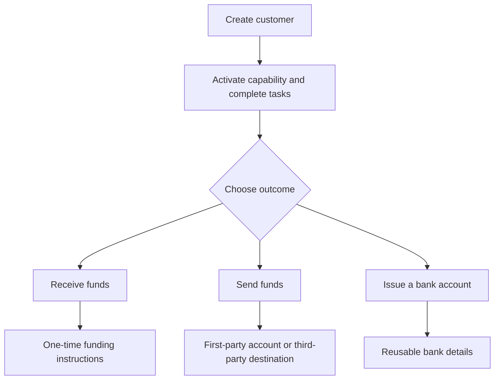

Aloita asiakkaan tuloksesta. Jokainen virta käyttää samaa käyttöönottomallia ja haarautuu sitten eri tileihin ja rahaliikenteeseen.

## Vertaa virtoja

| Tulos | Valmistele ensin | Mitä saat |
| --- | --- | --- |
| Maksun vastaanotto | Valmis maksun vastaanotto -kyky ja luotu kohdelompakko | Siirtokohtaiset ohjeet ja vakaakolikon selvitys |
| Maksu ulos | Valmis maksu ulos -kyky, rahoitettu luotu lompakko ja valmis tili tai kohde | Siirto valittuun vastaanottajapisteeseen |
| Luotu pankkitili | Valmis pankkikyky ja luotu selvityslompakko | Uudelleenkäytettävät pankkitilitiedot valmistelun jälkeen |

Tarjottu maksun vastaanotto luo ohjeet yhdelle siirrolle. Luotu pankkitili luo uudelleenkäytettävät tiedot myöhempiä talletuksia varten. Maksu ulos alkaa varoista, jotka ovat jo saatavilla luodussa lompakossa.

## Valitse virtasi

<CardGroup cols={3}>
  <Card title="Vastaanota varoja" icon="arrow-down-to-line" href="/fi/integration/receive-funds">
    Luo ja seuraa fiat-vakaakolikko-maksun vastaanottoa.
  </Card>
  <Card title="Lähetä varoja" icon="arrow-up-from-line" href="/fi/integration/send-funds">
    Rakenna ensimmäisen tai kolmannen osapuolen maksu ulos.
  </Card>
  <Card title="Luo pankkitili" icon="building-columns" href="/fi/integration/issue-bank-account">
    Valmistele lompakkoon linkitetyt uudelleenkäytettävät pankkitilitiedot.
  </Card>
</CardGroup>
