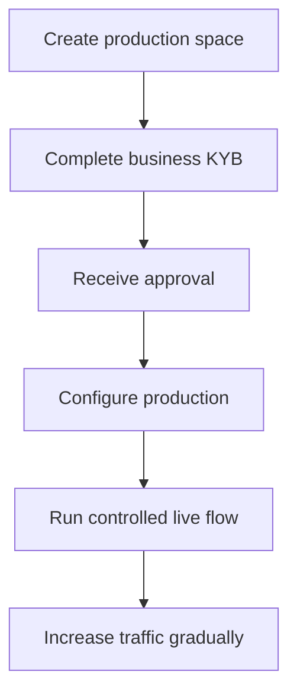

Tuotannon aktivointi vahvistaa integroivan yrityksesi. Se on erillinen API-asiakkaista, jotka luot tuotettasi varten.

## Aktivoi tuotantotilasi

1. Kirjaudu sisään Swipelux-hallintapaneeliin ja valitse **Create a production space**.
2. Avaa KYB-välilehti tai siirry kohtaan [Business verification](https://www.swipelux.app/kyb).
3. Täytä jokainen pyydetty kenttä ja lataa vaaditut asiakirjat.
4. Lähetä integroiva yrityksesi vahvistettavaksi ja odota hyväksyntää.

Vasta kun integroiva yrityksesi ja tuotantotilasi on hyväksytty, voit luoda tuotannon API-asiakkaita ja tapahtumia.

## Pidä tuotanto itsenäisenä

Luo tuotantoresurssit eksplisiittisesti. API-avaimen vaihtaminen ei siirrä sandbox-tilaa.

- Säilytä tuotannon tunnistetiedot erillisessä salaisuudenhallinnan merkinnässä.
- Käytä vain tuotannon käyttöönottokonfiguraatiota ja resurssi-ID:itä.
- Rekisteröi erillinen tuotannon webhook-päätepiste ja allekirjoitussalaisuus.
- Luo uudelleen tarvittavat asiakkaat, kyvyt, tilit, vastaanottajat ja kohteet tuotannossa.
- Rajoita tuotannon käyttö palveluille ja käyttäjille, jotka sitä tarvitsevat.

Sandbox ja tuotanto käyttävät `https://platform.swipelux.com`; API-avain valitsee ympäristön.

## Suorita käynnistystarkistuslista

- [ ] Testaa onnistumispolku ja odotetut virhepolut sandboxissa.
- [ ] Lähetä `Idempotency-Key` jokaisessa kirjoituksessa, joka sitä vaatii, ja säilytä se turvallisia uudelleenyrityksiä varten.
- [ ] Vahvista webhookien allekirjoitukset ennen jäsennystä, tallenna tapahtuma-ID:t kestävästi ja testaa toisto.
- [ ] Käsittele ei-saatavilla olevia kykyjä, avoimia tehtäviä ja muuttuneita tehtäväversioita.
- [ ] Näytä siirtojen epäonnistumiset ja toimintakelpoiset ohjeet operaattoreillesi.
- [ ] Vahvista, että lokit säilyttävät `X-Request-Id`- tai `correlationId`-arvon paljastamatta salaisuuksia tai arkaluontoisia taloustietoja.

## Suorita yksi hallittu tuotantovirta

Aloita tunnetulla asiakkaalla ja yhdellä pieniarvoisella tapahtumalla. Kirjaa:

| Hallinta | Määritä ennen testiä |
| --- | --- |
| Laajuus | Asiakas, kyky, tili tai kohde, summa ja menetelmä. |
| Odotettu tulos | API-tila, saldo tai ohjeet ja webhook-tapahtuma, jonka odotat havaitsevasi. |
| Vastuuhenkilö | Henkilö, joka vastaa täydellisen virran seuraamisesta. |
| Pysäytysehto | Mikä tahansa odottamaton tila, puuttuva webhook, virheellinen summa tai ratkaisematon tehtävä. |

Vahvista sekä nykyinen API-resurssi että todennettu webhook-toimitus. Jos jompikumpi eroaa odotetusta tuloksesta, pysähdy ja tutki ennen kuin lähetät lisää liikennettä.

Kun täydellinen virta onnistuu, lisää volyymia asteittain ja seuraa kykyjen, tilien, kohteiden ja siirtojen tiloja.

Palaa kohtaan [Yleiset virrat](/fi/integration/common-flows) tuotematkan osalta tai käytä [API-referenssiä](/fi/api-reference/introduction) tarkkoihin sopimuksiin.
