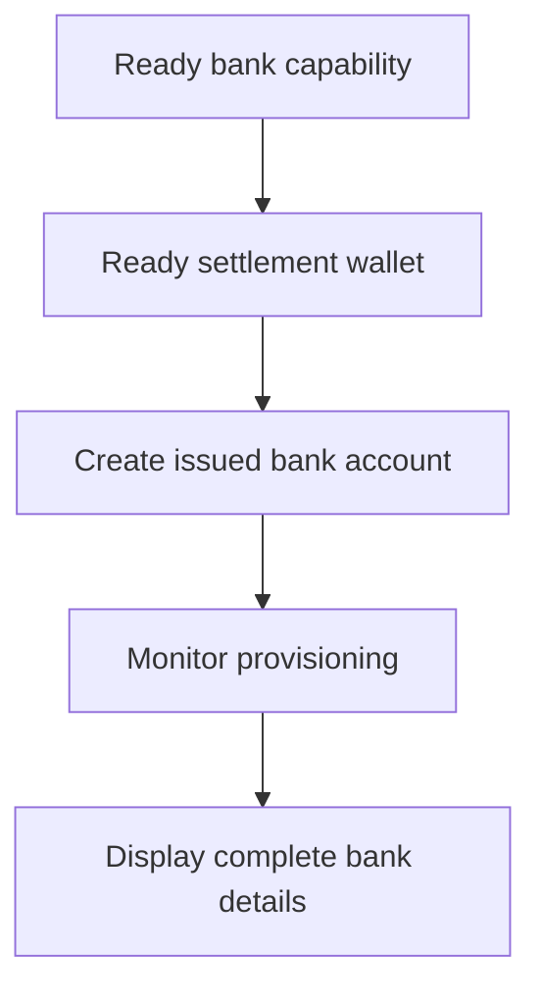

Käytä luotua pankkitiliä, kun asiakas tarvitsee uudelleenkäytettävät pankkitilitiedot. Kertaluontoisia rahoitusohjeita varten, jotka on sidottu tiettyyn summaan, käytä sen sijaan kohtaa [Vastaanota varoja](/fi/integration/receive-funds).



## Ennen kuin aloitat

Tarvitset asiakas-ID:n, valmiin pankkikyvyn aiotulle menetelmälle ja valuutalle sekä valmiin luodun lompakon, jonka omistaa sama asiakas. Suorita avoin työ [Kyvyt ja tehtävät](/fi/integration/onboarding/capabilities-and-requirements) -kautta.

## 1. Luo tai valitse selvityslompakko

Luo luotu lompakko [Tilit ja lompakot](/fi/integration/accounts#create-the-account) -kautta, lue se sitten uudelleen. Jatka vain, kun sen nykyinen tila sallii selvityksen.

Tallenna sen vastauksesta johdettu `data.id` muuttujaan `SETTLEMENT_WALLET_ID`. Älä käytä ulkoista lompakkoa `settlement.accountId`-kenttänä.

## 2. Luo luotu pankkitili

Käytä [`POST /v3/customers/{customerId}/accounts`](/api-reference/accounts/post-v3-customers-by-customer-id-accounts) -toimintoa näillä otsakkeilla:

```http
X-API-Key: ${SWIPELUX_API_KEY}
Idempotency-Key: issued-bank-account-001
Content-Type: application/json
```

Lähetä tämä pyyntörunko:

```json
{
  "origin": "issued",
  "type": "bank",
  "method": "ach",
  "country": "US",
  "currency": "USD",
  "settlement": {
    "accountId": "${SETTLEMENT_WALLET_ID}"
  },
  "label": "USD account"
}
```

Tallenna palautettu `data.id` muuttujaan `BANK_ACCOUNT_ID`. Säilytä myös `data.status`, `data.openTaskIds`, `data.details` ja selvityssuhde.

Pankkitili-ID:llä ja lompakko-ID:llä on eri roolit. Lue valmistelu ja pankkitilitiedot pankkitili-ID:n kautta. Käytä selvityslompakon ID:tä tunnistamaan, minne talletukset hyvitetään.

## 3. Seuraa valmistelua

Lue [`GET /v3/customers/{customerId}/accounts/{accountId}`](/api-reference/accounts/get-v3-customers-by-customer-id-accounts-by-account-id) luonnin jälkeen ja jokaisen asiaankuuluvan webhookin jälkeen.

Pidä asiakasliittymä odottavana, kun `details` puuttuu. Jos `openTaskIds` ei ole tyhjä, suorita uusimmat tehtävät ja hae tili uudelleen. Älä päättele valmiutta kuluneesta ajasta.

Jos uusin `statusReason.code` on `awaiting_assignment`, luo ensimmäinen maksun vastaanotto samalle asiakkaalle, kyvylle ja selvityslompakolle [Vastaanota varoja](/fi/integration/receive-funds) -kautta, lue sitten pankkitili uudelleen. Seuraa tätä haaraa vain, kun nykyinen tili pyytää sitä.

## 4. Esitä pankkitilitiedot turvallisesti

Näytä vain täydelliset tiedot, jotka palautettiin uusimmasta tilin lukemisesta. Kun `details.referenceRequired` on true, näytä tarkka `details.reference` ja tee siitä kopioitava. Kun se on false, älä keksi viitettä.

Nämä pankkitilitiedot ovat uudelleenkäytettäviä. Älä korvaa niitä tarjottuun maksun vastaanottoon liittyvillä rahoituskoordinaateilla, jotka kuuluvat vain kyseiseen siirtoon.

Seuraavaksi lisää [webhookit](/fi/integration/webhooks), jotta valmisteluun liittyvät päivitykset saavuttavat sovelluksesi ilman, että pidät asiakasta pollausnäytöllä.
