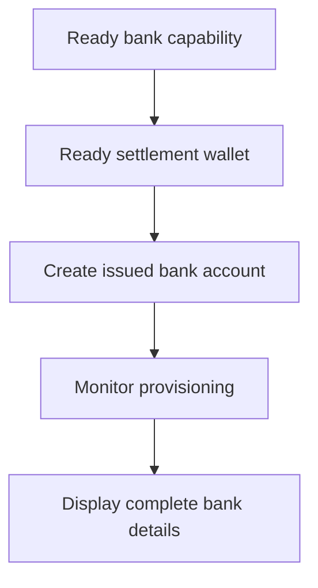

Käytä luotua pankkitiliä, kun asiakas tarvitsee uudelleenkäytettävät pankkitilitiedot. Kertaluontoisia rahoitusohjeita varten, jotka on sidottu tiettyyn summaan, käytä sen sijaan kohtaa [Vastaanota varoja](/fi/integration/receive-funds).


```mermaid
flowchart TD
  A["Ready bank capability"] --> B["Ready settlement wallet"]
  B --> C["Create issued bank account"]
  C --> D["Monitor provisioning"]
  D --> E["Display complete bank details"]
```

## Ennen kuin aloitat

Tarvitset asiakas-ID:n, valmiin pankkikyvyn aiotulle menetelmälle ja valuutalle sekä valmiin luodun lompakon, jonka omistaa sama asiakas. Suorita avoin työ [Kyvyt ja tehtävät](/fi/integration/onboarding/capabilities-and-requirements) -kautta.

## 1. Luo tai valitse selvityslompakko

Luo luotu lompakko [Tilit ja lompakot](/fi/integration/accounts#create-the-account) -kautta, lue se sitten uudelleen. Jatka vain, kun sen nykyinen tila sallii selvityksen.

Tallenna sen vastauksesta johdettu `data.id` muuttujaan `SETTLEMENT_WALLET_ID`. Älä käytä ulkoista lompakkoa `settlement.accountId`-kenttänä.

## 2. Luo luotu pankkitili

Käytä [`POST /v3/customers/{customerId}/accounts`](/api-reference/accounts/post-v3-customers-by-customer-id-accounts) -toimintoa näillä otsakkeilla:

```http
X-API-Key: ${SWIPELUX_API_KEY}
Idempotency-Key: issued-bank-account-001
Content-Type: application/json
```

Lähetä tämä pyyntörunko:

```json
{
  "origin": "issued",
  "type": "bank",
  "method": "ach",
  "country": "US",
  "currency": "USD",
  "settlement": {
    "accountId": "${SETTLEMENT_WALLET_ID}"
  },
  "label": "USD account"
}
```

Tallenna palautettu `data.id` muuttujaan `BANK_ACCOUNT_ID`. Säilytä myös `data.status`, `data.openTaskIds`, `data.details` ja selvityssuhde.

Valinnaiset pyyntökentät:

| Kenttä | Koskee | Toiminta |
| --- | --- | --- |
| `institution` | Luodut `ach`-, `wire`- ja `swift`-tilit | Valitsee täsmälleen tämän pankin. Swipelux ei vaihda toiseen pankkiin. Käytä laitos-ID:tä, joka palautetaan tuettujen kykyjen vastauksessa. |
| `allowPending` | Luodut `ach`-, `wire`- ja `swift`-tilit | Aseta arvoksi `true`, jos haluat tallentaa pyynnön, kun valitun pankin hakemus odottaa hyväksyntää. Vaatii `institution`-kentän. |
| `settlement.currency` | Luodut `USD`-pankkitilit | `USDC` tai `USDT`. Määrittää stablecoinin, joka toimitetaan selvityslompakkoon. |

### Valitse pankki {#choose-the-bank}

Lähetä `institution`, kun asiakas tarvitsee pankkitilitiedot tietystä pankista. Swipelux varaa yhden luodun tilin asiakasta, menetelmää, valuuttaa ja laitosta kohden. Kun jätät `institution`-kentän pois, yksi luotu tili menetelmää ja valuuttaa kohden kattaa kaikki pankit. Tällöin toinen luontipyyntö samalle menetelmälle ja valuutalle palauttaa `409 conflict` -virheen.

Tilin lukemiset palauttavat valitun pankin `institution`-kenttänä, jossa on `id`, `name` ja `bic`. `bic` voi olla `null`.

Idempotenssi koskee valittua pankkia. Saman pyynnön toistaminen palauttaa alkuperäisen tilin. `institution`-kentän muuttaminen saman `Idempotency-Key`-arvon alla palauttaa `409 idempotency_conflict` -virheen.

### Tallenna pyyntö ennen pankin hyväksyntää {#save-the-request-before-bank-approval}

Oletuksena Swipelux hyväksyy luodun pankkitilin pyynnön vasta, kun pankkikyky on valmis. Jos haluat kerätä asiakkaan tilin asetukset aiemmin, lähetä `allowPending: true` yhdessä `institution`-kentän kanssa:

```json
{
  "origin": "issued",
  "type": "bank",
  "method": "wire",
  "country": "US",
  "currency": "USD",
  "institution": "${INSTITUTION_ID}",
  "allowPending": true,
  "settlement": {
    "accountId": "${SETTLEMENT_WALLET_ID}"
  },
  "label": "USD wire account"
}
```

Kun pankin hakemus on tarkistettavana, tili palauttaa `status: "in_review"` -arvon, ja `statusReason.code` on `waiting_for_approval`. Vastaus sisältää myös `applicationId`-kentän ja hakemuksen `openTaskIds`-arvot. Suorita nämä tehtävät [Kyvyt ja tehtävät](/fi/integration/onboarding/capabilities-and-requirements) -kautta.

Tallennettu pyyntö säilyttää tili-ID:nsä, selvityslompakkonsa ja tilipaikkansa. Kun hakemus ja kyky ovat valmiita, Swipelux valmistelee pankkitilitiedot saman `BANK_ACCOUNT_ID`-tunnisteen alle. Jatka kyseisen ID:n lukemista. Älä luo uutta pyyntöä.

Jos hakemus hylätään, peruutetaan tai arkistoidaan ensin, tilin tilaksi tulee `rejected`. Se ei enää varaa tilipaikkaa, joten voit lähettää uuden pyynnön.

### Valitse selvitysvaluutta {#choose-the-settlement-currency}

Oletuksena talletukset selvitetään selvityslompakon valuutassa. Aseta `settlement.currency` arvoon `USDC` tai `USDT`, jos haluat valita toimitettavan omaisuuserän lompakon valuutasta riippumatta:

```json
{
  "settlement": {
    "accountId": "${SETTLEMENT_WALLET_ID}",
    "currency": "USDT"
  }
}
```

Tilin lukemiset palauttavat tallennetun valinnan myös silloin, kun tiliä vielä valmistellaan. Selvitysvaluutan muuttaminen myöhemmin ei muuta lompakkoa eikä hinnoittele uudelleen talletuksia, jotka Swipelux on jo kohdistanut tilille.

Pankkitili-ID:llä ja lompakko-ID:llä on eri roolit. Lue valmistelu ja pankkitilitiedot pankkitili-ID:n kautta. Käytä selvityslompakon ID:tä tunnistamaan, minne talletukset hyvitetään.

## 3. Seuraa valmistelua

Lue [`GET /v3/customers/{customerId}/accounts/{accountId}`](/api-reference/accounts/get-v3-customers-by-customer-id-accounts-by-account-id) luonnin jälkeen ja jokaisen asiaankuuluvan webhookin jälkeen.

Pidä asiakasliittymä odottavana, kun `details` puuttuu. Jos `openTaskIds` ei ole tyhjä, suorita uusimmat tehtävät ja hae tili uudelleen. Älä päättele valmiutta kuluneesta ajasta.

Jos tili tallennettiin `allowPending: true` -arvolla, se pysyy tilassa `in_review` ja `statusReason.code` on `waiting_for_approval`, kunnes pankki hyväksyy hakemuksen.

Jos uusin `statusReason.code` on `awaiting_assignment`, luo ensimmäinen maksun vastaanotto samalle asiakkaalle, kyvylle ja selvityslompakolle [Vastaanota varoja](/fi/integration/receive-funds) -kautta, lue sitten pankkitili uudelleen. Seuraa tätä haaraa vain, kun nykyinen tili pyytää sitä.

## 4. Esitä pankkitilitiedot turvallisesti

Näytä vain täydelliset tiedot, jotka palautettiin uusimmasta tilin lukemisesta. Kun `details.referenceRequired` on true, näytä tarkka `details.reference` ja tee siitä kopioitava. Kun se on false, älä keksi viitettä.

Luoduille `swift`-tileille näytä `details.swiftCode` (vastaanottavan pankin BIC), `details.accountNumber`, `details.accountHolderName` ja `details.accountHolderAddress`, kun ne palautetaan. Lähettäjien on kopioitava edunsaajan osoite täsmälleen kansainväliseen tilisiirtoon. Näytä myös `details.bankAddress` ja kaikki välittäjäpankin kentät, jotka tili palauttaa.

Nämä pankkitilitiedot ovat uudelleenkäytettäviä. Älä korvaa niitä tarjottuun maksun vastaanottoon liittyvillä rahoituskoordinaateilla, jotka kuuluvat vain kyseiseen siirtoon.

Seuraavaksi lisää [webhookit](/fi/integration/webhooks), jotta valmisteluun liittyvät päivitykset saavuttavat sovelluksesi ilman, että pidät asiakasta pollausnäytöllä.
