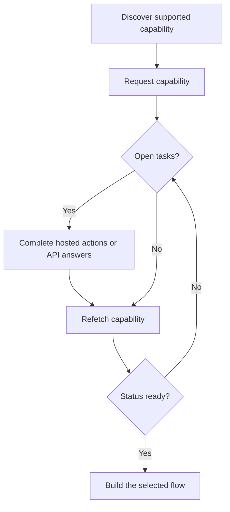

Kyky kertoo, voiko asiakas käyttää tiettyä tulosta, maksutapaa ja suuntaa. Avoimet tehtävät kertovat, mitä on tapahduttava, ennen kuin kyseinen kyky tai siihen liittyvä resurssi voi edetä.



```bash
export API_BASE='https://platform.swipelux.com'
export SWIPELUX_API_KEY='replace-with-your-api-key'
```

## Löydä tuetut kyvyt

Lue asiakkaan nykyiset vaihtoehdot [`GET /v3/customers/{customerId}/capabilities/supported`](/api-reference/capabilities/get-v3-customers-by-customer-id-capabilities-supported) -toiminnolla:

```bash
curl --request GET \
  "${API_BASE}/v3/customers/${CUSTOMER_ID}/capabilities/supported" \
  --header "X-API-Key: ${SWIPELUX_API_KEY}"
```

Valitse vastauskohta, joka vastaa aiottua `directions`-, `method`- ja `accountType`-arvoa. Jatka vain, kun `availability` on `available` tai `beta` ja `eligibility.eligible` on `true`. Jos `institutions` palautetaan, valitse vain ID kyseisestä vastauksesta.

Tallenna valittu `data[].id` muuttujaan `CAPABILITY_ID`. Älä koskaan kopioi kyky-ID:tä toiselta asiakkaalta tai ympäristöstä.

### Jaetut ja nimelliset tilityypit

Pankkikykyjä on kahta muunnelmaa, jotka koodataan `accountType`-kenttään ja kyky-ID:n loppuliitteeseen (esimerkiksi `ach_pooled`, `wire_named`):

- **`pooled`**: jaettu Swipeluxin pankkitili. Kukin maksun vastaanotto käyttää yksilöllistä viitettä varojen reitittämiseen. Valitse tämä kertaluontoisia siirtoja varten.
- **`named`**: asiakkaalle omistettu pankkitilitiedot (virtuaalinen IBAN, omistettu ACH-tili). Uudelleenkäytettävä ja jaettavissa minkä tahansa maksajan kanssa. Vaaditaan [luotuja pankkitilejä](/fi/integration/issue-bank-account) varten.

Käytä oletuksena `pooled`. Käytä `named`-tyyppiä vain, kun asiakas tarvitsee uudelleenkäytettäviä pankkitilitietoja. Tarkista `supported`-vastauksesta, mitkä muunnelmat ovat saatavilla.

## Pyydä kyky

Pyydä valittu vaihtoehto [`POST /v3/customers/{customerId}/capabilities/{capabilityId}`](/api-reference/capabilities/post-v3-customers-by-customer-id-capabilities-by-capability-id) -toiminnolla:

```bash
curl --request POST \
  "${API_BASE}/v3/customers/${CUSTOMER_ID}/capabilities/${CAPABILITY_ID}" \
  --header "X-API-Key: ${SWIPELUX_API_KEY}" \
  --header "Idempotency-Key: capability-request-001" \
  --header "Content-Type: application/json" \
  --data '{}'
```

Käytä eksplisiittistä `institutions`-taulukkoa vain, kun sinun täytyy valita tuettu-kykyvastauksen palauttamista ID:istä.

Tallenna `data.status` muuttujaan `CAPABILITY_STATUS`, `data.openTaskIds` muuttujaan `OPEN_TASK_IDS` ja kukin `data.applications[].id` muuttujaan `APPLICATION_IDS`.

## Suorita nykyiset tehtävät

Listaa tehtävät [`GET /v3/customers/{customerId}/tasks`](/api-reference/tasks/list-customer-tasks) -toiminnolla, valitse ID:t muuttujasta `OPEN_TASK_IDS`, lue sitten kukin nykyinen tehtävä [`GET /v3/customers/{customerId}/tasks/{taskId}`](/api-reference/tasks/get-customer-task) -toiminnolla:

```bash
curl --request GET \
  "${API_BASE}/v3/customers/${CUSTOMER_ID}/tasks/${TASK_ID}" \
  --header "X-API-Key: ${SWIPELUX_API_KEY}"
```

Käytä uusinta `data.revision`- ja `data.requirements`-arvoa. Hae tehtävä uudelleen juuri ennen lähettämistä, jos jompikumpi voi olla muuttunut.

### Isännöidyt toiminnot

Kun tehtävä palauttaa `verificationSessions`- tai `tosSessions`-arvoja, tallenna kunkin istunnon `id` ja nykyinen `url`. Lähetä asiakas palautettuun URL:iin ja lue tehtävä sitten uudelleen. Nämä ovat tehtäväkohtaisia toimintoja, ei erillinen asiakkaan vahvistuselinkaari.

### Lataa dokumentteja

Kun vaatimus pyytää dokumenttia, lataa se [`POST /v3/customers/{customerId}/documents`](/api-reference/documents/post-v3-customers-by-customer-id-documents) -toiminnolla:

```bash
export DOCUMENT_PATH='/absolute/path/to/requested-document.pdf'

curl --request POST \
  "${API_BASE}/v3/customers/${CUSTOMER_ID}/documents" \
  --header "X-API-Key: ${SWIPELUX_API_KEY}" \
  --header "Idempotency-Key: customer-document-001" \
  --form "file=@${DOCUMENT_PATH}"
```

Tallenna palautettu `data.id` muuttujaan `DOCUMENT_ID` ennen kuin lähetät siihen viittaavan vastauksen.

### API-vastaukset

Lähetä yksi täydellinen vastausjoukko nykyistä versiota varten [`POST /v3/customers/{customerId}/tasks/{taskId}/submissions`](/api-reference/task-submissions/create-customer-task-submission) -toiminnolla:

```bash
curl --request POST \
  "${API_BASE}/v3/customers/${CUSTOMER_ID}/tasks/${TASK_ID}/submissions" \
  --header "X-API-Key: ${SWIPELUX_API_KEY}" \
  --header "Idempotency-Key: task-submission-001" \
  --header "Content-Type: application/json" \
  --data @- <<'JSON'
{
  "taskRevision": 3,
  "answers": [
    {
      "requirementId": "req_from_current_task",
      "answer": {
        "type": "text",
        "value": "Current answer"
      }
    }
  ]
}
JSON
```

Ota jokainen vaatimuksen ID ja vastaustyyppi uusimmasta tehtävästä. Jos API ilmoittaa, että tehtävä on muuttunut, hae se uudelleen ja rakenna lähetys uuden version pohjalta.

## Jatka, kun kyky on valmis

Lue kyky uudelleen [`GET /v3/customers/{customerId}/capabilities/{capabilityId}`](/api-reference/capabilities/get-v3-customers-by-customer-id-capabilities-by-capability-id) -toiminnolla:

```bash
curl --request GET \
  "${API_BASE}/v3/customers/${CUSTOMER_ID}/capabilities/${CAPABILITY_ID}" \
  --header "X-API-Key: ${SWIPELUX_API_KEY}"
```

Korvaa tallennettu tila ja tehtävän ID:t uusimmalla vastauksella. Jatka vain, kun nykyinen kyvyn tila sallii aiottujen tilin, tarjouksen tai siirron luomisen.

Seuraavaksi valitse vastaava matka [Yleiset virrat](/fi/integration/common-flows) -sivulta.