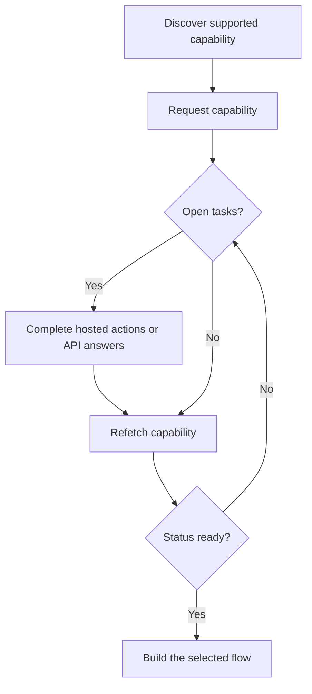

Kyky kertoo, voiko asiakas käyttää tiettyä tulosta, maksutapaa ja suuntaa. Avoimet tehtävät kertovat, mitä on tapahduttava, ennen kuin kyseinen kyky tai siihen liittyvä resurssi voi edetä.


```mermaid
flowchart TD
  A["Discover supported capability"] --> B["Request capability"]
  B --> C{"Open tasks?"}
  C -->|"Yes"| D["Complete hosted actions or API answers"]
  D --> E["Refetch capability"]
  C -->|"No"| E
  E --> F{"Status ready?"}
  F -->|"No"| C
  F -->|"Yes"| G["Build the selected flow"]
```

```bash
export API_BASE='https://platform.swipelux.com'
export SWIPELUX_API_KEY='replace-with-your-api-key'
```

## Löydä tuetut kyvyt

Lue asiakkaan nykyiset vaihtoehdot [`GET /v3/customers/{customerId}/capabilities/supported`](/api-reference/capabilities/get-v3-customers-by-customer-id-capabilities-supported) -toiminnolla:

```bash
curl --request GET \
  "${API_BASE}/v3/customers/${CUSTOMER_ID}/capabilities/supported" \
  --header "X-API-Key: ${SWIPELUX_API_KEY}"
```

Valitse vastauskohta, joka vastaa aiottua `directions`-, `method`- ja `accountType`-arvoa. Jatka vain, kun `availability` on `available` tai `beta` ja `eligibility.eligible` on `true`. Jos `institutions` palautetaan, valitse vain ID kyseisestä vastauksesta.

Jokainen instituutiomerkintä sisältää `logoUrl`-kentän ja `isDefault`-lipun. Käytä `logoUrl`-arvoa pankin logon näyttämiseen pankinvalintakäyttöliittymässä ja näytä oma yleinen pankkikuvakkeesi, kun arvo on `null`. `isDefault` koskee vain tätä asiakasta ja kykyä, ei instituutiota yleisesti. [`GET /v3/institutions`](/api-reference/institutions/get-v3-institutions) palauttaa saman null-arvoja sallivan `logoUrl`-kentän. Instituutioiden ID:t ovat läpinäkymättömiä, joten käsittele uudet ID:t ilman koodimuutoksia.

```json
{
  "institutions": [
    {
      "id": "jpmorgan",
      "name": "JPMorgan Chase",
      "bic": "CHASUS33",
      "logoUrl": "https://wallet.swipelux.com/bank-logos/jpmorgan.png",
      "countries": ["US"],
      "isDefault": true
    }
  ]
}
```

Tallenna valittu `data[].id` muuttujaan `CAPABILITY_ID`. Älä koskaan kopioi kyky-ID:tä toiselta asiakkaalta tai ympäristöstä.

### Jaetut ja nimelliset tilityypit

Pankkikykyjä on kahta muunnelmaa, jotka koodataan `accountType`-kenttään ja kyky-ID:n loppuliitteeseen (esimerkiksi `ach_pooled`, `wire_named`):

- **`pooled`**: jaettu Swipeluxin pankkitili. Kukin maksun vastaanotto käyttää yksilöllistä viitettä varojen reitittämiseen. Valitse tämä kertaluontoisia siirtoja varten.
- **`named`**: asiakkaalle omistettu pankkitilitiedot (virtuaalinen IBAN, omistettu ACH-tili). Uudelleenkäytettävä ja jaettavissa minkä tahansa maksajan kanssa. Vaaditaan [luotuja pankkitilejä](/fi/integration/issue-bank-account) varten.

Käytä oletuksena `pooled`. Käytä `named`-tyyppiä vain, kun asiakas tarvitsee uudelleenkäytettäviä pankkitilitietoja. Tarkista `supported`-vastauksesta, mitkä muunnelmat ovat saatavilla.

Jos haluat vastaanottaa SWIFT-talletuksia tai luoda SWIFT-pankkitilitiedot, käytä `swift_named`-vaihtoehtoa. `swift_pooled` tukee vain maksuja ulos, joten tarkista kunkin vaihtoehdon `directions`-arvo tuettu-kykyvastauksesta. Nimellinen SWIFT-tili palauttaa uudelleenkäytettävät vastaanottotiedot, mukaan lukien pankin BIC-tunnuksen, viitteen, kun sellainen vaaditaan, ja edunsaajan osoitteen, kun pankki toimittaa sen.

Luoduille ACH-, Wire- ja SWIFT-tileille voit valita tarkan pankin `institution`-kentällä ja tallentaa tilipyynnön ennen kuin pankki hyväksyy asiakkaan. Katso [Luo pankkitili](/fi/integration/issue-bank-account#choose-the-bank).

## Pyydä kyky

Pyydä valittu vaihtoehto [`POST /v3/customers/{customerId}/capabilities/{capabilityId}`](/api-reference/capabilities/post-v3-customers-by-customer-id-capabilities-by-capability-id) -toiminnolla:

```bash
curl --request POST \
  "${API_BASE}/v3/customers/${CUSTOMER_ID}/capabilities/${CAPABILITY_ID}" \
  --header "X-API-Key: ${SWIPELUX_API_KEY}" \
  --header "Idempotency-Key: capability-request-001" \
  --header "Content-Type: application/json" \
  --data '{}'
```

Käytä eksplisiittistä `institutions`-taulukkoa vain, kun sinun täytyy valita tuettu-kykyvastauksen palauttamista ID:istä.

Tallenna `data.status` muuttujaan `CAPABILITY_STATUS`, `data.accountProvisioning` muuttujaan `ACCOUNT_PROVISIONING_STATUS`, `data.openTaskIds` muuttujaan `OPEN_TASK_IDS` ja kukin `data.applications[].id` muuttujaan `APPLICATION_IDS`.

### Pankkikohtaiset jaetut hakemukset {#shared-applications-per-bank}

Nimellisissä pankkikyvyissä jokaisella asiakkaalla on yksi hakemustapaus pankkia kohden. Jaetut kyvyt ja alustakyvyt käyttävät tapauksia ilman pankkia. Swipelux jakaa tapauksen kaikkien pyytämiesi yhteensopivien kykyjen kesken:

- Yksi hyväksyntä voi kattaa useita kykyjä. Esimerkiksi yhden pankin hyväksytty tapaus voi tehdä sekä ACH- että wire-kyvystä `ready`-tilaisen.
- Myöhempi pyyntö, joka vastaa olemassa olevaa tapausta, käyttää sitä uudelleen. Swipelux ei avaa toista hakemusta eikä lisää päällekkäisiä tehtäviä.
- Eri pankkien tapaukset ovat toisistaan riippumattomia. Hylkäys yhdessä pankissa ei vaikuta toisen pankin tapaukseen.

Pyynnön vastaus kertoo, mitä tapausta Swipelux käytti:

- `201` tarkoittaa, että pyyntö avasi uuden hakemustapauksen.
- `200` tarkoittaa, että pyyntö kohdistui hakemustapaukseen, joka asiakkaalla jo oli, esimerkiksi toistettu pyyntö pankkikyvylle, joka asiakkaalla jo on, tai pyyntö peruutetulle kyvylle. Toistettu pyyntö kyvylle `card` tai `stablecoin_transfers` palauttaa edelleen [`409 capability_already_exists`](/integration/errors#capability-already-exists).
- `selectedApplicationId` on ylätason kenttä `data`-kentän vieressä, ja se sisältää pyynnön valitseman tai avaaman tapauksen ID:n. Swipelux jättää sen pois, kun pyyntö ei valinnut tapausta. Idempotentti uusinta palauttaa saman arvon.

Lyhennetty vastaus:

```json
{
  "data": {
    "id": "ach_named",
    "status": "pending",
    "openTaskIds": ["tsk_000000000000000002"],
    "applications": [{ "id": "apl_000000000000000005", "status": "in_review" }]
  },
  "selectedApplicationId": "apl_000000000000000005"
}
```

Nimellisissä kyvyissä lähetä sama `institutions`-luettelo uudelleen valitaksesi saman tapauksen, tai lähetä yksi instituution ID kohdistaaksesi pyynnön kyseiseen pankkiin. Pankki, joka on hylännyt asiakkaan lopullisesti, ohitetaan. Kun nimeät vain kyseisen pankin tai kaikki kelvolliset pankit ovat hylänneet asiakkaan, pyyntö palauttaa [`409 capability_terminally_rejected`](/integration/errors#capability-terminally-rejected). Kokeillaksesi toista pankkia hylkäyksen jälkeen pyydä kykyä uudelleen kyseisen pankin instituution ID:llä.

Kyvyn tila heijastaa kaikkia asiakkaan siihen liittyviä tapauksia. Nimellisessä kyvyssä yksi `ready`-tapaus, jonka hyväksyntä kattaa kyvyn, riittää tekemään siitä `ready`-tilaisen riippumatta siitä, mitä muut pankit raportoivat. Jaettu kyky odottaa lisäksi maksutapansa tarkistusta, joka raportoidaan `probes`-kentässä asiakkaan hakemusluettelossa.

#### Listaa asiakkaan hakemukset {#list-the-customers-applications}

Listaa kaikki asiakkaan hakemustapaukset [`GET /v3/customers/{customerId}/applications`](/api-reference/capabilities/get-v3-customers-by-customer-id-applications) -toiminnolla. Tulokset sivutetaan `nextCursor`- ja `hasMore`-kentillä, ja ne hyväksyvät `updatedAfter`-parametrin:

```bash
curl --request GET \
  "${API_BASE}/v3/customers/${CUSTOMER_ID}/applications" \
  --header "X-API-Key: ${SWIPELUX_API_KEY}"
```

Jokainen merkintä sisältää kyvyn `applications[]`-kentässä palautettavat hakemuskentät sekä lisäksi:

- `scope`: `named` yhden pankin tapaukselle, `provider_pooled` tai `platform` tapauksille ilman pankkia, tai `null` luokittelemattomalle historialliselle tapaukselle. `institution` puuttuu `provider_pooled`- ja `platform`-tapauksista.
- `requestedScope[]`: tapaukseen kohdistetut pyydetyt kykyavaimet, kukin ensimmäisellä `requestedAt`-arvollaan. Merkintöjä ei koskaan poisteta.
- `coverage[]`: kykyavaimet, jotka tapauksen hyväksyntä kattaa, kukin `grantedAt`- ja `source`-arvoineen. Kattavuus kirjaa laajuuden, ei valtuutusta. Lue kyky saadaksesi sen nykyisen tilan.
- `probes[]`: maksutavan tarkistukset tapauksen kattamille jaetuille kykyavaimille, kukin `capabilityKey`-, `status`- ja `reason`-arvoineen. Nimelliset avaimet eivät koskaan vaadi tarkistusta.
- `generation`, `predecessorApplicationId` ja `supersededByApplicationId`: seuraantolinkit. Kun `supersededByApplicationId` on asetettu, tapaus on korvattu. Seuraa kyseistä ID:tä nykyiseen tapaukseen.

Lyhennetty vastaus:

```json
{
  "data": [
    {
      "id": "apl_000000000000000005",
      "status": "ready",
      "scope": "named",
      "institution": { "id": "jpmorgan", "name": "JPMorgan Chase", "bic": "CHASUS33" },
      "requestedScope": [
        { "capabilityKey": "ach_named", "requestedAt": "2026-09-20T10:00:00.000Z" }
      ],
      "coverage": [
        { "capabilityKey": "ach_named", "grantedAt": "2026-09-22T12:00:00.000Z", "source": "approval" },
        { "capabilityKey": "wire_named", "grantedAt": "2026-09-22T12:00:00.000Z", "source": "approval" }
      ],
      "probes": [],
      "generation": 1,
      "predecessorApplicationId": null,
      "supersededByApplicationId": null
    }
  ],
  "nextCursor": null,
  "hasMore": false
}
```

## Suorita nykyiset tehtävät {#complete-current-tasks}

Listaa tehtävät [`GET /v3/customers/{customerId}/tasks`](/api-reference/tasks/list-customer-tasks) -toiminnolla, valitse ID:t muuttujasta `OPEN_TASK_IDS`, lue sitten kukin nykyinen tehtävä [`GET /v3/customers/{customerId}/tasks/{taskId}`](/api-reference/tasks/get-customer-task) -toiminnolla:

```bash
curl --request GET \
  "${API_BASE}/v3/customers/${CUSTOMER_ID}/tasks/${TASK_ID}" \
  --header "X-API-Key: ${SWIPELUX_API_KEY}"
```

Käytä uusinta `data.revision`- ja `data.requirements`-arvoa. Hae tehtävä uudelleen juuri ennen lähettämistä, jos jompikumpi voi olla muuttunut.

### Uudelleenkäytetyt profiilitodisteet {#reused-profile-evidence}

Hakemuksen intake-tehtävissä, jotka hyväksyvät suoran API-lähetyksen, Swipelux käyttää uudelleen tietoja, jotka asiakas on jo antanut. Kun tällainen tehtävä luodaan tai täsmäytetään, Swipelux tarkistaa asiakasprofiilin ja asiakkaan itse lataamat asiakirjat. Kelvolliset vaatimukset, joiden tukena on jo käyttökelpoinen profiiliarvo tai asiakirja, siirtyvät tilaan `in_review` sen sijaan, että ne jäisivät toimintakelpoisiksi. Profiilin päivitykset ja uudet asiakirjalataukset käynnistävät saman tarkistuksen olemassa oleville tehtäville.

Vain puuttuvat tai yhteensopimattomat arvot jäävät toimintakelpoisiksi. Uudelleenkäyttö ei hyväksy todisteita. Swipelux tarkistaa ne silti. Eksplisiittiset korjauspyynnöt ja aiemmin vastatut vaatimukset jäävät toimintakelpoisiksi. Omistajien ja liittyvien osapuolten asiakirjoja ei käytetä uudelleen, ja vaatimukset, jotka kerätään vain isännöidyn istunnon kautta, noudattavat normaalia kulkuaan.

### Vaatimusten esittäminen {#render-requirements}

Rakenna lomakkeet kunkin vaatimuksen palauttamista metatiedoista vaatimusavainten sijaan. Vaatimus voi sisältää valinnaisen lyhyen `title`-kentän, ja jokainen `request` sisältää `prompt`-kentän, joka näytetään otsikon alla.

Vaatimukset, joiden `request.type: "profile"`, yksilöivät profiilikentän `profilePointer`-kentällä ja lisäävät syötteen metatietoja:

- `allowedValues`: sallitut arvot skalaarikentälle tai taulukkokentän jokaiselle alkiolle. Lähetä nämä arvot, älä käännettyjä näyttöotsikoita.
- `valueSchema`: itsenäinen JSON Schema Draft 7 -dokumentti, joka kuvaa syötteen muodon, sisäkkäiset ominaisuudet, pakolliset kentät ja rakenteelliset rajoitteet. Objektien enumit näkyvät asianomaisessa ominaisuudessa, esimerkiksi `valueSchema.items.properties.type.enum` verotunnisteille. Swipelux soveltaa silti kenttien välistä validointia ja tarkastusvalidointia lähetyksen jälkeen, joten skeeman läpäisevä arvo voidaan silti hylätä.
- `valueType: "country"`, tai taulukoille `itemValueType: "country"`: kenttä hyväksyy isoilla kirjaimilla kirjoitettuja ISO 3166-1 alpha-2 -koodeja. `valueSchema`-skeeman sisäkkäiset maaominaisuudet käyttävät `format: "iso-3166-1-alpha-2"`. Käytä vakiomaaluetteloa lokalisoituja otsikoita varten.

```json
{
  "id": "req_000000000000000010",
  "key": "account_purposes",
  "title": "Account purpose",
  "status": "action_required",
  "request": {
    "type": "profile",
    "prompt": "Select every purpose that applies.",
    "required": true,
    "profilePointer": "/financialProfile/accountPurposes",
    "valueType": "array",
    "itemValueType": "string",
    "allowedValues": ["business_expenses", "ecommerce", "payroll"],
    "valueSchema": {
      "$schema": "http://json-schema.org/draft-07/schema#",
      "type": "array",
      "items": { "enum": ["business_expenses", "ecommerce", "payroll"] }
    }
  }
}
```

Tämä esimerkki lyhentää arvoluetteloa; API palauttaa kaikki sallitut arvot. Joillakin profiilivaatimuksilla ei ole julkaistua skeemaa, ja niistä puuttuvat `valueSchema` ja `allowedValues`. Esitä ne `prompt`- ja `valueType`-kenttien perusteella.

Jokainen avoin tehtävä sisältää `dueAt`-aikaleiman. Kun Swipelux luo tehtävän ilman eksplisiittistä eräpäivää, `dueAt` on oletuksena tasan 31 päivää tehtävän `createdAt`-ajankohdan jälkeen. Käsittele `dueAt`-arvoa informatiivisena: et voi asettaa sitä API:n kautta, eikä se laukaise automaattista elinkaarisiirtymää. Vain erillinen `deadline`-kenttä aiheuttaa automaattisen siirtymän, jos se on asetettu.

### Isännöidyt toiminnot

Tehtävän tietovastauksessa jokainen `verificationSessions`- ja `tosSessions`-merkintä sisältää `action`-objektin. Tehtäväluettelon vastaukset eivät sisällä näitä toimintolinkkejä. Tallenna kunkin istunnon `id` ja lue `action.kind` ennen asiakkaan ohjaamista; älä päättele linkin saatavuutta istunnon `status`-arvosta.

- `action.kind: "available"` sisältää `action.url`- ja `action.expiresAt`-arvot (tällä hetkellä aina `null`). Tallenna `action.url`, lähetä asiakas siihen ja lue tehtävä sitten uudelleen. Istuntotason `url`- ja `expiresAt`-kentät sisältävät samat arvot.
- `action.kind: "unavailable"` tarkoittaa, ettei linkkiä pidä näyttää. Istuntotason `url`- ja `expiresAt`-kentät puuttuvat. Istunnon `status` ei yksin määritä saatavan toiminnon tyyppiä.

```json
{
  "data": {
    "verificationSessions": [
      {
        "id": "vfy_000000000000000003",
        "key": "identity_verification",
        "type": "identity_verification",
        "status": "action_required",
        "action": {
          "kind": "available",
          "url": "https://platform.swipelux.com/kyc/redirect/cus_000000000000000001/tsk_000000000000000002/vfy_000000000000000003",
          "expiresAt": null
        },
        "url": "https://platform.swipelux.com/kyc/redirect/cus_000000000000000001/tsk_000000000000000002/vfy_000000000000000003",
        "expiresAt": null
      }
    ],
    "tosSessions": [
      {
        "id": "vfy_000000000000000004",
        "key": "terms_of_service",
        "type": "terms_of_service",
        "status": "completed",
        "action": { "kind": "unavailable" }
      }
    ]
  }
}
```

Nämä ovat tehtäväkohtaisia toimintoja, ei erillinen asiakkaan vahvistuselinkaari.

### Lataa dokumentteja {#upload-documents}

Kun vaatimus pyytää dokumenttia, lataa se [`POST /v3/customers/{customerId}/documents`](/api-reference/documents/post-v3-customers-by-customer-id-documents) -toiminnolla:

```bash
export DOCUMENT_PATH='/absolute/path/to/requested-document.pdf'

curl --request POST \
  "${API_BASE}/v3/customers/${CUSTOMER_ID}/documents" \
  --header "X-API-Key: ${SWIPELUX_API_KEY}" \
  --header "Idempotency-Key: customer-document-001" \
  --form "file=@${DOCUMENT_PATH}"
```

Tallenna palautettu `data.id` muuttujaan `DOCUMENT_ID` ennen kuin lähetät siihen viittaavan vastauksen.

Noutaaksesi tallennetun tiedoston myöhemmin kutsu [`GET /v3/customers/{customerId}/documents/{documentId}/download`](/api-reference/documents/get-v3-customers-by-customer-id-documents-by-document-id-download) -päätepistettä. Swipelux palauttaa `url`-arvon, joka lataa tiedoston liitteenä ja vanhenee tunnin kuluttua. Arkistoidut dokumentit palauttavat `404`-virheen.

### API-vastaukset

Lähetä yksi täydellinen vastausjoukko nykyistä versiota varten [`POST /v3/customers/{customerId}/tasks/{taskId}/submissions`](/api-reference/task-submissions/create-customer-task-submission) -toiminnolla:

```bash
curl --request POST \
  "${API_BASE}/v3/customers/${CUSTOMER_ID}/tasks/${TASK_ID}/submissions" \
  --header "X-API-Key: ${SWIPELUX_API_KEY}" \
  --header "Idempotency-Key: task-submission-001" \
  --header "Content-Type: application/json" \
  --data @- <<'JSON'
{
  "taskRevision": 3,
  "answers": [
    {
      "requirementId": "req_from_current_task",
      "answer": {
        "type": "text",
        "value": "Current answer"
      }
    }
  ]
}
JSON
```

Ota jokainen vaatimuksen ID ja vastaustyyppi uusimmasta tehtävästä. Jos API ilmoittaa, että tehtävä on muuttunut, hae se uudelleen ja rakenna lähetys uuden version pohjalta.

### Edunsaajaa koskeva ennakkoedellytys yrityksille {#beneficial-owner-prerequisite-for-businesses}

Sellaisen yrityskyvyn pyytäminen, joka tarvitsee edunsaajatodisteita, onnistuu myös silloin, kun asiakkaalla ei vielä ole kelvollista omistajaa. Kyky luodaan tilassa `restricted` arvolla `statusReason.code: tasks_due`, ja yrityksen intake-tehtävä pyytää puuttuvat omistusfaktat, mukaan lukien omistusrakenteen.

Sama tehtävä sisältää `resource_reference`-vaatimuksen, jonka pyyntö sisältää `qualification: "beneficial_owner"`:

```json
{
  "type": "resource_reference",
  "prompt": "Add or select a qualifying beneficial owner.",
  "required": true,
  "resourceType": "related_party",
  "qualification": "beneficial_owner"
}
```

Liittyvä osapuoli kelpaa, kun se on saman asiakkaan aktiivinen `person`-osapuoli, jolla on `ownership.declared: true` tai toimitettu omistusprosentti vähintään 25.

Vaatimus johdetaan nykyisestä liittyvien osapuolten luettelosta, joten et yleensä vastaa siihen suoraan:

- Kelvollisen liittyvän osapuolen luominen tai päivittäminen täyttää vaatimuksen samassa uudelleenarvioinnissa ja avaa kyseisen omistajan oman profiili- ja asiakirjatyön. Katso [Lisää yritykseen liittyvät osapuolet](/fi/integration/onboarding/customers#add-business-related-parties).
- Voit myös viitata kelvolliseen osapuoleen eksplisiittisesti `resource_reference`-vastauksella, joka sisältää sen `relatedPartyId`:n.
- Vaatimus pysyy listattuna nykyisessä tehtävässä sen täyttymisen jälkeen. Kun muita avoimia velvoitteita ei ole, tehtävä siirtyy tilaan `satisfied`.
- Viimeisen kelvollisen osapuolen arkistointi tai sen kelpuuttaneiden faktojen poistaminen avaa vaatimuksen uudelleen, myös sen jälkeen, kun tehtävä oli `satisfied`.

## Jatka, kun kyky on valmis

Lue kyky uudelleen [`GET /v3/customers/{customerId}/capabilities/{capabilityId}`](/api-reference/capabilities/get-v3-customers-by-customer-id-capabilities-by-capability-id) -toiminnolla:

```bash
curl --request GET \
  "${API_BASE}/v3/customers/${CUSTOMER_ID}/capabilities/${CAPABILITY_ID}" \
  --header "X-API-Key: ${SWIPELUX_API_KEY}"
```

Korvaa tallennettu tila, tilin provisiointitila ja tehtävän ID:t uusimmalla vastauksella. Kyvyn `status` kertoo, onko käyttöoikeus hyväksytty. Tilin myöntävällä kyvyllä `accountProvisioning` kertoo erikseen, onko kyseinen tili tilassa `not_started`, `in_progress`, `issued` vai `failed`; kyky, joka ei myönnä tiliä, palauttaa arvon `not_applicable`.

Jatka vain, kun nykyinen kyvyn tila sallii aiottujen tilin, tarjouksen tai siirron luomisen. Kun virta tarvitsee myönnetyn tilin, odota myös, että `accountProvisioning` muuttuu arvoon `issued`.

Seuraavaksi valitse vastaava matka [Yleiset virrat](/fi/integration/common-flows) -sivulta.
