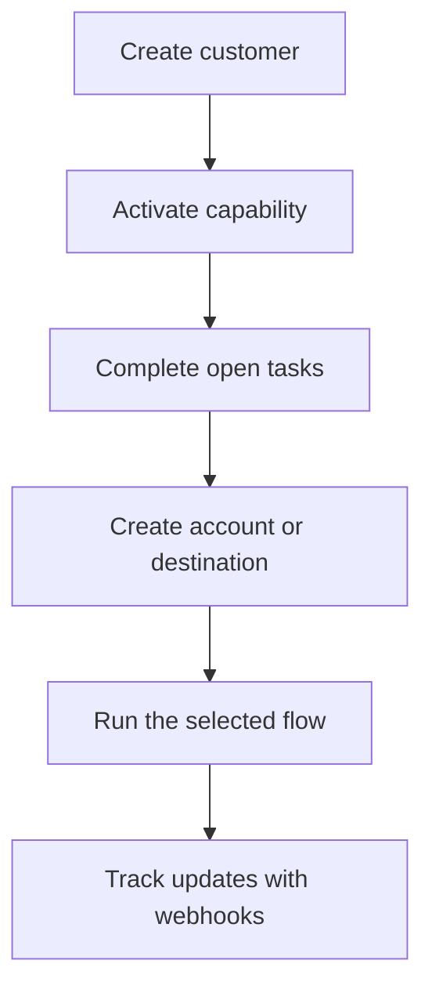

Swipelux tarjoaa taustapalvelullesi rakennuspalikat asiakkaiden käyttöönottoon ja rahaliikenteen liikuttamiseen ilman, että maksuinfrastruktuuri paljastuu tuotteessasi.

## Mitä voit rakentaa

<CardGroup cols={3}>
  <Card title="Vastaanota varoja" icon="arrow-down-to-line" href="/fi/integration/receive-funds">
    Luo kertaluontoisia fiat-rahoitusohjeita ja selvitä vakaakolikko lompakkoon.
  </Card>
  <Card title="Lähetä varoja" icon="arrow-up-from-line" href="/fi/integration/send-funds">
    Lähetä asiakkaan lompakosta ensimmäisen osapuolen tilille tai kolmannen osapuolen kohteeseen.
  </Card>
  <Card title="Luo pankkitili" icon="building-columns" href="/fi/integration/issue-bank-account">
    Anna uudelleenkäytettävät pankkitilitiedot, jotka on linkitetty selvityslompakkoon.
  </Card>
</CardGroup>

## Miten integraatio toimii

Asiakas on henkilö tai yritys, joka omistaa virran. Kyvyt kuvaavat, mitä tuloksia asiakas voi käyttää. Avoimet tehtävät kertovat, mitä on tehtävä loppuun, ennen kuin kyky tai resurssi voi edetä.

## Näe se toiminnassa

Tutustu [demo.swipelux.com](https://demo.swipelux.com) ja kokeile simuloitua neopankkikokemusta. Voit myös [kloonata aloituspaketin](https://github.com/swipelux/neobank-starter) ja mukauttaa sen tuoteliittymää.

Demo ja aloituspaketti ovat tuote- ja käyttöliittymäreferenssejä. Ne eivät korvaa näitä oppaita tai nykyistä API-sopimusta.

## Aloita rakentaminen

<CardGroup cols={3}>
  <Card title="Pikaopas" icon="rocket" href="/fi/integration/quickstart">
    Luo asiakas ja suorita yksi sandbox-virta.
  </Card>
  <Card title="Yleiset virrat" icon="route" href="/fi/integration/common-flows">
    Vertaa jokaiseen tulokseen tarvittavaa asennusta.
  </Card>
  <Card title="API-referenssi" icon="code" href="/fi/api-reference/introduction">
    Lue pyyntökäytännöt ja tutki jokainen API-toiminto.
  </Card>
</CardGroup>
