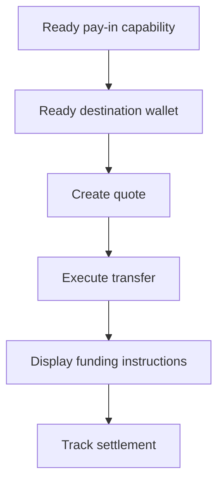

Käytä tarjottua maksun vastaanottoa, kun asiakkaan täytyy rahoittaa tietty summa. Siirto selvittää vakaakolikon luotuun lompakkoon.



## Ennen kuin aloitat

Tarvitset valmiin maksun vastaanotto -kyvyn ja valmiin luodun kohdelompakon samalle asiakkaalle. Suorita mahdollinen avoin työ [Kyvyt ja tehtävät](/fi/integration/onboarding/capabilities-and-requirements) -kautta, hae sitten molemmat resurssit uudelleen.

## 1. Luo tarjous

Luo hinta [`POST /v3/quotes`](/api-reference/money-movement/post-v3-quotes) -toiminnolla. Lähetä nämä otsakkeet:

```http
X-API-Key: ${SWIPELUX_API_KEY}
Idempotency-Key: payin-quote-001
Content-Type: application/json
```

```json
{
  "customerId": "${CUSTOMER_ID}",
  "capabilityId": "${CAPABILITY_ID}",
  "externalId": "payin-order-123",
  "in": {
    "amount": "150.00",
    "currency": "USD"
  },
  "destinationId": "${SETTLEMENT_WALLET_ID}",
  "out": {
    "currency": "USDC"
  }
}
```

Tallenna `data.id` muuttujaan `QUOTE_ID`. Esitä palautetut summat ja maksut sen sijaan, että rakentaisit ne uudelleen kurssista.

## 2. Suorita tarjous

Suorita nykyinen tarjous ennen sen erääntymistä [`POST /v3/transfers`](/api-reference/money-movement/post-v3-transfers) -toiminnolla. Käytä uutta avainta tälle aiotulle siirrolle:

```http
X-API-Key: ${SWIPELUX_API_KEY}
Idempotency-Key: payin-transfer-001
Content-Type: application/json
```

```json
{
  "quoteId": "${QUOTE_ID}"
}
```

Tallenna siirron `data.id` muuttujaan `TRANSFER_ID` ja säilytä sen nykyinen tila.

### Lisää paluu-URL kortti- ja Apple Pay -maksuille

Kortti- tai Apple Pay -tarjoukselle voit sisällyttää samaan pyyntöön valinnaisen `redirectUrl`-arvon. Kun asiakas on suorittanut isännöidyn kassan loppuun, kassasivu avaa tämän URL:n tuodakseen asiakkaan takaisin sovellukseesi.

```json
{
  "quoteId": "${QUOTE_ID}",
  "redirectUrl": "https://your-app.example/payments/complete"
}
```

`redirectUrl`-arvon on oltava absoluuttinen HTTPS-URL, enintään 2048 merkkiä pitkä, eikä se saa sisältää upotettuja tunnistetietoja. `redirectUrl`-arvon lähettäminen tarjoukselle, joka ei tue paluunavigointia, epäonnistuu validoinnissa sen sijaan, että se ohitettaisiin.

Saapuminen `redirectUrl`-osoitteeseen on vain selaimen navigointia. Se ei vahvista, että maksu tai siirto valmistui. Määritä valmistuminen siirron tilasta vaiheessa 4 ja webhook-tapahtumista.

## 3. Hae rahoitusohjeet

Lue [`GET /v3/transfers/{transferId}/instructions`](/api-reference/money-movement/get-v3-transfers-by-transfer-id-instructions). Renderöi palautettu `data.instructions`-muunnelma ilman, että oletat sen tyyppiä.

Nämä tiedot ovat siirtokohtaisia. Älä koskaan käytä yhden siirron pankkikoordinaatteja, koodia, isännöityä URL:iä, summaa, viitettä tai erääntymisaikaa toiseen maksun vastaanottoon.

Pankkiohjeiden osalta, kun `reference.required` on true, näytä tarkka `reference.value` pankkikoordinaattien vieressä ja tee siitä kopioitava. Näytä palautettu summa ja valuutta samasta ohjejoukosta.

Luotu pankkitili on erilainen: se tarjoaa uudelleenkäytettävät tiedot myöhempiä talletuksia varten. Katso [Luo pankkitili](/fi/integration/issue-bank-account), kun se on aiottu kokemus.

## 4. Seuraa selvitystä

Lue [`GET /v3/transfers/{transferId}`](/api-reference/money-movement/get-v3-transfers-by-transfer-id) suorituksen jälkeen ja jokaisen tapahtuman jälkeen. Aja asiakkaalle näkyvä tila uusimmasta `data.state`-arvosta.

Käytä `data.stateDetail`- ja `data.openTaskIds`-arvoja, kun siirto tarvitsee lisätoimia. Älä merkitse sitä valmiiksi odotetusta aikataulusta.

Seuraavaksi lisää [webhookit](/fi/integration/webhooks) ja pidä siirron tila synkronoituna, kunnes se saavuttaa tuloksen, jonka tuotteesi käsittelee.
