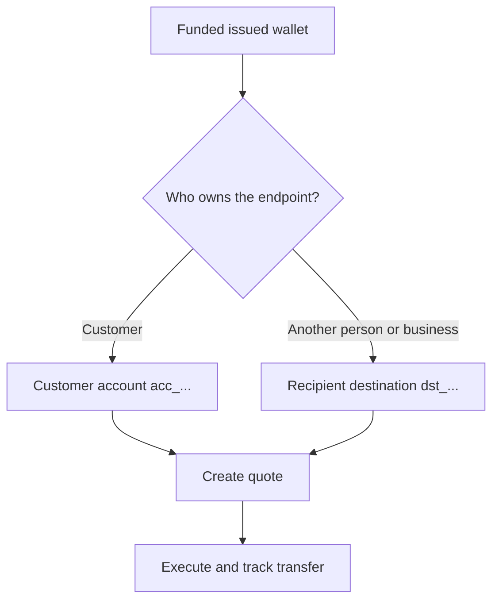

Jokainen maksu ulos alkaa valmiista, rahoitetusta luodusta lompakosta. Kohdemalli riippuu siitä, kuka omistaa päätepisteen.



## Ennen kuin aloitat

Hae lähdelompakko uudelleen. Vahvista, että sen nykyinen tila sallii maksun ja että sen käytettävissä oleva saldo kattaa aiotun lähdesumman. Tallenna sen vastauksesta johdettu ID muuttujaan `SOURCE_WALLET_ID`.

Tarvitset myös valmiin maksu ulos -kyvyn nykyiselle asiakkaalle ja valitulle kohteelle.

## 1. Valmistele kohde

<Tabs>
  <Tab title="Ensimmäinen osapuoli">

Käytä asiakkaan omistamaa ulkoista pankkitiliä, kun asiakas omistaa päätepisteen. Luo se [`POST /v3/customers/{customerId}/accounts`](/api-reference/accounts/post-v3-customers-by-customer-id-accounts) -toiminnolla ja näillä otsakkeilla:

```http
X-API-Key: ${SWIPELUX_API_KEY}
Idempotency-Key: payout-account-001
Content-Type: application/json
```

```json
{
  "origin": "external",
  "type": "bank",
  "methods": ["ach", "wire"],
  "country": "US",
  "currency": "USD",
  "details": {
    "routingNumber": "021000021",
    "accountNumber": "123456789",
    "accountType": "checking",
    "bankName": "Example Bank",
    "accountHolderName": "Acme Payments SAS"
  },
  "label": "Customer operating account"
}
```

Lue se [`GET /v3/customers/{customerId}/accounts/{accountId}`](/api-reference/accounts/get-v3-customers-by-customer-id-accounts-by-account-id) -toiminnolla. Jatka vain, kun sen nykyinen tila sallii maksun. Tallenna sen `acc_`-ID muuttujaan `PAYOUT_DESTINATION_ID`.

  </Tab>
  <Tab title="Kolmas osapuoli">

Luo henkilö tai yritys ja heidän pankki- tai lompakkopäätepisteensä [Vastaanottajat ja kohteet](/fi/integration/recipients) -kautta. Jatka vain, kun kohde on valmis.

Tallenna palautettu `dst_`-ID muuttujaan `PAYOUT_DESTINATION_ID`. Älä käytä vastaanottajan `rcp_`-ID:tä tarjouksen kohteena.

  </Tab>
</Tabs>

## 2. Luo maksu ulos -tarjous

Käytä [`POST /v3/quotes`](/api-reference/money-movement/post-v3-quotes) -toimintoa näillä otsakkeilla:

```http
X-API-Key: ${SWIPELUX_API_KEY}
Idempotency-Key: payout-quote-001
Content-Type: application/json
```

```json
{
  "customerId": "${CUSTOMER_ID}",
  "capabilityId": "${CAPABILITY_ID}",
  "in": {
    "amount": "150.00",
    "currency": "USDC",
    "accountId": "${SOURCE_WALLET_ID}"
  },
  "destinationId": "${PAYOUT_DESTINATION_ID}",
  "out": {
    "currency": "USD"
  }
}
```

Tallenna `data.id` muuttujaan `QUOTE_ID` ja esitä palautettu hinta ja maksut.

## 3. Suorita maksu ulos

Luo siirto [`POST /v3/transfers`](/api-reference/money-movement/post-v3-transfers) -toiminnolla. Käytä yhtä uutta avainta tälle aiotulle suoritukselle:

```http
X-API-Key: ${SWIPELUX_API_KEY}
Idempotency-Key: payout-transfer-001
Content-Type: application/json
```

```json
{
  "quoteId": "${QUOTE_ID}"
}
```

Tallenna siirron `data.id` muuttujaan `TRANSFER_ID`. Onnistunut luonti käynnistää maksun; se ei todista toimitusta.

## 4. Seuraa toimitusta

Lue [`GET /v3/transfers/{transferId}`](/api-reference/money-movement/get-v3-transfers-by-transfer-id) luonnin jälkeen ja jokaisen tapahtuman jälkeen. Käytä uusinta `data.state`-, `data.stateDetail`- ja `data.openTaskIds`-arvoa päättääksesi, odottaako, toimiako vai näyttääkö lopullinen tulos.

Seuraavaksi tutustu kohtaan [Tarjoukset ja siirrot](/fi/integration/quotes-and-transfers) tarkkojen summien, turvallisen suoritustoipumisen ja siirtotehtävien osalta.
