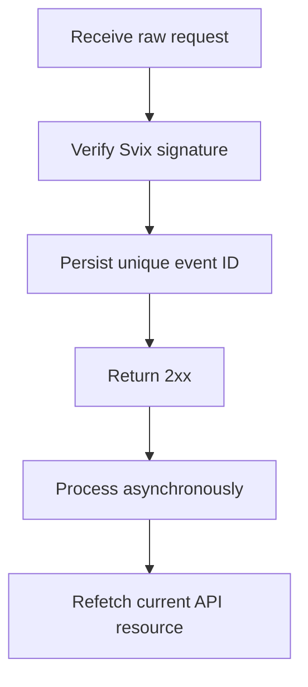

Käytä webhookkeja reagoidaksesi asynkronisiin muutoksiin. Toimitus on vähintään kerran, joten päällekkäiset, viivästyneet ja epäjärjestyksessä olevat tapahtumat ovat normaaleja.



## Rekisteröi vain tarvitsemasi tapahtumat

Luo päätepiste [`POST /v3/webhooks`](/api-reference/webhooks/post-v3-webhooks) -toiminnolla. Tilaa vain dokumentoituja tapahtumia, jotka ohjaavat integraatiotasi. Tämä esimerkki käyttää [`transfer.state_changed`](/api-reference/webhooks/transfer-state-changed) -tapahtumaa.

```bash
export API_BASE='https://platform.swipelux.com'
export SWIPELUX_API_KEY='replace-with-your-api-key'

curl --request POST \
  "${API_BASE}/v3/webhooks" \
  --header "X-API-Key: ${SWIPELUX_API_KEY}" \
  --header "Idempotency-Key: webhook-endpoint-001" \
  --header "Content-Type: application/json" \
  --data @- <<'JSON'
{
  "url": "https://example.com/webhooks/swipelux",
  "events": ["transfer.state_changed"]
}
JSON
```

Tallenna vastauksen `data.id` muuttujaan `WEBHOOK_ID`. Avaa [`GET /v3/webhooks/portal`](/api-reference/webhooks/get-v3-webhooks-portal) -toiminnon palauttama portaali, hae tämän päätepisteen allekirjoitussalaisuus ja tallenna se erillään API-avaimestasi salaisuudenhallintaan.

## Vahvista ennen jäsennystä

Swipelux toimittaa uudet webhook-integraatiot Svixin kautta. Vahvista raaka pyyntörunko päätepisteesi allekirjoitussalaisuudella ja näillä otsakkeilla:

- `svix-id`
- `svix-timestamp`
- `svix-signature`

Älä jäsennä JSON:ää tai aiheuta sivuvaikutuksia ennen kuin vahvistus onnistuu.

```javascript
import { Webhook } from "svix";

const verifier = new Webhook(process.env.SWIPELUX_WEBHOOK_SECRET);

export async function handleSwipeluxWebhook(request) {
  const rawBody = await request.text();
  const event = verifier.verify(rawBody, {
    "svix-id": request.headers.get("svix-id"),
    "svix-timestamp": request.headers.get("svix-timestamp"),
    "svix-signature": request.headers.get("svix-signature"),
  });

  await webhookInbox.insertIfAbsent({
    id: event.id,
    payload: event,
    status: "pending",
  });

  return new Response(null, { status: 204 });
}
```

Hylkää pyynnöt, joissa on puuttuva tai virheellinen allekirjoitus. Pidä raaka runko saatavilla, kunnes vahvistus valmistuu.

## Tallenna, kuittaa, sitten käsittele

Aseta yksilöllisyysrajoite kirjekuoren `id`-kentälle. Tallenna vahvistettu kirjekuori, palauta `2xx` nopeasti, käsittele se sitten asynkronisesti.

Jos tapahtuman ID on jo olemassa, kuittaa toimitus toistamatta valmiita sivuvaikutuksia. Jatka odottavaa tai epäonnistunutta paikallista työtä oman uudelleenyritysjonosi kautta. Älä käytä kirjekuoren `attempt`-kenttää deduplikointiavaimena tai kuljetuksen uudelleenyrityslaskurina.

## Hae nykyinen tila uudelleen

Webhookin järjestys ei ole arvovaltainen resurssihistoria. Käytä `resource.type`- ja `resource.id`-arvoja objektin paikantamiseen, hae sitten sen nykyinen tila ennen järjestelmäsi päivittämistä.

Siirtotapahtumassa kutsu [`GET /v3/transfers/{transferId}`](/api-reference/money-movement/get-v3-transfers-by-transfer-id):

```bash
curl --request GET \
  "${API_BASE}/v3/transfers/${TRANSFER_ID}" \
  --header "X-API-Key: ${SWIPELUX_API_KEY}"
```

Aja asiakkaalle näkyvä tila ja alavirran toimet nykyisestä API-vastauksesta. Suunnittele sivuvaikutukset pysymään turvallisina, jos kaksi työntekijää käsittelee toisiinsa liittyviä tapahtumia eri järjestyksessä.

## Palauta toimitukset

Käytä [`GET /v3/webhooks/portal`](/api-reference/webhooks/get-v3-webhooks-portal) -toimintoa avataksesi toimituslokit, uudelleenyrittääksesi epäonnistuneet toimitukset tai aloittaaksesi manuaalisen toiston.

Jokaisen toiston täytyy kulkea saman allekirjoitusvahvistuksen ja kestävän saapumislaatikon läpi. Toipuaksesi katkoksen jälkeen toista vaikuttava ikkuna ja hae kukin viitattu resurssi uudelleen. Valmiit tapahtuma-ID:t pysyvät tekemättöminä; keskeneräiset tietueet jatkuvat asynkronisesti.

Seuraavaksi vahvista päällekkäiset ja epäjärjestyksessä olevat toimitukset sandboxissa, suorita sitten [Käynnistys tuotantoon](/fi/integration/go-live) -tarkistuslista.
