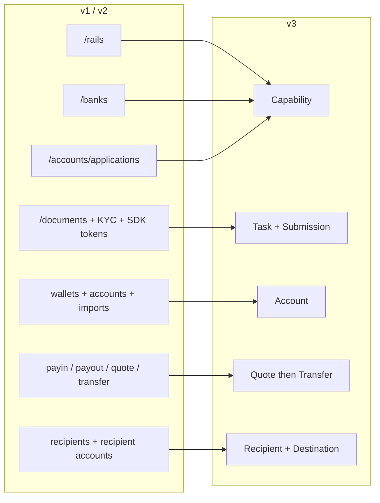
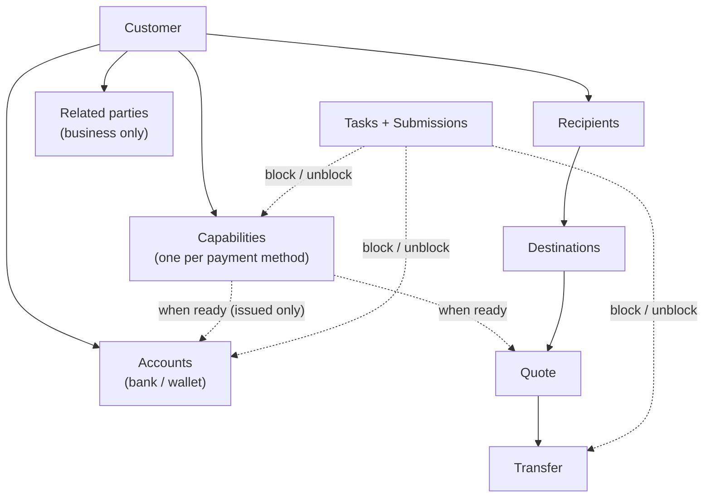
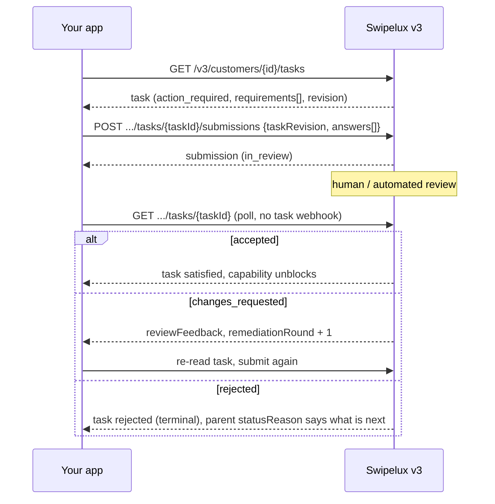
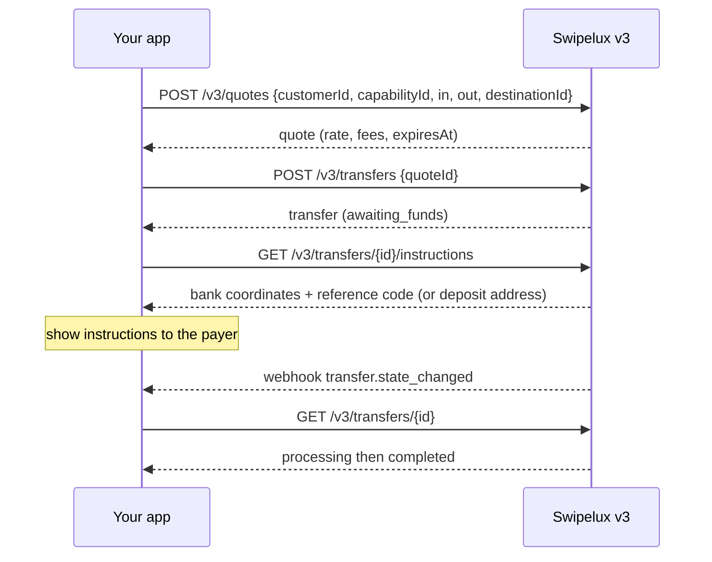
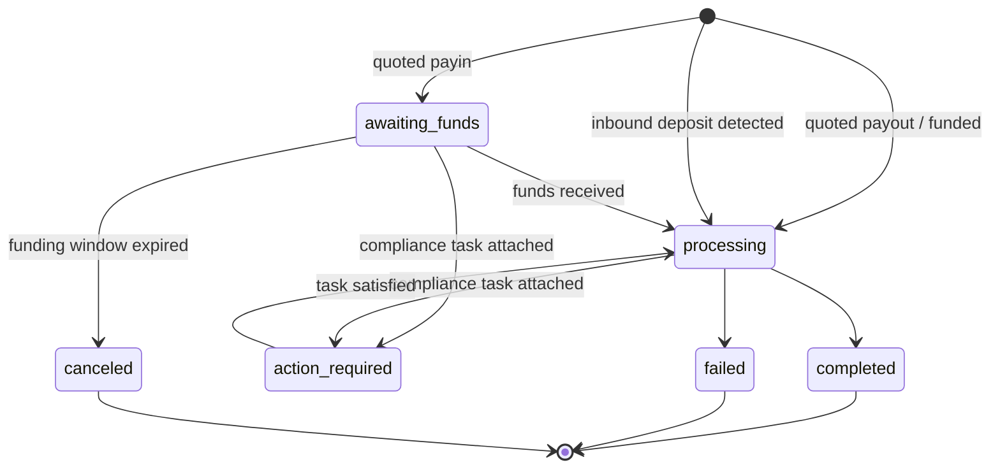
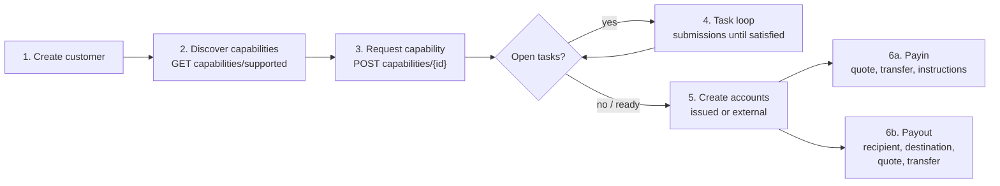

Migrez votre intégration de l'API v1 et v2 vers v3 en deux passes :

- **Partie 1, le concept.** Lisez-la d'abord. v3 est une refonte, pas un renommage : si vous mappez les anciens endpoints un pour un, vous lutterez contre l'API. Dix minutes ici vous économiseront des jours plus tard.
- **Partie 2, l'API.** Mapping endpoint par endpoint, exemples de requêtes, machines à états et check-list de migration.

Basé sur la spécification OpenAPI de production ([platform.swipelux.com/openapi.json](https://platform.swipelux.com/openapi.json)). v1 et v2 restent actives et ne sont pas encore dépréciées ; toutes les nouvelles fonctionnalités capability, recipient, task et quoting ne sortent que sur v3. Abonnez-vous à l'événement webhook `api.deprecation` pour recevoir les avis de retrait.

<Info>
  **Sommaire.** Partie 1 : 1.1 pourquoi v3 existe, 1.2 modèle d'objets, 1.3 préparation par capability, 1.4 boucle des tâches, 1.5 mouvement d'argent, 1.6 machines à états, 1.7 conventions, 1.8 chemin doré. Partie 2 : 2.1 customers, 2.2 capabilities, 2.3 tasks et submissions, 2.4 accounts, 2.5 recipients et destinations, 2.6 quotes et transfers, 2.7 webhooks, 2.8 sandbox, 2.9 endpoints hérités, 2.10 ordre de migration, 2.11 check-list des pièges.
</Info>

---

## Partie 1, le concept

### 1.1 Pourquoi v3 existe

v1 et v2 ont fait pousser quatre façons qui se chevauchent pour rendre un customer prêt à payer : `/rails`, `/banks`, `/accounts/applications` et la surface entreprise `rail-applications`, chacune avec son propre vocabulaire de statuts. La collecte de documents (`/documents`, imports KYC, tokens SDK de vérification) était déconnectée de ce qu'elle débloquait réellement. v3 condense tout cela en six ressources : le customer plus cinq choses qu'il possède :



| Ressource | Définition en une ligne |
| --- | --- |
| **Customer** | La personne ou l'entreprise. **Aucun champ de statut public**, la préparation vit sur les capabilities. |
| **Capability** | Un moyen de paiement utilisable par le customer (`sepa`, `ach`, `swift`, `stablecoin_transfers`, etc.), avec son propre statut. Remplace `/rails`, `/banks` et les points d'entrée account-application. |
| **Task** | Une unité de travail que Swipelux réclame (données, documents, vérification), à laquelle on répond par une **Submission**. Remplace la surface documents et KYC. |
| **Account** | Un endpoint de financement possédé par le customer : `bank` ou `wallet`, `issued` par Swipelux ou `external`. |
| **Recipient / Destination** | Bénéficiaire du paiement (qui) et son endpoint bancaire ou wallet (où). |
| **Quote / Transfer** | Tout mouvement d'argent. Un transfer exécute une quote persistée ; les transfers sans quote disparaissent. |

### 1.2 Le modèle d'objets



Deux règles structurelles à intérioriser :

1. **Les capabilities régissent tout.** Les accounts sont provisionnées sous une capability `ready` ; les quotes sont tarifées contre une capability. L'onboarding équivaut à amener les capabilities dont vous avez besoin à `ready`.
2. **Les tasks s'attachent partout.** Une capability, une account ou un transfer en cours peuvent porter des `openTaskIds`. Où qu'elles apparaissent, la boucle est la même : lire la task, envoyer les réponses, attendre la revue, relire le parent.

### 1.3 La préparation est par capability, pas par customer

v1 mêlait la préparation de `/rails` avec une barrière KYC à l'échelle du customer. En v3, il n'y a pas de statut de customer : un customer peut être pleinement utilisable sur `stablecoin_transfers` alors que sa capability `sepa` a encore des tasks ouvertes. Les capabilities à compte mutualisé passent généralement à `ready` plus vite que les nominatives, alors commencez à opérer sur ce qui est `ready` au lieu d'attendre le tout.

Si votre code v1 ou v2 pilote des badges d'UI à partir du statut de vérification du customer, réécrivez-le :

- « Peut-il opérer sur X ? » devient capability X `status == "ready"`.
- « A-t-il quelque chose à faire ? » devient toute task avec le statut `action_required` (la capability affiche généralement `restricted` avec `statusReason.resolution: "complete_tasks"`).
- « Attendons-nous Swipelux ? » devient tasks `in_review`, capability `pending`.

### 1.4 La boucle des tâches

Tout ce que faisait l'ancienne surface documents et KYC est désormais cette seule boucle :



Propriétés clés :

- Une task porte `requirements[]`, les demandes individuelles. Chacune a un `requirementId` par task, une `key` stable nommant la demande (par exemple justificatif de domicile, dédupliquez votre UI par elle) et une `request` typée qui décrit exactement l'entrée attendue (texte, date, sélection, document, attestation, etc.).
- La soumission est **soumise à revue** : elle ne mute jamais directement l'état de la capability ou de l'account, seule l'acceptation le fait. Une exception : les réponses `profile` sont propagées au profil du customer à la soumission (2.3). Après avoir soumis, sondez la task ou la ressource parente.
- `taskRevision` (écho de la `revision` de la task) est un garde-fou de concurrence : si la task a changé depuis votre lecture, relisez-la et reconstruisez vos réponses.
- `absence` est une réponse de premier ordre (« je n'ai pas cela parce que... »), utilisez-la plutôt que de laisser des requirements en suspens.

### 1.5 Mouvement d'argent

Un seul flux pour les payins, payouts et déplacements de stablecoin. **Aucune entrée de direction**, vous ne déclarez jamais payin contre payout. Les formes de devise d'entrée et de sortie dérivent une `direction` en lecture seule sur la quote et le transfer : `fiat_to_stablecoin` (payin), `stablecoin_to_fiat` (payout), ou `stablecoin_move`.



### 1.6 Une machine à états par ressource

Chaque ressource à statut a son propre enum, et chaque statut non heureux porte une raison structurée. Accounts, applications et transfers partagent la forme `{ code, message, actor, retryable }` : accounts et applications l'exposent sous `statusReason`, transfers sous `stateDetail`. `actor` indique qui doit agir (`customer`, `developer`, `provider`, `network`, `swipelux`), `retryable` indique si un réessai peut aider. Les capabilities utilisent `{ code, resolution, message }`, où `resolution` (`complete_tasks`, `wait`, `contact_support`, `none`) indique ce qui fait avancer la capability. Les valeurs de `code` forment un catalogue ouvert et purement additif : branchez-vous sur `resolution` (ou `actor` plus `retryable`), et tolérez les codes jamais vus.

| Ressource | États |
| --- | --- |
| Capability | `pending`, `restricted`, `ready`, `rejected`, `canceled` |
| Application (tentative par requête sous une capability, 2.2) | `requested`, `in_review`, `action_required`, `ready`, `rejected`, `disabled`, `canceled` |
| Task | `action_required`, `in_review`, `satisfied`, `rejected`, `canceled` |
| Submission | `in_review`, `accepted`, `changes_requested`, `rejected` |
| Account | `provisioning`, `in_review`, `ready`, `action_required`, `suspended`, `rejected`, `archived` |
| Quote | `active`, `executed`, `expired`, `failed` |
| Transfer | `awaiting_funds`, `processing`, `action_required`, `completed`, `failed`, `canceled` |
| Recipient | `active`, `rejected`, `archived` |
| Destination | `in_review`, `ready`, `action_required`, `archived` |

Les états que ce guide ne parcourt pas (`rejected`, `suspended`, `disabled`, `failed`, `canceled`) sont terminaux ou pilotés par le support ; les définitions par ressource se trouvent dans la spécification.

Transfer, en détail :



### 1.7 Conventions

| Domaine | v1 / v2 | v3 |
| --- | --- | --- |
| Auth | En-tête `X-API-Key` | Idem. L'environnement (production ou sandbox) est sélectionné par la clé ; une seule URL de base. |
| Idempotence | Non appliquée | En-tête `Idempotency-Key` **obligatoire sur toute requête à effet** (POST, PATCH, PUT, DELETE), les endpoints sandbox exceptés. Même clé plus même corps rejoue la réponse d'origine. |
| Argent | Nombres et chaînes mélangés | Uniquement des chaînes (`"amount": "150.00"`). Jamais de flottants. |
| Pagination | Variantes offset/limit | Curseur : les listes retournent `{ data, nextCursor, hasMore }`. |
| Mises à jour | Très axées PUT | Mises à jour partielles avec `PATCH`. |
| Webhooks | Configuration d'un unique endpoint | Plusieurs endpoints, abonnement par événement. Les événements sont des **indices**, la lecture est la vérité (2.7). |

Règles d'idempotence à intérioriser avant d'écrire du code :

- Réutiliser une clé avec un corps **différent** provoque `409 idempotency_conflict` tant que la clé est retenue (au moins 7 jours), alors ne planifiez jamais de réutiliser une clé. Générez un UUID neuf par opération logique et persistez-le avec votre job.
- Le rejeu couvre aussi les erreurs : si la requête d'origine s'est terminée par un 4xx terminal, la même clé plus corps renvoie la même réponse de problème.
- Deux requêtes concurrentes avec la même clé : l'une gagne, l'autre reçoit `409`. Réessayez la perdante après le règlement de la gagnante ; le rejeu renvoie la réponse d'origine.

### 1.8 Le chemin doré



---

## Partie 2, l'API

### 2.1 Customers

| v1 / v2 | v3 |
| --- | --- |
| `POST /v1/customers`, `POST /v1/customers/business`, `POST /v2/customers` | `POST /v3/customers` (un seul endpoint, `type: individual \| business`) |
| `GET/PUT/DELETE /v1/customers/{id}`, `/v1/customers/business/{id}`, `/v2/customers/{customerId}` | `GET/PATCH/DELETE /v3/customers/{customerId}` |
| `GET /v1/customers` (liste) | `GET /v3/customers` (paginé par curseur, incorpore des résumés de capabilities) |
| `GET /v1/customers/balances` (batch), `GET /v1/customers/{id}/balances` | Pas d'endpoint de balances, les balances vivent sur les accounts : lisez `balances` sur `GET /v3/customers/{customerId}/accounts` |
| `POST/GET .../shareholders` (v1 business) | `POST/GET /v3/customers/{customerId}/related-parties` (plus `GET/PATCH/DELETE .../related-parties/{relatedPartyId}`) |
| `POST /v1/customers/business/{id}/kyb` (soumettre), `GET .../kyb` (statut) | Pas d'appel de soumission KYB, demandez une capability (2.2) et répondez à ses tasks (2.3) ; le verdict apparaît comme état de capability et de task |
| `POST /v1/customers/{id}/kyc`, `.../kyc/import`, endpoints de tokens SDK | Système de tasks (2.3) ; la vérification hébergée apparaît comme `verificationSessions` à l'intérieur des tasks |

Création, discriminée par `type` (valeurs illustratives, noms de champs selon la spécification) :

```jsonc
// POST /v3/customers        Idempotency-Key: <fresh uuid>
{
  "type": "individual",
  "externalId": "user-1042",
  "individual": {
    "firstName": "Maria",
    "lastName": "Silva",
    "birthDate": "1990-04-12",
    "nationalities": ["BR"],
    "residenceCountry": "BR",
    "email": "maria@example.com",
    "residentialAddress": {
      "streetLine1": "Av. Paulista 1000",
      "city": "Sao Paulo",
      "postalCode": "01310-100",
      "country": "BR"
    }
  },
  "financialProfile": {
    "accountPurposes": ["cross_border_remittance"],
    "sourcesOfFunds": ["salary"]
  }
}
```

- **La création est progressive** : `{ "type": "individual" }` seul est une création valide. Les données manquantes n'invalident jamais le customer, elles apparaissent plus tard comme tasks d'intake sur les capabilities qui en ont besoin.
- Les entreprises portent `business` plus des données d'immatriculation. Le CRUD des actionnaires de v1 se mappe sur les **related parties**, élargi pour couvrir dirigeants, mandataires et propriétaires : créez-les en ligne à la création du customer (chacune reçoit un id stable `rp_`) ou gérez-les par les endpoints dédiés related-parties.
- **Aucun champ `status` sur le customer**, voir 1.3.
- **Les customers existants sont conservés** : les customers créés sur v1 ou v2 sont adressables par le même id sur les endpoints v3. La lecture v3 est une _vue assainie_, les valeurs héritées qui échouent à la validation v3 reviennent absentes. Après votre **première écriture v3, cette vue devient permanente** : les valeurs absentes ne reviennent pas d'elles-mêmes. Enrichissez tôt, prévoyez une passe unique qui `PATCH`e le profil complet depuis vos propres enregistrements avant de vous appuyer sur les lectures v3. Le `metadata` de v1 est un espace de noms séparé et **n'**est **pas** repris, redéfinissez-le sur v3.
- `externalId` est de premier ordre et **unique parmi vos customers** en v3, par environnement (`409 duplicate_external_id`). Archiver un customer ne libère pas son `externalId`, effacez-le par PATCH avant DELETE si vous comptez le réutiliser.
- `DELETE` est un **archivage en cascade** (sans restauration ; les ids ne sont jamais réutilisés). Il est bloqué par `409 customer_has_active_resources` plus `blockingResources[]` tant qu'il existe une account non archivée ou un transfer en cours.
- Règles de fusion PATCH : `null` explicite efface un champ nullable, les tableaux remplacent en entier (sauf les related parties en ligne, qui sont upsertées par id), les clés de `metadata` fusionnent. Les schémas complets et les filtres de liste sont dans la spécification OpenAPI.

### 2.2 `/rails`, `/banks`, applications deviennent Capabilities

| v1 / v2 | v3 |
| --- | --- |
| `GET /v1/.../rails/capabilities` | `GET /v3/customers/{customerId}/capabilities/supported` |
| `GET /v2/.../banks` (plus `/banks/{bank}`), `GET /v2/meta/banks` | `GET /v3/customers/{customerId}/capabilities/supported` |
| `GET /v1/customers/{customerId}/rails` (liste) | `GET /v3/customers/{customerId}/capabilities` |
| `GET /v2/customers/{customerId}/rails` (aperçu) | `GET /v3/customers/{customerId}/capabilities` |
| `POST /v1/.../rails`, `POST /v2/.../banks` | `POST /v3/customers/{customerId}/capabilities/{capabilityId}` |
| `POST /v2/.../accounts/applications` | `POST /v3/customers/{customerId}/capabilities/{capabilityId}` |
| `GET /v1/.../rails/{rail}` | `GET /v3/.../capabilities/{capabilityId}` |
| `GET /v2/.../accounts/applications` (plus `/{applicationId}`, `/{applicationId}/history`) | `GET /v3/.../capabilities/{capabilityId}` (plus `/applications`, `/applications/{id}/history`) |
| Surface business-rail : `GET/POST /v2/customers/business/{customerId}/rail-applications` (plus `/{rail}`) | Les mêmes endpoints capability v3, pas de surface entreprise séparée |
| Surface business-rail : `GET .../business/{customerId}/rails` (plus `/{rail}`) | Les mêmes endpoints capability v3, pas de surface entreprise séparée |
| `GET /v1/meta/rails` (catalogue statique) | `GET /v3/customers/{customerId}/capabilities/supported`, la disponibilité est par customer ; il n'y a pas de catalogue statique |
| `GET /v1/meta/accounts/banks` | `GET /v3/institutions` (annuaire bancaire : id, nom, BIC, pays) |
| Non disponible | `GET /v3/capabilities`, liste marchande des capabilities accordées à travers les customers (filtrable par `status`, `method`, `customerId`) |
| Non disponible | `GET /v3/.../capabilities/{capabilityId}/tasks-preview` (voir les demandes avant de solliciter) |
| Non disponible | `POST /v3/.../capabilities/{capabilityId}/cancel` |

- Une capability équivaut à `method` (`ach`, `wire`, `rtp`, `pix`, `sepa`, `swift`, `spei`, `pse`, `transfers_3_0`, `faster_payments`, `sepa_instant`, `uaefts`, `card`, `stablecoin_transfers`, etc.) plus `accountType` (`pooled` ou `named`, `null` pour les méthodes non bancaires) plus `directions` (`payin` ou `payout`). Le `capabilityId` public est la paire qualifiée (`sepa_pooled`, `ach_named`) ou la méthode seule pour `card` et `stablecoin_transfers`.
- Chaque demande de capability engendre une **application**, l'enregistrement par tentative sous `.../capabilities/{capabilityId}/applications` (plus `/{applicationId}/history`), avec ses propres statuts (1.6) et `statusReason`. C'est la trace d'audit d'une demande ; au quotidien, sondez la capability elle-même.
- `capabilities/supported` renvoie la disponibilité (`available`, `beta` ou `disabled`), l'éligibilité et les institutions proposées. La sélection de banque se fait au moment de la demande via le tableau optionnel `institutions` ; il n'y a pas de ressource `/banks` séparée. L'omettre (ou envoyer `[]`) sélectionne toutes les institutions par défaut ; `isDefault: true` est un drapeau spécifique à un customer et une capability, pas global. Une liste non vide écrase les valeurs par défaut, et une capability adossée à une banque sans valeur par défaut applicable renvoie `422 capability_institutions_required`. Les ids d'institution sont opaques, tolérez-en de nouveaux.
- `stablecoin_transfers` est **auto-attribuée à la création du customer** et naît `ready` (donc jamais demandée et non annulable). `card` est réservée aux individuals.
- `openTaskIds` sur la capability est votre pointeur « quoi faire ensuite ». Ouvert équivaut à `action_required` **ou** `in_review`, et le rollup inclut des tasks partagées au niveau customer atteintes par des dépendances actives.
- `cancel` ne fonctionne qu'à partir de `pending` ou `restricted` **et** sans ressources bloquantes, sinon `409 capability_not_cancelable`, dont le corps de problème liste `blockingResources`. Redemander après annulation est une création neuve avec une nouvelle clé d'idempotence.
- **Sondez le GET.** L'état de la capability se rafraîchit lors de la lecture ; sondez `GET .../capabilities/{capabilityId}` ou abonnez-vous à `capability.status_changed`, ne cachez pas.
- Demander une méthode peut rendre disponibles des méthodes apparentées d'un coup, traitez les capabilities comme un ensemble à relire, pas comme une ligne unique à suivre.
- Utilisez `tasks-preview` pour montrer les demandes d'onboarding **avant** de vous engager sur une demande.
- La vérification n'est pas ponctuelle : de nouvelles tasks peuvent apparaître sur une capability déjà `ready` (revérification périodique ou pilotée par événement). Gardez la boucle des tasks branchée pour toute la vie du customer, pas seulement pour l'onboarding.

### 2.3 Documents et KYC deviennent Tasks et Submissions

<Note>
  **Note de nommage.** Ces endpoints ont brièvement été publiés sous les noms `requirements` et `fulfillments`. Depuis le 2026-08-02, les noms publics sont **tasks** et **submissions**. Le renommage a porté uniquement sur les ressources et les chemins d'endpoints, le tableau `requirements[]` à l'intérieur d'une task et son `requirementId` conservent ces noms.
</Note>

Chaque surface documentaire héritée se mappe sur le même remplacement : lisez `GET /v3/customers/{customerId}/tasks`, répondez avec `POST .../tasks/{taskId}/submissions`.

| v1 / v2 | v3 |
| --- | --- |
| `POST/GET/DELETE /v1/documents` | `GET /v3/.../tasks` plus `POST .../tasks/{taskId}/submissions` |
| `POST /v1/customers/{id}/documents` | `GET /v3/.../tasks` plus `POST .../tasks/{taskId}/submissions` |
| `GET/POST /v1/customers/business/{id}/documents` (plus `PUT/DELETE .../{docId}`) | `GET /v3/.../tasks` plus `POST .../tasks/{taskId}/submissions` |
| `GET/POST .../shareholders/{shareholderId}/documents` (plus `GET/PUT/DELETE .../{docId}`) | `GET /v3/.../tasks` plus `POST .../tasks/{taskId}/submissions` |
| `GET/POST/DELETE /v2/.../documents` (plus `/{documentId}`) | `GET /v3/.../tasks` plus `POST .../tasks/{taskId}/submissions` |
| `POST /v2/.../documents/upload-token` plus `POST /v2/documents/direct-upload` | Retiré, chargez directement avec votre clé API (ci-dessous) |
| `POST /v1/customers/documents/upload`, `POST /v1/document` (intakes hérités) | Retiré, chargez directement avec votre clé API (ci-dessous) |
| `POST /v1/customers/{id}/kyc` plus tokens SDK | Task `verificationSessions` (vérification hébergée) ; pas d'appel direct « start KYC » |

Autour de cette boucle :

- **Stockage de fichiers bruts** : `POST/GET/DELETE /v3/customers/{customerId}/documents` (plus `/{documentId}`), chargez une fois avec votre clé API puis référencez les ids de document dans les réponses de submission. Cela remplace tous les intakes upload-token et direct-upload.
- **Lectures inédites** : `GET /v3/tasks` (boîte de réception marchande), `GET /v3/transfers/{transferId}/tasks`, `GET .../tasks/{taskId}/history`, `GET .../tasks/{taskId}/submissions` (plus `/{submissionId}`).

Submission (illustrative) :

```jsonc
// POST /v3/customers/{cus}/tasks/{task}/submissions   Idempotency-Key: <fresh uuid>
{
  "taskRevision": 3,
  "answers": [
    { "requirementId": "req_a1", "answer": { "type": "document", "documentIds": ["doc_passport1"] } },
    { "requirementId": "req_b2", "answer": { "type": "text", "value": "Import/export business" } },
    { "requirementId": "req_c3", "answer": { "type": "absence", "reason": "not_applicable" } }
  ]
}
```

- Types de réponse : `profile`, `text`, `date`, `single_select`, `multi_select`, `boolean`, `attestation`, `document`, `resource_reference`, `absence`. L'objet `request` de chaque requirement indique quel type est attendu.
- Une submission doit répondre à **chaque requirement actionnable de la ronde en cours**, avec le `taskRevision` exact que vous avez lu. Les submissions partielles sont rejetées.
- Les réponses `profile` **se propagent** : elles mettent à jour le profil du customer via le chemin de validation normal et réévaluent immédiatement chaque capability référençant le même travail d'intake. Les tasks d'intake sœurs dont tous les requirements sont satisfaits se ferment automatiquement.
- Les requirements peuvent former des groupes alternatifs (`alternativeKey`) : soumettez exactement un du groupe.
- `changes_requested` incrémente `remediationRound` et porte `reviewFeedback`. Relisez la task, soumettez de nouveau **avec une nouvelle clé d'idempotence**.
- Les URL de vérification hébergée n'apparaissent **que** dans le détail de task par customer (`GET /v3/customers/{customerId}/tasks/{taskId}`) et uniquement tant que la session est actionnable ; les listes et `GET /v3/tasks/{taskId}` sont volontairement sans URL.
- Les conditions générales sont aussi une task : `openTaskIds` peut inclure une task avec `category: "terms_of_service"` dont la page d'acceptation hébergée est liée de la même façon (uniquement dans le détail par customer). Les submissions génériques ne peuvent pas accepter les conditions, et l'approbation KYC n'implique jamais l'acceptation des conditions.
- Les tasks ont une portée par capability, donc la « même » demande (par exemple justificatif de domicile) peut apparaître une fois par capability. Dédupliquez dans votre UI par la `key` du requirement.
- **Aucune couche de traduction** : publier vers `/v1/documents` ne débloquera pas les capabilities v3. Une fois qu'un customer est sur v3, canalisez toutes les demandes par les tasks.

### 2.4 Accounts et wallets

| v1 / v2 | v3 |
| --- | --- |
| `POST/GET /v1/.../accounts` (plus `/import`), `/v2/.../accounts` (plus `/import`) | `POST/GET /v3/customers/{customerId}/accounts` |
| `POST/GET /v1/.../wallets` (plus `/import`) | Même endpoint, `type: wallet` |
| `GET/DELETE /v1/customers/{customerId}/accounts/{accountId}` (et la variante wallets), `GET /v2/.../accounts/{accountId}` | `GET/PATCH/DELETE /v3/.../accounts/{accountId}` |
| `PATCH /v2/.../accounts/{accountId}/fees` | `GET/PUT /v3/.../accounts/{accountId}/fees` |

Création, discriminée par `origin` plus `type`. Les comptes bancaires émis prennent une seule `method` ; les comptes bancaires externes prennent à la place un tableau `methods` (envoyer `method` là est rejeté) :

```jsonc
// issued bank account (capability must be ready)
{ "origin": "issued", "type": "bank", "method": "sepa",
  "currency": "EUR", "settlement": { "accountId": "acc_wallet1" } }

// external wallet the customer already owns (replaces /import)
{ "origin": "external", "type": "wallet", "currency": "USDC",
  "network": "polygon", "details": { "address": "0x71C7656EC7ab88b098defB751B7401B5f6d8976F" } }
```

- `country` sur les comptes bancaires émis est optionnel (par défaut selon la méthode) ; sur les comptes bancaires **externes**, fournissez-le explicitement. Les comptes wallet ne portent pas de pays du tout.
- `settlement.accountId` est requis sur les comptes bancaires émis : il désigne le compte wallet émis qui reçoit les fonds réglés depuis les dépôts sur le compte bancaire.
- Les comptes émis exposent `details` (IBAN ou routing plus account ou address), `routing` versionné (les coordonnées de dépôt peuvent tourner, affichez toujours la dernière lecture), `fees`, `balances`.
- Réseaux : `polygon`, `ethereum`, `base`, `arbitrum`, `optimism`, `bsc`, `avalanche`.
- La barrière capability s'applique uniquement aux comptes **émis** : en créer un contre une capability non prête échoue avec une erreur codée par capability, demandez d'abord la capability (2.2). Les comptes externes n'ont besoin d'aucune capability (ni d'approbation du customer) ; ils obtiennent seulement la validation du schéma de requête et des coordonnées bancaires.
- Les comptes bancaires émis naissent `provisioning` avec `details: null`. Sondez le compte ou surveillez `account.status_changed` jusqu'à `ready`.
- `DELETE` archive, ne supprime jamais définitivement. Les comptes référencés par des transfers en cours renvoient `409 account_has_active_transfers`. Réessayez après que ces transfers atteignent un état terminal.
- Inédit en v3 : **Rules**, instructions permanentes sur un compte wallet émis (`POST/GET /v3/customers/{customerId}/rules`, `GET/PATCH/DELETE .../rules/{ruleId}`) qui balaient automatiquement les fonds entrants vers un autre compte ou une destination wallet. Aucun équivalent en v1 ou v2.

### 2.5 Recipients et destinations

| v1 | v3 |
| --- | --- |
| `POST/GET /v1/.../recipients` | `POST/GET /v3/customers/{customerId}/recipients` |
| Non disponible (les recipients v1 se limitaient à create et list) | `GET/PATCH/DELETE /v3/.../recipients/{recipientId}`, détail, mise à jour, archivage inédits |
| `POST/GET .../recipients/{recipientId}/accounts` | `POST/GET /v3/.../recipients/{recipientId}/destinations` |
| `GET/DELETE .../recipients/{recipientId}/accounts/{recipientAccountId}` | `GET/DELETE /v3/.../recipients/{recipientId}/destinations/{destinationId}` (pas de PATCH de destination, archivez et recréez) |

v2 n'avait pas de concept de recipient. Si vous êtes en v2 et payez des tiers, c'est une surface nouvelle, pas un renommage.

- **Recipient** équivaut à qui : `individual` (prénom et nom) ou `business` (nom d'entreprise), avec `relationship` requis (`employee`, `contractor`, `vendor`, `subsidiary`, `merchant`, `customer`, `landlord`, `family`, `other`). Recipients et destinations ne concernent que les tiers. Un payout à soi-même n'utilise pas de recipient du tout : ciblez l'une des propres accounts `acc_` du customer comme `destinationId` de la quote (2.6).
- **Destination** équivaut à où : typée par méthode, `sepa` (iban, bic optionnel), `ach` ou `wire` (routing plus account), `swift` (coordonnées complètes plus intermédiaire optionnel), `spei` (clabe), `pse`, `transfers_3_0` (cbu), etc., plus les destinations wallet. Chaque destination a son propre statut. Surveillez `destination.status_changed`.
- Les destinations fiat exigent l'`address` complète du recipient (rue, ville, code postal, pays) **avant** la création. Les pièces manquantes échouent avec `422 recipient_address_required`. Les destinations wallet omettent l'adresse mais exigent un `ownership` de premier niveau (`self_custodied`, ou `custodial` avec un nom de custodian).
- La précision du nom du bénéficiaire compte : les banques réceptrices vérifient le nom **légal** du compte. Envoyez le prénom et le nom légaux exacts ou le nom d'entreprise, pas un pseudonyme d'affichage.
- Les schémas de champs de destination par méthode sont dans la spécification OpenAPI.

### 2.6 Quotes et transfers

| v1 / v2 | v3 |
| --- | --- |
| `POST /v1/payin/quote`, `/v1/payout/quote`, `/v2/quote` | `POST /v3/quotes` |
| `POST /v1/payin`, `/v1/payout`, `POST /v1/transfers`, `/v2/transfer` | `POST /v3/transfers` (exécute une quote, les créations sans quote disparaissent) |
| `GET /v1/transfers` (liste), `GET /v1/transfers/{id}` | `GET /v3/transfers`, `/v3/transfers/{transferId}` |
| Non disponible (les quotes v1 et v2 n'avaient pas de lecture) | `GET /v3/quotes/{quoteId}` |
| `GET /v1/rate/{base}/{quote}` | `GET /v3/rates` |
| (implicite dans la réponse payin) | `GET /v3/transfers/{transferId}/instructions` |
| Non disponible | `POST /v3/transfers/{transferId}/cancel`, `GET /v3/transfers/{transferId}/tasks` |

```jsonc
// 1. Quote: amount on exactly one side picks mode (exact_in / exact_out).
// POST /v3/quotes            Idempotency-Key: <fresh uuid>
{
  "customerId": "cus_123",
  "capabilityId": "sepa_named",
  "in":  { "currency": "EUR", "amount": "150.00" },
  "out": { "currency": "USDC" },
  "destinationId": "acc_wallet1",   // fiat-funded: must be a customer-owned acc_ account
  "fees": { "breakdown": { "developer": { "fixed": "1.00", "bips": 50 } } }
}
// -> { mode: "exact_in", direction: "fiat_to_stablecoin", rate, fees[], expiresAt, ... }

// 2. Execute before expiresAt.
// POST /v3/transfers         Idempotency-Key: <fresh uuid>
{ "quoteId": "quo_789", "externalId": "order-991", "memo": "invoice 44" }
```

- `destinationId` accepte un id `acc_` (account du customer) ou `dst_` (destination de recipient). **Les quotes financées en fiat (payins) doivent cibler un compte `acc_`**, une cible `dst_` signifie toujours un payout (`422 quote_direction_invalid` sinon).
- `externalId` sur quotes et transfers est une référence de corrélation non unique (rendue en lecture, filtrable en liste). La règle d'unicité par environnement (2.1) s'applique uniquement à l'`externalId` du customer.
- Exécutez une quote exactement une fois, avant `expiresAt`. Une quote expirée échoue avec `409 quote_expired`, une seconde exécution avec `409 quote_already_executed` (le problème porte le `transferId` existant).
- L'annulation de transfer n'est pas encore prise en charge : `POST .../cancel` renvoie `409 transfer_not_cancelable` dans tous les états. Les transfers `canceled` d'aujourd'hui proviennent de l'expiration de la fenêtre de financement sur un payin non financé, pas de cet endpoint.
- Les payins démarrent `awaiting_funds` : présentez `GET .../instructions` au payeur, coordonnées bancaires plus **code de référence ou memo** pour le fiat, adresse de dépôt pour la crypto. Le code de référence est comment le dépôt est apparié. Affichez-le toujours.
- `state` plus `stateDetail` pour des sous-états lisibles par machine ; `action_required` signifie qu'une task de conformité est attachée (`openTaskIds`, `GET .../tasks`), répondez par submissions.
- Les dépôts entrants détectés sur les comptes émis apparaissent comme transfers avec `origin: "inbound_deposit"` (contre `"quoted"`).
- Les références de réseau de paiement sont consolidées sous `references` : `transactionHash`, `traceNumber`, `imad`, `uetr`, `explorerUrl`, `returnedTransferId`.

Traduction du statut v1 :

| Concept v1 | v3 |
| --- | --- |
| objets payin et payout séparés | un seul transfer avec `direction` |
| retours ou annulations côté fournisseur (repliés dans `failed`) | toujours `failed`, désormais avec `stateDetail` lisible par machine et `references.returnedTransferId` quand un retour a engendré un transfer inverse |

Deux avertissements de migration :

- **Les transfers ne traversent pas les versions.** Les transfers créés sur v1 ou v2 ne sont pas lisibles depuis v3. La liste les omet et `GET /v3/transfers/{transferId}` renvoie 404. Basculez d'abord la _création_, gardez le chemin de lecture v1 jusqu'à ce que ces transfers atteignent des états terminaux, puis abandonnez-le.
- **Pas d'échange de tokens.** `stablecoin_move` exige la même devise en entrée et en sortie : USDC vers USDT échoue avec `422 recipient_destination_invalid` portant une erreur de champ `currency_mismatch`. Même réseau des deux côtés, sans pontage, et les déplacements wallet à wallet ne prennent actuellement en charge que la livraison sans frais : une quote dont les frais plateforme ou developer sont non nuls échoue avec `422 amount_not_deliverable`.

### 2.7 Webhooks

| v1 | v3 |
| --- | --- |
| `GET/PATCH /v1/webhooks` (configuration d'un unique endpoint) | `POST/GET /v3/webhooks`, `PATCH/DELETE /v3/webhooks/{webhookId}`, `GET /v3/webhooks/portal` |

Catalogue d'événements : `customer.created`, `customer.updated`, `customer.archived`, `capability.created`, `capability.status_changed`, `application.status_changed`, `recipient.status_changed`, `destination.status_changed`, `account.created`, `account.status_changed`, `account.details_changed`, `transfer.created`, `transfer.state_changed`, `api.deprecation`.

- `GET /v3/webhooks/portal` renvoie une URL de portail de gestion hébergé pour les journaux de livraison, les réessais et le rejeu manuel.
- `transfer.created` est actuellement livré avec la forme de payload héritée v1 (l'enveloppe v3 s'active quand les webhooks v1 seront retirés). Traitez-le purement comme un indice et faites un GET du transfer ; ne construisez pas contre son corps.
- Les événements sont des indices : à la réception, faites un GET de la ressource et agissez sur la lecture. Ne construisez jamais l'état à partir des payloads ou de l'ordre d'événements. La livraison est au moins une fois et peut être retardée ou réordonnée. Dédupliquez par id d'événement, et récupérez les événements manqués avec le filtre inclusif `updatedAfter` de chaque liste.
- Abonnez-vous à `api.deprecation`, le canal machine pour les retraits de version.
- Aucun événement `task.*` aujourd'hui : après avoir soumis, sondez la task ou son parent.

### 2.8 Sandbox

Même URL de base ; la clé API sandbox sélectionne l'environnement.

| v1 | v3 |
| --- | --- |
| `POST /v1/sandbox/topup` | `POST /v3/sandbox/accounts/{accountId}/topup` |
| `POST /v1/sandbox/payins/simulate`, `.../payouts/simulate`, `POST /v1/customers/{id}/simulate-transactions` | `POST /v3/sandbox/transfers/{transferId}/state` (pilote un transfer réel à travers les états) |
| Non disponible | `POST /v3/sandbox/customers/{customerId}/verification` (complète la vérification) |
| Non disponible | `POST /v3/sandbox/customers/{customerId}/capabilities/{capabilityId}/status` (force le statut de la capability) |
| Non disponible | `POST /v3/sandbox/tasks`, `POST /v3/sandbox/tasks/{taskId}/review` (créez une task, puis simulez le verdict) |

Le sandbox v3 simule la boucle de revue de bout en bout : créez une task, soumettez contre elle, `review` vers `accepted` ou `rejected`, observez la capability se débloquer. Répétez votre UX de remédiation avant la production. Les tasks créées en sandbox comme les tasks d'intake habituelles qui apparaissent sur les capabilities demandées peuvent être revues de cette façon ; comme en production, aucun webhook de task ne se déclenche, sondez (2.7).

### 2.9 Endpoints hérités sans remplacement en v3

Ceux-ci n'ont pas de remplacement en v3. La plupart restent inchangés sur v1 (gardez vos appels existants) ; deux sont retirés purement (voir Disposition) :

| Endpoint | Disposition |
| --- | --- |
| `GET /v1/merchant-kyb/creation-gate`, `POST /v1/merchant-kyb/{customerId}/submit`, `POST /v1/merchant-kyb/parked-url`, `POST /v1/merchant-kyb/upload-token` | Votre propre onboarding KYB marchand (pas le KYB customer), inchangé sur v1 |
| `POST /v1/merchant-wallets/get-or-create` | Utilitaire de wallet de trésorerie marchand, inchangé sur v1 |
| `GET /v1/meta/accounts/relationships` | Retiré, l'enum `relationship` de recipient est fixe et documenté en ligne (2.5) |
| `GET /v1/meta/kyb/documents` | Retiré, les tasks v3 déclarent les documents requis par cas via `requirements[]` (2.3) ; il n'y a pas de catalogue statique |
| `GET /statecharts` (plus `/{machineId}`, `/{machineId}/svg`, `/explorer`, `/validate`) | Pages publiques de référence des machines à états, neutres en version, inchangées |

Tout autre endpoint public v1 ou v2 apparaît dans une table de mapping ci-dessus.

### 2.10 Ordre de migration suggéré

Chaque étape peut être livrée indépendamment ; v1 ou v2 et v3 fonctionnent côte à côte sur la même base de customers. Répétez chaque étape contre votre clé sandbox (2.8) avant de la refaire en production.

<Steps>
  <Step title="Plomberie">
    `Idempotency-Key` sur toutes les requêtes à effet (POST, PATCH, PUT, DELETE ; endpoints sandbox exemptés) ; argent sous forme de chaînes ; helpers de pagination par curseur.
  </Step>
  <Step title="Webhooks">
    Enregistrez des endpoints v3 par événement, y compris `api.deprecation`. La configuration d'unique endpoint de v1 est une surface séparée, laissez-la en place ; les deux fonctionnent côte à côte jusqu'au drain de l'étape 9.
  </Step>
  <Step title="Enrichissement du profil">
    `PATCH /v3/customers/{id}` avec le profil complet que vous détenez (v1 collectait moins que ce que v3 expose) et redéfinissez `metadata`. Faites-en délibérément la **première écriture v3** par customer : elle remplit la vue assainie avant que cette vue ne devienne permanente (2.1).
  </Step>
  <Step title="Lectures">
    Pointez les lectures de customer, capability et account vers v3 ; réécrivez la logique de statut de customer selon 1.3. Uniquement après l'étape 3, les lectures non enrichies reviennent avec les champs invalides côté legacy absents.
  </Step>
  <Step title="Écritures d'onboarding">
    Créez via `POST /v3/customers` ; demandez des capabilities au lieu de `/rails`, `/banks` ou applications ; construisez la boucle des tasks (le plus gros travail d'UI inédit, `tasks-preview` aide à montrer les demandes en amont). À partir d'ici, cessez de publier vers `/v1/documents` pour les customers pilotés en v3, ils ne débloquent pas les capabilities (2.3).
  </Step>
  <Step title="Comptes">
    Émettez via v3 ; déplacez les imports vers `origin: external`.
  </Step>
  <Step title="Payouts">
    Recipients plus destinations, puis quote et transfer.
  </Step>
  <Step title="Payins">
    Quote, transfer, instructions ; continuez à afficher le code de référence.
  </Step>
  <Step title="Drain">
    Les transfers ne traversent pas les versions (2.6). Gardez le chemin de lecture v1 ou v2 et l'endpoint webhook v1 pour les transfers créés là-bas, double-lisez jusqu'à ce qu'ils atteignent des états terminaux, puis abandonnez l'ancien client et la configuration webhook v1.
  </Step>
</Steps>

### 2.11 Check-list des pièges

- [ ] UUID neuf par **opération logique**, persisté avec votre job et réutilisé au réessai ; ne réutilisez jamais une clé avec un corps modifié (`409 idempotency_conflict`). Les endpoints sandbox sont exemptés de l'en-tête.
- [ ] Enrichissez les customers existants (`PATCH` le profil complet, redéfinissez `metadata`, il n'est pas repris) **avant toute autre écriture v3**, la première écriture v3 rend la vue assainie permanente.
- [ ] `externalId` est unique par environnement et **n'est pas libéré par l'archivage**, effacez-le par `PATCH` avant `DELETE` si vous prévoyez de le réutiliser.
- [ ] Aucun champ `status` de customer n'existe, dérivez la préparation par capability.
- [ ] `action_required` **et** `in_review` signifient tous deux une task ouverte.
- [ ] Les submissions sont soumises à revue (soumettre n'équivaut pas à débloqué) et doivent répondre à **chaque** requirement actionnable avec le `taskRevision` exact. En cas de désaccord, relisez et reconstruisez.
- [ ] Aucun webhook `task.*` n'existe, sondez la task (ou son parent) après chaque soumission.
- [ ] Réessai `changes_requested` équivaut à relire la task, réponses nouvelles, **nouvelle clé d'idempotence**.
- [ ] Publier vers `/v1/documents` ne débloque jamais une capability v3, une fois qu'un customer est sur les tasks, canalisez toute demande par les tasks.
- [ ] De nouvelles tasks peuvent apparaître sur une capability déjà `ready`, gardez la boucle des tasks branchée après l'onboarding, pas seulement pendant.
- [ ] `cancel` de capability ne fonctionne que depuis `pending` ou `restricted` sans ressources bloquantes (`409 capability_not_cancelable`) ; redemander après annulation est une création neuve avec une nouvelle clé d'idempotence.
- [ ] La capability doit être `ready` avant d'émettre des comptes sous elle ou de tarifer contre elle.
- [ ] Une quote a le montant exactement sur un côté ; pas de champ de direction ; exécutez-la exactement une fois avant `expiresAt` (`409 quote_expired` ou `409 quote_already_executed`).
- [ ] Les mouvements de stablecoin sont uniquement même devise, même réseau (USDC vers USDT échoue `422`) ; wallet à wallet ne prend en charge que la livraison sans frais.
- [ ] `DELETE` archive, ne supprime jamais définitivement. La suppression de compte est bloquée par les transfers en cours (`409 account_has_active_transfers`) ; la suppression de customer l'est en plus par toute account non archivée (`409 customer_has_active_resources`, `blockingResources[]` les nomme).
- [ ] Les transfers v1 ou v2 sont invisibles aux lectures v3 (la liste omet, GET renvoie 404), double-lisez jusqu'au drain, puis abandonnez les anciens chemins.
- [ ] Le `routing` de dépôt et les instructions peuvent tourner, affichez toujours le dernier GET et affichez toujours le code de référence.
- [ ] Les webhooks sont des indices ; le GET est la vérité, dédupliquez par id d'événement, récupérez les événements manqués avec `updatedAfter`.

## Étape suivante

Commencez à l'étape 1 de l'ordre de migration (2.10), clés d'idempotence, argent sous forme de chaînes, pagination par curseur, et répétez chaque étape contre votre clé sandbox (2.8) avant de la refaire en production.
