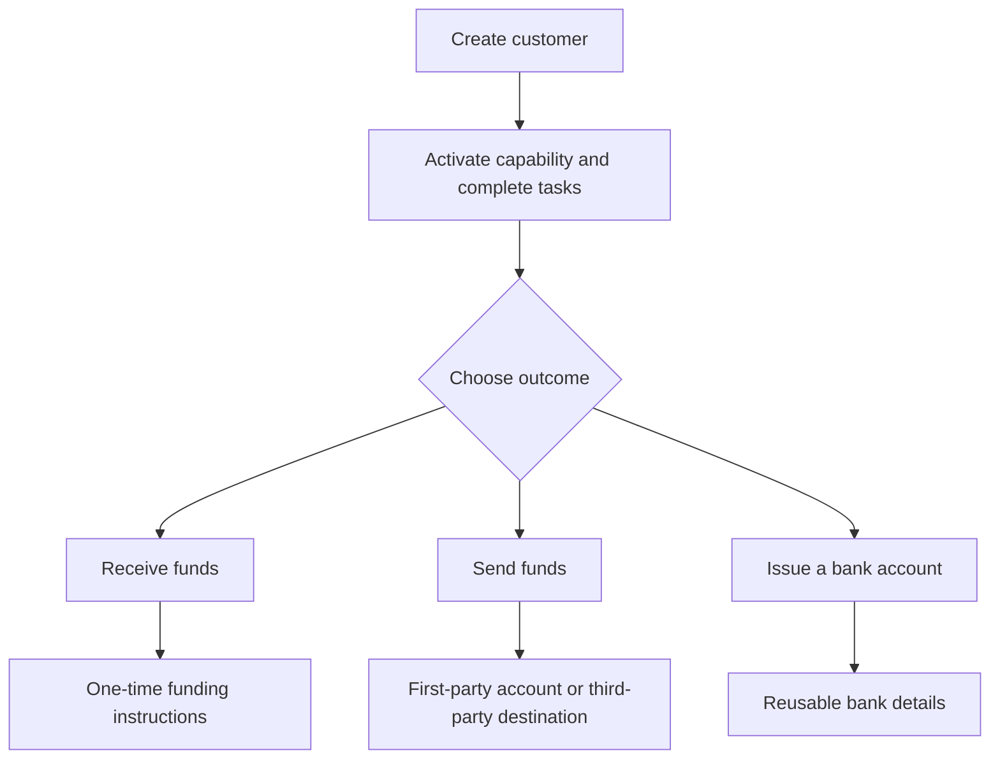

Commencez par le résultat client. Chaque flux utilise le même modèle d'onboarding, puis se ramifie vers différents comptes et mouvements de fonds.

## Comparer les flux

| Résultat | Préparer d'abord | Ce que vous recevez |
| --- | --- | --- |
| Encaissement | Capacité d'encaissement prête et portefeuille de destination émis | Instructions spécifiques au transfert et règlement en stablecoin |
| Paiement | Capacité de paiement prête, portefeuille émis alimenté et compte ou destination prêts | Un transfert vers l'endpoint de destinataire sélectionné |
| Compte bancaire émis | Capacité bancaire prête et portefeuille de règlement émis | Coordonnées bancaires réutilisables après provisionnement |

Un encaissement avec devis crée des instructions pour un seul transfert. Un compte bancaire émis crée des coordonnées réutilisables pour les dépôts ultérieurs. Un paiement commence à partir de fonds déjà disponibles dans un portefeuille émis.

## Choisir votre flux

<CardGroup cols={3}>
  <Card title="Recevoir des fonds" icon="arrow-down-to-line" href="/fr/integration/receive-funds">
    Créez et suivez un encaissement fiat vers stablecoin.
  </Card>
  <Card title="Envoyer des fonds" icon="arrow-up-from-line" href="/fr/integration/send-funds">
    Construisez un paiement propre ou tiers.
  </Card>
  <Card title="Émettre un compte bancaire" icon="building-columns" href="/fr/integration/issue-bank-account">
    Provisionnez des coordonnées bancaires réutilisables liées à un portefeuille.
  </Card>
</CardGroup>
