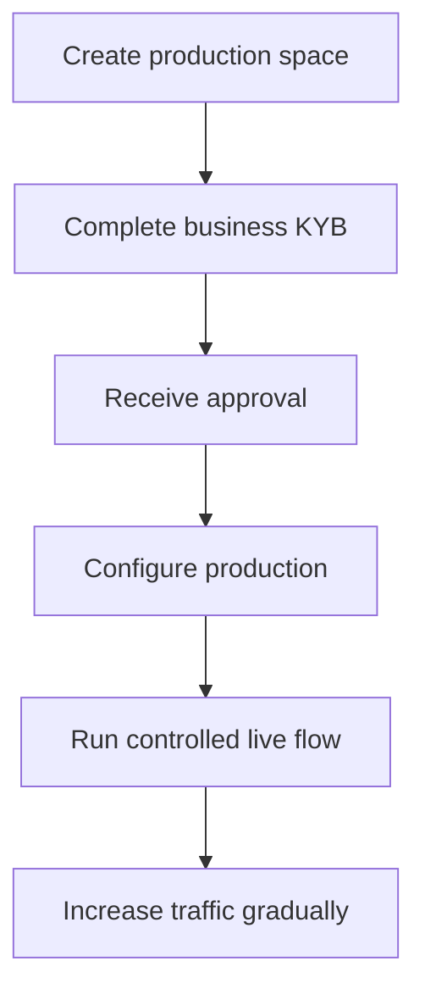

L'activation en production vérifie votre entreprise d'intégration. Elle est distincte des clients API que vous créez pour votre produit.

## Activer votre espace de production

1. Connectez-vous au tableau de bord Swipelux et sélectionnez **Créer un espace de production**.
2. Ouvrez l'onglet KYB ou allez à [Vérification d'entreprise](https://www.swipelux.app/kyb).
3. Complétez chaque champ demandé et téléversez les documents requis.
4. Soumettez votre entreprise d'intégration pour vérification et attendez l'approbation.

Ce n'est qu'après l'approbation de votre entreprise d'intégration et de votre espace de production que vous pouvez créer des clients API et des transactions en production.

## Garder la production indépendante

Créez les ressources de production explicitement. Changer une clé API ne migre pas l'état sandbox.

- Stockez les identifiants de production dans une entrée de gestionnaire de secrets séparée.
- Utilisez une configuration de déploiement et des IDs de ressources spécifiques à la production.
- Enregistrez un endpoint webhook et un secret de signature de production séparés.
- Recréez les clients, capacités, comptes, destinataires et destinations requis en production.
- Restreignez l'accès à la production aux services et opérateurs qui en ont besoin.

Le sandbox et la production utilisent `https://platform.swipelux.com` ; la clé API sélectionne l'environnement.

## Compléter la checklist de lancement

- [ ] Testez le chemin heureux et les chemins d'échec attendus en sandbox.
- [ ] Envoyez une `Idempotency-Key` avec chaque écriture qui en requiert une et conservez-la pour des tentatives sûres.
- [ ] Vérifiez les signatures des webhooks avant l'analyse, persistez durablement les IDs d'événements et testez la relecture.
- [ ] Gérez les capacités indisponibles, les tâches ouvertes et les révisions de tâches modifiées.
- [ ] Faites remonter les échecs de transfert et les instructions exploitables à vos opérateurs.
- [ ] Confirmez que les journaux conservent `X-Request-Id` ou `correlationId` sans exposer de secrets ou de données financières sensibles.

## Exécuter un flux en direct contrôlé

Commencez par un client connu et une transaction de faible valeur. Enregistrez :

| Contrôle | Définir avant le test |
| --- | --- |
| Portée | Client, capacité, compte ou destination, montant et méthode. |
| Résultat attendu | État de l'API, solde ou instructions, et événement webhook attendu. |
| Propriétaire | Personne responsable de surveiller le flux complet. |
| Condition d'arrêt | Tout état inattendu, webhook manquant, montant incorrect ou tâche non résolue. |

Vérifiez à la fois la ressource API actuelle et la livraison webhook authentifiée. Si l'un ou l'autre diffère du résultat attendu, arrêtez et investiguez avant d'envoyer plus de trafic.

Une fois le flux complet réussi, augmentez progressivement le volume tout en surveillant les états des capacités, comptes, destinations et transferts.

Retournez à [Flux courants](/fr/integration/common-flows) pour le parcours produit, ou utilisez la [Référence API](/fr/api-reference/introduction) pour les contrats exacts.
