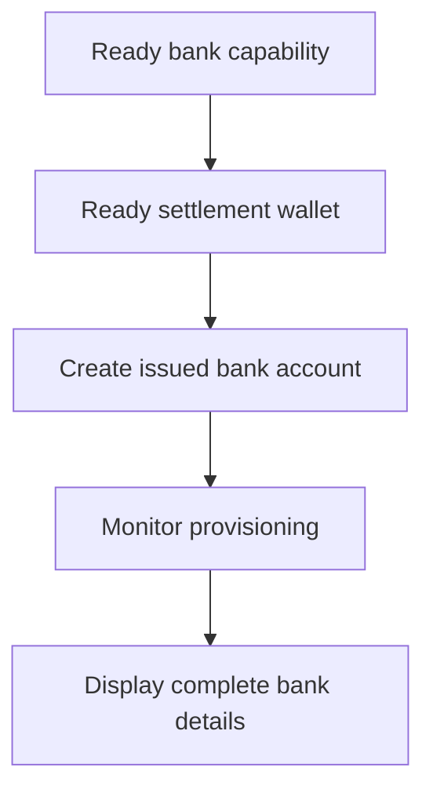

Utilisez un compte bancaire émis lorsque le client a besoin de coordonnées bancaires réutilisables. Pour des instructions de financement ponctuelles liées à un montant spécifique, utilisez plutôt [Recevoir des fonds](/fr/integration/receive-funds).



## Avant de commencer

Vous avez besoin d'un ID de client, d'une capacité bancaire prête pour la méthode et la devise prévues, et d'un portefeuille émis prêt détenu par le même client. Complétez le travail ouvert via [Capacités et tâches](/fr/integration/onboarding/capabilities-and-requirements).

## 1. Créer ou sélectionner le portefeuille de règlement

Créez un portefeuille émis via [Comptes et portefeuilles](/fr/integration/accounts#create-the-account), puis lisez-le à nouveau. Continuez uniquement lorsque son statut actuel autorise le règlement.

Stockez son `data.id` dérivé de la réponse en tant que `SETTLEMENT_WALLET_ID`. N'utilisez pas de portefeuille externe pour `settlement.accountId`.

## 2. Créer le compte bancaire émis

Utilisez [`POST /v3/customers/{customerId}/accounts`](/api-reference/accounts/post-v3-customers-by-customer-id-accounts) avec ces en-têtes :

```http
X-API-Key: ${SWIPELUX_API_KEY}
Idempotency-Key: issued-bank-account-001
Content-Type: application/json
```

Envoyez ce corps de requête :

```json
{
  "origin": "issued",
  "type": "bank",
  "method": "ach",
  "country": "US",
  "currency": "USD",
  "settlement": {
    "accountId": "${SETTLEMENT_WALLET_ID}"
  },
  "label": "USD account"
}
```

Stockez le `data.id` renvoyé en tant que `BANK_ACCOUNT_ID`. Conservez également `data.status`, `data.openTaskIds`, `data.details` et la relation de règlement.

L'ID du compte bancaire et l'ID du portefeuille ont des rôles différents. Lisez le provisionnement et les coordonnées bancaires via l'ID du compte bancaire. Utilisez l'ID du portefeuille de règlement pour identifier où les dépôts sont crédités.

## 3. Surveiller le provisionnement

Lisez [`GET /v3/customers/{customerId}/accounts/{accountId}`](/api-reference/accounts/get-v3-customers-by-customer-id-accounts-by-account-id) après la création et après chaque webhook pertinent.

Maintenez l'interface client en attente tant que `details` est absent. Si `openTaskIds` n'est pas vide, complétez les dernières tâches et récupérez à nouveau le compte. N'inférez pas la disponibilité à partir du temps écoulé.

Si le dernier `statusReason.code` est `awaiting_assignment`, créez le premier encaissement pour le même client, la même capacité et le même portefeuille de règlement via [Recevoir des fonds](/fr/integration/receive-funds), puis lisez à nouveau le compte bancaire. Suivez cette branche uniquement lorsque le compte actuel le demande.

## 4. Présenter les coordonnées bancaires en toute sécurité

Affichez uniquement les coordonnées complètes renvoyées par la dernière lecture du compte. Lorsque `details.referenceRequired` est true, affichez exactement la `details.reference` et rendez-la copiable. Lorsqu'elle est false, n'inventez pas de référence.

Ces coordonnées bancaires sont réutilisables. Ne les remplacez pas par des coordonnées de financement provenant d'un encaissement avec devis, qui n'appartiennent qu'à ce transfert.

Ensuite, ajoutez des [Webhooks](/fr/integration/webhooks) afin que les mises à jour de provisionnement atteignent votre application sans garder le client sur un écran de polling.
