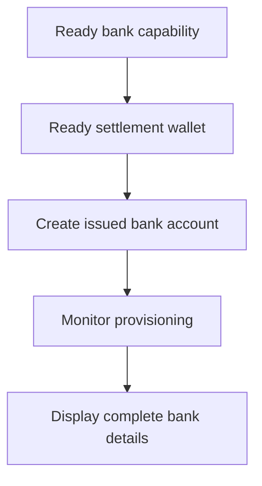

Utilisez un compte bancaire émis lorsque le client a besoin de coordonnées bancaires réutilisables. Pour des instructions de financement ponctuelles liées à un montant spécifique, utilisez plutôt [Recevoir des fonds](/fr/integration/receive-funds).


```mermaid
flowchart TD
  A["Ready bank capability"] --> B["Ready settlement wallet"]
  B --> C["Create issued bank account"]
  C --> D["Monitor provisioning"]
  D --> E["Display complete bank details"]
```

## Avant de commencer

Vous avez besoin d'un ID de client, d'une capacité bancaire prête pour la méthode et la devise prévues, et d'un portefeuille émis prêt détenu par le même client. Complétez le travail ouvert via [Capacités et tâches](/fr/integration/onboarding/capabilities-and-requirements).

## 1. Créer ou sélectionner le portefeuille de règlement

Créez un portefeuille émis via [Comptes et portefeuilles](/fr/integration/accounts#create-the-account), puis lisez-le à nouveau. Continuez uniquement lorsque son statut actuel autorise le règlement.

Stockez son `data.id` dérivé de la réponse en tant que `SETTLEMENT_WALLET_ID`. N'utilisez pas de portefeuille externe pour `settlement.accountId`.

## 2. Créer le compte bancaire émis

Utilisez [`POST /v3/customers/{customerId}/accounts`](/api-reference/accounts/post-v3-customers-by-customer-id-accounts) avec ces en-têtes :

```http
X-API-Key: ${SWIPELUX_API_KEY}
Idempotency-Key: issued-bank-account-001
Content-Type: application/json
```

Envoyez ce corps de requête :

```json
{
  "origin": "issued",
  "type": "bank",
  "method": "ach",
  "country": "US",
  "currency": "USD",
  "settlement": {
    "accountId": "${SETTLEMENT_WALLET_ID}"
  },
  "label": "USD account"
}
```

Stockez le `data.id` renvoyé en tant que `BANK_ACCOUNT_ID`. Conservez également `data.status`, `data.openTaskIds`, `data.details` et la relation de règlement.

Champs de requête facultatifs :

| Champ | S'applique à | Comportement |
| --- | --- | --- |
| `institution` | `ach`, `wire` et `swift` émis | Sélectionne exactement cette banque. Swipelux ne se rabat pas sur une autre banque. Utilisez un ID d'institution renvoyé par la réponse des capacités prises en charge. |
| `allowPending` | `ach`, `wire` et `swift` émis | Définissez sur `true` pour enregistrer la demande pendant que le dossier auprès de la banque sélectionnée attend son approbation. Nécessite `institution`. |
| `settlement.currency` | Comptes bancaires `USD` émis | `USDC` ou `USDT`. Définit le stablecoin livré au portefeuille de règlement. |

### Choisir la banque {#choose-the-bank}

Envoyez `institution` lorsque le client a besoin de coordonnées bancaires d'une banque précise. Swipelux réserve un compte émis par client, méthode, devise et institution. Lorsque vous omettez `institution`, un seul compte émis par méthode et devise couvre toutes les banques. Une seconde requête de création pour cette méthode et cette devise renvoie alors `409 conflict`.

Les lectures de compte renvoient la banque sélectionnée sous `institution` avec `id`, `name` et `bic`. `bic` peut valoir `null`.

L'idempotence s'applique à la banque sélectionnée. Rejouer la même requête renvoie le compte d'origine. Modifier `institution` avec la même `Idempotency-Key` renvoie `409 idempotency_conflict`.

### Enregistrer la demande avant l'approbation de la banque {#save-the-request-before-bank-approval}

Par défaut, Swipelux accepte une demande de compte bancaire émis uniquement lorsque la capacité bancaire est prête. Pour recueillir plus tôt la configuration du compte du client, envoyez `allowPending: true` avec `institution` :

```json
{
  "origin": "issued",
  "type": "bank",
  "method": "wire",
  "country": "US",
  "currency": "USD",
  "institution": "${INSTITUTION_ID}",
  "allowPending": true,
  "settlement": {
    "accountId": "${SETTLEMENT_WALLET_ID}"
  },
  "label": "USD wire account"
}
```

Pendant l'examen du dossier par la banque, le compte renvoie `status: "in_review"` avec `statusReason.code` défini sur `waiting_for_approval`. La réponse inclut également `applicationId` et les `openTaskIds` du dossier. Complétez ces tâches via [Capacités et tâches](/fr/integration/onboarding/capabilities-and-requirements).

La demande enregistrée conserve son ID de compte, son portefeuille de règlement et son emplacement de compte. Une fois le dossier et la capacité prêts, Swipelux provisionne les coordonnées bancaires sous le même `BANK_ACCOUNT_ID`. Continuez à lire cet ID. Ne créez pas d'autre demande.

Si le dossier est d'abord rejeté, annulé ou archivé, le compte passe à `rejected`. Il ne réserve plus l'emplacement de compte, vous pouvez donc envoyer une nouvelle demande.

### Choisir la devise de règlement {#choose-the-settlement-currency}

Par défaut, les dépôts sont réglés dans la devise du portefeuille de règlement. Définissez `settlement.currency` sur `USDC` ou `USDT` pour choisir l'actif livré indépendamment de la devise du portefeuille :

```json
{
  "settlement": {
    "accountId": "${SETTLEMENT_WALLET_ID}",
    "currency": "USDT"
  }
}
```

Les lectures de compte renvoient le choix enregistré, y compris pendant le provisionnement du compte. Modifier ultérieurement la devise de règlement ne change pas le portefeuille et ne réévalue pas les dépôts que Swipelux a déjà attribués au compte.

L'ID du compte bancaire et l'ID du portefeuille ont des rôles différents. Lisez le provisionnement et les coordonnées bancaires via l'ID du compte bancaire. Utilisez l'ID du portefeuille de règlement pour identifier où les dépôts sont crédités.

## 3. Surveiller le provisionnement

Lisez [`GET /v3/customers/{customerId}/accounts/{accountId}`](/api-reference/accounts/get-v3-customers-by-customer-id-accounts-by-account-id) après la création et après chaque webhook pertinent.

Maintenez l'interface client en attente tant que `details` est absent. Si `openTaskIds` n'est pas vide, complétez les dernières tâches et récupérez à nouveau le compte. N'inférez pas la disponibilité à partir du temps écoulé.

Si le compte a été enregistré avec `allowPending: true`, il reste `in_review` avec `statusReason.code` défini sur `waiting_for_approval` jusqu'à ce que la banque approuve le dossier.

Si le dernier `statusReason.code` est `awaiting_assignment`, créez le premier encaissement pour le même client, la même capacité et le même portefeuille de règlement via [Recevoir des fonds](/fr/integration/receive-funds), puis lisez à nouveau le compte bancaire. Suivez cette branche uniquement lorsque le compte actuel le demande.

## 4. Présenter les coordonnées bancaires en toute sécurité

Affichez uniquement les coordonnées complètes renvoyées par la dernière lecture du compte. Lorsque `details.referenceRequired` est true, affichez exactement la `details.reference` et rendez-la copiable. Lorsqu'elle est false, n'inventez pas de référence.

Pour les comptes `swift` émis, affichez `details.swiftCode` (le BIC de la banque réceptrice), `details.accountNumber`, `details.accountHolderName` et `details.accountHolderAddress` lorsqu'ils sont renvoyés. Les émetteurs doivent copier exactement l'adresse du bénéficiaire dans le virement international. Affichez également `details.bankAddress` et tous les champs de banque intermédiaire renvoyés par le compte.

Ces coordonnées bancaires sont réutilisables. Ne les remplacez pas par des coordonnées de financement provenant d'un encaissement avec devis, qui n'appartiennent qu'à ce transfert.

Ensuite, ajoutez des [Webhooks](/fr/integration/webhooks) afin que les mises à jour de provisionnement atteignent votre application sans garder le client sur un écran de polling.
