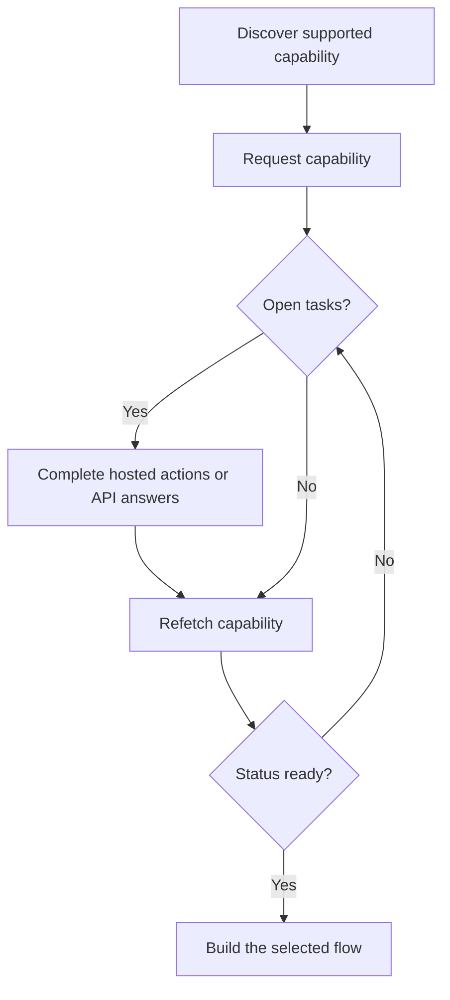

Une capacité indique si un client peut utiliser un résultat, une méthode de paiement et une direction spécifiques. Les tâches ouvertes indiquent ce qui doit se produire avant que cette capacité ou une ressource associée puisse avancer.



```bash
export API_BASE='https://platform.swipelux.com'
export SWIPELUX_API_KEY='replace-with-your-api-key'
```

## Découvrir les capacités prises en charge

Lisez les options actuelles du client avec [`GET /v3/customers/{customerId}/capabilities/supported`](/api-reference/capabilities/get-v3-customers-by-customer-id-capabilities-supported) :

```bash
curl --request GET \
  "${API_BASE}/v3/customers/${CUSTOMER_ID}/capabilities/supported" \
  --header "X-API-Key: ${SWIPELUX_API_KEY}"
```

Choisissez une entrée de réponse qui correspond aux `directions`, à la `method` et au `accountType` prévus. Continuez uniquement lorsque `availability` est `available` ou `beta` et `eligibility.eligible` est `true`. Si des `institutions` sont renvoyées, sélectionnez uniquement un ID de cette réponse.

Stockez le `data[].id` sélectionné en tant que `CAPABILITY_ID`. Ne copiez jamais un ID de capacité d'un autre client ou environnement.

### Types de comptes mutualisés vs nominatifs

Les capacités bancaires existent en deux variantes, encodées dans le champ `accountType` et le suffixe de l'ID de capacité (par exemple `ach_pooled`, `wire_named`) :

- **`pooled`** : compte bancaire Swipelux partagé. Chaque encaissement utilise une référence unique pour acheminer les fonds. Choisissez ceci pour les transferts ponctuels.
- **`named`** : coordonnées bancaires dédiées au client (IBAN virtuel, compte ACH dédié). Réutilisables et partageables avec n'importe quel payeur. Requis pour les [comptes bancaires émis](/fr/integration/issue-bank-account).

Par défaut, utilisez `pooled`. Utilisez `named` uniquement lorsque le client a besoin de coordonnées bancaires réutilisables. Vérifiez la réponse `supported` pour savoir quelles variantes sont disponibles.

## Demander la capacité

Demandez l'option sélectionnée avec [`POST /v3/customers/{customerId}/capabilities/{capabilityId}`](/api-reference/capabilities/post-v3-customers-by-customer-id-capabilities-by-capability-id) :

```bash
curl --request POST \
  "${API_BASE}/v3/customers/${CUSTOMER_ID}/capabilities/${CAPABILITY_ID}" \
  --header "X-API-Key: ${SWIPELUX_API_KEY}" \
  --header "Idempotency-Key: capability-request-001" \
  --header "Content-Type: application/json" \
  --data '{}'
```

Utilisez un tableau `institutions` explicite uniquement lorsque vous devez sélectionner parmi les IDs renvoyés par la réponse de capacité prise en charge.

Stockez `data.status` en tant que `CAPABILITY_STATUS`, `data.openTaskIds` en tant que `OPEN_TASK_IDS`, et chaque `data.applications[].id` dans `APPLICATION_IDS`.

## Compléter les tâches actuelles {#complete-current-tasks}

Listez les tâches avec [`GET /v3/customers/{customerId}/tasks`](/api-reference/tasks/list-customer-tasks), sélectionnez les IDs de `OPEN_TASK_IDS`, puis lisez chaque tâche actuelle avec [`GET /v3/customers/{customerId}/tasks/{taskId}`](/api-reference/tasks/get-customer-task) :

```bash
curl --request GET \
  "${API_BASE}/v3/customers/${CUSTOMER_ID}/tasks/${TASK_ID}" \
  --header "X-API-Key: ${SWIPELUX_API_KEY}"
```

Utilisez le dernier `data.revision` et les dernières `data.requirements`. Récupérez à nouveau la tâche juste avant la soumission si l'un ou l'autre peut avoir changé.

### Actions hébergées

Dans la réponse détaillée de la tâche, chaque entrée de `verificationSessions` et `tosSessions` inclut un objet `action`. Les réponses de liste de tâches n'incluent pas ces liens d'action. Enregistrez l'`id` de chaque session, puis lisez `action.kind` avant d'orienter le client ; ne déduisez pas la disponibilité du lien à partir du `status` de la session.

- `action.kind: "available"` inclut `action.url` et `action.expiresAt` (actuellement toujours `null`). Enregistrez `action.url`, envoyez-y le client, puis relisez la tâche. Les champs `url` et `expiresAt` au niveau de la session contiennent les mêmes valeurs.
- `action.kind: "unavailable"` signifie qu'aucun lien ne doit être présenté. Les champs `url` et `expiresAt` au niveau de la session sont absents. Le `status` d'une session ne détermine pas à lui seul le type d'action reçu.

```json
{
  "data": {
    "verificationSessions": [
      {
        "id": "vfy_000000000000000003",
        "key": "identity_verification",
        "type": "identity_verification",
        "status": "action_required",
        "action": {
          "kind": "available",
          "url": "https://platform.swipelux.com/kyc/redirect/cus_000000000000000001/tsk_000000000000000002/vfy_000000000000000003",
          "expiresAt": null
        },
        "url": "https://platform.swipelux.com/kyc/redirect/cus_000000000000000001/tsk_000000000000000002/vfy_000000000000000003",
        "expiresAt": null
      }
    ],
    "tosSessions": [
      {
        "id": "vfy_000000000000000004",
        "key": "terms_of_service",
        "type": "terms_of_service",
        "status": "completed",
        "action": { "kind": "unavailable" }
      }
    ]
  }
}
```

Ce sont des actions liées à la tâche, pas un cycle de vie de vérification client distinct.

### Téléverser des documents {#upload-documents}

Lorsqu'une exigence demande un document, téléversez-le avec [`POST /v3/customers/{customerId}/documents`](/api-reference/documents/post-v3-customers-by-customer-id-documents) :

```bash
export DOCUMENT_PATH='/absolute/path/to/requested-document.pdf'

curl --request POST \
  "${API_BASE}/v3/customers/${CUSTOMER_ID}/documents" \
  --header "X-API-Key: ${SWIPELUX_API_KEY}" \
  --header "Idempotency-Key: customer-document-001" \
  --form "file=@${DOCUMENT_PATH}"
```

Stockez le `data.id` renvoyé en tant que `DOCUMENT_ID` avant de soumettre la réponse qui y fait référence.

Pour récupérer un fichier stocké ultérieurement, appelez [`GET /v3/customers/{customerId}/documents/{documentId}/download`](/api-reference/documents/get-v3-customers-by-customer-id-documents-by-document-id-download). Swipelux renvoie une `url` qui télécharge le fichier en pièce jointe et expire après une heure. Les documents archivés renvoient `404`.

### Réponses API

Soumettez un ensemble complet de réponses pour la révision actuelle avec [`POST /v3/customers/{customerId}/tasks/{taskId}/submissions`](/api-reference/task-submissions/create-customer-task-submission) :

```bash
curl --request POST \
  "${API_BASE}/v3/customers/${CUSTOMER_ID}/tasks/${TASK_ID}/submissions" \
  --header "X-API-Key: ${SWIPELUX_API_KEY}" \
  --header "Idempotency-Key: task-submission-001" \
  --header "Content-Type: application/json" \
  --data @- <<'JSON'
{
  "taskRevision": 3,
  "answers": [
    {
      "requirementId": "req_from_current_task",
      "answer": {
        "type": "text",
        "value": "Current answer"
      }
    }
  ]
}
JSON
```

Prenez chaque ID d'exigence et type de réponse depuis la dernière tâche. Si l'API signale que la tâche a changé, récupérez-la à nouveau et reconstruisez la soumission à partir de la nouvelle révision.

## Continuer lorsque la capacité est prête

Lisez à nouveau la capacité avec [`GET /v3/customers/{customerId}/capabilities/{capabilityId}`](/api-reference/capabilities/get-v3-customers-by-customer-id-capabilities-by-capability-id) :

```bash
curl --request GET \
  "${API_BASE}/v3/customers/${CUSTOMER_ID}/capabilities/${CAPABILITY_ID}" \
  --header "X-API-Key: ${SWIPELUX_API_KEY}"
```

Remplacez le statut stocké et les IDs de tâche par la dernière réponse. Continuez uniquement lorsque le statut de capacité actuel autorise le compte, le devis ou le transfert que vous prévoyez de créer.

Ensuite, choisissez le parcours correspondant dans [Flux courants](/fr/integration/common-flows).
