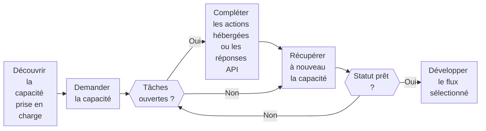

Une capacité indique si un client peut utiliser un résultat, une méthode de paiement et une direction spécifiques. Les tâches ouvertes indiquent ce qui doit se produire avant que cette capacité ou une ressource associée puisse avancer.


```mermaid
%%{init: {"flowchart": {"rankSpacing": 20, "nodeSpacing": 16, "wrappingWidth": 80, "padding": 8}}}%%
flowchart LR
  A["Découvrir la capacité prise en charge"] --> B["Demander la capacité"]
  B --> C{{"Tâches ouvertes ?"}}
  C -->|"Oui"| D["Compléter les actions hébergées ou les réponses API"]
  D --> E["Récupérer à nouveau la capacité"]
  C -->|"Non"| E
  E --> F{{"Statut prêt ?"}}
  F -->|"Non"| C
  F -->|"Oui"| G["Développer le flux sélectionné"]
```

```bash Environment variables
export API_BASE='https://platform.swipelux.com'
export SWIPELUX_API_KEY='replace-with-your-api-key'
```

## Découvrir les capacités prises en charge

Lisez les options actuelles du client avec [`GET /v3/customers/{customerId}/capabilities/supported`](/api-reference/capabilities/get-v3-customers-by-customer-id-capabilities-supported) :

```bash List supported capabilities
curl --request GET \
  "${API_BASE}/v3/customers/${CUSTOMER_ID}/capabilities/supported" \
  --header "X-API-Key: ${SWIPELUX_API_KEY}"
```

Choisissez une entrée de réponse qui correspond aux `directions`, à la `method` et au `accountType` prévus. Continuez uniquement lorsque `availability` est `available` ou `beta` et `eligibility.eligible` est `true`. Si des `institutions` sont renvoyées, sélectionnez uniquement un ID de cette réponse.

Chaque entrée d'institution inclut un `logoUrl` et un indicateur `isDefault`. Utilisez `logoUrl` pour afficher le logo de la banque dans une interface de sélection de banque, et affichez votre propre icône de banque générique lorsqu'il vaut `null`. `isDefault` s'applique uniquement à ce client et à cette capacité, pas à l'institution de manière globale. [`GET /v3/institutions`](/api-reference/institutions/get-v3-institutions) renvoie le même `logoUrl` nullable. Les ID d'institution sont opaques : gérez donc les nouveaux ID sans modifier votre code.

```json Institution entry
{
  "institutions": [
    {
      "id": "jpmorgan",
      "name": "JPMorgan Chase",
      "bic": "CHASUS33",
      "logoUrl": "https://wallet.swipelux.com/bank-logos/jpmorgan.png",
      "countries": ["US"],
      "isDefault": true
    }
  ]
}
```

Stockez le `data[].id` sélectionné en tant que `CAPABILITY_ID`. Ne copiez jamais un ID de capacité d'un autre client ou environnement.

### Types de comptes mutualisés vs nominatifs

Les capacités bancaires existent en deux variantes, encodées dans le champ `accountType` et le suffixe de l'ID de capacité (par exemple `ach_pooled`, `wire_named`) :

- **`pooled`** : compte bancaire Swipelux partagé. Chaque encaissement utilise une référence unique pour acheminer les fonds. Choisissez ceci pour les transferts ponctuels.
- **`named`** : coordonnées bancaires dédiées au client (IBAN virtuel, compte ACH dédié). Réutilisables et partageables avec n'importe quel payeur. Requis pour les [comptes bancaires émis](/fr/integration/issue-bank-account).

Par défaut, utilisez `pooled`. Utilisez `named` uniquement lorsque le client a besoin de coordonnées bancaires réutilisables. Vérifiez la réponse `supported` pour savoir quelles variantes sont disponibles.

Pour recevoir des dépôts SWIFT ou émettre des coordonnées bancaires SWIFT, utilisez `swift_named`. `swift_pooled` ne prend en charge que les paiements, vérifiez donc les `directions` de chaque option dans la réponse de capacité prise en charge. Un compte SWIFT named renvoie des coordonnées de réception réutilisables, notamment le BIC de la banque, une référence lorsqu'elle est requise et l'adresse du bénéficiaire lorsque la banque la fournit.

Pour les comptes ACH, Wire et SWIFT émis, vous pouvez choisir une banque précise avec `institution` et enregistrer la demande de compte avant que la banque n'approuve le client. Consultez [Émettre un compte bancaire](/fr/integration/issue-bank-account#choose-the-bank).

## Demander la capacité

Demandez l'option sélectionnée avec [`POST /v3/customers/{customerId}/capabilities/{capabilityId}`](/api-reference/capabilities/post-v3-customers-by-customer-id-capabilities-by-capability-id) :

```bash Request capability
curl --request POST \
  "${API_BASE}/v3/customers/${CUSTOMER_ID}/capabilities/${CAPABILITY_ID}" \
  --header "X-API-Key: ${SWIPELUX_API_KEY}" \
  --header "Idempotency-Key: capability-request-001" \
  --header "Content-Type: application/json" \
  --data '{}'
```

Utilisez un tableau `institutions` explicite uniquement lorsque vous devez sélectionner parmi les IDs renvoyés par la réponse de capacité prise en charge.

Stockez `data.status` en tant que `CAPABILITY_STATUS`, `data.accountProvisioning` en tant que `ACCOUNT_PROVISIONING_STATUS`, `data.openTaskIds` en tant que `OPEN_TASK_IDS`, et chaque `data.applications[].id` dans `APPLICATION_IDS`.

### Applications partagées par banque {#shared-applications-per-bank}

Pour les capacités bancaires named, chaque client dispose d'un dossier d'application par banque. Les capacités pooled et de plateforme utilisent des dossiers sans banque. Swipelux partage un dossier entre toutes les capacités compatibles que vous demandez :

- Une seule approbation peut couvrir plusieurs capacités. Par exemple, un dossier approuvé auprès d'une banque peut rendre `ready` à la fois une capacité ACH et une capacité Wire.
- Une demande ultérieure qui correspond à un dossier existant le réutilise. Swipelux n'ouvre pas de deuxième application et n'ajoute aucune tâche en double.
- Les dossiers auprès de banques différentes sont indépendants. Un rejet auprès d'une banque n'affecte pas un dossier auprès d'une autre banque.

La réponse à la demande vous indique quel dossier Swipelux a utilisé :

- `201` signifie que la demande a ouvert un nouveau dossier d'application.
- `200` signifie que la demande a abouti à un dossier d'application que le client possédait déjà, par exemple une demande répétée pour une capacité bancaire que le client détient déjà, ou une demande pour une capacité annulée. Une demande répétée pour `card` ou `stablecoin_transfers` renvoie toujours [`409 capability_already_exists`](/integration/errors#capability-already-exists).
- `selectedApplicationId` est un champ de premier niveau à côté de `data` qui contient l'ID du dossier que la demande a sélectionné ou ouvert. Swipelux l'omet lorsque la demande n'a sélectionné aucun dossier. Une relecture idempotente renvoie la même valeur.

Réponse abrégée :

```json Response (abbreviated)
{
  "data": {
    "id": "ach_named",
    "status": "pending",
    "openTaskIds": ["tsk_000000000000000002"],
    "applications": [{ "id": "apl_000000000000000005", "status": "in_review" }]
  },
  "selectedApplicationId": "apl_000000000000000005"
}
```

Pour les capacités named, renvoyez la même liste `institutions` pour sélectionner le même dossier, ou envoyez un seul ID d'institution pour cibler cette banque. Une banque qui a définitivement rejeté le client est ignorée. Lorsque vous ne nommez que cette banque, ou que toutes les banques éligibles ont rejeté le client, la demande renvoie [`409 capability_terminally_rejected`](/integration/errors#capability-terminally-rejected). Pour essayer une autre banque après un rejet, demandez à nouveau la capacité avec l'ID d'institution de cette banque.

Le statut d'une capacité reflète l'ensemble des dossiers associés du client. Pour une capacité named, un seul dossier `ready` dont l'approbation la couvre suffit à la rendre `ready`, quel que soit le statut signalé par les autres banques. Une capacité pooled attend également sa vérification de méthode, signalée dans `probes` sur la liste des applications du client.

#### Lister les applications du client {#list-the-customers-applications}

Listez tous les dossiers d'application du client avec [`GET /v3/customers/{customerId}/applications`](/api-reference/capabilities/get-v3-customers-by-customer-id-applications). Les résultats sont paginés avec `nextCursor` et `hasMore`, et acceptent `updatedAfter` :

```bash List applications
curl --request GET \
  "${API_BASE}/v3/customers/${CUSTOMER_ID}/applications" \
  --header "X-API-Key: ${SWIPELUX_API_KEY}"
```

Chaque entrée inclut les champs d'application renvoyés dans le `applications[]` d'une capacité, ainsi que :

- `scope` : `named` pour un dossier auprès d'une seule banque, `provider_pooled` ou `platform` pour les dossiers sans banque, ou `null` pour un dossier historique non classé. `institution` est absent pour les dossiers `provider_pooled` et `platform`.
- `requestedScope[]` : les clés de capacité demandées pour le dossier, chacune avec son premier `requestedAt`. Les entrées ne sont jamais supprimées.
- `coverage[]` : les clés de capacité couvertes par l'approbation du dossier, chacune avec `grantedAt` et `source`. La couverture enregistre une portée, pas une autorisation. Lisez la capacité pour connaître son statut actuel.
- `probes[]` : les vérifications de méthode pour les clés de capacité pooled couvertes par le dossier, chacune avec `capabilityKey`, `status` et `reason`. Les clés named ne nécessitent jamais de vérification.
- `generation`, `predecessorApplicationId` et `supersededByApplicationId` : liens de succession. Lorsque `supersededByApplicationId` est défini, le dossier a été remplacé. Suivez cet ID jusqu'au dossier actuel. La liste `applications[]` d'une capacité ne contient que les dossiers actuels, donc un dossier remplacé n'apparaît que dans cette liste.

Réponse abrégée :

```json Response (abbreviated)
{
  "data": [
    {
      "id": "apl_000000000000000005",
      "status": "ready",
      "scope": "named",
      "institution": { "id": "jpmorgan", "name": "JPMorgan Chase", "bic": "CHASUS33" },
      "requestedScope": [
        { "capabilityKey": "ach_named", "requestedAt": "2026-09-20T10:00:00.000Z" }
      ],
      "coverage": [
        { "capabilityKey": "ach_named", "grantedAt": "2026-09-22T12:00:00.000Z", "source": "approval" },
        { "capabilityKey": "wire_named", "grantedAt": "2026-09-22T12:00:00.000Z", "source": "approval" }
      ],
      "probes": [],
      "generation": 1,
      "predecessorApplicationId": null,
      "supersededByApplicationId": null
    }
  ],
  "nextCursor": null,
  "hasMore": false
}
```

## Compléter les tâches actuelles {#complete-current-tasks}

Listez les tâches avec [`GET /v3/customers/{customerId}/tasks`](/api-reference/tasks/list-customer-tasks), sélectionnez les IDs de `OPEN_TASK_IDS`, puis lisez chaque tâche actuelle avec [`GET /v3/customers/{customerId}/tasks/{taskId}`](/api-reference/tasks/get-customer-task) :

```bash List open tasks
curl --request GET \
  "${API_BASE}/v3/customers/${CUSTOMER_ID}/tasks/${TASK_ID}" \
  --header "X-API-Key: ${SWIPELUX_API_KEY}"
```

Utilisez le dernier `data.revision` et les dernières `data.requirements`. Récupérez à nouveau la tâche juste avant la soumission si l'un ou l'autre peut avoir changé.

### Preuves de profil réutilisées {#reused-profile-evidence}

Pour les tâches d'intake d'application qui acceptent la soumission directe via l'API, Swipelux réutilise les informations que le client a déjà fournies. Lorsqu'une telle tâche est créée ou réconciliée, Swipelux vérifie le profil du client et les documents que le client a lui-même téléversés. Les exigences éligibles déjà étayées par une valeur de profil ou un document utilisable passent à `in_review` au lieu de rester actionnables. Les mises à jour du profil et les nouveaux téléversements de documents déclenchent la même vérification pour les tâches existantes.

Seules les valeurs manquantes ou incompatibles restent actionnables. La réutilisation n'approuve pas les preuves : Swipelux les examine toujours. Les demandes de correction explicites et les exigences déjà répondues restent actionnables. Les documents des propriétaires et des parties liées ne sont pas réutilisés, et les exigences collectées uniquement via une session hébergée conservent leur flux habituel.

### Afficher les exigences {#render-requirements}

Construisez les formulaires à partir des métadonnées renvoyées par chaque exigence plutôt qu'à partir des clés d'exigence. Une exigence peut inclure un `title` court facultatif, et chaque `request` inclut un `prompt` à afficher sous le titre.

Les exigences avec `request.type: "profile"` identifient le champ de profil avec `profilePointer` et ajoutent des métadonnées de saisie :

- `allowedValues` : les valeurs autorisées pour un champ scalaire, ou pour chaque élément d'un champ de type tableau. Soumettez ces valeurs, pas des libellés d'affichage traduits.
- `valueSchema` : un document JSON Schema Draft 7 autonome qui décrit la forme de la saisie, les propriétés imbriquées, les champs obligatoires et les contraintes structurelles. Les enums sur les objets apparaissent sur la propriété concernée, par exemple `valueSchema.items.properties.type.enum` pour les identifiants fiscaux. Swipelux applique toujours une validation inter-champs et de revue après la soumission, donc une valeur conforme au schéma peut tout de même être rejetée.
- `valueType: "country"`, ou `itemValueType: "country"` pour les tableaux : le champ accepte des codes ISO 3166-1 alpha-2 en majuscules. Les propriétés de pays imbriquées dans `valueSchema` utilisent `format: "iso-3166-1-alpha-2"`. Utilisez une liste de pays standard pour les libellés localisés.

```json Requirement
{
  "id": "req_000000000000000010",
  "key": "account_purposes",
  "title": "Account purpose",
  "status": "action_required",
  "request": {
    "type": "profile",
    "prompt": "Select every purpose that applies.",
    "required": true,
    "profilePointer": "/financialProfile/accountPurposes",
    "valueType": "array",
    "itemValueType": "string",
    "allowedValues": ["business_expenses", "ecommerce", "payroll"],
    "valueSchema": {
      "$schema": "http://json-schema.org/draft-07/schema#",
      "type": "array",
      "items": { "enum": ["business_expenses", "ecommerce", "payroll"] }
    }
  }
}
```

Cet exemple raccourcit le catalogue de valeurs ; l'API renvoie toutes les valeurs autorisées. Certaines exigences de profil n'ont pas de schéma publié et omettent `valueSchema` et `allowedValues`. Affichez-les à partir de `prompt` et `valueType`.

Chaque tâche ouverte inclut un horodatage `dueAt`. Lorsque Swipelux crée une tâche sans date d'échéance explicite, `dueAt` prend par défaut exactement 31 jours après le `createdAt` de la tâche. Traitez `dueAt` comme informatif : vous ne pouvez pas le définir via l'API et il ne déclenche aucune transition automatique du cycle de vie. Seul le champ distinct `deadline`, lorsqu'il est présent, provoque une transition automatique.

### Actions hébergées {#hosted-actions}

Dans la réponse détaillée de la tâche, chaque entrée de `verificationSessions` et `tosSessions` inclut un objet `action`. Les réponses de liste de tâches n'incluent pas ces liens d'action. Enregistrez l'`id` de chaque session, puis lisez `action.kind` avant d'orienter le client ; ne déduisez pas la disponibilité du lien à partir du `status` de la session.

- `action.kind: "available"` inclut `action.url` et `action.expiresAt` (actuellement toujours `null`). Enregistrez `action.url`, envoyez-y le client, puis relisez la tâche. Les champs `url` et `expiresAt` au niveau de la session contiennent les mêmes valeurs.
- `action.kind: "unavailable"` signifie qu'aucun lien ne doit être présenté. Les champs `url` et `expiresAt` au niveau de la session sont absents. Le `status` d'une session ne détermine pas à lui seul le type d'action reçu.

```json Verification session
{
  "data": {
    "verificationSessions": [
      {
        "id": "vfy_000000000000000003",
        "key": "identity_verification",
        "type": "identity_verification",
        "status": "action_required",
        "action": {
          "kind": "available",
          "url": "https://platform.swipelux.com/kyc/redirect/cus_000000000000000001/tsk_000000000000000002/vfy_000000000000000003",
          "expiresAt": null
        },
        "url": "https://platform.swipelux.com/kyc/redirect/cus_000000000000000001/tsk_000000000000000002/vfy_000000000000000003",
        "expiresAt": null
      }
    ],
    "tosSessions": [
      {
        "id": "vfy_000000000000000004",
        "key": "terms_of_service",
        "type": "terms_of_service",
        "status": "completed",
        "action": { "kind": "unavailable" }
      }
    ]
  }
}
```

Ce sont des actions liées à la tâche, pas un cycle de vie de vérification client distinct.

### Téléverser des documents {#upload-documents}

Lorsqu'une exigence demande un document, téléversez-le avec [`POST /v3/customers/{customerId}/documents`](/api-reference/documents/post-v3-customers-by-customer-id-documents) :

```bash Upload document
export DOCUMENT_PATH='/absolute/path/to/requested-document.pdf'

curl --request POST \
  "${API_BASE}/v3/customers/${CUSTOMER_ID}/documents" \
  --header "X-API-Key: ${SWIPELUX_API_KEY}" \
  --header "Idempotency-Key: customer-document-001" \
  --form "file=@${DOCUMENT_PATH}"
```

Stockez le `data.id` renvoyé en tant que `DOCUMENT_ID` avant de soumettre la réponse qui y fait référence.

Pour récupérer un fichier stocké ultérieurement, appelez [`GET /v3/customers/{customerId}/documents/{documentId}/download`](/api-reference/documents/get-v3-customers-by-customer-id-documents-by-document-id-download). Swipelux renvoie une `url` qui télécharge le fichier en pièce jointe et expire après une heure. Les documents archivés renvoient `404`.

### Réponses API

Soumettez un ensemble complet de réponses pour la révision actuelle avec [`POST /v3/customers/{customerId}/tasks/{taskId}/submissions`](/api-reference/task-submissions/create-customer-task-submission) :

```bash Submit task answers
curl --request POST \
  "${API_BASE}/v3/customers/${CUSTOMER_ID}/tasks/${TASK_ID}/submissions" \
  --header "X-API-Key: ${SWIPELUX_API_KEY}" \
  --header "Idempotency-Key: task-submission-001" \
  --header "Content-Type: application/json" \
  --data @- <<'JSON'
{
  "taskRevision": 3,
  "answers": [
    {
      "requirementId": "req_from_current_task",
      "answer": {
        "type": "text",
        "value": "Current answer"
      }
    }
  ]
}
JSON
```

Prenez chaque ID d'exigence et type de réponse depuis la dernière tâche. Si l'API signale que la tâche a changé, récupérez-la à nouveau et reconstruisez la soumission à partir de la nouvelle révision.

### Prérequis de bénéficiaire effectif pour les entreprises {#beneficial-owner-prerequisite-for-businesses}

Demander une capacité professionnelle qui nécessite des preuves de bénéficiaire effectif réussit même lorsque le client n'a pas encore de propriétaire qualifié. La capacité est créée en `restricted` avec `statusReason.code: tasks_due`, et la tâche d'intake professionnelle demande les faits de propriété manquants, y compris la structure de propriété.

La même tâche porte une exigence `resource_reference` dont la demande inclut `qualification: "beneficial_owner"` :

```json Beneficial owner requirement
{
  "type": "resource_reference",
  "prompt": "Add or select a qualifying beneficial owner.",
  "required": true,
  "resourceType": "related_party",
  "qualification": "beneficial_owner"
}
```

Une partie liée est qualifiée lorsqu'il s'agit d'une partie `person` active du même client avec un pourcentage de propriété fourni d'au moins 25, ou avec `ownership.declared: true` sans pourcentage.

L'exigence est dérivée de la liste actuelle des parties liées, vous n'y répondez donc généralement pas directement :

- Créer ou mettre à jour une partie liée qualifiée satisfait l'exigence lors de la même réévaluation et ouvre le travail de profil et de documents propre à ce propriétaire. Consultez [Ajouter des parties liées professionnelles](/fr/integration/onboarding/customers#add-business-related-parties).
- Vous pouvez aussi référencer explicitement une partie qualifiée avec une réponse `resource_reference` portant son `relatedPartyId`.
- L'exigence reste listée dans la tâche actuelle après avoir été satisfaite. Lorsqu'aucune autre obligation ne reste ouverte, la tâche devient `satisfied`.
- Archiver la dernière partie qualifiée, ou supprimer les faits qui la qualifiaient, rouvre l'exigence, même après que la tâche est passée à `satisfied`.

## Continuer lorsque la capacité est prête {#continue-when-the-capability-is-ready}

Lisez à nouveau la capacité avec [`GET /v3/customers/{customerId}/capabilities/{capabilityId}`](/api-reference/capabilities/get-v3-customers-by-customer-id-capabilities-by-capability-id) :

```bash Refetch capability
curl --request GET \
  "${API_BASE}/v3/customers/${CUSTOMER_ID}/capabilities/${CAPABILITY_ID}" \
  --header "X-API-Key: ${SWIPELUX_API_KEY}"
```

Remplacez le statut stocké, le statut de provisionnement de compte et les IDs de tâche par la dernière réponse. Le `status` de la capacité indique si le droit est approuvé. Pour une capacité qui émet un compte, `accountProvisioning` indique séparément si ce compte est `not_started`, `in_progress`, `issued` ou `failed` ; une capacité qui n'émet pas de compte renvoie `not_applicable`.

Tant que la capacité est `pending`, deux des valeurs de `statusReason.code` qu'elle peut indiquer montrent si un examen est en cours. `preparing_submission` signifie que Swipelux prépare encore un dossier pour soumission et qu'aucun examen n'est en cours, même si le dossier d'une autre banque est `rejected` ou nécessite une action. `review_in_progress` signifie qu'un examen est en cours, par exemple lorsqu'un dossier est `in_review` ou qu'une [vérification hébergée](#hosted-actions) est ouverte. Les deux utilisent `resolution: wait`. Un passage d'un code à l'autre conserve le statut `pending`, donc aucun événement `capability.status_changed` n'est envoyé. Lisez la capacité pour connaître le code actuel.

Continuez uniquement lorsque le statut de capacité actuel autorise le compte, le devis ou le transfert que vous prévoyez de créer. Lorsque le flux nécessite un compte émis, attendez également que `accountProvisioning` devienne `issued`.

Ensuite, choisissez le parcours correspondant dans [Flux courants](/fr/integration/common-flows).
