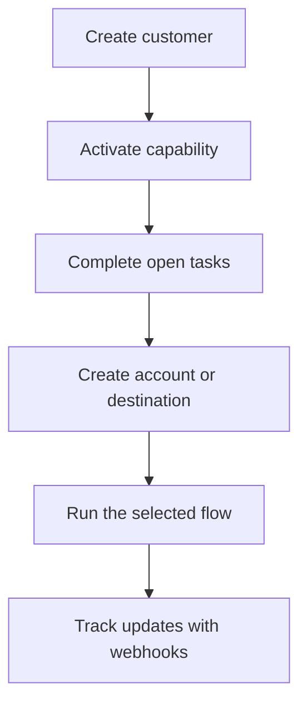

Swipelux fournit à votre backend les briques nécessaires pour intégrer des clients et déplacer des fonds sans exposer l'infrastructure de paiement dans votre produit.

## Ce que vous pouvez créer

<CardGroup cols={3}>
  <Card title="Recevoir des fonds" icon="arrow-down-to-line" href="/fr/integration/receive-funds">
    Créez des instructions de financement fiat ponctuelles et réglez en stablecoin vers un portefeuille.
  </Card>
  <Card title="Envoyer des fonds" icon="arrow-up-from-line" href="/fr/integration/send-funds">
    Envoyez depuis un portefeuille client vers un compte propre ou une destination tierce.
  </Card>
  <Card title="Émettre un compte bancaire" icon="building-columns" href="/fr/integration/issue-bank-account">
    Provisionnez des coordonnées bancaires réutilisables liées à un portefeuille de règlement.
  </Card>
</CardGroup>

## Comment fonctionne une intégration

Un client est la personne physique ou morale qui possède le flux. Les capacités décrivent les résultats que ce client peut utiliser. Les tâches ouvertes indiquent ce qui doit être terminé avant que la capacité ou la ressource puisse avancer.

## Voir en action

Explorez [demo.swipelux.com](https://demo.swipelux.com) pour essayer une expérience neobank simulée. Vous pouvez également [cloner le starter](https://github.com/swipelux/neobank-starter) et personnaliser son interface produit.

La démo et le starter sont des références produit et UI. Ils ne remplacent pas ces guides ni le contrat API actuel.

## Commencer à développer

<CardGroup cols={3}>
  <Card title="Démarrage rapide" icon="rocket" href="/fr/integration/quickstart">
    Créez un client et exécutez un flux sandbox.
  </Card>
  <Card title="Flux courants" icon="route" href="/fr/integration/common-flows">
    Comparez la configuration requise pour chaque résultat.
  </Card>
  <Card title="Référence API" icon="code" href="/fr/api-reference/introduction">
    Lisez les conventions de requête et inspectez chaque opération API.
  </Card>
</CardGroup>
