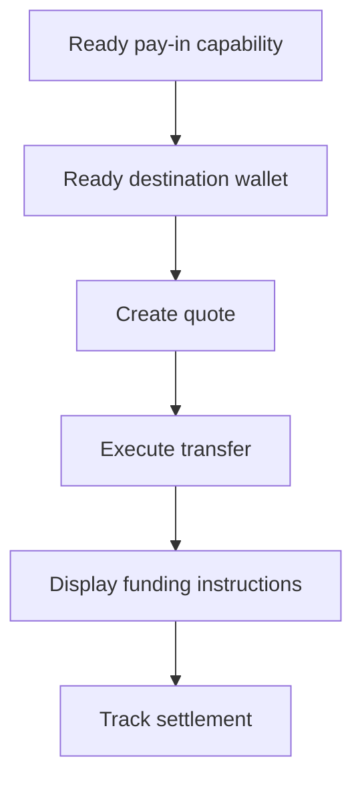

Utilisez un encaissement avec devis lorsque le client doit financer un montant spécifique. Le transfert règle en stablecoin dans un portefeuille émis.



## Avant de commencer

Vous avez besoin d'une capacité d'encaissement prête et d'un portefeuille de destination émis prêt pour le même client. Complétez toute tâche ouverte via [Capacités et tâches](/fr/integration/onboarding/capabilities-and-requirements), puis récupérez à nouveau les deux ressources.

## 1. Créer un devis

Créez le prix avec [`POST /v3/quotes`](/api-reference/money-movement/post-v3-quotes). Envoyez ces en-têtes :

```http
X-API-Key: ${SWIPELUX_API_KEY}
Idempotency-Key: payin-quote-001
Content-Type: application/json
```

```json
{
  "customerId": "${CUSTOMER_ID}",
  "capabilityId": "${CAPABILITY_ID}",
  "externalId": "payin-order-123",
  "in": {
    "amount": "150.00",
    "currency": "USD"
  },
  "destinationId": "${SETTLEMENT_WALLET_ID}",
  "out": {
    "currency": "USDC"
  }
}
```

Stockez `data.id` en tant que `QUOTE_ID`. Présentez les montants et les frais renvoyés plutôt que de les reconstruire à partir du taux.

## 2. Exécuter le devis

Exécutez le devis actuel avant expiration avec [`POST /v3/transfers`](/api-reference/money-movement/post-v3-transfers). Utilisez une nouvelle clé pour ce transfert prévu :

```http
X-API-Key: ${SWIPELUX_API_KEY}
Idempotency-Key: payin-transfer-001
Content-Type: application/json
```

```json
{
  "quoteId": "${QUOTE_ID}"
}
```

Stockez le `data.id` du transfert en tant que `TRANSFER_ID` et conservez son état actuel.

## 3. Récupérer les instructions de financement

Lisez [`GET /v3/transfers/{transferId}/instructions`](/api-reference/money-movement/get-v3-transfers-by-transfer-id-instructions). Rendez la variante `data.instructions` renvoyée sans supposer son type.

Ces détails sont spécifiques au transfert. Ne réutilisez jamais les coordonnées bancaires, le code, l'URL hébergée, le montant, la référence ou l'expiration d'un transfert pour un autre encaissement.

Pour les instructions bancaires, lorsque `reference.required` est true, affichez exactement la `reference.value` à côté des coordonnées bancaires et rendez-la copiable. Affichez le montant et la devise renvoyés du même ensemble d'instructions.

Les instructions bancaires peuvent aussi inclure les champs optionnels `bankName`, `bankAddress`, `accountHolderName` et `accountHolderAddress` pour les méthodes `ach`, `wire`, `rtp` et `swift`. Affichez chaque champ renvoyé à côté des autres coordonnées bancaires. Les banques émettrices exigent souvent l'adresse de la banque destinataire pour `swift` et les autres virements internationaux ; affichez donc `bankAddress` chaque fois qu'il est renvoyé.

```json
{
  "type": "bank",
  "method": "swift",
  "amount": { "amount": "150.00", "currency": "USD" },
  "accountHolderName": "Swipelux FBO Customer",
  "accountHolderAddress": "8 The Green, Dover, DE",
  "bankName": "JPMorgan Chase",
  "bankAddress": "383 Madison Avenue, New York, NY",
  "details": {
    "swiftCode": "CHASUS33",
    "accountNumber": "123456789"
  },
  "reference": { "value": "SWIFTMEMO1", "required": true }
}
```

Un compte bancaire émis est différent : il fournit des coordonnées réutilisables pour les dépôts ultérieurs. Consultez [Émettre un compte bancaire](/fr/integration/issue-bank-account) lorsque c'est l'expérience prévue.

## 4. Suivre le règlement

Lisez [`GET /v3/transfers/{transferId}`](/api-reference/money-movement/get-v3-transfers-by-transfer-id) après l'exécution et après chaque événement. Pilotez le statut destiné au client à partir du dernier `data.state`.

Utilisez `data.stateDetail` et `data.openTaskIds` lorsque le transfert nécessite une autre action. Ne le marquez pas comme terminé à partir d'un calendrier prévu.

Ensuite, ajoutez des [Webhooks](/fr/integration/webhooks) et gardez le statut de transfert synchronisé jusqu'à ce qu'il atteigne un résultat que votre produit gère.
