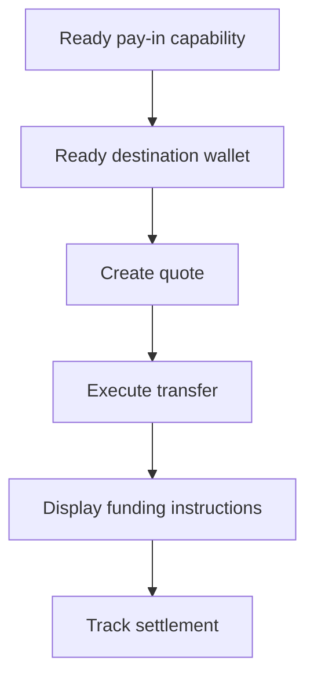

Utilisez un encaissement avec devis lorsque le client doit financer un montant spécifique. Le transfert règle en stablecoin dans un portefeuille émis.



## Avant de commencer

Vous avez besoin d'une capacité d'encaissement prête et d'un portefeuille de destination émis prêt pour le même client. Complétez toute tâche ouverte via [Capacités et tâches](/fr/integration/onboarding/capabilities-and-requirements), puis récupérez à nouveau les deux ressources.

## 1. Créer un devis

Créez le prix avec [`POST /v3/quotes`](/api-reference/money-movement/post-v3-quotes). Envoyez ces en-têtes :

```http
X-API-Key: ${SWIPELUX_API_KEY}
Idempotency-Key: payin-quote-001
Content-Type: application/json
```

```json
{
  "customerId": "${CUSTOMER_ID}",
  "capabilityId": "${CAPABILITY_ID}",
  "externalId": "payin-order-123",
  "in": {
    "amount": "150.00",
    "currency": "USD"
  },
  "destinationId": "${SETTLEMENT_WALLET_ID}",
  "out": {
    "currency": "USDC"
  }
}
```

Stockez `data.id` en tant que `QUOTE_ID`. Présentez les montants et les frais renvoyés plutôt que de les reconstruire à partir du taux.

## 2. Exécuter le devis

Exécutez le devis actuel avant expiration avec [`POST /v3/transfers`](/api-reference/money-movement/post-v3-transfers). Utilisez une nouvelle clé pour ce transfert prévu :

```http
X-API-Key: ${SWIPELUX_API_KEY}
Idempotency-Key: payin-transfer-001
Content-Type: application/json
```

```json
{
  "quoteId": "${QUOTE_ID}"
}
```

Stockez le `data.id` du transfert en tant que `TRANSFER_ID` et conservez son état actuel.

### Ajouter une URL de retour pour la carte et Apple Pay

Pour un devis par carte ou Apple Pay, vous pouvez inclure un `redirectUrl` facultatif dans la même requête. Une fois que le client a terminé le paiement hébergé, la page de paiement ouvre cette URL pour ramener le client vers votre application.

```json
{
  "quoteId": "${QUOTE_ID}",
  "redirectUrl": "https://your-app.example/payments/complete"
}
```

`redirectUrl` doit être une URL HTTPS absolue d'au plus 2048 caractères et ne doit pas contenir d'identifiants intégrés. Envoyer `redirectUrl` pour un devis qui ne prend pas en charge la navigation de retour échoue à la validation au lieu d'être ignoré.

L'arrivée sur `redirectUrl` n'est qu'une navigation du navigateur. Elle ne confirme pas que le paiement ou le transfert est terminé. Déterminez l'achèvement à partir de l'état du transfert à l'étape 4 et des événements webhook.

### Demander une méthode préférée pour la carte, Apple Pay ou Google Pay

Pour un devis par carte, vous pouvez inclure un `paymentMethod` facultatif avec la valeur `card`, `apple_pay` ou `google_pay` dans la même requête. Le paiement hébergé s'ouvre sur cette méthode lorsqu'elle est disponible pour le client et son appareil, et le client peut toujours choisir toute autre méthode proposée par le paiement hébergé. Omettez-le pour conserver la préférence par défaut.

```json
{
  "quoteId": "${QUOTE_ID}",
  "paymentMethod": "google_pay"
}
```

`paymentMethod` est une préférence, pas une garantie. La disponibilité d'Apple Pay et de Google Pay dépend du client, de son appareil et du paiement hébergé ; en demander une ne la rend pas disponible. La préférence ne modifie ni la capacité, ni les montants, ni les frais du devis, et le paiement hébergé confirme les frais définitifs. Les lectures du transfert renvoient la valeur demandée ; elles ne confirment pas la méthode réellement utilisée par le client. Envoyer `paymentMethod` pour un devis qui n'est pas un devis par carte échoue à la validation au lieu d'être ignoré, et une relecture avec la même clé d'idempotence doit envoyer le même `paymentMethod`.

## 3. Récupérer les instructions de financement

Lisez [`GET /v3/transfers/{transferId}/instructions`](/api-reference/money-movement/get-v3-transfers-by-transfer-id-instructions). Rendez la variante `data.instructions` renvoyée sans supposer son type.

Ces détails sont spécifiques au transfert. Ne réutilisez jamais les coordonnées bancaires, le code, l'URL hébergée, le montant, la référence ou l'expiration d'un transfert pour un autre encaissement.

Pour les instructions bancaires, lorsque `reference.required` est true, affichez exactement la `reference.value` à côté des coordonnées bancaires et rendez-la copiable. Affichez le montant et la devise renvoyés du même ensemble d'instructions.

Un compte bancaire émis est différent : il fournit des coordonnées réutilisables pour les dépôts ultérieurs. Consultez [Émettre un compte bancaire](/fr/integration/issue-bank-account) lorsque c'est l'expérience prévue.

## 4. Suivre le règlement

Lisez [`GET /v3/transfers/{transferId}`](/api-reference/money-movement/get-v3-transfers-by-transfer-id) après l'exécution et après chaque événement. Pilotez le statut destiné au client à partir du dernier `data.state`.

Utilisez `data.stateDetail` et `data.openTaskIds` lorsque le transfert nécessite une autre action. Ne le marquez pas comme terminé à partir d'un calendrier prévu.

Ensuite, ajoutez des [Webhooks](/fr/integration/webhooks) et gardez le statut de transfert synchronisé jusqu'à ce qu'il atteigne un résultat que votre produit gère.
