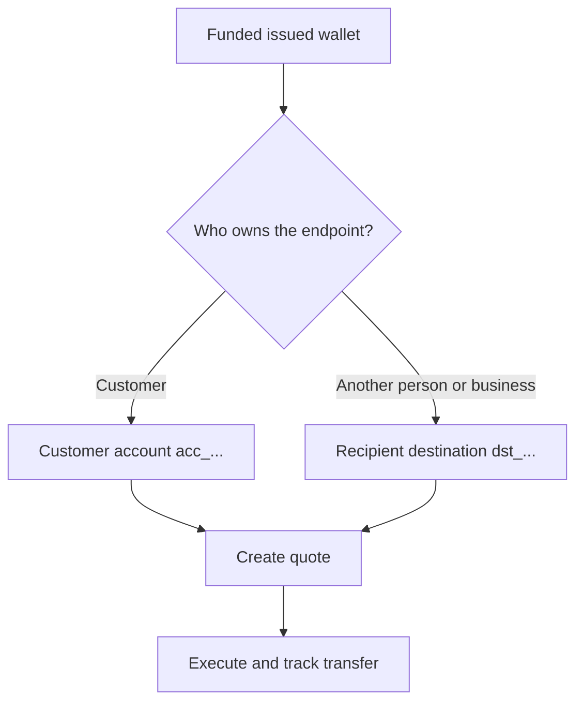

Chaque paiement commence à partir d'un portefeuille émis prêt et alimenté. Le modèle de destination dépend de qui détient l'endpoint.



## Avant de commencer

Récupérez à nouveau le portefeuille source. Confirmez que son statut actuel autorise le paiement et que son solde disponible couvre le montant source prévu. Stockez son ID dérivé de la réponse en tant que `SOURCE_WALLET_ID`.

Vous avez également besoin d'une capacité de paiement prête pour le client actuel et la destination sélectionnée.

## 1. Préparer la destination

<Tabs>
  <Tab title="Propre">

Utilisez un compte bancaire externe détenu par le client lorsque le client détient l'endpoint. Créez-le avec [`POST /v3/customers/{customerId}/accounts`](/api-reference/accounts/post-v3-customers-by-customer-id-accounts) et ces en-têtes :

```http
X-API-Key: ${SWIPELUX_API_KEY}
Idempotency-Key: payout-account-001
Content-Type: application/json
```

```json
{
  "origin": "external",
  "type": "bank",
  "methods": ["ach", "wire"],
  "country": "US",
  "currency": "USD",
  "details": {
    "routingNumber": "021000021",
    "accountNumber": "123456789",
    "accountType": "checking",
    "bankName": "Example Bank",
    "accountHolderName": "Acme Payments SAS"
  },
  "label": "Customer operating account"
}
```

Lisez-le avec [`GET /v3/customers/{customerId}/accounts/{accountId}`](/api-reference/accounts/get-v3-customers-by-customer-id-accounts-by-account-id). Continuez uniquement lorsque son statut actuel autorise le paiement. Stockez son ID `acc_` en tant que `PAYOUT_DESTINATION_ID`.

  </Tab>
  <Tab title="Tiers">

Créez la personne ou l'entreprise et son endpoint bancaire ou portefeuille via [Destinataires et destinations](/fr/integration/recipients). Continuez uniquement lorsque la destination est prête.

Stockez l'ID `dst_` renvoyé en tant que `PAYOUT_DESTINATION_ID`. N'utilisez pas l'ID `rcp_` du destinataire comme destination du devis.

  </Tab>
</Tabs>

## 2. Créer le devis de paiement

Utilisez [`POST /v3/quotes`](/api-reference/money-movement/post-v3-quotes) avec ces en-têtes :

```http
X-API-Key: ${SWIPELUX_API_KEY}
Idempotency-Key: payout-quote-001
Content-Type: application/json
```

```json
{
  "customerId": "${CUSTOMER_ID}",
  "capabilityId": "${CAPABILITY_ID}",
  "in": {
    "amount": "150.00",
    "currency": "USDC",
    "accountId": "${SOURCE_WALLET_ID}"
  },
  "destinationId": "${PAYOUT_DESTINATION_ID}",
  "out": {
    "currency": "USD"
  }
}
```

Stockez `data.id` en tant que `QUOTE_ID` et présentez le prix et les frais renvoyés.

## 3. Exécuter le paiement

Créez le transfert avec [`POST /v3/transfers`](/api-reference/money-movement/post-v3-transfers). Utilisez une nouvelle clé pour cette exécution prévue :

```http
X-API-Key: ${SWIPELUX_API_KEY}
Idempotency-Key: payout-transfer-001
Content-Type: application/json
```

```json
{
  "quoteId": "${QUOTE_ID}"
}
```

Stockez le `data.id` du transfert en tant que `TRANSFER_ID`. Une création réussie lance le paiement ; elle ne prouve pas la livraison.

## 4. Suivre la livraison

Lisez [`GET /v3/transfers/{transferId}`](/api-reference/money-movement/get-v3-transfers-by-transfer-id) après la création et après chaque événement. Utilisez les derniers `data.state`, `data.stateDetail` et `data.openTaskIds` pour décider s'il faut attendre, agir ou afficher un résultat terminal.

Ensuite, consultez [Devis et transferts](/fr/integration/quotes-and-transfers) pour des montants exacts, une récupération d'exécution sûre et les tâches de transfert.
