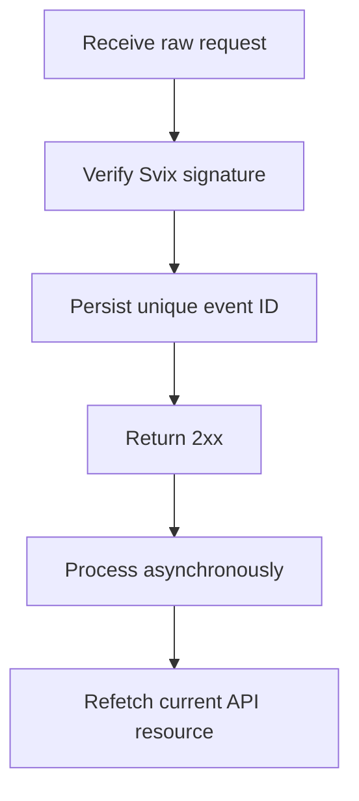

Utilisez les webhooks pour réagir aux changements asynchrones. La livraison est au moins une fois, donc les événements dupliqués, retardés et hors ordre sont normaux.



## N'enregistrez que les événements dont vous avez besoin

Créez un endpoint avec [`POST /v3/webhooks`](/api-reference/webhooks/post-v3-webhooks). Abonnez-vous uniquement aux événements documentés qui pilotent votre intégration. Cet exemple utilise [`transfer.state_changed`](/api-reference/webhooks/transfer-state-changed).

```bash
export API_BASE='https://platform.swipelux.com'
export SWIPELUX_API_KEY='replace-with-your-api-key'

curl --request POST \
  "${API_BASE}/v3/webhooks" \
  --header "X-API-Key: ${SWIPELUX_API_KEY}" \
  --header "Idempotency-Key: webhook-endpoint-001" \
  --header "Content-Type: application/json" \
  --data @- <<'JSON'
{
  "url": "https://example.com/webhooks/swipelux",
  "events": ["transfer.state_changed"]
}
JSON
```

Stockez le `data.id` de la réponse en tant que `WEBHOOK_ID`. Ouvrez le portail renvoyé par [`GET /v3/webhooks/portal`](/api-reference/webhooks/get-v3-webhooks-portal), récupérez le secret de signature de cet endpoint et stockez-le séparément de votre clé API dans un gestionnaire de secrets.

## Vérifier avant l'analyse

Swipelux livre les nouvelles intégrations de webhooks via Svix. Vérifiez le corps brut de la requête avec le secret de signature de votre endpoint et ces en-têtes :

- `svix-id`
- `svix-timestamp`
- `svix-signature`

N'analysez pas le JSON et ne provoquez aucun effet secondaire avant que la vérification ne réussisse.

```javascript
import { Webhook } from "svix";

const verifier = new Webhook(process.env.SWIPELUX_WEBHOOK_SECRET);

export async function handleSwipeluxWebhook(request) {
  const rawBody = await request.text();
  const event = verifier.verify(rawBody, {
    "svix-id": request.headers.get("svix-id"),
    "svix-timestamp": request.headers.get("svix-timestamp"),
    "svix-signature": request.headers.get("svix-signature"),
  });

  await webhookInbox.insertIfAbsent({
    id: event.id,
    payload: event,
    status: "pending",
  });

  return new Response(null, { status: 204 });
}
```

Rejetez les requêtes avec des signatures manquantes ou invalides. Gardez le corps brut disponible jusqu'à ce que la vérification soit terminée.

## Persister, acquitter, puis traiter

Placez une contrainte d'unicité sur l'`id` de l'enveloppe. Persistez l'enveloppe vérifiée, renvoyez `2xx` rapidement, puis traitez-la de manière asynchrone.

Si l'ID d'événement existe déjà, acquittez la livraison sans répéter les effets secondaires terminés. Reprenez le travail local en attente ou en échec via votre propre file d'attente de nouvelles tentatives. N'utilisez pas le champ `attempt` de l'enveloppe comme clé de déduplication ou compteur de nouvelles tentatives de transport.

## Récupérer l'état actuel

L'ordre des webhooks n'est pas un historique de ressources faisant autorité. Utilisez `resource.type` et `resource.id` pour localiser l'objet, puis récupérez son état actuel avant de mettre à jour votre système.

Pour un événement de transfert, appelez [`GET /v3/transfers/{transferId}`](/api-reference/money-movement/get-v3-transfers-by-transfer-id) :

```bash
curl --request GET \
  "${API_BASE}/v3/transfers/${TRANSFER_ID}" \
  --header "X-API-Key: ${SWIPELUX_API_KEY}"
```

Pilotez le statut visible par le client et les actions en aval à partir de la réponse API actuelle. Concevez les effets secondaires pour qu'ils restent sûrs si deux workers traitent des événements liés dans un ordre différent.

## Récupérer les livraisons

Utilisez [`GET /v3/webhooks/portal`](/api-reference/webhooks/get-v3-webhooks-portal) pour ouvrir les journaux de livraison, réessayer les livraisons ayant échoué ou démarrer une relecture manuelle.

Chaque relecture doit passer par la même vérification de signature et par la même boîte de réception durable. Pour récupérer après une panne, relisez la fenêtre affectée et récupérez chaque ressource référencée. Les IDs d'événements terminés restent sans effet ; les enregistrements incomplets reprennent de manière asynchrone.

Ensuite, vérifiez les livraisons dupliquées et hors ordre en sandbox, puis complétez la checklist [Mise en production](/fr/integration/go-live).
