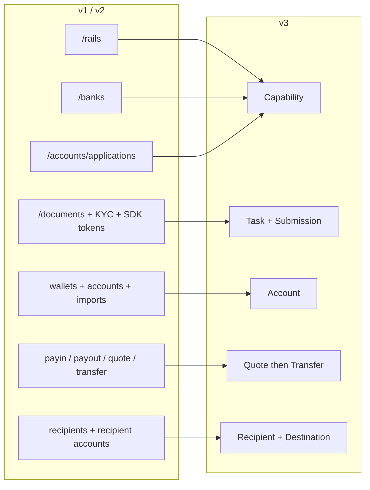
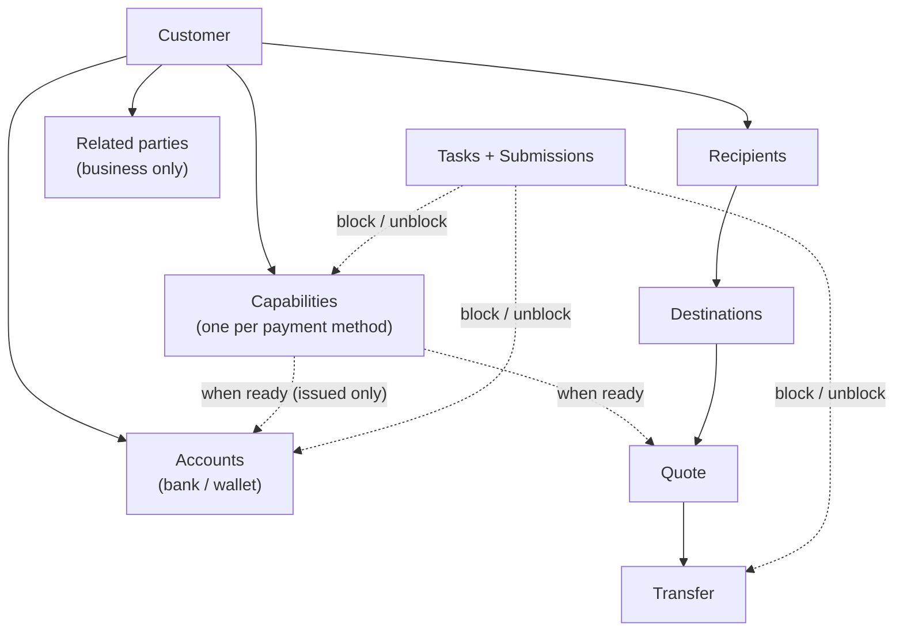
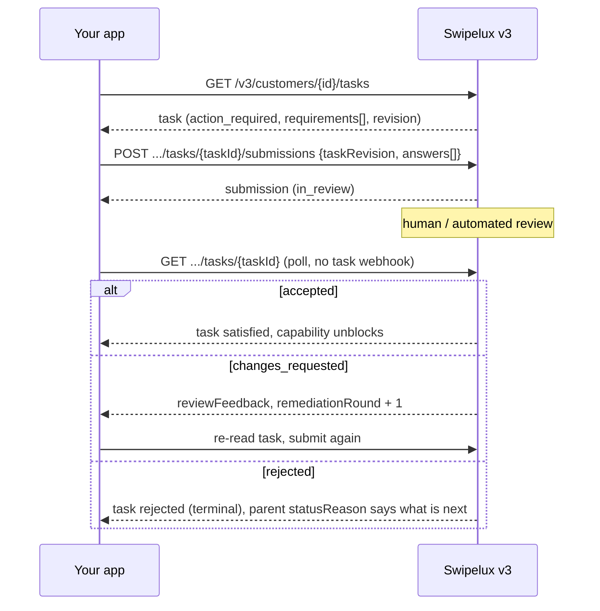
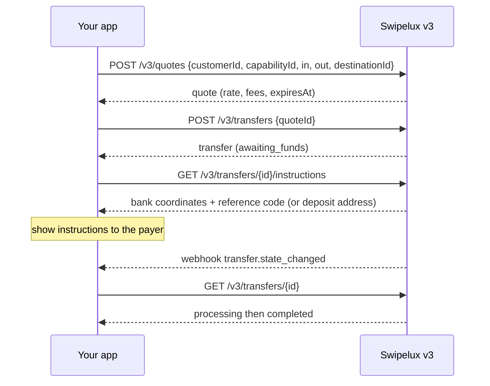
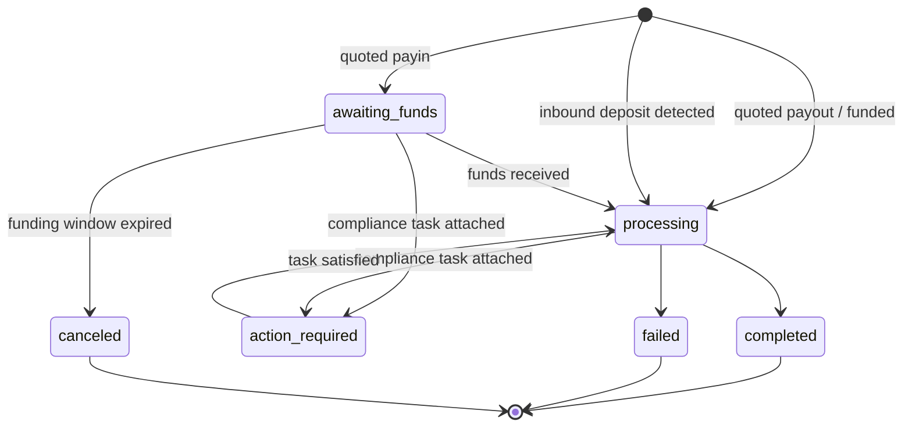
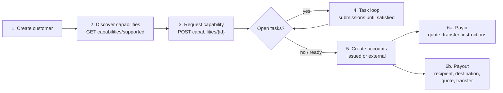

अपने इंटीग्रेशन को API v1 और v2 से v3 पर दो चरणों में माइग्रेट करें:

- **भाग 1, अवधारणा।** पहले इसे पढ़ें। v3 एक पुनर्रचना है, केवल नाम-परिवर्तन नहीं: यदि आप पुराने एंडपॉइंट्स को एक-के-एक मैप करेंगे, तो आप API से लड़ते रहेंगे। यहाँ बिताए दस मिनट बाद में कई दिन बचाएँगे।
- **भाग 2, API।** एंडपॉइंट-दर-एंडपॉइंट मैपिंग, अनुरोध उदाहरण, स्टेट मशीनें, और एक माइग्रेशन चेकलिस्ट।

यह मार्गदर्शिका उत्पादन OpenAPI विनिर्देश ([platform.swipelux.com/openapi.json](https://platform.swipelux.com/openapi.json)) पर आधारित है। v1 और v2 अभी भी चालू हैं और अभी तक अप्रचलित नहीं किए गए हैं; सभी नई capability, recipient, task और quoting सुविधाएँ केवल v3 पर आती हैं। सूर्यास्त सूचनाओं के लिए `api.deprecation` webhook इवेंट की सदस्यता लें।

<Info>
  **विषय-सूची।** भाग 1: 1.1 v3 क्यों अस्तित्व में है, 1.2 ऑब्जेक्ट मॉडल, 1.3 प्रति-capability तत्परता, 1.4 task लूप, 1.5 पैसे की गति, 1.6 स्टेट मशीनें, 1.7 सम्मेलन, 1.8 सुनहरा पथ। भाग 2: 2.1 customers, 2.2 capabilities, 2.3 tasks और submissions, 2.4 accounts, 2.5 recipients और destinations, 2.6 quotes और transfers, 2.7 webhooks, 2.8 sandbox, 2.9 विरासती एंडपॉइंट्स, 2.10 माइग्रेशन क्रम, 2.11 सावधानी चेकलिस्ट।
</Info>

---

## भाग 1, अवधारणा

### 1.1 v3 क्यों अस्तित्व में है

v1 और v2 में customer को भुगतान-तैयार करने के चार परस्पर-अतिव्यापी तरीके विकसित हुए: `/rails`, `/banks`, `/accounts/applications`, और business `rail-applications` सतह, प्रत्येक का अपना स्थिति-शब्दकोश। दस्तावेज़ संग्रह (`/documents`, KYC आयात, verification SDK टोकन) उस चीज़ से डिस्कनेक्टेड था जिसे यह वास्तव में अनब्लॉक करता था। v3 इस सबको छह संसाधनों में समेट देता है, यानी customer और उसके स्वामित्व वाली पाँच चीज़ें:



| संसाधन | एक-पंक्ति परिभाषा |
| --- | --- |
| **Customer** | व्यक्ति या व्यवसाय। इसमें **कोई सार्वजनिक status फ़ील्ड नहीं** है, तत्परता capabilities पर रहती है। |
| **Capability** | एक भुगतान विधि जिसका customer उपयोग कर सकता है (`sepa`, `ach`, `swift`, `stablecoin_transfers`, आदि), अपनी स्थिति के साथ। `/rails`, `/banks`, और account-application प्रवेश-बिंदुओं का स्थान लेता है। |
| **Task** | Swipelux को आवश्यक कार्य की एक इकाई (डेटा, दस्तावेज़, verification), जिसका उत्तर **Submission** से दिया जाता है। दस्तावेज़ और KYC सतह का स्थान लेता है। |
| **Account** | customer के स्वामित्व वाला एक funding endpoint: `bank` या `wallet`, Swipelux द्वारा `issued` या `external`। |
| **Recipient / Destination** | payout लाभार्थी (कौन) और उनका बैंक या wallet एंडपॉइंट (कहाँ)। |
| **Quote / Transfer** | सभी पैसे की गति। एक transfer एक सहेजे गए quote को निष्पादित करता है; बिना-quote वाले transfers अब नहीं हैं। |

### 1.2 ऑब्जेक्ट मॉडल



आत्मसात करने के लिए दो संरचनात्मक नियम:

1. **Capabilities सब कुछ नियंत्रित करती हैं।** Accounts का प्रावधान `ready` capability के अंतर्गत होता है; quotes का मूल्य capability के विरुद्ध निर्धारित होता है। ऑनबोर्डिंग का अर्थ है आवश्यक capabilities को `ready` तक लाना।
2. **Tasks कहीं भी संलग्न हो सकते हैं।** एक capability, एक account, या एक चालू transfer `openTaskIds` वहन कर सकते हैं। जहाँ भी आप उन्हें देखें, लूप वही है: task पढ़ें, उत्तर सबमिट करें, समीक्षा की प्रतीक्षा करें, मूल संसाधन को पुनः पढ़ें।

### 1.3 तत्परता प्रति-capability है, प्रति-customer नहीं

v1 ने `/rails` तत्परता को customer-व्यापी KYC द्वार से उलझा रखा था। v3 में कोई customer स्थिति नहीं है: एक customer `stablecoin_transfers` पर पूरी तरह उपयोग-योग्य हो सकता है जबकि उनकी `sepa` capability में अभी भी खुले tasks हों। Pooled-account capabilities आम तौर पर named वाली से तेज़ी से `ready` तक पहुँचती हैं, इसलिए जो `ready` है उसी पर लेन-देन शुरू करें बजाय इसके कि सबके तैयार होने की प्रतीक्षा करें।

यदि आपका v1 या v2 कोड customer verification स्थिति के आधार पर UI badges चलाता है, तो उसे फिर से लिखें:

- "क्या वे X पर लेन-देन कर सकते हैं?" बन जाता है capability X `status == "ready"`।
- "क्या उन्हें कुछ करने की आवश्यकता है?" बन जाता है कोई भी task जिसकी स्थिति `action_required` हो (capability आम तौर पर `restricted` दिखेगा, `statusReason.resolution: "complete_tasks"` के साथ)।
- "क्या हम Swipelux की प्रतीक्षा कर रहे हैं?" बन जाता है tasks `in_review`, capability `pending`।

### 1.4 Task लूप

पुरानी दस्तावेज़ और KYC सतह जो कुछ भी करती थी, वह अब यही एक लूप है:



मुख्य विशेषताएँ:

- एक task में `requirements[]` होते हैं, यानी अलग-अलग माँगें। प्रत्येक में एक task-भीतर `requirementId`, माँग को नामित करने वाली एक स्थिर `key` (उदाहरण के लिए पते का प्रमाण, अपने UI में इसी के अनुसार duplicate हटाएँ), और एक टाइप्ड `request` होता है जो ठीक-ठाक बताता है कि कौन-सा इनपुट अपेक्षित है (text, date, select, document, attestation, आदि)।
- सबमिट करना **समीक्षा-नियंत्रित** है: यह कभी भी सीधे capability या account स्थिति नहीं बदलता, स्वीकृति बदलती है। एक अपवाद: `profile` उत्तर सबमिट पर customer profile में सीधे लिखे जाते हैं (2.3)। सबमिट करने के बाद, task या मूल संसाधन को पोल करें।
- `taskRevision` (task के `revision` की प्रतिध्वनि) एक समवर्ती-रक्षक है: यदि आपके पढ़ने के बाद task बदल गया, तो पुनः पढ़ें और अपने उत्तर फिर से तैयार करें।
- `absence` एक प्रथम-श्रेणी उत्तर है ("मेरे पास यह इसलिए नहीं है क्योंकि...")। इसे उपयोग करें, requirements को अधूरा छोड़ने के बजाय।

### 1.5 पैसे की गति

payins, payouts, और stablecoin स्थानांतरण के लिए एक ही प्रवाह। **कोई direction इनपुट नहीं** है, आप कभी payin बनाम payout घोषित नहीं करते। इन और आउट मुद्रा का आकार quote और transfer पर एक केवल-पढ़ा `direction` निर्धारित करता है: `fiat_to_stablecoin` (payin), `stablecoin_to_fiat` (payout), या `stablecoin_move`।



### 1.6 प्रति संसाधन एक स्टेट मशीन

प्रत्येक status-धारी संसाधन का अपना enum होता है, और प्रत्येक गैर-सुखद स्थिति एक संरचित कारण वहन करती है। Accounts, applications, और transfers एक आकार साझा करते हैं `{ code, message, actor, retryable }`: accounts और applications इसे `statusReason` के रूप में उजागर करते हैं, transfers इसे `stateDetail` के रूप में। `actor` बताता है कि किसे कार्रवाई करनी है (`customer`, `developer`, `provider`, `network`, `swipelux`), `retryable` बताता है कि क्या पुनः प्रयास मदद कर सकता है। Capabilities `{ code, resolution, message }` का उपयोग करती हैं, जहाँ `resolution` (`complete_tasks`, `wait`, `contact_support`, `none`) बताता है कि capability को क्या आगे बढ़ाता है। `code` मान एक खुली, केवल-जोड़ी जाने वाली सूची हैं: `resolution` (या `actor` प्लस `retryable`) पर शाखा बनाएँ, और उन कोड्स को सहन करें जिन्हें आपने कभी नहीं देखा।

| संसाधन | स्थितियाँ |
| --- | --- |
| Capability | `pending`, `restricted`, `ready`, `rejected`, `canceled` |
| Application (एक capability के अंतर्गत प्रति-अनुरोध प्रयास, 2.2) | `requested`, `in_review`, `action_required`, `ready`, `rejected`, `disabled`, `canceled` |
| Task | `action_required`, `in_review`, `satisfied`, `rejected`, `canceled` |
| Submission | `in_review`, `accepted`, `changes_requested`, `rejected` |
| Account | `provisioning`, `in_review`, `ready`, `action_required`, `suspended`, `rejected`, `archived` |
| Quote | `active`, `executed`, `expired`, `failed` |
| Transfer | `awaiting_funds`, `processing`, `action_required`, `completed`, `failed`, `canceled` |
| Recipient | `active`, `rejected`, `archived` |
| Destination | `in_review`, `ready`, `action_required`, `archived` |

जिन स्थितियों से यह मार्गदर्शिका नहीं गुज़रती (`rejected`, `suspended`, `disabled`, `failed`, `canceled`) वे टर्मिनल या सहायता-प्रेरित हैं; प्रति-संसाधन परिभाषाएँ विनिर्देश में हैं।

Transfer, विस्तार से:



### 1.7 सम्मेलन

| क्षेत्र | v1 / v2 | v3 |
| --- | --- | --- |
| प्रमाणीकरण | `X-API-Key` हेडर | वही। पर्यावरण (production बनाम sandbox) कुंजी द्वारा चुना जाता है; एक base URL। |
| Idempotency | लागू नहीं | `Idempotency-Key` हेडर **हर प्रभावकारी अनुरोध पर आवश्यक** (POST, PATCH, PUT, DELETE), sandbox एंडपॉइंट्स को छोड़कर। समान कुंजी प्लस समान body मूल प्रतिक्रिया को दोहराता है। |
| पैसा | मिश्रित संख्याएँ और स्ट्रिंग्स | केवल स्ट्रिंग्स (`"amount": "150.00"`)। कभी floats नहीं। |
| Pagination | offset/limit variants | Cursor: सूचियाँ `{ data, nextCursor, hasMore }` लौटाती हैं। |
| Updates | PUT-भारी | `PATCH` आंशिक अद्यतन। |
| Webhooks | एकल एंडपॉइंट कॉन्फ़िगरेशन | अनेक एंडपॉइंट, प्रति-इवेंट सदस्यता। इवेंट्स **संकेत** हैं, read ही सत्य है (2.7)। |

कोड लिखने से पहले आत्मसात करने योग्य idempotency नियम:

- **अलग** body के साथ किसी कुंजी को पुनः उपयोग करना `409 idempotency_conflict` है, जब तक कुंजी बनी रहती है (कम से कम 7 दिन), इसलिए कभी भी कुंजी को पुनः उपयोग की योजना न बनाएँ। प्रत्येक तार्किक ऑपरेशन के लिए एक ताज़ा UUID उत्पन्न करें और उसे अपने job के साथ बनाए रखें।
- Replay त्रुटियों को भी शामिल करता है: यदि मूल अनुरोध किसी टर्मिनल 4xx में समाप्त हुआ, तो वही कुंजी प्लस body फिर से वही problem प्रतिक्रिया लौटाएगी।
- समान कुंजी वाले दो समवर्ती अनुरोध: एक जीतता है, दूसरे को `409` मिलता है। हारने वाले को विजेता के निपटान के बाद पुनः प्रयास करें; replay मूल प्रतिक्रिया लौटाएगा।

### 1.8 सुनहरा पथ



---

## भाग 2, API

### 2.1 Customers

| v1 / v2 | v3 |
| --- | --- |
| `POST /v1/customers`, `POST /v1/customers/business`, `POST /v2/customers` | `POST /v3/customers` (एक एंडपॉइंट, `type: individual \| business`) |
| `GET/PUT/DELETE /v1/customers/{id}`, `/v1/customers/business/{id}`, `/v2/customers/{customerId}` | `GET/PATCH/DELETE /v3/customers/{customerId}` |
| `GET /v1/customers` (सूची) | `GET /v3/customers` (cursor-paged, capability सारांश एम्बेड करता है) |
| `GET /v1/customers/balances` (batch), `GET /v1/customers/{id}/balances` | कोई balance एंडपॉइंट नहीं, balances accounts पर रहते हैं: `GET /v3/customers/{customerId}/accounts` पर `balances` पढ़ें |
| `POST/GET .../shareholders` (v1 business) | `POST/GET /v3/customers/{customerId}/related-parties` (साथ ही `GET/PATCH/DELETE .../related-parties/{relatedPartyId}`) |
| `POST /v1/customers/business/{id}/kyb` (submit), `GET .../kyb` (status) | कोई KYB submit कॉल नहीं, एक capability का अनुरोध करें (2.2) और उसके tasks का उत्तर दें (2.3); निर्णय capability और task स्थिति के रूप में सामने आता है |
| `POST /v1/customers/{id}/kyc`, `.../kyc/import`, SDK token एंडपॉइंट्स | Task सिस्टम (2.3); होस्टेड verification tasks के भीतर `verificationSessions` के रूप में प्रकट होती है |

निर्माण, `type` पर भिन्न (दृष्टांतीय मान, फ़ील्ड नाम विनिर्देश के अनुसार):

```jsonc
// POST /v3/customers        Idempotency-Key: <fresh uuid>
{
  "type": "individual",
  "externalId": "user-1042",
  "individual": {
    "firstName": "Maria",
    "lastName": "Silva",
    "birthDate": "1990-04-12",
    "nationalities": ["BR"],
    "residenceCountry": "BR",
    "email": "maria@example.com",
    "residentialAddress": {
      "streetLine1": "Av. Paulista 1000",
      "city": "Sao Paulo",
      "postalCode": "01310-100",
      "country": "BR"
    }
  },
  "financialProfile": {
    "accountPurposes": ["cross_border_remittance"],
    "sourcesOfFunds": ["salary"]
  }
}
```

- **निर्माण प्रगतिशील है**: केवल `{ "type": "individual" }` एक वैध निर्माण है। छूटे हुए तथ्य कभी customer को अमान्य नहीं करते, वे बाद में उन capabilities पर intake tasks के रूप में सामने आते हैं जिन्हें उनकी ज़रूरत है।
- Businesses `business` प्लस पंजीकरण डेटा वहन करते हैं। v1 का shareholder CRUD **related parties** पर मैप होता है, जिसे directors, officers, और owners को कवर करने के लिए विस्तृत किया गया है: customer निर्माण पर उन्हें इनलाइन बनाएँ (प्रत्येक को एक स्थिर `rp_` id मिलती है) या समर्पित related-parties एंडपॉइंट्स के माध्यम से प्रबंधित करें।
- **कोई customer `status` फ़ील्ड नहीं**, 1.3 देखें।
- **मौजूदा customers चलते हैं**: v1 या v2 पर बनाए गए customers v3 एंडपॉइंट्स पर उसी id से पहुँच योग्य हैं। v3 read एक _साफ़ किया गया दृश्य_ है, वे विरासती मान जो v3 सत्यापन में विफल होते हैं अनुपस्थित लौटते हैं। **आपके पहले v3 write के बाद वह दृश्य स्थायी हो जाता है**: अनुपस्थित मान अपने आप वापस नहीं आते। इसलिए जल्दी संवर्धित करें, एक बार का पास बजट करें जो v3 reads पर निर्भर होने से पहले आपके अपने रिकॉर्ड से पूरा profile `PATCH` करता है। v1 `metadata` एक अलग namespace है और **नहीं** ले जाया जाता, इसे v3 पर पुनः-सेट करें।
- `externalId` प्रथम-श्रेणी है और v3 पर, प्रति पर्यावरण, **आपके customers में अद्वितीय** (`409 duplicate_external_id`)। किसी customer को archive करना उसकी `externalId` जारी नहीं करता, यदि आप उसे पुनः उपयोग करना चाहते हैं तो DELETE से पहले PATCH द्वारा उसे साफ़ करें।
- `DELETE` एक **archive cascade** है (कोई restore नहीं; ids कभी पुनः उपयोग नहीं होतीं)। यह `409 customer_has_active_resources` प्लस `blockingResources[]` के साथ अवरुद्ध होता है जब कोई गैर-archived account या चालू transfer मौजूद हो।
- PATCH विलय नियम: स्पष्ट `null` एक nullable फ़ील्ड को साफ़ करता है, arrays पूरी तरह प्रतिस्थापित होते हैं (inline related parties को छोड़कर, जो id द्वारा upsert होती हैं), `metadata` कुंजियाँ मर्ज होती हैं। पूर्ण schema और सूची फ़िल्टर OpenAPI विनिर्देश में हैं।

### 2.2 `/rails`, `/banks`, applications Capabilities बनते हैं

| v1 / v2 | v3 |
| --- | --- |
| `GET /v1/.../rails/capabilities` | `GET /v3/customers/{customerId}/capabilities/supported` |
| `GET /v2/.../banks` (साथ ही `/banks/{bank}`), `GET /v2/meta/banks` | `GET /v3/customers/{customerId}/capabilities/supported` |
| `GET /v1/customers/{customerId}/rails` (सूची) | `GET /v3/customers/{customerId}/capabilities` |
| `GET /v2/customers/{customerId}/rails` (अवलोकन) | `GET /v3/customers/{customerId}/capabilities` |
| `POST /v1/.../rails`, `POST /v2/.../banks` | `POST /v3/customers/{customerId}/capabilities/{capabilityId}` |
| `POST /v2/.../accounts/applications` | `POST /v3/customers/{customerId}/capabilities/{capabilityId}` |
| `GET /v1/.../rails/{rail}` | `GET /v3/.../capabilities/{capabilityId}` |
| `GET /v2/.../accounts/applications` (साथ ही `/{applicationId}`, `/{applicationId}/history`) | `GET /v3/.../capabilities/{capabilityId}` (साथ ही `/applications`, `/applications/{id}/history`) |
| Business-rail सतह: `GET/POST /v2/customers/business/{customerId}/rail-applications` (साथ ही `/{rail}`) | वही v3 capability एंडपॉइंट्स, कोई अलग business सतह नहीं |
| Business-rail सतह: `GET .../business/{customerId}/rails` (साथ ही `/{rail}`) | वही v3 capability एंडपॉइंट्स, कोई अलग business सतह नहीं |
| `GET /v1/meta/rails` (स्थिर कैटलॉग) | `GET /v3/customers/{customerId}/capabilities/supported`, उपलब्धता प्रति customer है; कोई स्थिर कैटलॉग नहीं |
| `GET /v1/meta/accounts/banks` | `GET /v3/institutions` (बैंक निर्देशिका: id, name, BIC, countries) |
| उपलब्ध नहीं | `GET /v3/capabilities`, customers में प्रदान की गई capabilities की merchant-व्यापी सूची (`status`, `method`, `customerId` द्वारा फ़िल्टर) |
| उपलब्ध नहीं | `GET /v3/.../capabilities/{capabilityId}/tasks-preview` (अनुरोध करने से पहले माँगें देखें) |
| उपलब्ध नहीं | `POST /v3/.../capabilities/{capabilityId}/cancel` |

- एक capability बराबर है `method` (`ach`, `wire`, `rtp`, `pix`, `sepa`, `swift`, `spei`, `pse`, `transfers_3_0`, `faster_payments`, `sepa_instant`, `uaefts`, `card`, `stablecoin_transfers`, आदि) प्लस `accountType` (`pooled` या `named`, गैर-बैंक विधियों के लिए `null`) प्लस `directions` (`payin` या `payout`)। सार्वजनिक `capabilityId` योग्य युग्म है (`sepa_pooled`, `ach_named`) या `card` और `stablecoin_transfers` के लिए केवल method।
- प्रत्येक capability अनुरोध एक **application** जन्मित करता है, यानी `.../capabilities/{capabilityId}/applications` के तहत प्रति-प्रयास रिकॉर्ड (साथ ही `/{applicationId}/history`), अपनी स्थितियों (1.6) और `statusReason` के साथ। यह एक अनुरोध का ऑडिट-ट्रेल है; रोज़मर्रा में, capability को ही पोल करें।
- `capabilities/supported` उपलब्धता (`available`, `beta`, या `disabled`), पात्रता, और प्रस्तावित संस्थान लौटाता है। बैंक चयन अनुरोध के समय वैकल्पिक `institutions` array के माध्यम से होता है, कोई अलग `/banks` संसाधन नहीं। इसे छोड़ना (या `[]` भेजना) प्रत्येक डिफ़ॉल्ट संस्थान का चयन करता है; `isDefault: true` एक customer-और-capability-विशिष्ट ध्वज है, वैश्विक नहीं। एक गैर-रिक्त सूची डिफ़ॉल्ट को ओवरराइड करती है, और बिना किसी लागू डिफ़ॉल्ट के एक बैंक-समर्थित capability `422 capability_institutions_required` लौटाती है। संस्थान ids अपारदर्शी हैं, नई को सहन करें।
- `stablecoin_transfers` **customer निर्माण पर स्वतः-प्रदान** किया जाता है और `ready` जन्मता है (इसलिए इसका कभी अनुरोध नहीं किया जाता और यह रद्द नहीं होता)। `card` केवल-individual है।
- capability पर `openTaskIds` आपका "अब क्या करूँ" संकेतक है। खुला बराबर `action_required` **या** `in_review` है, और रोलअप में सक्रिय निर्भरताओं के माध्यम से पहुँचे साझा customer-स्तर के tasks शामिल हैं।
- `cancel` केवल `pending` या `restricted` से काम करता है **और** बिना किसी अवरोधक संसाधन के, अन्यथा `409 capability_not_cancelable`, जिसका problem body `blockingResources` सूचीबद्ध करता है। रद्द करने के बाद पुनः-अनुरोध एक ताज़ा निर्माण है नई idempotency कुंजी के साथ।
- **GET को पोल करें।** capability स्थिति तब ताज़ा होती है जब आप उसे पढ़ते हैं; `GET .../capabilities/{capabilityId}` को पोल करें या `capability.status_changed` की सदस्यता लें, कैश न करें।
- एक method का अनुरोध संबंधित methods को एक साथ उपलब्ध कर सकता है, capabilities को उस सेट के रूप में मानें जिसे आप पुनः पढ़ते हैं, न कि एक पंक्ति जिसे आप ट्रैक करते हैं।
- अनुरोध करने से **पहले** ऑनबोर्डिंग माँगें दिखाने के लिए `tasks-preview` का उपयोग करें।
- Verification एक-बार नहीं है: पहले से `ready` capability पर नए tasks दिखाई दे सकते हैं (आवधिक या इवेंट-प्रेरित पुनः-verification)। पूरे customer जीवनकाल के लिए task लूप को जोड़े रखें, केवल ऑनबोर्डिंग के लिए नहीं।

### 2.3 Documents और KYC, Tasks और Submissions बनते हैं

<Note>
  **नामकरण नोट।** ये एंडपॉइंट्स संक्षेप में `requirements` और `fulfillments` के रूप में शिप किए गए थे। 2026-08-02 से सार्वजनिक नाम **tasks** और **submissions** हैं। नाम परिवर्तन ने केवल संसाधनों और एंडपॉइंट पथों को कवर किया, task के भीतर `requirements[]` array और उसकी `requirementId` अपने नाम रखती हैं।
</Note>

प्रत्येक विरासती document सतह उसी प्रतिस्थापन पर मैप होती है: `GET /v3/customers/{customerId}/tasks` पढ़ें, `POST .../tasks/{taskId}/submissions` से उत्तर दें।

| v1 / v2 | v3 |
| --- | --- |
| `POST/GET/DELETE /v1/documents` | `GET /v3/.../tasks` प्लस `POST .../tasks/{taskId}/submissions` |
| `POST /v1/customers/{id}/documents` | `GET /v3/.../tasks` प्लस `POST .../tasks/{taskId}/submissions` |
| `GET/POST /v1/customers/business/{id}/documents` (साथ ही `PUT/DELETE .../{docId}`) | `GET /v3/.../tasks` प्लस `POST .../tasks/{taskId}/submissions` |
| `GET/POST .../shareholders/{shareholderId}/documents` (साथ ही `GET/PUT/DELETE .../{docId}`) | `GET /v3/.../tasks` प्लस `POST .../tasks/{taskId}/submissions` |
| `GET/POST/DELETE /v2/.../documents` (साथ ही `/{documentId}`) | `GET /v3/.../tasks` प्लस `POST .../tasks/{taskId}/submissions` |
| `POST /v2/.../documents/upload-token` प्लस `POST /v2/documents/direct-upload` | हट गया, अपनी API key के साथ सीधे अपलोड करें (नीचे) |
| `POST /v1/customers/documents/upload`, `POST /v1/document` (विरासती intake) | हट गया, अपनी API key के साथ सीधे अपलोड करें (नीचे) |
| `POST /v1/customers/{id}/kyc` प्लस SDK tokens | Task `verificationSessions` (होस्टेड verification); कोई सीधा "KYC शुरू करें" कॉल नहीं |

उस लूप के आसपास:

- **कच्चा फ़ाइल भंडारण**: `POST/GET/DELETE /v3/customers/{customerId}/documents` (साथ ही `/{documentId}`), अपनी API key के साथ एक बार अपलोड करें, फिर submission उत्तरों में document ids का संदर्भ दें। यह हर upload-token और direct-upload intake को प्रतिस्थापित करता है।
- **बिल्कुल नए reads**: `GET /v3/tasks` (merchant-व्यापी inbox), `GET /v3/transfers/{transferId}/tasks`, `GET .../tasks/{taskId}/history`, `GET .../tasks/{taskId}/submissions` (साथ ही `/{submissionId}`)।

Submission (दृष्टांतीय):

```jsonc
// POST /v3/customers/{cus}/tasks/{task}/submissions   Idempotency-Key: <fresh uuid>
{
  "taskRevision": 3,
  "answers": [
    { "requirementId": "req_a1", "answer": { "type": "document", "documentIds": ["doc_passport1"] } },
    { "requirementId": "req_b2", "answer": { "type": "text", "value": "Import/export business" } },
    { "requirementId": "req_c3", "answer": { "type": "absence", "reason": "not_applicable" } }
  ]
}
```

- उत्तर प्रकार: `profile`, `text`, `date`, `single_select`, `multi_select`, `boolean`, `attestation`, `document`, `resource_reference`, `absence`। प्रत्येक requirement का `request` ऑब्जेक्ट आपको बताता है कि वह किस प्रकार की अपेक्षा करता है।
- एक submission को **वर्तमान दौर के प्रत्येक कार्रवाई-योग्य requirement** का उत्तर देना चाहिए, उसी सटीक `taskRevision` के साथ जिसे आपने पढ़ा। आंशिक submissions अस्वीकृत होते हैं।
- `profile` उत्तर **सीधे लिखते हैं**: वे सामान्य सत्यापन पथ के माध्यम से customer profile को अपडेट करते हैं और उसी intake कार्य को संदर्भित करने वाली प्रत्येक capability का तुरंत पुनः-मूल्यांकन करते हैं। सहोदर intake tasks जिनके सारे requirements संतुष्ट हैं, स्वतः बंद हो जाते हैं।
- Requirements वैकल्पिक समूह बना सकते हैं (`alternativeKey`): समूह में से ठीक एक सबमिट करें।
- `changes_requested` `remediationRound` को बढ़ाता है और `reviewFeedback` वहन करता है। task पुनः पढ़ें, **एक ताज़ा idempotency कुंजी** के साथ फिर से सबमिट करें।
- होस्टेड verification URLs **केवल** customer-scoped task विवरण (`GET /v3/customers/{customerId}/tasks/{taskId}`) पर और केवल तब जब session कार्रवाई-योग्य हो प्रकट होते हैं; सूचियाँ और `GET /v3/tasks/{taskId}` जानबूझकर URL-मुक्त हैं।
- सेवा की शर्तें भी एक task है: `openTaskIds` में `category: "terms_of_service"` का एक task शामिल हो सकता है जिसका होस्टेड स्वीकृति पृष्ठ उसी तरह लिंक किया जाता है (केवल customer-scoped विवरण)। सामान्य submissions शर्तें स्वीकार नहीं कर सकते, और KYC अनुमोदन कभी शर्तें स्वीकार नहीं करता।
- Tasks प्रति capability scoped हैं, इसलिए "समान" माँग (उदाहरण के लिए पते का प्रमाण) प्रति capability एक बार दिखाई दे सकती है। अपने UI में requirement `key` द्वारा duplicate हटाएँ।
- **कोई अनुवाद परत नहीं**: `/v1/documents` पर पोस्ट करना v3 capabilities को अनब्लॉक नहीं करेगा। एक बार customer v3 पर आ जाए, सभी माँगें tasks के माध्यम से चलाएँ।

### 2.4 Accounts और wallets

| v1 / v2 | v3 |
| --- | --- |
| `POST/GET /v1/.../accounts` (साथ ही `/import`), `/v2/.../accounts` (साथ ही `/import`) | `POST/GET /v3/customers/{customerId}/accounts` |
| `POST/GET /v1/.../wallets` (साथ ही `/import`) | वही एंडपॉइंट, `type: wallet` |
| `GET/DELETE /v1/customers/{customerId}/accounts/{accountId}` (और wallets variant), `GET /v2/.../accounts/{accountId}` | `GET/PATCH/DELETE /v3/.../accounts/{accountId}` |
| `PATCH /v2/.../accounts/{accountId}/fees` | `GET/PUT /v3/.../accounts/{accountId}/fees` |

निर्माण, `origin` प्लस `type` पर भिन्न। Issued bank accounts एकल `method` लेते हैं; external bank accounts इसके बजाय एक `methods` array लेते हैं (वहाँ `method` भेजना अस्वीकृत होता है):

```jsonc
// issued bank account (capability must be ready)
{ "origin": "issued", "type": "bank", "method": "sepa",
  "currency": "EUR", "settlement": { "accountId": "acc_wallet1" } }

// external wallet the customer already owns (replaces /import)
{ "origin": "external", "type": "wallet", "currency": "USDC",
  "network": "polygon", "details": { "address": "0x71C7656EC7ab88b098defB751B7401B5f6d8976F" } }
```

- issued bank accounts पर `country` वैकल्पिक है (प्रति method डिफ़ॉल्ट); external **bank** accounts पर इसे स्पष्ट रूप से प्रदान करें। Wallet accounts पर कोई देश बिल्कुल नहीं होता।
- issued bank accounts पर `settlement.accountId` आवश्यक है: यह उस issued wallet account को नामित करता है जो bank account में जमा से निपटाए गए fund प्राप्त करता है।
- Issued accounts `details` (IBAN या routing प्लस account या address), संस्करणित `routing` (जमा coordinates घुमा सकते हैं, हमेशा नवीनतम read प्रस्तुत करें), `fees`, `balances` उजागर करते हैं।
- नेटवर्क: `polygon`, `ethereum`, `base`, `arbitrum`, `optimism`, `bsc`, `avalanche`।
- capability द्वार केवल **issued** accounts पर लागू होता है: गैर-ready capability के विरुद्ध एक बनाना capability-कोड त्रुटि के साथ विफल होगा, पहले capability का अनुरोध करें (2.2)। External accounts को न capability चाहिए (न customer अनुमोदन); उन्हें केवल request-schema और bank-detail सत्यापन मिलता है।
- Issued bank accounts `provisioning` जन्मते हैं `details: null` के साथ। account को पोल करें या `account.status_changed` देखें जब तक `ready` न हो।
- `DELETE` archive करता है, कभी हार्ड-डिलीट नहीं। चालू transfers द्वारा संदर्भित accounts `409 account_has_active_transfers` लौटाते हैं। उन transfers के टर्मिनल स्थिति तक पहुँचने के बाद पुनः प्रयास करें।
- v3 में बिल्कुल-नया: **Rules**, एक issued wallet account पर स्थायी निर्देश (`POST/GET /v3/customers/{customerId}/rules`, `GET/PATCH/DELETE .../rules/{ruleId}`) जो आने वाले fund को स्वचालित रूप से किसी अन्य account या wallet destination में स्वीप करते हैं। कोई v1 या v2 समकक्ष नहीं।

### 2.5 Recipients और destinations

| v1 | v3 |
| --- | --- |
| `POST/GET /v1/.../recipients` | `POST/GET /v3/customers/{customerId}/recipients` |
| उपलब्ध नहीं (v1 recipients केवल-निर्माण और सूची थे) | `GET/PATCH/DELETE /v3/.../recipients/{recipientId}`, बिल्कुल-नए विवरण, update, archive |
| `POST/GET .../recipients/{recipientId}/accounts` | `POST/GET /v3/.../recipients/{recipientId}/destinations` |
| `GET/DELETE .../recipients/{recipientId}/accounts/{recipientAccountId}` | `GET/DELETE /v3/.../recipients/{recipientId}/destinations/{destinationId}` (कोई destination PATCH नहीं, archive करके पुनः बनाएँ) |

v2 में कोई recipient अवधारणा नहीं थी। यदि आप v2 पर हैं और तीसरे पक्षों को payout करते हैं, यह नई सतह है, नाम-परिवर्तन नहीं।

- **Recipient** बराबर कौन: `individual` (पहला और अंतिम नाम) या `business` (कंपनी नाम), आवश्यक `relationship` के साथ (`employee`, `contractor`, `vendor`, `subsidiary`, `merchant`, `customer`, `landlord`, `family`, `other`)। Recipients और destinations केवल तीसरे पक्षों के लिए हैं। एक first-party payout में recipient का बिल्कुल उपयोग नहीं होता: customer के अपने `acc_` accounts में से किसी एक को quote `destinationId` के रूप में लक्षित करें (2.6)।
- **Destination** बराबर कहाँ: प्रति method टाइप्ड, `sepa` (iban, bic वैकल्पिक), `ach` या `wire` (routing प्लस account), `swift` (पूर्ण coordinates प्लस वैकल्पिक intermediary), `spei` (clabe), `pse`, `transfers_3_0` (cbu), आदि, प्लस wallet destinations। प्रत्येक destination की अपनी स्थिति होती है। `destination.status_changed` देखें।
- Fiat destinations को निर्माण से **पहले** recipient का पूरा `address` (street, city, postal code, country) चाहिए। छूटे हुए भाग `422 recipient_address_required` के साथ विफल होते हैं। Wallet destinations address छोड़ते हैं लेकिन top-level `ownership` (`self_custodied`, या custodian नाम के साथ `custodial`) की आवश्यकता होती है।
- लाभार्थी-नाम सटीकता महत्वपूर्ण है: प्राप्तकर्ता बैंक account के **कानूनी** नाम से मिलान करते हैं। सटीक कानूनी पहला और अंतिम नाम या कंपनी नाम भेजें, प्रदर्शन उपनाम नहीं।
- प्रति-method destination फ़ील्ड schemas OpenAPI विनिर्देश में हैं।

### 2.6 Quotes और transfers

| v1 / v2 | v3 |
| --- | --- |
| `POST /v1/payin/quote`, `/v1/payout/quote`, `/v2/quote` | `POST /v3/quotes` |
| `POST /v1/payin`, `/v1/payout`, `POST /v1/transfers`, `/v2/transfer` | `POST /v3/transfers` (एक quote निष्पादित करता है, unquoted निर्माण हट गए) |
| `GET /v1/transfers` (सूची), `GET /v1/transfers/{id}` | `GET /v3/transfers`, `/v3/transfers/{transferId}` |
| उपलब्ध नहीं (v1 और v2 quotes में कोई read नहीं था) | `GET /v3/quotes/{quoteId}` |
| `GET /v1/rate/{base}/{quote}` | `GET /v3/rates` |
| (payin प्रतिक्रिया में निहित) | `GET /v3/transfers/{transferId}/instructions` |
| उपलब्ध नहीं | `POST /v3/transfers/{transferId}/cancel`, `GET /v3/transfers/{transferId}/tasks` |

```jsonc
// 1. Quote: amount on exactly one side picks mode (exact_in / exact_out).
// POST /v3/quotes            Idempotency-Key: <fresh uuid>
{
  "customerId": "cus_123",
  "capabilityId": "sepa_named",
  "in":  { "currency": "EUR", "amount": "150.00" },
  "out": { "currency": "USDC" },
  "destinationId": "acc_wallet1",   // fiat-funded: must be a customer-owned acc_ account
  "fees": { "breakdown": { "developer": { "fixed": "1.00", "bips": 50 } } }
}
// -> { mode: "exact_in", direction: "fiat_to_stablecoin", rate, fees[], expiresAt, ... }

// 2. Execute before expiresAt.
// POST /v3/transfers         Idempotency-Key: <fresh uuid>
{ "quoteId": "quo_789", "externalId": "order-991", "memo": "invoice 44" }
```

- `destinationId` एक `acc_` (customer-स्वामित्व account) या `dst_` (recipient destination) id लेता है। **Fiat-funded quotes (payins) को `acc_` account लक्षित करना चाहिए**, एक `dst_` लक्ष्य हमेशा payout का अर्थ है (अन्यथा `422 quote_direction_invalid`)।
- quotes और transfers पर `externalId` एक गैर-अद्वितीय सहसंबंध संदर्भ है (reads पर प्रतिध्वनित, सूचियों पर filterable)। प्रति-पर्यावरण विशिष्टता नियम (2.1) केवल customer `externalId` पर लागू होता है।
- एक quote ठीक एक बार निष्पादित करें, `expiresAt` से पहले। एक expired quote `409 quote_expired` के साथ विफल होता है, दूसरा निष्पादन `409 quote_already_executed` के साथ (problem मौजूदा `transferId` वहन करता है)।
- Transfer रद्दीकरण अभी समर्थित नहीं है: `POST .../cancel` हर स्थिति में `409 transfer_not_cancelable` लौटाता है। आज के `canceled` transfers एक बिना-funded payin पर funding window समाप्त होने से आते हैं, इस एंडपॉइंट से नहीं।
- Payins `awaiting_funds` से शुरू होते हैं: भुगतानकर्ता को `GET .../instructions` प्रस्तुत करें, यानी fiat के लिए bank coordinates प्लस **reference या memo code**, या crypto के लिए deposit address। Reference code यही है जिससे जमा का मिलान होता है। हमेशा प्रदर्शित करें।
- मशीन-पठनीय substates के लिए `state` प्लस `stateDetail`; `action_required` का अर्थ है कि एक अनुपालन task संलग्न है (`openTaskIds`, `GET .../tasks`), submissions के माध्यम से उत्तर दें।
- Issued accounts पर पहचाने गए inbound जमा `origin: "inbound_deposit"` वाले transfers के रूप में प्रकट होते हैं (`"quoted"` के विपरीत)।
- भुगतान-नेटवर्क संदर्भ `references` के तहत समेकित: `transactionHash`, `traceNumber`, `imad`, `uetr`, `explorerUrl`, `returnedTransferId`।

v1 स्थिति अनुवाद:

| v1 अवधारणा | v3 |
| --- | --- |
| अलग payin और payout ऑब्जेक्ट | एक transfer `direction` के साथ |
| returns या provider-पक्ष रद्दीकरण (`failed` में मुड़े) | अभी भी `failed`, अब मशीन-पठनीय `stateDetail` और `references.returnedTransferId` के साथ जब कोई return एक विपरीत transfer उत्पन्न करे |

दो माइग्रेशन चेतावनियाँ:

- **Transfers संस्करण पार नहीं करते।** v1 या v2 पर बनाए गए transfers v3 से पठनीय नहीं हैं। सूची उन्हें छोड़ती है और `GET /v3/transfers/{transferId}` 404 देता है। पहले _निर्माण_ को स्थानांतरित करें, v1 read पथ बनाए रखें जब तक वे transfers टर्मिनल स्थिति तक न पहुँचें, फिर हटा दें।
- **कोई token swaps नहीं।** `stablecoin_move` को समान in और out currency आवश्यक है: USDC से USDT `422 recipient_destination_invalid` के साथ विफल होता है, `currency_mismatch` फ़ील्ड त्रुटि वहन करते हुए। दोनों तरफ समान नेटवर्क, कोई bridging नहीं, और wallet-to-wallet moves वर्तमान में केवल zero-fee delivery का समर्थन करते हैं: एक quote जिसका platform या developer fee गैर-शून्य है `422 amount_not_deliverable` के साथ विफल होता है।

### 2.7 Webhooks

| v1 | v3 |
| --- | --- |
| `GET/PATCH /v1/webhooks` (एकल एंडपॉइंट कॉन्फ़िगरेशन) | `POST/GET /v3/webhooks`, `PATCH/DELETE /v3/webhooks/{webhookId}`, `GET /v3/webhooks/portal` |

इवेंट कैटलॉग: `customer.created`, `customer.updated`, `customer.archived`, `capability.created`, `capability.status_changed`, `application.status_changed`, `recipient.status_changed`, `destination.status_changed`, `account.created`, `account.status_changed`, `account.details_changed`, `transfer.created`, `transfer.state_changed`, `api.deprecation`।

- `GET /v3/webhooks/portal` delivery logs, retries, और manual replay के लिए एक होस्टेड प्रबंधन-पोर्टल URL लौटाता है।
- `transfer.created` वर्तमान में विरासती v1 payload आकार के साथ डिलीवर होता है (v3 envelope तब सक्रिय होगा जब v1 webhooks सूर्यास्त होंगे)। इसे विशुद्ध रूप से संकेत के रूप में मानें और transfer को GET करें; इसके body के विरुद्ध निर्माण न करें।
- इवेंट्स संकेत हैं: प्राप्ति पर, संसाधन को GET करें और read पर कार्रवाई करें। कभी भी इवेंट payload या क्रम से स्थिति न बनाएँ। डिलीवरी at-least-once है और विलंबित या पुनः-क्रमित हो सकती है। इवेंट id द्वारा duplicate हटाएँ, और छूटे इवेंट्स को प्रत्येक सूची के समावेशी `updatedAfter` फ़िल्टर से पुनः प्राप्त करें।
- `api.deprecation` की सदस्यता लें, यह संस्करण सूर्यास्त का मशीन चैनल है।
- आज कोई `task.*` इवेंट नहीं: सबमिट करने के बाद, task या उसके मूल को पोल करें।

### 2.8 Sandbox

वही base URL; sandbox API key पर्यावरण चुनती है।

| v1 | v3 |
| --- | --- |
| `POST /v1/sandbox/topup` | `POST /v3/sandbox/accounts/{accountId}/topup` |
| `POST /v1/sandbox/payins/simulate`, `.../payouts/simulate`, `POST /v1/customers/{id}/simulate-transactions` | `POST /v3/sandbox/transfers/{transferId}/state` (एक वास्तविक transfer को स्थितियों से चलाएँ) |
| उपलब्ध नहीं | `POST /v3/sandbox/customers/{customerId}/verification` (verification पूरा करें) |
| उपलब्ध नहीं | `POST /v3/sandbox/customers/{customerId}/capabilities/{capabilityId}/status` (capability स्थिति बलपूर्वक सेट करें) |
| उपलब्ध नहीं | `POST /v3/sandbox/tasks`, `POST /v3/sandbox/tasks/{taskId}/review` (task बनाएँ, फिर निर्णय का अनुकरण करें) |

v3 sandbox समीक्षा लूप का पूरा अनुकरण करता है: एक task बनाएँ, उसके विरुद्ध सबमिट करें, `accepted` या `rejected` पर `review` करें, capability को अनब्लॉक होते देखें। उत्पादन से पहले अपने उपचार UX का अभ्यास करें। Sandbox-निर्मित tasks और अनुरोधित capabilities पर प्रकट होने वाले नियमित intake tasks दोनों इस तरह समीक्षा-योग्य हैं; उत्पादन की तरह, कोई task webhooks नहीं आते, पोल करें (2.7)।

### 2.9 v3 प्रतिस्थापन के बिना विरासती एंडपॉइंट्स

इनका कोई v3 प्रतिस्थापन नहीं है। अधिकांश v1 पर अपरिवर्तित रहते हैं (अपने मौजूदा कॉल रखें); दो सीधे सेवानिवृत्त हैं (निपटान देखें):

| एंडपॉइंट | निपटान |
| --- | --- |
| `GET /v1/merchant-kyb/creation-gate`, `POST /v1/merchant-kyb/{customerId}/submit`, `POST /v1/merchant-kyb/parked-url`, `POST /v1/merchant-kyb/upload-token` | आपकी अपनी merchant KYB ऑनबोर्डिंग (customer KYB नहीं), v1 पर अपरिवर्तित |
| `POST /v1/merchant-wallets/get-or-create` | Merchant treasury wallet सहायक, v1 पर अपरिवर्तित |
| `GET /v1/meta/accounts/relationships` | सेवानिवृत्त, recipient `relationship` enum तय है और इनलाइन प्रलेखित (2.5) |
| `GET /v1/meta/kyb/documents` | सेवानिवृत्त, v3 tasks प्रति मामला `requirements[]` (2.3) के माध्यम से आवश्यक दस्तावेज़ों की घोषणा करते हैं; कोई स्थिर कैटलॉग नहीं |
| `GET /statecharts` (साथ ही `/{machineId}`, `/{machineId}/svg`, `/explorer`, `/validate`) | संस्करण-तटस्थ सार्वजनिक state-machine संदर्भ पृष्ठ, अपरिवर्तित |

अन्य सभी सार्वजनिक v1 या v2 एंडपॉइंट ऊपर के मैपिंग तालिकाओं में प्रकट होते हैं।

### 2.10 सुझाया गया माइग्रेशन क्रम

प्रत्येक चरण स्वतंत्र रूप से शिप होता है; v1 या v2 और v3 समान customer आधार के विरुद्ध साथ-साथ चलते हैं। उत्पादन में दोहराने से पहले प्रत्येक चरण को अपनी sandbox key (2.8) के विरुद्ध अभ्यास करें।

<Steps>
  <Step title="Plumbing">
    सभी प्रभावकारी अनुरोधों (POST, PATCH, PUT, DELETE; sandbox एंडपॉइंट्स को छोड़कर) पर `Idempotency-Key`; पैसा स्ट्रिंग्स के रूप में; cursor pagination सहायक।
  </Step>
  <Step title="Webhooks">
    प्रति इवेंट v3 एंडपॉइंट पंजीकृत करें, `api.deprecation` सहित। v1 का एकल-एंडपॉइंट कॉन्फ़िगरेशन एक अलग सतह है, इसे यथावत छोड़ें; दोनों चरण 9 के drain तक साथ-साथ चलेंगे।
  </Step>
  <Step title="Profile enrichment">
    अपने पास मौजूद पूरे profile के साथ `PATCH /v3/customers/{id}` (v1 ने v3 द्वारा उजागर की गई मात्रा से कम एकत्र किया) और `metadata` पुनः-सेट करें। इसे प्रति customer जानबूझकर **पहला v3 write** बनाएँ: यह उस साफ़ किए गए दृश्य को भरता है इससे पहले कि वह दृश्य स्थायी हो जाए (2.1)।
  </Step>
  <Step title="Reads">
    customer, capability, और account reads को v3 पर इंगित करें; 1.3 के अनुसार customer-status तर्क को फिर से लिखें। केवल चरण 3 के बाद, बिना-संवर्धित reads विरासती-अमान्य फ़ील्ड्स के बिना वापस आते हैं।
  </Step>
  <Step title="Onboarding writes">
    `POST /v3/customers` के माध्यम से बनाएँ; `/rails`, `/banks`, या applications के बजाय capabilities का अनुरोध करें; task लूप बनाएँ (सबसे बड़ा बिल्कुल-नया UI कार्य, `tasks-preview` माँगें अग्रिम दिखाने में मदद करता है)। इस बिंदु से, v3-प्रेरित customers के लिए `/v1/documents` पर पोस्ट करना बंद करें, वे capabilities को अनब्लॉक नहीं करते (2.3)।
  </Step>
  <Step title="Accounts">
    v3 के माध्यम से issue करें; imports को `origin: external` में स्थानांतरित करें।
  </Step>
  <Step title="Payouts">
    Recipients प्लस destinations, फिर quote और transfer।
  </Step>
  <Step title="Payins">
    Quote, transfer, instructions; reference code प्रस्तुत करना जारी रखें।
  </Step>
  <Step title="Drain">
    Transfers संस्करण पार नहीं करते (2.6)। वहाँ बनाए गए transfers के लिए v1 या v2 read पथ और v1 webhook एंडपॉइंट बनाए रखें, टर्मिनल स्थिति तक पहुँचने तक dual-read करें, फिर पुराने client और v1 webhook कॉन्फ़िगरेशन को हटा दें।
  </Step>
</Steps>

### 2.11 सावधानी चेकलिस्ट

- [ ] प्रति **तार्किक ऑपरेशन** ताज़ा UUID, अपने job के साथ बनाए रखा जाए और पुनः प्रयास पर पुनः उपयोग किया जाए; कभी बदले हुए body के साथ किसी कुंजी का पुनः उपयोग न करें (`409 idempotency_conflict`)। Sandbox एंडपॉइंट्स हेडर से छूट प्राप्त हैं।
- [ ] मौजूदा customers को संवर्धित करें (पूरा profile `PATCH` करें, `metadata` पुनः-सेट करें, यह नहीं ले जाया जाता) **किसी भी अन्य v3 write से पहले**, पहला v3 write साफ़ किए गए दृश्य को स्थायी बनाता है।
- [ ] `externalId` प्रति पर्यावरण अद्वितीय है और **archive द्वारा जारी नहीं** होती, यदि आप इसे पुनः उपयोग करने की योजना बनाते हैं तो `DELETE` से पहले `PATCH` द्वारा साफ़ करें।
- [ ] कोई customer `status` फ़ील्ड नहीं है, प्रति capability तत्परता निकालें।
- [ ] `action_required` **और** `in_review` दोनों का अर्थ एक खुला task है।
- [ ] Submissions समीक्षा-नियंत्रित हैं (सबमिट करना अनब्लॉक करने के समान नहीं है) और सटीक `taskRevision` के साथ **प्रत्येक** कार्रवाई-योग्य requirement का उत्तर देना चाहिए। बेमेल होने पर, पुनः पढ़ें और फिर से तैयार करें।
- [ ] कोई `task.*` webhook नहीं है, प्रत्येक सबमिट के बाद task (या इसके मूल) को पोल करें।
- [ ] `changes_requested` पुनः प्रयास बराबर है task को पुनः पढ़ना, ताज़ा उत्तर, **ताज़ी idempotency कुंजी**।
- [ ] `/v1/documents` पर पोस्ट करना कभी v3 capability को अनब्लॉक नहीं करेगा, एक बार customer tasks पर आ जाए, सभी माँगों को tasks के माध्यम से चलाएँ।
- [ ] पहले से `ready` capability पर नए tasks दिखाई दे सकते हैं, ऑनबोर्डिंग के बाद भी task लूप जोड़े रखें, केवल इसके दौरान नहीं।
- [ ] Capability `cancel` केवल `pending` या `restricted` से बिना अवरोधक संसाधनों के काम करता है (`409 capability_not_cancelable`); रद्द करने के बाद पुनः-अनुरोध एक ताज़ा idempotency कुंजी के साथ ताज़ा निर्माण है।
- [ ] Accounts को इसके तहत issue करने या इसके विरुद्ध quote करने से पहले Capability को `ready` होना चाहिए।
- [ ] Quote में ठीक एक तरफ राशि हो; कोई direction फ़ील्ड नहीं; `expiresAt` से पहले ठीक एक बार निष्पादित करें (`409 quote_expired` या `409 quote_already_executed`)।
- [ ] Stablecoin moves केवल समान-currency, समान-network हैं (USDC से USDT `422` विफल); wallet-to-wallet केवल zero-fee delivery का समर्थन करता है।
- [ ] `DELETE` archive करता है, कभी हार्ड-डिलीट नहीं। Account delete चालू transfers द्वारा अवरुद्ध होता है (`409 account_has_active_transfers`); customer delete इसके अलावा किसी भी गैर-archived account द्वारा (`409 customer_has_active_resources`, `blockingResources[]` उन्हें नामित करता है)।
- [ ] v1 या v2 transfers v3 reads के लिए अदृश्य हैं (सूची छोड़ती है, GET 404), drain होने तक dual-read करें, फिर पुराने पथ हटाएँ।
- [ ] Deposit `routing` और instructions घूम सकते हैं, हमेशा नवीनतम GET प्रस्तुत करें, और हमेशा reference code दिखाएँ।
- [ ] Webhooks संकेत हैं; GET सत्य है, इवेंट id द्वारा duplicate हटाएँ, `updatedAfter` से छूटे इवेंट्स पुनः प्राप्त करें।

## अगला चरण

माइग्रेशन क्रम (2.10) के चरण 1 से शुरू करें: idempotency कुंजियाँ, पैसा स्ट्रिंग्स के रूप में, cursor pagination, और उत्पादन में दोहराने से पहले अपनी sandbox key (2.8) के विरुद्ध प्रत्येक चरण का अभ्यास करें।
