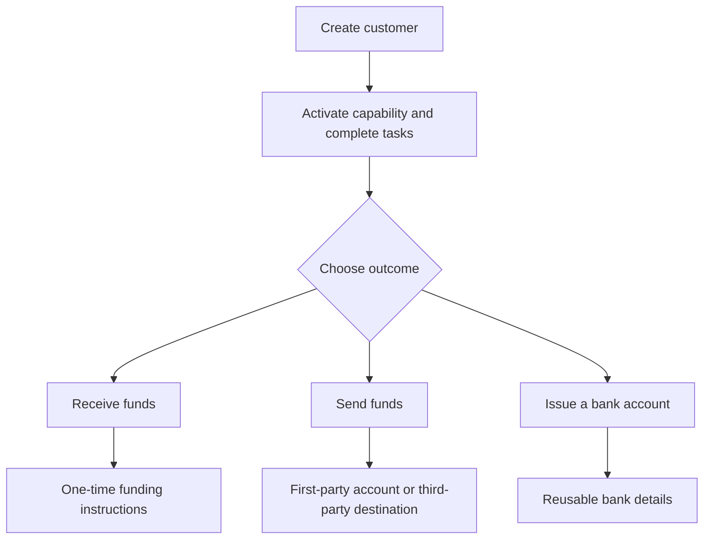

Customer outcome से शुरू करें। प्रत्येक flow वही onboarding model उपयोग करता है, फिर विभिन्न accounts और money movement में शाखा में जाता है।

## Flows की तुलना करें

| Outcome | पहले तैयार करें | आपको क्या मिलता है |
| --- | --- | --- |
| Pay-in | Ready pay-in capability और issued destination wallet | Transfer-specific instructions और stablecoin settlement |
| Payout | Ready payout capability, funded issued wallet, और ready account या destination | चयनित recipient endpoint को एक transfer |
| Issued bank account | Ready bank capability और issued settlement wallet | Provisioning के बाद पुन: उपयोग करने योग्य bank details |

एक quoted pay-in एक transfer के लिए instructions बनाता है। एक issued bank account बाद के deposits के लिए पुन: उपयोग करने योग्य details बनाता है। एक payout एक issued wallet में पहले से उपलब्ध funds से शुरू होता है।

## अपना flow चुनें

<CardGroup cols={3}>
  <Card title="Funds प्राप्त करें" icon="arrow-down-to-line" href="/hi/integration/receive-funds">
    Fiat-to-stablecoin pay-in बनाएँ और track करें।
  </Card>
  <Card title="Funds भेजें" icon="arrow-up-from-line" href="/hi/integration/send-funds">
    First-party या third-party payout बनाएँ।
  </Card>
  <Card title="Bank account जारी करें" icon="building-columns" href="/hi/integration/issue-bank-account">
    Wallet से जुड़े पुन: उपयोग करने योग्य bank details provision करें।
  </Card>
</CardGroup>
