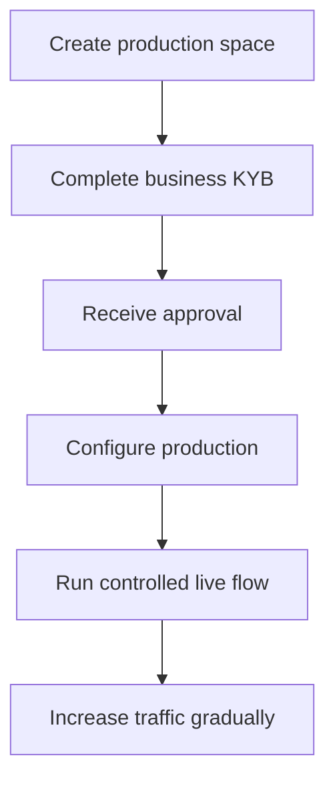

Production activation आपके integrating business को verify करता है। यह उन API customers से अलग है जिन्हें आप अपने product के लिए बनाते हैं।

## अपने production space को सक्रिय करें

1. Swipelux Dashboard में sign in करें और **Create a production space** चुनें।
2. KYB tab खोलें या [Business verification](https://www.swipelux.app/kyb) पर जाएँ।
3. प्रत्येक अनुरोधित field पूरा करें और आवश्यक documents upload करें।
4. Verification के लिए अपना integrating business submit करें और approval की प्रतीक्षा करें।

केवल आपके integrating business और production space के approve होने के बाद ही आप production API customers और transactions बना सकते हैं।

## Production को स्वतंत्र रखें

Production resources को स्पष्ट रूप से बनाएँ। API key बदलने से sandbox state migrate नहीं होती।

- Production credentials को एक अलग secret-manager entry में संग्रहीत करें।
- Production-only deployment configuration और resource IDs का उपयोग करें।
- एक अलग production webhook endpoint और signing secret register करें।
- Production में आवश्यक customers, capabilities, accounts, recipients, और destinations फिर से बनाएँ।
- Production पहुँच को उन services और operators तक सीमित करें जिन्हें इसकी आवश्यकता है।

Sandbox और production `https://platform.swipelux.com` का उपयोग करते हैं; API key environment का चयन करती है।

## Launch checklist पूरी करें

- [ ] Sandbox में happy path और expected failure paths का परीक्षण करें।
- [ ] प्रत्येक write के साथ एक `Idempotency-Key` भेजें जिसे इसकी आवश्यकता है और सुरक्षित retries के लिए इसे बनाए रखें।
- [ ] Parsing से पहले webhook signatures verify करें, event IDs को durably persist करें, और replay का परीक्षण करें।
- [ ] अनुपलब्ध capabilities, open tasks, और बदले हुए task revisions को संभालें।
- [ ] दस्तावेज़ीकृत [API errors और retries](/hi/integration/errors) को संभालें, जिसमें मूल key के साथ idempotent retries शामिल हैं।
- [ ] अपने operators को transfer failures और actionable instructions दिखाएँ।
- [ ] पुष्टि करें कि logs `X-Request-Id` या `correlationId` को secrets या संवेदनशील वित्तीय data को उजागर किए बिना बनाए रखते हैं।

## एक नियंत्रित live flow चलाएँ

एक ज्ञात customer और एक low-value transaction से शुरू करें। रिकॉर्ड करें:

| Control | Test से पहले परिभाषित करें |
| --- | --- |
| Scope | Customer, capability, account या destination, amount, और method। |
| Expected result | API state, balance या instructions, और वह webhook event जिसे आप observe करने की उम्मीद करते हैं। |
| Owner | पूर्ण flow देखने के लिए ज़िम्मेदार व्यक्ति। |
| Stop condition | कोई भी अप्रत्याशित state, अनुपस्थित webhook, गलत amount, या अनसुलझा task। |

वर्तमान API resource और authenticated webhook delivery दोनों को verify करें। यदि कोई भी अपेक्षित परिणाम से अलग है, तो अधिक traffic भेजने से पहले रुकें और जाँच करें।

पूर्ण flow के सफल होने के बाद, capability, account, destination, और transfer states की निगरानी करते हुए volume को धीरे-धीरे बढ़ाएँ।

Product journey के लिए [Common flows](/hi/integration/common-flows) पर लौटें, failure handling के लिए [Errors और retries](/hi/integration/errors) की समीक्षा करें, या सटीक contracts के लिए [API Reference](/hi/api-reference/introduction) का उपयोग करें।
