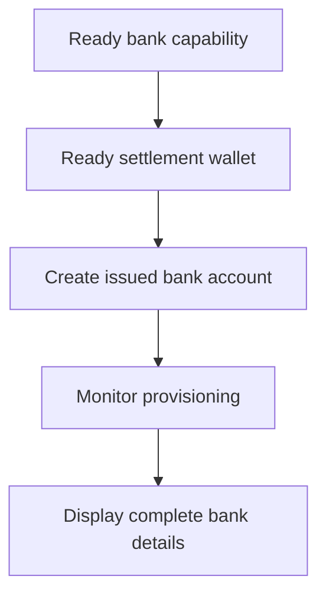

एक issued bank account का उपयोग तब करें जब customer को पुन: उपयोग करने योग्य bank details की आवश्यकता हो। विशिष्ट amount से जुड़े एक-बार के funding instructions के लिए, इसके बजाय [Receive funds](/hi/integration/receive-funds) का उपयोग करें।



## शुरू करने से पहले

आपको एक customer ID, इच्छित method और currency के लिए एक ready bank capability, और उसी customer के स्वामित्व वाला एक ready issued wallet चाहिए। [Capabilities और tasks](/hi/integration/onboarding/capabilities-and-requirements) के माध्यम से open work पूरा करें।

## 1. Settlement wallet बनाएँ या चुनें

[Accounts और wallets](/hi/integration/accounts#create-the-account) के माध्यम से एक issued wallet बनाएँ, फिर इसे फिर से पढ़ें। केवल तब जारी रखें जब इसकी वर्तमान status settlement की अनुमति देती है।

इसके response से प्राप्त `data.id` को `SETTLEMENT_WALLET_ID` के रूप में संग्रहीत करें। `settlement.accountId` के लिए एक external wallet का उपयोग न करें।

## 2. Issued bank account बनाएँ

इन headers के साथ [`POST /v3/customers/{customerId}/accounts`](/api-reference/accounts/post-v3-customers-by-customer-id-accounts) का उपयोग करें:

```http
X-API-Key: ${SWIPELUX_API_KEY}
Idempotency-Key: issued-bank-account-001
Content-Type: application/json
```

यह request body भेजें:

```json
{
  "origin": "issued",
  "type": "bank",
  "method": "ach",
  "country": "US",
  "currency": "USD",
  "settlement": {
    "accountId": "${SETTLEMENT_WALLET_ID}"
  },
  "label": "USD account"
}
```

लौटाए गए `data.id` को `BANK_ACCOUNT_ID` के रूप में संग्रहीत करें। `data.status`, `data.openTaskIds`, `data.details`, और settlement संबंध को भी बनाए रखें।

Bank account ID और wallet ID की अलग-अलग भूमिकाएँ हैं। Provisioning और bank details को bank account ID के माध्यम से पढ़ें। यह पहचानने के लिए settlement wallet ID का उपयोग करें कि deposits कहाँ credit होते हैं।

## 3. Provisioning की निगरानी करें

Creation के बाद और प्रत्येक संबंधित webhook के बाद [`GET /v3/customers/{customerId}/accounts/{accountId}`](/api-reference/accounts/get-v3-customers-by-customer-id-accounts-by-account-id) पढ़ें।

जब तक `details` अनुपस्थित है, customer interface को pending रखें। यदि `openTaskIds` खाली नहीं है, तो नवीनतम tasks पूरे करें और account को पुन: प्राप्त करें। बीते समय से readiness का अनुमान न लगाएँ।

यदि नवीनतम `statusReason.code` `awaiting_assignment` है, तो [Receive funds](/hi/integration/receive-funds) के माध्यम से उसी customer, capability, और settlement wallet के लिए पहला pay-in बनाएँ, फिर bank account को फिर से पढ़ें। इस शाखा का पालन केवल तब करें जब वर्तमान account इसका अनुरोध करता है।

## 4. Bank details को सुरक्षित रूप से प्रस्तुत करें

केवल नवीनतम account read द्वारा लौटाए गए पूर्ण details प्रदर्शित करें। जब `details.referenceRequired` true है, तो सटीक `details.reference` दिखाएँ और इसे copyable बनाएँ। जब यह false है, तो एक reference का आविष्कार न करें।

ये bank details पुन: उपयोग करने योग्य हैं। इन्हें एक quoted pay-in के funding coordinates से न बदलें, जो केवल उस transfer से संबंधित हैं।

आगे, [Webhooks](/hi/integration/webhooks) जोड़ें ताकि provisioning updates आपके application तक बिना customer को polling screen पर रखे पहुँच सकें।
