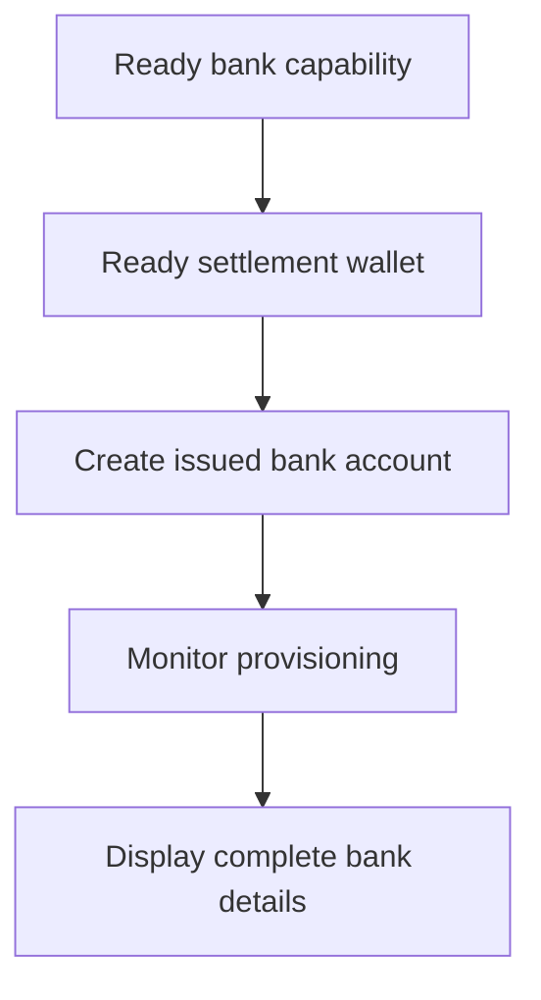

एक issued bank account का उपयोग तब करें जब customer को पुन: उपयोग करने योग्य bank details की आवश्यकता हो। विशिष्ट amount से जुड़े एक-बार के funding instructions के लिए, इसके बजाय [Receive funds](/hi/integration/receive-funds) का उपयोग करें।


```mermaid
flowchart TD
  A["Ready bank capability"] --> B["Ready settlement wallet"]
  B --> C["Create issued bank account"]
  C --> D["Monitor provisioning"]
  D --> E["Display complete bank details"]
```

## शुरू करने से पहले

आपको एक customer ID, इच्छित method और currency के लिए एक ready bank capability, और उसी customer के स्वामित्व वाला एक ready issued wallet चाहिए। `allowPending` के साथ, आप request तब save कर सकते हैं जब चयनित bank अभी भी customer को review कर रहा हो। [Capabilities और tasks](/hi/integration/onboarding/capabilities-and-requirements) के माध्यम से open work पूरा करें।

## 1. Settlement wallet बनाएँ या चुनें

[Accounts और wallets](/hi/integration/accounts#create-the-account) के माध्यम से एक issued wallet बनाएँ, फिर इसे फिर से पढ़ें। केवल तब जारी रखें जब इसकी वर्तमान status settlement की अनुमति देती है।

इसके response से प्राप्त `data.id` को `SETTLEMENT_WALLET_ID` के रूप में संग्रहीत करें। `settlement.accountId` के लिए एक external wallet का उपयोग न करें।

## 2. Issued bank account बनाएँ

इन headers के साथ [`POST /v3/customers/{customerId}/accounts`](/api-reference/accounts/post-v3-customers-by-customer-id-accounts) का उपयोग करें:

```http
X-API-Key: ${SWIPELUX_API_KEY}
Idempotency-Key: issued-bank-account-001
Content-Type: application/json
```

यह request body भेजें:

```json
{
  "origin": "issued",
  "type": "bank",
  "method": "ach",
  "country": "US",
  "currency": "USD",
  "settlement": {
    "accountId": "${SETTLEMENT_WALLET_ID}"
  },
  "label": "USD account"
}
```

लौटाए गए `data.id` को `BANK_ACCOUNT_ID` के रूप में संग्रहीत करें। `data.status`, `data.openTaskIds`, `data.details`, और settlement संबंध को भी बनाए रखें।

वैकल्पिक request fields:

| Field | किस पर लागू | व्यवहार |
| --- | --- | --- |
| `institution` | Issued `ach`, `wire`, और `swift` | ठीक इसी bank को चुनता है। Swipelux किसी अन्य bank पर fall back नहीं करता। Supported-capability response द्वारा लौटाए गए institution ID का उपयोग करें। |
| `allowPending` | Issued `ach`, `wire`, और `swift` | चयनित bank का application approval की प्रतीक्षा में रहने के दौरान request save करने के लिए `true` पर set करें। `institution` आवश्यक है। |
| `settlement.currency` | Issued bank accounts | `USDC` या `USDT`। Settlement wallet में deliver होने वाला stablecoin तय करता है। |

### Bank चुनें {#choose-the-bank}

जब customer को किसी विशिष्ट bank से bank details चाहिए, तब `institution` भेजें। Swipelux प्रति customer, method, currency, और institution एक issued account reserve करता है। यदि customer के पास उस method और currency के लिए किसी भी bank में पहले से एक issued account है, तो `institution` के बिना request `409 conflict` लौटाता है। `institution` के साथ request केवल तभी `409 conflict` लौटाता है जब उस bank के लिए account पहले से मौजूद हो।

Account reads चयनित bank को `institution` के रूप में `id`, `name`, और `bic` के साथ लौटाते हैं। `bic` `null` हो सकता है।

Idempotency चयनित bank पर लागू होती है। उसी request को replay करने पर मूल account लौटता है। उसी `Idempotency-Key` के तहत `institution` बदलने पर `409 idempotency_conflict` लौटता है।

### Bank approval से पहले request save करें {#save-the-request-before-bank-approval}

Default रूप से, Swipelux issued bank account request को केवल तब स्वीकार करता है जब bank capability ready हो। Customer का account setup पहले एकत्र करने के लिए, `institution` के साथ `allowPending: true` भेजें:

```json
{
  "origin": "issued",
  "type": "bank",
  "method": "wire",
  "country": "US",
  "currency": "USD",
  "institution": "${INSTITUTION_ID}",
  "allowPending": true,
  "settlement": {
    "accountId": "${SETTLEMENT_WALLET_ID}"
  },
  "label": "USD wire account"
}
```

जब तक bank का application review में है, account `status: "in_review"` लौटाता है, जिसमें `statusReason.code` `waiting_for_approval` पर set होता है। Response में `applicationId` और application के `openTaskIds` भी शामिल होते हैं। उन tasks को [Capabilities और tasks](/hi/integration/onboarding/capabilities-and-requirements) के माध्यम से पूरा करें।

Saved request अपना account ID, settlement wallet, और account slot बनाए रखता है। Application और capability के ready होने के बाद, Swipelux उसी `BANK_ACCOUNT_ID` के तहत bank details provision करता है। उसी ID को पढ़ते रहें। कोई दूसरा request न बनाएँ।

यदि application पहले reject, cancel, या archive हो जाता है, तो account `rejected` हो जाता है। यह अब account slot को hold नहीं करता।

### Settlement currency चुनें {#choose-the-settlement-currency}

Default रूप से, deposits settlement wallet की currency में settle होते हैं। Wallet की currency से स्वतंत्र रूप से delivered asset चुनने के लिए `settlement.currency` को `USDC` या `USDT` पर set करें:

```json
{
  "settlement": {
    "accountId": "${SETTLEMENT_WALLET_ID}",
    "currency": "USDT"
  }
}
```

`USDT` के लिए एक `USD` account और ऐसे network पर एक settlement wallet आवश्यक है जो USDT delivery को support करता हो। अन्यथा request `400 invalid_settlement_target` लौटाता है। Account reads saved choice लौटाते हैं, account के provisioning के दौरान भी।

Bank account ID और wallet ID की अलग-अलग भूमिकाएँ हैं। Provisioning और bank details को bank account ID के माध्यम से पढ़ें। यह पहचानने के लिए settlement wallet ID का उपयोग करें कि deposits कहाँ credit होते हैं।

## 3. Provisioning की निगरानी करें

Creation के बाद और प्रत्येक संबंधित webhook के बाद [`GET /v3/customers/{customerId}/accounts/{accountId}`](/api-reference/accounts/get-v3-customers-by-customer-id-accounts-by-account-id) पढ़ें।

जब तक `details` अनुपस्थित है, customer interface को pending रखें। यदि `openTaskIds` खाली नहीं है, तो नवीनतम tasks पूरे करें और account को पुन: प्राप्त करें। बीते समय से readiness का अनुमान न लगाएँ।

यदि account को `allowPending: true` के साथ save किया गया था, तो bank द्वारा application approve किए जाने तक यह `in_review` रहता है, जिसमें `statusReason.code` `waiting_for_approval` पर set होता है।

यदि नवीनतम `statusReason.code` `awaiting_assignment` है, तो [Receive funds](/hi/integration/receive-funds) के माध्यम से उसी customer, capability, और settlement wallet के लिए पहला pay-in बनाएँ, फिर bank account को फिर से पढ़ें। इस शाखा का पालन केवल तब करें जब वर्तमान account इसका अनुरोध करता है।

## 4. Bank details को सुरक्षित रूप से प्रस्तुत करें

केवल नवीनतम account read द्वारा लौटाए गए पूर्ण details प्रदर्शित करें। जब `details.referenceRequired` true है, तो सटीक `details.reference` दिखाएँ और इसे copyable बनाएँ। जब यह false है, तो एक reference का आविष्कार न करें।

Issued `swift` accounts के लिए, लौटाए जाने पर `details.bankName`, `details.swiftCode` (receiving bank का BIC), `details.accountNumber`, `details.accountHolderName`, और `details.accountHolderAddress` प्रदर्शित करें। Senders को beneficiary address को international wire में ठीक वैसा ही copy करना होगा। `details.bankAddress` और account द्वारा लौटाए गए कोई भी intermediary bank fields भी दिखाएँ।

ये bank details पुन: उपयोग करने योग्य हैं। इन्हें एक quoted pay-in के funding coordinates से न बदलें, जो केवल उस transfer से संबंधित हैं।

आगे, [Webhooks](/hi/integration/webhooks) जोड़ें ताकि provisioning updates आपके application तक बिना customer को polling screen पर रखे पहुँच सकें।
