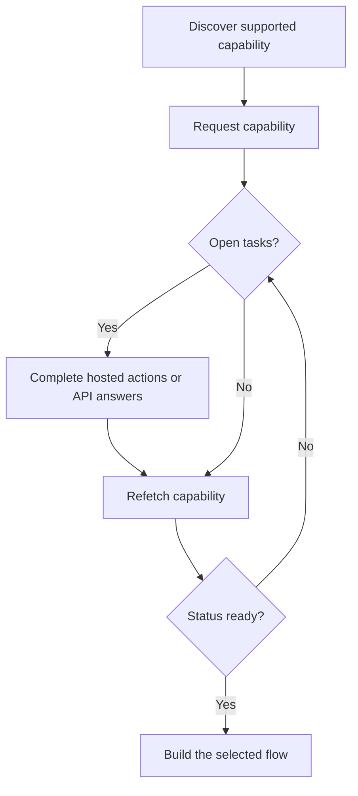

एक capability आपको बताती है कि क्या एक customer किसी विशिष्ट outcome, payment method, और direction का उपयोग कर सकता है। Open tasks आपको बताते हैं कि उस capability या संबंधित resource के आगे बढ़ने से पहले क्या होना चाहिए।



```bash
export API_BASE='https://platform.swipelux.com'
export SWIPELUX_API_KEY='replace-with-your-api-key'
```

## समर्थित capabilities खोजें

Customer के वर्तमान विकल्पों को [`GET /v3/customers/{customerId}/capabilities/supported`](/api-reference/capabilities/get-v3-customers-by-customer-id-capabilities-supported) के साथ पढ़ें:

```bash
curl --request GET \
  "${API_BASE}/v3/customers/${CUSTOMER_ID}/capabilities/supported" \
  --header "X-API-Key: ${SWIPELUX_API_KEY}"
```

एक response entry चुनें जो इच्छित `directions`, `method`, और `accountType` से मेल खाती हो। केवल तब जारी रखें जब `availability` `available` या `beta` हो और `eligibility.eligible` `true` हो। यदि `institutions` लौटाए जाते हैं, तो केवल उस response से एक ID चुनें।

चयनित `data[].id` को `CAPABILITY_ID` के रूप में संग्रहीत करें। किसी अन्य customer या environment से capability ID को कभी copy न करें।

### Pooled बनाम named account types

Bank capabilities दो variants में आती हैं, जिन्हें `accountType` field और capability ID suffix (उदाहरण के लिए `ach_pooled`, `wire_named`) के रूप में encode किया गया है:

- **`pooled`**: साझा Swipelux bank account। Funds को route करने के लिए प्रत्येक pay-in एक unique reference का उपयोग करता है। एक-बार के transfers के लिए इसे चुनें।
- **`named`**: customer के लिए dedicated bank details (virtual IBAN, dedicated ACH account)। पुन: उपयोग करने योग्य और किसी भी payer के साथ साझा करने योग्य। [Issued bank accounts](/hi/integration/issue-bank-account) के लिए आवश्यक।

Default रूप से `pooled` का उपयोग करें। `named` का उपयोग केवल तभी करें जब customer को पुन: उपयोग करने योग्य bank details की आवश्यकता हो। यह देखने के लिए कि कौन से variants उपलब्ध हैं, `supported` response की जाँच करें।

## Capability का अनुरोध करें

चयनित option का अनुरोध [`POST /v3/customers/{customerId}/capabilities/{capabilityId}`](/api-reference/capabilities/post-v3-customers-by-customer-id-capabilities-by-capability-id) के साथ करें:

```bash
curl --request POST \
  "${API_BASE}/v3/customers/${CUSTOMER_ID}/capabilities/${CAPABILITY_ID}" \
  --header "X-API-Key: ${SWIPELUX_API_KEY}" \
  --header "Idempotency-Key: capability-request-001" \
  --header "Content-Type: application/json" \
  --data '{}'
```

एक explicit `institutions` array का उपयोग केवल तब करें जब आपको supported-capability response द्वारा लौटाए गए IDs में से चयन करने की आवश्यकता हो।

`data.status` को `CAPABILITY_STATUS`, `data.openTaskIds` को `OPEN_TASK_IDS`, और प्रत्येक `data.applications[].id` को `APPLICATION_IDS` में संग्रहीत करें।

## वर्तमान tasks पूरे करें {#complete-current-tasks}

Tasks को [`GET /v3/customers/{customerId}/tasks`](/api-reference/tasks/list-customer-tasks) के साथ सूचीबद्ध करें, `OPEN_TASK_IDS` से IDs चुनें, फिर प्रत्येक वर्तमान task को [`GET /v3/customers/{customerId}/tasks/{taskId}`](/api-reference/tasks/get-customer-task) के साथ पढ़ें:

```bash
curl --request GET \
  "${API_BASE}/v3/customers/${CUSTOMER_ID}/tasks/${TASK_ID}" \
  --header "X-API-Key: ${SWIPELUX_API_KEY}"
```

नवीनतम `data.revision` और `data.requirements` का उपयोग करें। यदि दोनों में से कोई बदल सकता है, तो submit करने से ठीक पहले task को पुन: प्राप्त करें।

प्रत्येक खुले टास्क में एक `dueAt` टाइमस्टैम्प शामिल होता है। जब Swipelux बिना किसी स्पष्ट नियत तिथि के टास्क बनाता है, तो `dueAt` डिफ़ॉल्ट रूप से टास्क के `createdAt` के ठीक 31 दिन बाद सेट होता है। `dueAt` को केवल सूचनात्मक मानें: आप इसे API के माध्यम से सेट नहीं कर सकते, और यह कोई स्वचालित लाइफ़साइकल ट्रांज़िशन ट्रिगर नहीं करता। केवल अलग `deadline` फ़ील्ड, यदि मौजूद हो, स्वचालित ट्रांज़िशन का कारण बनता है।

### Hosted actions

Task-detail response में `verificationSessions` और `tosSessions` की प्रत्येक entry में `action` object शामिल होता है। Task-list responses में ये action links शामिल नहीं होते। प्रत्येक session का `id` store करें, फिर customer को भेजने से पहले `action.kind` पढ़ें; session के `status` से link की उपलब्धता का अनुमान न लगाएँ।

- `action.kind: "available"` में `action.url` और `action.expiresAt` शामिल होते हैं (वर्तमान में हमेशा `null`)। `action.url` store करें, customer को उस पर भेजें, फिर task को दोबारा पढ़ें। Session-level `url` और `expiresAt` fields में वही values होती हैं।
- `action.kind: "unavailable"` का अर्थ है कि कोई link नहीं दिखाया जाना चाहिए। Session-level `url` और `expiresAt` fields मौजूद नहीं होते। Session का `status` अकेले यह तय नहीं करता कि आपको कौन सा action kind मिलेगा।

```json
{
  "data": {
    "verificationSessions": [
      {
        "id": "vfy_000000000000000003",
        "key": "identity_verification",
        "type": "identity_verification",
        "status": "action_required",
        "action": {
          "kind": "available",
          "url": "https://platform.swipelux.com/kyc/redirect/cus_000000000000000001/tsk_000000000000000002/vfy_000000000000000003",
          "expiresAt": null
        },
        "url": "https://platform.swipelux.com/kyc/redirect/cus_000000000000000001/tsk_000000000000000002/vfy_000000000000000003",
        "expiresAt": null
      }
    ],
    "tosSessions": [
      {
        "id": "vfy_000000000000000004",
        "key": "terms_of_service",
        "type": "terms_of_service",
        "status": "completed",
        "action": { "kind": "unavailable" }
      }
    ]
  }
}
```

ये task-scoped actions हैं, अलग customer-verification lifecycle नहीं।

### Documents upload करें {#upload-documents}

जब कोई requirement एक document का अनुरोध करता है, तो उसे [`POST /v3/customers/{customerId}/documents`](/api-reference/documents/post-v3-customers-by-customer-id-documents) के साथ upload करें:

```bash
export DOCUMENT_PATH='/absolute/path/to/requested-document.pdf'

curl --request POST \
  "${API_BASE}/v3/customers/${CUSTOMER_ID}/documents" \
  --header "X-API-Key: ${SWIPELUX_API_KEY}" \
  --header "Idempotency-Key: customer-document-001" \
  --form "file=@${DOCUMENT_PATH}"
```

Answer submit करने से पहले जो इसे संदर्भित करता है, लौटाए गए `data.id` को `DOCUMENT_ID` के रूप में संग्रहीत करें।

### API answers

वर्तमान revision के लिए एक पूर्ण answer set [`POST /v3/customers/{customerId}/tasks/{taskId}/submissions`](/api-reference/task-submissions/create-customer-task-submission) के साथ submit करें:

```bash
curl --request POST \
  "${API_BASE}/v3/customers/${CUSTOMER_ID}/tasks/${TASK_ID}/submissions" \
  --header "X-API-Key: ${SWIPELUX_API_KEY}" \
  --header "Idempotency-Key: task-submission-001" \
  --header "Content-Type: application/json" \
  --data @- <<'JSON'
{
  "taskRevision": 3,
  "answers": [
    {
      "requirementId": "req_from_current_task",
      "answer": {
        "type": "text",
        "value": "Current answer"
      }
    }
  ]
}
JSON
```

प्रत्येक requirement ID और answer type नवीनतम task से लें। यदि API यह रिपोर्ट करता है कि task बदल गया है, तो इसे पुन: प्राप्त करें और नए revision से submission को फिर से बनाएँ।

## जब capability तैयार हो तो जारी रखें

Capability को [`GET /v3/customers/{customerId}/capabilities/{capabilityId}`](/api-reference/capabilities/get-v3-customers-by-customer-id-capabilities-by-capability-id) के साथ फिर से पढ़ें:

```bash
curl --request GET \
  "${API_BASE}/v3/customers/${CUSTOMER_ID}/capabilities/${CAPABILITY_ID}" \
  --header "X-API-Key: ${SWIPELUX_API_KEY}"
```

संग्रहीत status और task IDs को नवीनतम response से बदलें। केवल तब जारी रखें जब वर्तमान capability status उस account, quote, या transfer की अनुमति देती है जिसे आप बनाने का इरादा रखते हैं।

आगे, [Common flows](/hi/integration/common-flows) में मेल खाती यात्रा चुनें।
