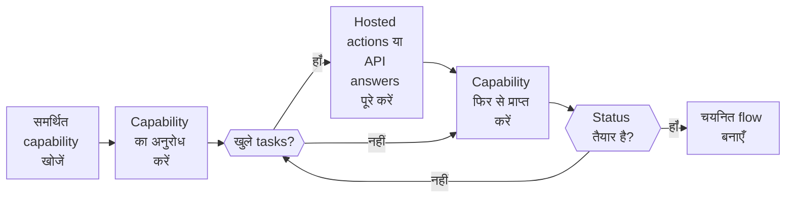

एक capability आपको बताती है कि क्या एक customer किसी विशिष्ट outcome, payment method, और direction का उपयोग कर सकता है। Open tasks आपको बताते हैं कि उस capability या संबंधित resource के आगे बढ़ने से पहले क्या होना चाहिए।


```mermaid
%%{init: {"flowchart": {"rankSpacing": 20, "nodeSpacing": 16, "wrappingWidth": 80, "padding": 8}}}%%
flowchart LR
  A["समर्थित capability खोजें"] --> B["Capability का अनुरोध करें"]
  B --> C{{"खुले tasks?"}}
  C -->|"हाँ"| D["Hosted actions या API answers पूरे करें"]
  D --> E["Capability फिर से प्राप्त करें"]
  C -->|"नहीं"| E
  E --> F{{"Status तैयार है?"}}
  F -->|"नहीं"| C
  F -->|"हाँ"| G["चयनित flow बनाएँ"]
```

```bash Environment variables
export API_BASE='https://platform.swipelux.com'
export SWIPELUX_API_KEY='replace-with-your-api-key'
```

## समर्थित capabilities खोजें

Customer के वर्तमान विकल्पों को [`GET /v3/customers/{customerId}/capabilities/supported`](/api-reference/capabilities/get-v3-customers-by-customer-id-capabilities-supported) के साथ पढ़ें:

```bash List supported capabilities
curl --request GET \
  "${API_BASE}/v3/customers/${CUSTOMER_ID}/capabilities/supported" \
  --header "X-API-Key: ${SWIPELUX_API_KEY}"
```

एक response entry चुनें जो इच्छित `directions`, `method`, और `accountType` से मेल खाती हो। केवल तब जारी रखें जब `availability` `available` या `beta` हो और `eligibility.eligible` `true` हो। यदि `institutions` लौटाए जाते हैं, तो केवल उस response से एक ID चुनें।

प्रत्येक institution entry में एक `logoUrl` और एक `isDefault` flag शामिल होता है। Bank selection UI में bank का logo दिखाने के लिए `logoUrl` का उपयोग करें, और जब यह `null` हो तो अपना generic bank icon render करें। `isDefault` केवल इस customer और capability पर लागू होता है, institution पर globally नहीं। [`GET /v3/institutions`](/api-reference/institutions/get-v3-institutions) वही nullable `logoUrl` लौटाता है। Institution IDs opaque हैं, इसलिए code बदले बिना नए IDs को handle करें।

```json Institution entry
{
  "institutions": [
    {
      "id": "jpmorgan",
      "name": "JPMorgan Chase",
      "bic": "CHASUS33",
      "logoUrl": "https://wallet.swipelux.com/bank-logos/jpmorgan.png",
      "countries": ["US"],
      "isDefault": true
    }
  ]
}
```

चयनित `data[].id` को `CAPABILITY_ID` के रूप में संग्रहीत करें। किसी अन्य customer या environment से capability ID को कभी copy न करें।

### Pooled बनाम named account types

Bank capabilities दो variants में आती हैं, जिन्हें `accountType` field और capability ID suffix (उदाहरण के लिए `ach_pooled`, `wire_named`) के रूप में encode किया गया है:

- **`pooled`**: साझा Swipelux bank account। Funds को route करने के लिए प्रत्येक pay-in एक unique reference का उपयोग करता है। एक-बार के transfers के लिए इसे चुनें।
- **`named`**: customer के लिए dedicated bank details (virtual IBAN, dedicated ACH account)। पुन: उपयोग करने योग्य और किसी भी payer के साथ साझा करने योग्य। [Issued bank accounts](/hi/integration/issue-bank-account) के लिए आवश्यक।

Default रूप से `pooled` का उपयोग करें। `named` का उपयोग केवल तभी करें जब customer को पुन: उपयोग करने योग्य bank details की आवश्यकता हो। यह देखने के लिए कि कौन से variants उपलब्ध हैं, `supported` response की जाँच करें।

SWIFT deposits प्राप्त करने या SWIFT bank details जारी करने के लिए, `swift_named` का उपयोग करें। `swift_pooled` केवल payouts को support करता है, इसलिए supported-capability response में प्रत्येक option के `directions` की जाँच करें। Named SWIFT account पुन: उपयोग करने योग्य receiving details लौटाता है, जिनमें bank का BIC, आवश्यक होने पर एक reference, और bank द्वारा प्रदान किए जाने पर beneficiary address शामिल है।

Issued ACH, Wire, और SWIFT accounts के लिए, आप `institution` के साथ एक सटीक bank चुन सकते हैं और bank द्वारा customer को approve करने से पहले account request save कर सकते हैं। [Bank account जारी करें](/hi/integration/issue-bank-account#choose-the-bank) देखें।

## Capability का अनुरोध करें

चयनित option का अनुरोध [`POST /v3/customers/{customerId}/capabilities/{capabilityId}`](/api-reference/capabilities/post-v3-customers-by-customer-id-capabilities-by-capability-id) के साथ करें:

```bash Request capability
curl --request POST \
  "${API_BASE}/v3/customers/${CUSTOMER_ID}/capabilities/${CAPABILITY_ID}" \
  --header "X-API-Key: ${SWIPELUX_API_KEY}" \
  --header "Idempotency-Key: capability-request-001" \
  --header "Content-Type: application/json" \
  --data '{}'
```

एक explicit `institutions` array का उपयोग केवल तब करें जब आपको supported-capability response द्वारा लौटाए गए IDs में से चयन करने की आवश्यकता हो।

`data.status` को `CAPABILITY_STATUS`, `data.accountProvisioning` को `ACCOUNT_PROVISIONING_STATUS`, `data.openTaskIds` को `OPEN_TASK_IDS`, और प्रत्येक `data.applications[].id` को `APPLICATION_IDS` में संग्रहीत करें।

### प्रति bank साझा applications {#shared-applications-per-bank}

Named bank capabilities के लिए, प्रत्येक customer के पास प्रति bank एक application case होता है। Pooled और platform capabilities बिना bank वाले cases का उपयोग करती हैं। Swipelux आपके द्वारा अनुरोधित हर compatible capability में एक case साझा करता है:

- एक approval कई capabilities को cover कर सकता है। उदाहरण के लिए, एक bank पर approved case ACH और wire दोनों capabilities को `ready` बना सकता है।
- बाद का कोई request जो किसी मौजूदा case से मेल खाता है, उसी का पुन: उपयोग करता है। Swipelux कोई दूसरा application नहीं खोलता और कोई duplicate tasks नहीं जोड़ता।
- अलग-अलग banks पर cases स्वतंत्र होते हैं। एक bank पर rejection किसी दूसरे bank के case को प्रभावित नहीं करता।

Request response आपको बताता है कि Swipelux ने किस case का उपयोग किया:

- `201` का अर्थ है कि request ने एक नया application case खोला।
- `200` का अर्थ है कि request किसी ऐसे application case पर resolve हुआ जो customer के पास पहले से था, उदाहरण के लिए ऐसी bank capability के लिए दोहराया गया request जो customer के पास पहले से है, या किसी canceled capability के लिए request। `card` या `stablecoin_transfers` के लिए दोहराया गया request अब भी [`409 capability_already_exists`](/integration/errors#capability-already-exists) लौटाता है।
- `selectedApplicationId` `data` के बगल में एक top-level field है, जिसमें उस case का ID होता है जिसे request ने चुना या खोला। जब request ने कोई case नहीं चुना, तो Swipelux इसे छोड़ देता है। Idempotent replay वही value लौटाता है।

संक्षिप्त response:

```json Response (abbreviated)
{
  "data": {
    "id": "ach_named",
    "status": "pending",
    "openTaskIds": ["tsk_000000000000000002"],
    "applications": [{ "id": "apl_000000000000000005", "status": "in_review" }]
  },
  "selectedApplicationId": "apl_000000000000000005"
}
```

Named capabilities के लिए, उसी case को चुनने के लिए वही `institutions` list फिर से भेजें, या उस bank को target करने के लिए एक institution ID भेजें। जिस bank ने customer को terminally reject किया है, उसे skip किया जाता है। जब आप केवल उसी bank का नाम देते हैं, या हर eligible bank ने customer को reject कर दिया है, तो request [`409 capability_terminally_rejected`](/integration/errors#capability-terminally-rejected) लौटाता है। Rejection के बाद किसी दूसरे bank को आज़माने के लिए, उस bank के institution ID के साथ capability का फिर से अनुरोध करें।

किसी capability का status customer के सभी संबंधित cases को दर्शाता है। Named capability के लिए, एक `ready` case जिसका approval उसे cover करता है, उसे `ready` बनाने के लिए पर्याप्त है, चाहे दूसरे banks कुछ भी report करें। Pooled capability अपने method check की भी प्रतीक्षा करती है, जो customer applications list पर `probes` में report होता है।

#### Customer के applications सूचीबद्ध करें {#list-the-customers-applications}

Customer के हर application case को [`GET /v3/customers/{customerId}/applications`](/api-reference/capabilities/get-v3-customers-by-customer-id-applications) के साथ सूचीबद्ध करें। Results `nextCursor` और `hasMore` के साथ paginated होते हैं, और `updatedAfter` स्वीकार करते हैं:

```bash List applications
curl --request GET \
  "${API_BASE}/v3/customers/${CUSTOMER_ID}/applications" \
  --header "X-API-Key: ${SWIPELUX_API_KEY}"
```

प्रत्येक entry में capability के `applications[]` में लौटाए गए application fields शामिल होते हैं, साथ ही:

- `scope`: एक bank पर case के लिए `named`, बिना bank वाले cases के लिए `provider_pooled` या `platform`, या unclassified historical case के लिए `null`। `provider_pooled` और `platform` cases के लिए `institution` मौजूद नहीं होता।
- `requestedScope[]`: case के विरुद्ध अनुरोधित capability keys, प्रत्येक अपने पहले `requestedAt` के साथ। Entries कभी हटाई नहीं जातीं।
- `coverage[]`: वे capability keys जिन्हें case का approval cover करता है, प्रत्येक `grantedAt` और `source` के साथ। Coverage scope record करता है, authorization नहीं। वर्तमान status के लिए capability पढ़ें।
- `probes[]`: case द्वारा cover की गई pooled capability keys के लिए method checks, प्रत्येक `capabilityKey`, `status`, और `reason` के साथ। Named keys को कभी probe की आवश्यकता नहीं होती।
- `generation`, `predecessorApplicationId`, और `supersededByApplicationId`: succession links। जब `supersededByApplicationId` set हो, तो case को replace कर दिया गया है। वर्तमान case तक पहुँचने के लिए उस ID का पालन करें। किसी capability की `applications[]` केवल वर्तमान cases सूचीबद्ध करती है, इसलिए replace किया गया case केवल इसी सूची में दिखता है।

संक्षिप्त response:

```json Response (abbreviated)
{
  "data": [
    {
      "id": "apl_000000000000000005",
      "status": "ready",
      "scope": "named",
      "institution": { "id": "jpmorgan", "name": "JPMorgan Chase", "bic": "CHASUS33" },
      "requestedScope": [
        { "capabilityKey": "ach_named", "requestedAt": "2026-09-20T10:00:00.000Z" }
      ],
      "coverage": [
        { "capabilityKey": "ach_named", "grantedAt": "2026-09-22T12:00:00.000Z", "source": "approval" },
        { "capabilityKey": "wire_named", "grantedAt": "2026-09-22T12:00:00.000Z", "source": "approval" }
      ],
      "probes": [],
      "generation": 1,
      "predecessorApplicationId": null,
      "supersededByApplicationId": null
    }
  ],
  "nextCursor": null,
  "hasMore": false
}
```

## वर्तमान tasks पूरे करें {#complete-current-tasks}

Tasks को [`GET /v3/customers/{customerId}/tasks`](/api-reference/tasks/list-customer-tasks) के साथ सूचीबद्ध करें, `OPEN_TASK_IDS` से IDs चुनें, फिर प्रत्येक वर्तमान task को [`GET /v3/customers/{customerId}/tasks/{taskId}`](/api-reference/tasks/get-customer-task) के साथ पढ़ें:

```bash List open tasks
curl --request GET \
  "${API_BASE}/v3/customers/${CUSTOMER_ID}/tasks/${TASK_ID}" \
  --header "X-API-Key: ${SWIPELUX_API_KEY}"
```

नवीनतम `data.revision` और `data.requirements` का उपयोग करें। यदि दोनों में से कोई बदल सकता है, तो submit करने से ठीक पहले task को पुन: प्राप्त करें।

### पुन: उपयोग किए गए profile evidence {#reused-profile-evidence}

Direct API submission स्वीकार करने वाले application intake tasks के लिए, Swipelux उस जानकारी का पुन: उपयोग करता है जो customer पहले ही दे चुका है। जब ऐसा task बनाया या reconcile किया जाता है, तो Swipelux customer profile और customer के अपने upload किए गए documents की जाँच करता है। जो eligible requirements पहले से किसी usable profile value या document द्वारा समर्थित हैं, वे actionable रहने के बजाय `in_review` में चली जाती हैं। Profile updates और नए document uploads मौजूदा tasks के लिए वही जाँच trigger करते हैं।

केवल missing या incompatible values actionable रहती हैं। पुन: उपयोग evidence को approve नहीं करता। Swipelux फिर भी उसकी review करता है। Explicit correction requests और पहले से answered requirements actionable रहती हैं। Owner और related-party documents का पुन: उपयोग नहीं होता, और केवल hosted session के माध्यम से collect की जाने वाली requirements अपने सामान्य flow का पालन करती हैं।

### Requirements render करें {#render-requirements}

Forms को requirement keys के बजाय प्रत्येक requirement द्वारा लौटाए गए metadata से बनाएँ। एक requirement में एक वैकल्पिक छोटा `title` शामिल हो सकता है, और हर `request` में heading के नीचे दिखाने के लिए एक `prompt` शामिल होता है।

`request.type: "profile"` वाली requirements `profilePointer` के साथ profile field की पहचान करती हैं और input metadata जोड़ती हैं:

- `allowedValues`: किसी scalar field के लिए, या किसी array field के प्रत्येक item के लिए अनुमत values। इन्हीं values को submit करें, translated display labels को नहीं।
- `valueSchema`: एक self-contained JSON Schema Draft 7 document जो input shape, nested properties, required fields, और structural constraints का वर्णन करता है। Objects पर enums संबंधित property पर दिखाई देते हैं, उदाहरण के लिए tax identifiers के लिए `valueSchema.items.properties.type.enum`। Swipelux submission के बाद भी cross-field और review validation लागू करता है, इसलिए schema पास करने वाली value भी reject हो सकती है।
- `valueType: "country"`, या arrays के लिए `itemValueType: "country"`: field uppercase ISO 3166-1 alpha-2 codes लेता है। `valueSchema` में nested country properties `format: "iso-3166-1-alpha-2"` का उपयोग करती हैं। Localized labels के लिए एक standard country list का उपयोग करें।

```json Requirement
{
  "id": "req_000000000000000010",
  "key": "account_purposes",
  "title": "Account purpose",
  "status": "action_required",
  "request": {
    "type": "profile",
    "prompt": "Select every purpose that applies.",
    "required": true,
    "profilePointer": "/financialProfile/accountPurposes",
    "valueType": "array",
    "itemValueType": "string",
    "allowedValues": ["business_expenses", "ecommerce", "payroll"],
    "valueSchema": {
      "$schema": "http://json-schema.org/draft-07/schema#",
      "type": "array",
      "items": { "enum": ["business_expenses", "ecommerce", "payroll"] }
    }
  }
}
```

यह उदाहरण value catalog को छोटा करता है; API हर अनुमत value लौटाता है। कुछ profile requirements का कोई published schema नहीं होता और वे `valueSchema` और `allowedValues` को छोड़ देती हैं। उन्हें `prompt` और `valueType` से render करें।

प्रत्येक खुले टास्क में एक `dueAt` टाइमस्टैम्प शामिल होता है। जब Swipelux बिना किसी स्पष्ट नियत तिथि के टास्क बनाता है, तो `dueAt` डिफ़ॉल्ट रूप से टास्क के `createdAt` के ठीक 31 दिन बाद सेट होता है। `dueAt` को केवल सूचनात्मक मानें: आप इसे API के माध्यम से सेट नहीं कर सकते, और यह कोई स्वचालित लाइफ़साइकल ट्रांज़िशन ट्रिगर नहीं करता। केवल अलग `deadline` फ़ील्ड, यदि मौजूद हो, स्वचालित ट्रांज़िशन का कारण बनता है।

### Hosted actions {#hosted-actions}

Task-detail response में `verificationSessions` और `tosSessions` की प्रत्येक entry में `action` object शामिल होता है। Task-list responses में ये action links शामिल नहीं होते। प्रत्येक session का `id` store करें, फिर customer को भेजने से पहले `action.kind` पढ़ें; session के `status` से link की उपलब्धता का अनुमान न लगाएँ।

- `action.kind: "available"` में `action.url` और `action.expiresAt` शामिल होते हैं (वर्तमान में हमेशा `null`)। `action.url` store करें, customer को उस पर भेजें, फिर task को दोबारा पढ़ें। Session-level `url` और `expiresAt` fields में वही values होती हैं।
- `action.kind: "unavailable"` का अर्थ है कि कोई link नहीं दिखाया जाना चाहिए। Session-level `url` और `expiresAt` fields मौजूद नहीं होते। Session का `status` अकेले यह तय नहीं करता कि आपको कौन सा action kind मिलेगा।

```json Verification session
{
  "data": {
    "verificationSessions": [
      {
        "id": "vfy_000000000000000003",
        "key": "identity_verification",
        "type": "identity_verification",
        "status": "action_required",
        "action": {
          "kind": "available",
          "url": "https://platform.swipelux.com/kyc/redirect/cus_000000000000000001/tsk_000000000000000002/vfy_000000000000000003",
          "expiresAt": null
        },
        "url": "https://platform.swipelux.com/kyc/redirect/cus_000000000000000001/tsk_000000000000000002/vfy_000000000000000003",
        "expiresAt": null
      }
    ],
    "tosSessions": [
      {
        "id": "vfy_000000000000000004",
        "key": "terms_of_service",
        "type": "terms_of_service",
        "status": "completed",
        "action": { "kind": "unavailable" }
      }
    ]
  }
}
```

ये task-scoped actions हैं, अलग customer-verification lifecycle नहीं।

### Documents upload करें {#upload-documents}

जब कोई requirement एक document का अनुरोध करता है, तो उसे [`POST /v3/customers/{customerId}/documents`](/api-reference/documents/post-v3-customers-by-customer-id-documents) के साथ upload करें:

```bash Upload document
export DOCUMENT_PATH='/absolute/path/to/requested-document.pdf'

curl --request POST \
  "${API_BASE}/v3/customers/${CUSTOMER_ID}/documents" \
  --header "X-API-Key: ${SWIPELUX_API_KEY}" \
  --header "Idempotency-Key: customer-document-001" \
  --form "file=@${DOCUMENT_PATH}"
```

Answer submit करने से पहले जो इसे संदर्भित करता है, लौटाए गए `data.id` को `DOCUMENT_ID` के रूप में संग्रहीत करें।

किसी संग्रहीत फ़ाइल को बाद में प्राप्त करने के लिए, [`GET /v3/customers/{customerId}/documents/{documentId}/download`](/api-reference/documents/get-v3-customers-by-customer-id-documents-by-document-id-download) कॉल करें। Swipelux एक `url` लौटाता है जो फ़ाइल को attachment के रूप में download करता है और एक घंटे बाद समाप्त हो जाता है। Archived documents `404` लौटाते हैं।

### API answers

वर्तमान revision के लिए एक पूर्ण answer set [`POST /v3/customers/{customerId}/tasks/{taskId}/submissions`](/api-reference/task-submissions/create-customer-task-submission) के साथ submit करें:

```bash Submit task answers
curl --request POST \
  "${API_BASE}/v3/customers/${CUSTOMER_ID}/tasks/${TASK_ID}/submissions" \
  --header "X-API-Key: ${SWIPELUX_API_KEY}" \
  --header "Idempotency-Key: task-submission-001" \
  --header "Content-Type: application/json" \
  --data @- <<'JSON'
{
  "taskRevision": 3,
  "answers": [
    {
      "requirementId": "req_from_current_task",
      "answer": {
        "type": "text",
        "value": "Current answer"
      }
    }
  ]
}
JSON
```

प्रत्येक requirement ID और answer type नवीनतम task से लें। यदि API यह रिपोर्ट करता है कि task बदल गया है, तो इसे पुन: प्राप्त करें और नए revision से submission को फिर से बनाएँ।

### Businesses के लिए beneficial-owner पूर्वापेक्षा {#beneficial-owner-prerequisite-for-businesses}

ऐसी business capability का अनुरोध करना जिसे beneficial-owner evidence की आवश्यकता है, तब भी सफल होता है जब customer के पास अभी तक कोई qualifying owner नहीं है। Capability `restricted` के रूप में `statusReason.code: tasks_due` के साथ बनाई जाती है, और business intake task छूटे हुए ownership facts का अनुरोध करता है, जिसमें ownership structure शामिल है।

वही task एक `resource_reference` requirement रखता है जिसके request में `qualification: "beneficial_owner"` शामिल है:

```json Beneficial owner requirement
{
  "type": "resource_reference",
  "prompt": "Add or select a qualifying beneficial owner.",
  "required": true,
  "resourceType": "related_party",
  "qualification": "beneficial_owner"
}
```

एक related party तब qualify करती है जब वह उसी customer की एक active `person` party हो जिसके पास `ownership.declared: true` हो या कम से कम 25 का supplied ownership percentage हो।

यह requirement वर्तमान related-party roster से derive होता है, इसलिए आप आमतौर पर इसका सीधे उत्तर नहीं देते:

- एक qualifying related party बनाना या अपडेट करना उसी reevaluation में requirement को पूरा करता है और उस owner के अपने profile और document work को खोलता है। [Business related parties जोड़ें](/hi/integration/onboarding/customers#add-business-related-parties) देखें।
- आप एक `resource_reference` answer के साथ, जो उसका `relatedPartyId` रखता है, किसी qualifying party को स्पष्ट रूप से reference भी कर सकते हैं।
- पूरा होने के बाद भी requirement वर्तमान task में सूचीबद्ध रहता है। जब कोई अन्य obligation खुला नहीं रहता, तो task `satisfied` हो जाता है।
- आखिरी qualifying party को archive करना, या उसे qualify करने वाले facts को हटाना, requirement को फिर से खोल देता है, भले ही task `satisfied` हो चुका हो।

## जब capability तैयार हो तो जारी रखें {#continue-when-the-capability-is-ready}

Capability को [`GET /v3/customers/{customerId}/capabilities/{capabilityId}`](/api-reference/capabilities/get-v3-customers-by-customer-id-capabilities-by-capability-id) के साथ फिर से पढ़ें:

```bash Refetch capability
curl --request GET \
  "${API_BASE}/v3/customers/${CUSTOMER_ID}/capabilities/${CAPABILITY_ID}" \
  --header "X-API-Key: ${SWIPELUX_API_KEY}"
```

संग्रहीत status, account-provisioning status, और task IDs को नवीनतम response से बदलें। Capability `status` रिपोर्ट करता है कि entitlement approve हुआ है या नहीं। Account जारी करने वाली capability के लिए, `accountProvisioning` अलग से रिपोर्ट करता है कि वह account `not_started`, `in_progress`, `issued`, या `failed` है; जो capability account जारी नहीं करती वह `not_applicable` लौटाती है।

जब capability `pending` होती है, तो वह जो `statusReason.code` values report कर सकती है, उनमें से दो यह दिखाती हैं कि review चल रहा है या नहीं। `preparing_submission` का अर्थ है कि Swipelux अभी भी submission के लिए application तैयार कर रहा है और कोई review नहीं चल रहा, भले ही किसी दूसरे bank का application `rejected` हो या उस पर ध्यान देने की ज़रूरत हो। `review_in_progress` का अर्थ है कि review चल रहा है, उदाहरण के लिए जब कोई application `in_review` हो या कोई [hosted verification](#hosted-actions) खुला हो। दोनों `resolution: wait` का उपयोग करते हैं। इन codes के बीच बदलाव status को `pending` ही रखता है, इसलिए कोई `capability.status_changed` event नहीं भेजा जाता। मौजूदा code देखने के लिए capability पढ़ें।

केवल तब जारी रखें जब वर्तमान capability status उस account, quote, या transfer की अनुमति देती है जिसे आप बनाने का इरादा रखते हैं। जब flow को issued account की आवश्यकता हो, तो `accountProvisioning` के `issued` होने की भी प्रतीक्षा करें।

आगे, [Common flows](/hi/integration/common-flows) में मेल खाती यात्रा चुनें।
