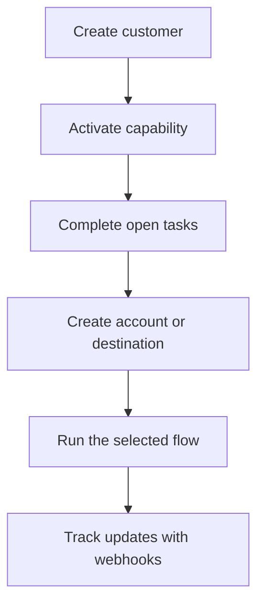

Swipelux आपके backend को ग्राहकों को onboard करने और आपके product में payment infrastructure को उजागर किए बिना पैसा स्थानांतरित करने के लिए building blocks देता है।

## आप क्या बना सकते हैं

<CardGroup cols={3}>
  <Card title="Funds प्राप्त करें" icon="arrow-down-to-line" href="/hi/integration/receive-funds">
    एक-बार के fiat funding instructions बनाएँ और stablecoin को wallet में settle करें।
  </Card>
  <Card title="Funds भेजें" icon="arrow-up-from-line" href="/hi/integration/send-funds">
    Customer wallet से first-party account या third-party destination पर भेजें।
  </Card>
  <Card title="Bank account जारी करें" icon="building-columns" href="/hi/integration/issue-bank-account">
    Settlement wallet से जुड़े पुन: उपयोग करने योग्य bank details provision करें।
  </Card>
</CardGroup>

## एक integration कैसे काम करता है

एक customer वह व्यक्ति या व्यवसाय है जो flow का स्वामी है। Capabilities बताती हैं कि वह customer कौन से outcomes उपयोग कर सकता है। Open tasks आपको बताते हैं कि capability या resource के आगे बढ़ने से पहले क्या पूरा होना चाहिए।

## इसे कार्य में देखें

एक simulated neobank अनुभव आज़माने के लिए [demo.swipelux.com](https://demo.swipelux.com) का अन्वेषण करें। आप [starter को clone](https://github.com/swipelux/neobank-starter) कर सकते हैं और इसके product interface को अनुकूलित कर सकते हैं।

Demo और starter product और UI संदर्भ हैं। वे इन guides या वर्तमान API contract का स्थान नहीं लेते।

## बनाना शुरू करें

<CardGroup cols={3}>
  <Card title="Quickstart" icon="rocket" href="/hi/integration/quickstart">
    एक customer बनाएँ और एक sandbox flow चलाएँ।
  </Card>
  <Card title="Common flows" icon="route" href="/hi/integration/common-flows">
    प्रत्येक outcome के लिए आवश्यक setup की तुलना करें।
  </Card>
  <Card title="API Reference" icon="code" href="/hi/api-reference/introduction">
    Request conventions पढ़ें और प्रत्येक API operation का निरीक्षण करें।
  </Card>
</CardGroup>
