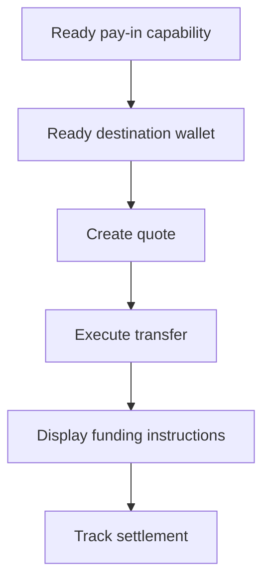

Quoted pay-in का उपयोग तब करें जब customer को एक विशिष्ट amount fund करने की आवश्यकता हो। Transfer stablecoin को एक issued wallet में settle करता है।



## शुरू करने से पहले

आपको उसी customer के लिए एक ready pay-in capability और ready issued destination wallet चाहिए। किसी भी open work को [Capabilities और tasks](/hi/integration/onboarding/capabilities-and-requirements) के माध्यम से पूरा करें, फिर दोनों resources को पुन: प्राप्त करें।

## 1. एक quote बनाएँ

[`POST /v3/quotes`](/api-reference/money-movement/post-v3-quotes) के साथ price बनाएँ। ये headers भेजें:

```http
X-API-Key: ${SWIPELUX_API_KEY}
Idempotency-Key: payin-quote-001
Content-Type: application/json
```

```json
{
  "customerId": "${CUSTOMER_ID}",
  "capabilityId": "${CAPABILITY_ID}",
  "externalId": "payin-order-123",
  "in": {
    "amount": "150.00",
    "currency": "USD"
  },
  "destinationId": "${SETTLEMENT_WALLET_ID}",
  "out": {
    "currency": "USDC"
  }
}
```

`data.id` को `QUOTE_ID` के रूप में संग्रहीत करें। लौटाए गए amounts और fees को प्रस्तुत करें, बजाय rate से उन्हें फिर से बनाने के।

## 2. Quote execute करें

Expiry से पहले वर्तमान quote को [`POST /v3/transfers`](/api-reference/money-movement/post-v3-transfers) के साथ execute करें। इस इच्छित transfer के लिए एक नई key का उपयोग करें:

```http
X-API-Key: ${SWIPELUX_API_KEY}
Idempotency-Key: payin-transfer-001
Content-Type: application/json
```

```json
{
  "quoteId": "${QUOTE_ID}"
}
```

Transfer `data.id` को `TRANSFER_ID` के रूप में संग्रहीत करें और इसकी वर्तमान state बनाए रखें।

## 3. Funding instructions प्राप्त करें

[`GET /v3/transfers/{transferId}/instructions`](/api-reference/money-movement/get-v3-transfers-by-transfer-id-instructions) पढ़ें। लौटाए गए `data.instructions` variant को render करें, इसके type का अनुमान लगाए बिना।

ये details transfer-specific हैं। एक transfer के bank coordinates, code, hosted URL, amount, reference, या expiry को दूसरे pay-in के लिए कभी पुन: उपयोग न करें।

Bank instructions के लिए, जब `reference.required` true है, तो सटीक `reference.value` को bank coordinates के बगल में प्रदर्शित करें और इसे copyable बनाएँ। उसी instruction set से लौटाए गए amount और currency दिखाएँ।

एक issued bank account अलग है: यह बाद के deposits के लिए पुन: उपयोग करने योग्य details प्रदान करता है। जब वह इच्छित अनुभव हो तो [Bank account जारी करें](/hi/integration/issue-bank-account) देखें।

## 4. Settlement track करें

Execution के बाद और प्रत्येक event के बाद [`GET /v3/transfers/{transferId}`](/api-reference/money-movement/get-v3-transfers-by-transfer-id) पढ़ें। नवीनतम `data.state` से customer-facing status को drive करें।

जब transfer को किसी अन्य action की आवश्यकता हो तो `data.stateDetail` और `data.openTaskIds` का उपयोग करें। इसे एक अपेक्षित schedule से complete के रूप में मार्क न करें।

आगे, [Webhooks](/hi/integration/webhooks) जोड़ें और transfer status को तब तक synchronized रखें जब तक यह किसी ऐसे outcome तक न पहुँच जाए जिसे आपका product संभालता है।
