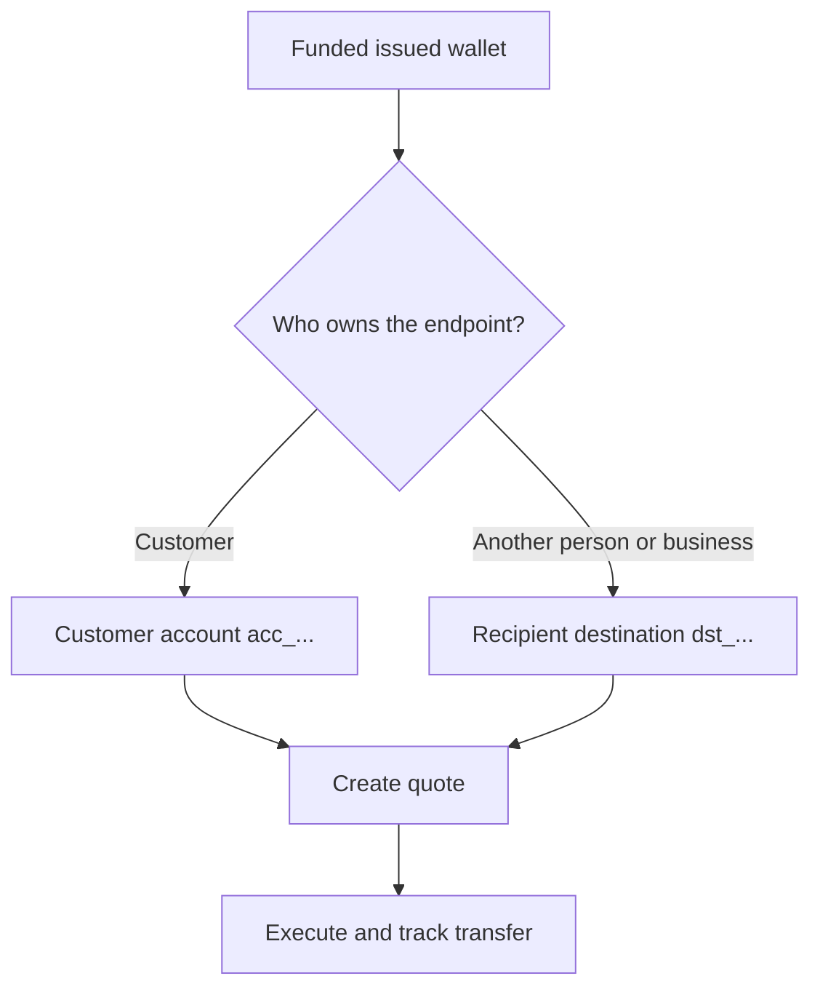

प्रत्येक payout एक ready, funded issued wallet से शुरू होता है। Destination model इस पर निर्भर करता है कि endpoint का स्वामी कौन है।



## शुरू करने से पहले

Source wallet को पुन: प्राप्त करें। पुष्टि करें कि इसकी वर्तमान status payout की अनुमति देती है और इसका available balance इच्छित source amount को cover करता है। इसकी response से प्राप्त ID को `SOURCE_WALLET_ID` के रूप में संग्रहीत करें।

आपको वर्तमान customer और चयनित destination के लिए एक ready payout capability भी चाहिए।

## 1. Destination तैयार करें

<Tabs>
  <Tab title="First-party">

एक customer-owned external bank account का उपयोग तब करें जब customer endpoint का स्वामी हो। इसे [`POST /v3/customers/{customerId}/accounts`](/api-reference/accounts/post-v3-customers-by-customer-id-accounts) और इन headers के साथ बनाएँ:

```http
X-API-Key: ${SWIPELUX_API_KEY}
Idempotency-Key: payout-account-001
Content-Type: application/json
```

```json
{
  "origin": "external",
  "type": "bank",
  "methods": ["ach", "wire"],
  "country": "US",
  "currency": "USD",
  "details": {
    "routingNumber": "021000021",
    "accountNumber": "123456789",
    "accountType": "checking",
    "bankName": "Example Bank",
    "accountHolderName": "Acme Payments SAS"
  },
  "label": "Customer operating account"
}
```

इसे [`GET /v3/customers/{customerId}/accounts/{accountId}`](/api-reference/accounts/get-v3-customers-by-customer-id-accounts-by-account-id) के साथ पढ़ें। केवल तब जारी रखें जब इसकी वर्तमान status payout की अनुमति देती है। इसके `acc_` ID को `PAYOUT_DESTINATION_ID` के रूप में संग्रहीत करें।

  </Tab>
  <Tab title="Third-party">

[Recipients और destinations](/hi/integration/recipients) के माध्यम से व्यक्ति या व्यवसाय और उनका bank या wallet endpoint बनाएँ। केवल तब जारी रखें जब destination ready हो।

लौटाए गए `dst_` ID को `PAYOUT_DESTINATION_ID` के रूप में संग्रहीत करें। Recipient के `rcp_` ID का उपयोग quote destination के रूप में न करें।

  </Tab>
</Tabs>

## 2. Payout quote बनाएँ

इन headers के साथ [`POST /v3/quotes`](/api-reference/money-movement/post-v3-quotes) का उपयोग करें:

```http
X-API-Key: ${SWIPELUX_API_KEY}
Idempotency-Key: payout-quote-001
Content-Type: application/json
```

```json
{
  "customerId": "${CUSTOMER_ID}",
  "capabilityId": "${CAPABILITY_ID}",
  "in": {
    "amount": "150.00",
    "currency": "USDC",
    "accountId": "${SOURCE_WALLET_ID}"
  },
  "destinationId": "${PAYOUT_DESTINATION_ID}",
  "out": {
    "currency": "USD"
  }
}
```

`data.id` को `QUOTE_ID` के रूप में संग्रहीत करें और लौटाए गए price और fees प्रस्तुत करें।

## 3. Payout execute करें

Transfer को [`POST /v3/transfers`](/api-reference/money-movement/post-v3-transfers) के साथ बनाएँ। इस इच्छित execution के लिए एक नई key का उपयोग करें:

```http
X-API-Key: ${SWIPELUX_API_KEY}
Idempotency-Key: payout-transfer-001
Content-Type: application/json
```

```json
{
  "quoteId": "${QUOTE_ID}"
}
```

Transfer `data.id` को `TRANSFER_ID` के रूप में संग्रहीत करें। एक सफल create payout शुरू करता है; यह delivery साबित नहीं करता।

## 4. Delivery track करें

Creation के बाद और प्रत्येक event के बाद [`GET /v3/transfers/{transferId}`](/api-reference/money-movement/get-v3-transfers-by-transfer-id) पढ़ें। नवीनतम `data.state`, `data.stateDetail`, और `data.openTaskIds` का उपयोग करके तय करें कि प्रतीक्षा करें, कार्य करें, या terminal outcome दिखाएँ।

आगे, सटीक amounts, सुरक्षित execution recovery, और transfer tasks के लिए [Quotes और transfers](/hi/integration/quotes-and-transfers) की समीक्षा करें।
