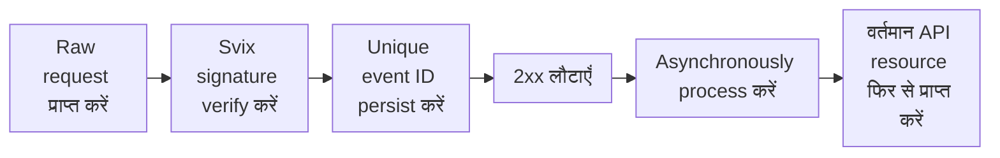

Asynchronous changes पर प्रतिक्रिया करने के लिए webhooks का उपयोग करें। Delivery कम से कम एक बार है, इसलिए duplicate, delayed, और out-of-order events सामान्य हैं।


```mermaid
%%{init: {"flowchart": {"rankSpacing": 20, "nodeSpacing": 16, "wrappingWidth": 80, "padding": 8}}}%%
flowchart LR
  A["Raw request प्राप्त करें"] --> B["Svix signature verify करें"]
  B --> C["Unique event ID persist करें"]
  C --> D["2xx लौटाएँ"]
  D --> E["Asynchronously process करें"]
  E --> F["वर्तमान API resource फिर से प्राप्त करें"]
```

## केवल आवश्यक events register करें

एक endpoint को [`POST /v3/webhooks`](/api-reference/webhooks/post-v3-webhooks) के साथ बनाएँ। केवल दस्तावेज़ीकृत events की सदस्यता लें जो आपके integration को drive करते हैं। यह उदाहरण [`transfer.state_changed`](/api-reference/webhooks/transfer-state-changed) का उपयोग करता है।

```bash Create webhook endpoint
export API_BASE='https://platform.swipelux.com'
export SWIPELUX_API_KEY='replace-with-your-api-key'

curl --request POST \
  "${API_BASE}/v3/webhooks" \
  --header "X-API-Key: ${SWIPELUX_API_KEY}" \
  --header "Idempotency-Key: webhook-endpoint-001" \
  --header "Content-Type: application/json" \
  --data @- <<'JSON'
{
  "url": "https://example.com/webhooks/swipelux",
  "events": ["transfer.state_changed"]
}
JSON
```

Response `data.id` को `WEBHOOK_ID` के रूप में संग्रहीत करें। [`GET /v3/webhooks/portal`](/api-reference/webhooks/get-v3-webhooks-portal) द्वारा लौटाए गए portal को खोलें, इस endpoint की signing secret प्राप्त करें, और इसे अपनी API key से अलग एक secret manager में संग्रहीत करें।

Portal v3 events को resource के अनुसार group करता है: Customers, Capabilities, Accounts, Recipients, Transfers, और API। प्रत्येक event अपना payload schema और एक example दिखाता है। Legacy events deprecated के रूप में mark किए जाते हैं और एक अलग Legacy group में list किए जाते हैं। यदि आपका endpoint पहले से किसी legacy event को subscribe करता है, तो उसे वह event मिलता रहेगा। नए subscriptions के लिए v3 event names चुनें।

## किसी endpoint के events बदलें {#change-an-endpoints-events}

[`GET /v3/webhooks/{webhookId}`](/api-reference/webhooks/get-v3-webhooks-by-webhook-id) के साथ एक endpoint पढ़ें। Response का `events` shape [`GET /v3/webhooks`](/api-reference/webhooks/get-v3-webhooks) जैसा ही होता है। इसमें signing secret कभी शामिल नहीं होती। Reads के लिए `webhooks:read` आवश्यक है और अज्ञात endpoint ID के लिए ये `404 not_found` लौटाते हैं।

Endpoint को [`PATCH /v3/webhooks/{webhookId}`](/api-reference/webhooks/patch-v3-webhooks-by-webhook-id) के साथ update करें। एक `Idempotency-Key` header भेजें। Updates के लिए `webhooks:write` आवश्यक है।

- वर्तमान URL बनाए रखने के लिए केवल `events` भेजें।
- वर्तमान event selection बनाए रखने के लिए केवल `url` भेजें।
- `events` पूरे selection को replace करता है। पहले endpoint पढ़ें और हर वह event शामिल करें जिसकी आपको अभी भी आवश्यकता है।
- नए subscriptions को v3 event names का उपयोग करना होगा।
- यदि endpoint पहले से किसी legacy event name को subscribe करता है, तो आप उसे बनाए रख सकते हैं। नया legacy name जोड़ने पर `400 validation_error` लौटता है।

यह body URL को बनाए रखती है और selection को replace करती है:

```json Request body
{
  "events": ["transfer.state_changed", "capability.status_changed"]
}
```

## Parsing से पहले verify करें

Swipelux नए webhook integrations को Svix के माध्यम से deliver करता है। अपनी endpoint signing secret और इन headers के साथ raw request body को verify करें:

- `svix-id`
- `svix-timestamp`
- `svix-signature`

Verification सफल होने से पहले JSON parse न करें या side effects का कारण न बनें।

```javascript Verify signature
import { Webhook } from "svix";

const verifier = new Webhook(process.env.SWIPELUX_WEBHOOK_SECRET);

export async function handleSwipeluxWebhook(request) {
  const rawBody = await request.text();
  const event = verifier.verify(rawBody, {
    "svix-id": request.headers.get("svix-id"),
    "svix-timestamp": request.headers.get("svix-timestamp"),
    "svix-signature": request.headers.get("svix-signature"),
  });

  await webhookInbox.insertIfAbsent({
    id: event.id,
    payload: event,
    status: "pending",
  });

  return new Response(null, { status: 204 });
}
```

अनुपस्थित या अमान्य signatures वाले requests को अस्वीकार करें। Verification पूरा होने तक raw body उपलब्ध रखें।

## Persist, acknowledge, फिर process

Envelope `id` पर एक uniqueness constraint लगाएँ। Verified envelope को persist करें, तुरंत `2xx` लौटाएँ, फिर इसे asynchronously process करें।

यदि event ID पहले से मौजूद है, तो पूर्ण किए गए side effects को दोहराए बिना delivery को acknowledge करें। अपनी retry queue के माध्यम से pending या failed local work को फिर से शुरू करें। Envelope `attempt` field को deduplication key या transport retry counter के रूप में उपयोग न करें।

## वर्तमान state पुन: प्राप्त करें

Webhook order एक authoritative resource history नहीं है। Object का पता लगाने के लिए `resource.type` और `resource.id` का उपयोग करें, फिर अपने system को update करने से पहले इसकी वर्तमान state प्राप्त करें।

एक transfer event के लिए, [`GET /v3/transfers/{transferId}`](/api-reference/money-movement/get-v3-transfers-by-transfer-id) को call करें:

```bash Refetch transfer
curl --request GET \
  "${API_BASE}/v3/transfers/${TRANSFER_ID}" \
  --header "X-API-Key: ${SWIPELUX_API_KEY}"
```

वर्तमान API response से customer-visible status और downstream actions को drive करें। Side effects को इस तरह design करें कि यदि दो workers संबंधित events को अलग order में process करें तो सुरक्षित रहें।

## Deliveries recover करें

Delivery logs खोलने, failed deliveries retry करने, या manual replay शुरू करने के लिए [`GET /v3/webhooks/portal`](/api-reference/webhooks/get-v3-webhooks-portal) का उपयोग करें।

प्रत्येक replay को उसी signature verification और durable inbox से गुजरना होगा। Downtime के बाद recover करने के लिए, प्रभावित window को replay करें और प्रत्येक संदर्भित resource को पुन: प्राप्त करें। पूर्ण किए गए event IDs no-ops रहते हैं; अपूर्ण records asynchronously फिर से शुरू होते हैं।

आगे, sandbox में duplicate और out-of-order deliveries को verify करें, फिर [Go live](/hi/integration/go-live) checklist पूरी करें।
