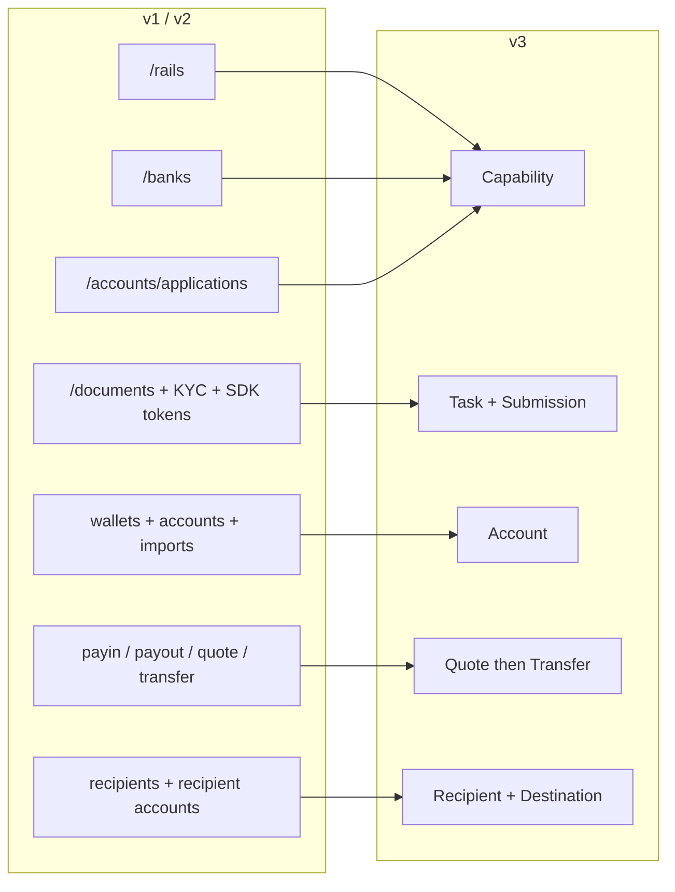
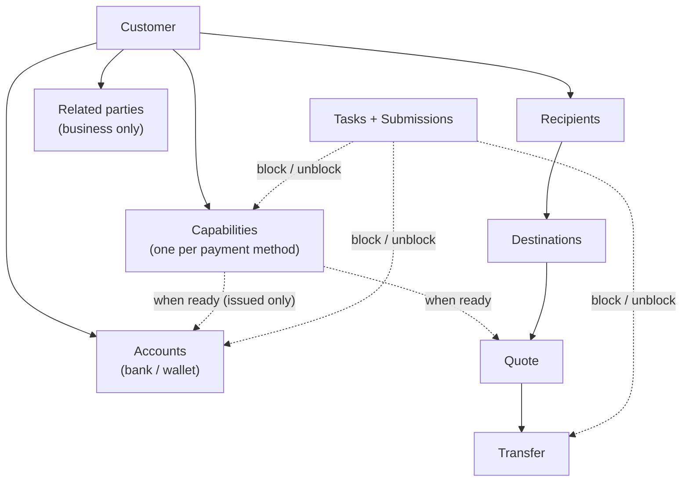
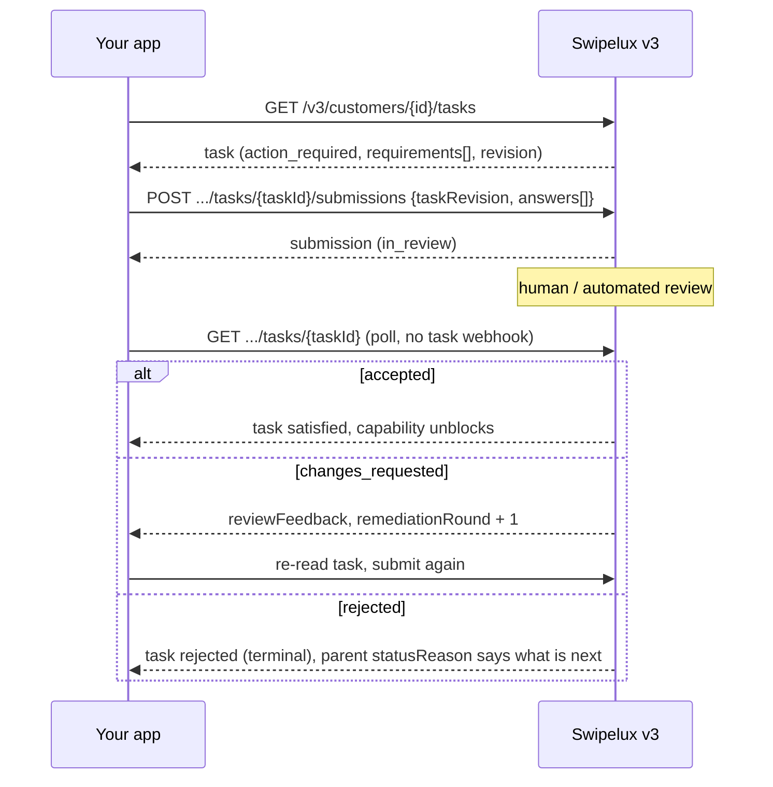
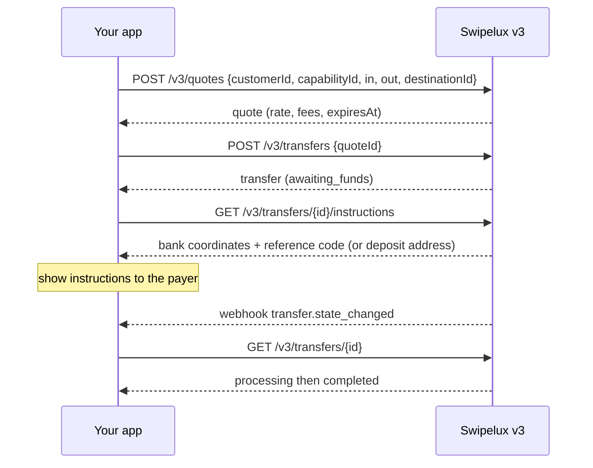
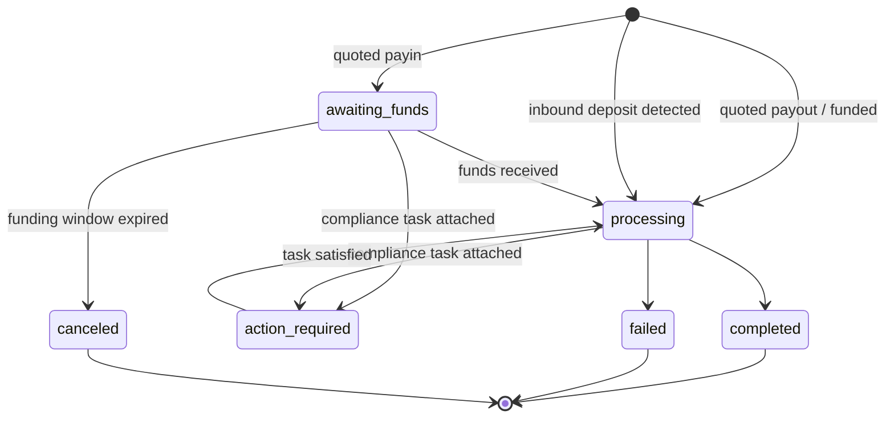
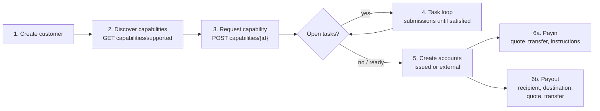

Migráld az integrációdat v1 és v2 API-ról v3-ra két lépésben:

- **1. rész, a koncepció.** Ezt olvasd el először. A v3 nem átnevezés, hanem újratervezés: ha a régi végpontokat egy az egyben leképezed, hadakozni fogsz az API-val. Az itt eltöltött tíz perc napokat spórol később.
- **2. rész, az API.** Végpontonkénti leképezés, kéréspéldák, állapotgépek és egy migrációs ellenőrzőlista.

A produkciós OpenAPI specifikációra alapozva ([platform.swipelux.com/openapi.json](https://platform.swipelux.com/openapi.json)). A v1 és v2 továbbra is él, és még nincsenek elavultnak nyilvánítva; minden új képesség-, címzett-, feladat- és árajánlati funkció kizárólag v3-on kerül kiadásra. Iratkozz fel az `api.deprecation` webhook eseményre a kivezetési értesítésekhez.

<Info>
  **Tartalom.** 1. rész: 1.1 miért létezik a v3, 1.2 objektummodell, 1.3 képességenkénti készenlét, 1.4 feladathurok, 1.5 pénzmozgás, 1.6 állapotgépek, 1.7 konvenciók, 1.8 aranyút. 2. rész: 2.1 ügyfelek, 2.2 képességek, 2.3 feladatok és beadványok, 2.4 számlák, 2.5 címzettek és rendeltetési helyek, 2.6 árajánlatok és átutalások, 2.7 webhookok, 2.8 sandbox, 2.9 örökölt végpontok, 2.10 migrációs sorrend, 2.11 buktatók ellenőrzőlistája.
</Info>

---

## 1. rész, a koncepció

### 1.1 Miért létezik a v3

A v1 és v2 négy egymással átfedő módot fejlesztett ki arra, hogy egy ügyfelet fizetésre kész állapotba hozzon: `/rails`, `/banks`, `/accounts/applications` és az üzleti `rail-applications` felület, mindegyik saját státuszszókészlettel. A dokumentumgyűjtés (`/documents`, KYC importok, verifikációs SDK tokenek) el volt választva attól, amit valójában feloldott. A v3 mindezt hat erőforrássá tömöríti: az ügyfél plusz öt dolog, amit birtokol:



| Erőforrás | Egysoros meghatározás |
| --- | --- |
| **Customer** | A személy vagy vállalkozás. **Nincs publikus státuszmezője**, a készenlét a képességeken él. |
| **Capability** | Egy fizetési mód, amit az ügyfél használhat (`sepa`, `ach`, `swift`, `stablecoin_transfers` stb.), saját státusszal. Kiváltja a `/rails`, `/banks` és a számlaigénylési belépési pontokat. |
| **Task** | A Swipelux által igényelt munkaegység (adat, dokumentumok, verifikáció), amit egy **Submission** válaszol meg. Kiváltja a dokumentum- és KYC-felületet. |
| **Account** | Egy fizetési végpont, amelyet az ügyfél birtokol: `bank` vagy `wallet`, `issued` (a Swipelux által kiállított) vagy `external`. |
| **Recipient / Destination** | A kifizetés kedvezményezettje (ki) és a hozzá tartozó banki vagy tárca-végpont (hova). |
| **Quote / Transfer** | Minden pénzmozgás. Egy átutalás egy megőrzött árajánlatot hajt végre; az árajánlat nélküli átutalások megszűntek. |

### 1.2 Az objektummodell



Két strukturális szabály, amit érdemes elsajátítani:

1. **A képességek mindent kapuznak.** A számlák egy `ready` képesség alatt kerülnek kiállításra; az árajánlatok egy képesség ellenében árazódnak. A regisztráció az, hogy a szükséges képességeket `ready` állapotba juttatod.
2. **A feladatok bárhová kapcsolódhatnak.** Egy képesség, egy számla vagy egy futó átutalás is hordozhat `openTaskIds` mezőt. Bárhol is látod, a hurok ugyanaz: feladat olvasása, válaszok beküldése, felülvizsgálat kivárása, szülő újraolvasása.

### 1.3 A készenlét képességenkénti, nem ügyfélenkénti

A v1 összekeverte a `/rails` készenlétet egy ügyfélszintű KYC kapuval. A v3-ban nincs ügyfélstátusz: egy ügyfél teljesen használható lehet `stablecoin_transfers`-en, miközben a `sepa` képességének még nyitott feladatai vannak. A pooled-számlás képességek általában gyorsabban válnak `ready`-vé, mint a nevesítettek, így kezdj el tranzakciózni azon, ami `ready`, ne várj mindenre.

Ha a v1 vagy v2 kódod az ügyfél verifikációs státuszáról vezérli az UI jelvényeit, írd át:

- „Tud tranzakciózni X-en?” azzá válik, hogy X képesség `status == "ready"`.
- „Tenniük kell valamit?” azzá válik, hogy van-e olyan feladat, amelynek státusza `action_required` (a képesség jellemzően `restricted`-et mutat, `statusReason.resolution: "complete_tasks"` értékkel).
- „A Swipeluxra várunk?” azzá válik, hogy feladatok `in_review`, képesség `pending` állapotban.

### 1.4 A feladathurok

Mindazt, amit a régi dokumentum- és KYC-felület csinált, most ez az egyetlen hurok végzi:



Kulcstulajdonságok:

- Egy feladat `requirements[]` tömböt hordoz, ezek az egyéni kérések. Mindegyiknek van egy feladatonkénti `requirementId` azonosítója, egy stabil `key` mezője, amely megnevezi a kérést (például lakcímigazolás, ez alapján deduplikáld az UI-t), valamint egy típusos `request` mező, amely pontosan leírja a várt bemenetet (szöveg, dátum, választás, dokumentum, nyilatkozat stb.).
- A beküldés **felülvizsgálatköteles**: soha nem módosítja közvetlenül a képesség vagy a számla állapotát, csak az elfogadás. Egy kivétel: a `profile` válaszok beküldéskor átírják az ügyfélprofilt (2.3). Beküldés után pollozd a feladatot vagy a szülő erőforrást.
- A `taskRevision` (a feladat `revision`-jének visszaküldése) egyidejűségi őr: ha a feladat megváltozott, mióta beolvastad, olvasd újra és építsd újra a válaszokat.
- Az `absence` egy elsőrangú válasz („nem rendelkezem ezzel, mert...”), használd ezt ahelyett, hogy a követelményeket megválaszolatlanul hagynád.

### 1.5 Pénzmozgás

Egy folyamat a befizetésekre, kifizetésekre és stablecoin-mozgásokra. **Nincs iránybemenet**, soha nem deklarálod, hogy befizetés vs. kifizetés. A be- és kimeneti pénznem alakja egy csak olvasható `direction` mezőt vezet le az árajánlaton és az átutaláson: `fiat_to_stablecoin` (befizetés), `stablecoin_to_fiat` (kifizetés) vagy `stablecoin_move`.



### 1.6 Erőforrásonként egy állapotgép

Minden státuszt hordozó erőforrásnak saját enumja van, és minden nem-boldog státusz strukturált okot hordoz. A számlák, igénylések és átutalások osztoznak a `{ code, message, actor, retryable }` alakon: a számlák és igénylések `statusReason`-ként, az átutalások `stateDetail`-ként teszik közzé. Az `actor` megmondja, kinek kell cselekednie (`customer`, `developer`, `provider`, `network`, `swipelux`), a `retryable` pedig, hogy segít-e az újrapróbálás. A képességek `{ code, resolution, message }` formát használnak, ahol a `resolution` (`complete_tasks`, `wait`, `contact_support`, `none`) megmondja, mi viszi tovább a képességet. A `code` értékek nyílt, csak bővíthető katalógus: ágazz el `resolution` (vagy `actor` plusz `retryable`) alapján, és toleráld a soha nem látott kódokat.

| Erőforrás | Állapotok |
| --- | --- |
| Capability | `pending`, `restricted`, `ready`, `rejected`, `canceled` |
| Application (kérésenkénti próbálkozás egy képesség alatt, 2.2) | `requested`, `in_review`, `action_required`, `ready`, `rejected`, `disabled`, `canceled` |
| Task | `action_required`, `in_review`, `satisfied`, `rejected`, `canceled` |
| Submission | `in_review`, `accepted`, `changes_requested`, `rejected` |
| Account | `provisioning`, `in_review`, `ready`, `action_required`, `suspended`, `rejected`, `archived` |
| Quote | `active`, `executed`, `expired`, `failed` |
| Transfer | `awaiting_funds`, `processing`, `action_required`, `completed`, `failed`, `canceled` |
| Recipient | `active`, `rejected`, `archived` |
| Destination | `in_review`, `ready`, `action_required`, `archived` |

Az útmutató nem járja végig ezeket az állapotokat (`rejected`, `suspended`, `disabled`, `failed`, `canceled`), ezek terminálisak vagy támogatásvezéreltek; erőforrásonkénti definíciók a specifikációban.

A Transfer, kifejtve:



### 1.7 Konvenciók

| Terület | v1 / v2 | v3 |
| --- | --- | --- |
| Hitelesítés | `X-API-Key` fejléc | Ugyanaz. A környezetet (produkció vs. sandbox) a kulcs választja meg; egyetlen base URL. |
| Idempotencia | Nem kényszerítve | `Idempotency-Key` fejléc **kötelező minden hatással bíró kérésen** (POST, PATCH, PUT, DELETE), a sandbox végpontok kivételével. Ugyanaz a kulcs ugyanazzal a testtel megismétli az eredeti választ. |
| Pénz | Vegyes számok és stringek | Csak stringek (`"amount": "150.00"`). Soha nem lebegőpontos. |
| Lapozás | Offset/limit változatok | Kurzor: a listák `{ data, nextCursor, hasMore }` értéket adnak vissza. |
| Frissítések | PUT-központú | `PATCH` részleges frissítések. |
| Webhookok | Egyetlen végpont-konfiguráció | Több végpont, eseményenkénti feliratkozás. Az események **jelzések**, az olvasás az igazság (2.7). |

Idempotencia-szabályok, amelyeket érdemes elsajátítani, mielőtt kódot írsz:

- Ugyanazon kulcs újrahasználata **eltérő** testtel `409 idempotency_conflict`, ameddig a kulcsot megőrizzük (legalább 7 nap), ezért soha ne tervezz kulcs-újrahasználatot. Generálj friss UUID-t minden logikai művelethez, és tárold a feladattal együtt.
- Az újrajátszás a hibákat is lefedi: ha az eredeti kérés terminális 4xx-szel végződött, ugyanaz a kulcs plusz test újra ugyanazt a problémaválaszt adja vissza.
- Két egyidejű kérés ugyanazzal a kulccsal: az egyik nyer, a másik `409`-et kap. Az újrapróbálást a vesztes csak azután végezze el, hogy a nyertes lezárult; az újrajátszás az eredeti választ adja vissza.

### 1.8 Az aranyút



---

## 2. rész, az API

### 2.1 Ügyfelek

| v1 / v2 | v3 |
| --- | --- |
| `POST /v1/customers`, `POST /v1/customers/business`, `POST /v2/customers` | `POST /v3/customers` (egy végpont, `type: individual \| business`) |
| `GET/PUT/DELETE /v1/customers/{id}`, `/v1/customers/business/{id}`, `/v2/customers/{customerId}` | `GET/PATCH/DELETE /v3/customers/{customerId}` |
| `GET /v1/customers` (lista) | `GET /v3/customers` (kurzor-lapozott, beágyazott képesség-összefoglalókkal) |
| `GET /v1/customers/balances` (kötegelt), `GET /v1/customers/{id}/balances` | Nincs egyenleg-végpont, az egyenlegek a számlákon élnek: olvasd a `balances`-t a `GET /v3/customers/{customerId}/accounts` végponton |
| `POST/GET .../shareholders` (v1 üzleti) | `POST/GET /v3/customers/{customerId}/related-parties` (plusz `GET/PATCH/DELETE .../related-parties/{relatedPartyId}`) |
| `POST /v1/customers/business/{id}/kyb` (beküldés), `GET .../kyb` (státusz) | Nincs KYB-beküldő hívás, kérj egy képességet (2.2) és válaszolj a feladataira (2.3); a verdikt képesség- és feladatállapotként jelenik meg |
| `POST /v1/customers/{id}/kyc`, `.../kyc/import`, SDK token végpontok | Feladatrendszer (2.3); a hosztolt verifikáció `verificationSessions`-ként jelenik meg a feladatokon belül |

Létrehozás, `type` szerinti diszkriminációval (illusztratív értékek, mezőnevek a specifikáció szerint):

```jsonc
// POST /v3/customers        Idempotency-Key: <fresh uuid>
{
  "type": "individual",
  "externalId": "user-1042",
  "individual": {
    "firstName": "Maria",
    "lastName": "Silva",
    "birthDate": "1990-04-12",
    "nationalities": ["BR"],
    "residenceCountry": "BR",
    "email": "maria@example.com",
    "residentialAddress": {
      "streetLine1": "Av. Paulista 1000",
      "city": "Sao Paulo",
      "postalCode": "01310-100",
      "country": "BR"
    }
  },
  "financialProfile": {
    "accountPurposes": ["cross_border_remittance"],
    "sourcesOfFunds": ["salary"]
  }
}
```

- **A létrehozás progresszív**: önmagában a `{ "type": "individual" }` is érvényes létrehozás. A hiányzó tények soha nem érvénytelenítik az ügyfelet, hanem később bevételi feladatokként jelennek meg az azokat igénylő képességeken.
- Az üzleti ügyfelek `business` mezőt plusz regisztrációs adatokat hordoznak. A v1 részvényes-CRUD-ja **kapcsolt felekre** képeződik le, kiterjesztve az igazgatókra, tisztségviselőkre és tulajdonosokra: hozz létre őket inline az ügyfél létrehozásakor (mindegyik stabil `rp_` azonosítót kap), vagy kezeld őket a dedikált kapcsolt-fél végpontokon keresztül.
- **Nincs ügyfél `status` mező**, lásd 1.3.
- **A meglévő ügyfelek átvihetők**: a v1-en vagy v2-n létrehozott ügyfelek ugyanazzal az azonosítóval címezhetők a v3 végpontokon. A v3 olvasás egy _szanitizált nézet_, azok az örökölt értékek, amelyek nem felelnek meg a v3 validációnak, hiányzóként jönnek vissza. Az **első v3 írás után ez a nézet állandósul**: a hiányzó értékek nem térnek vissza maguktól. Ezért gazdagíts korán, tervezz egy egyszeri lépést, amely a saját nyilvántartásaidból `PATCH`-el a teljes profilt, mielőtt v3 olvasásokra támaszkodnál. A v1 `metadata` külön névtér, és **nem** kerül átvitelre, állítsd be újra a v3-on.
- Az `externalId` elsőrangú és **egyedi az ügyfeleid között** a v3-on, környezetenként (`409 duplicate_external_id`). Egy ügyfél archiválása nem szabadítja fel az `externalId`-t, tisztítsd PATCH-csel a DELETE előtt, ha újra akarod használni.
- A `DELETE` egy **archiválási kaszkád** (nincs visszaállítás; az azonosítókat soha nem használjuk újra). Blokkolt `409 customer_has_active_resources` plusz `blockingResources[]` üzenettel, amíg bármely nem archivált számla vagy folyamatban lévő átutalás létezik.
- PATCH merge szabályok: az explicit `null` töröl egy nullázható mezőt, a tömbök teljesen felülíródnak (kivéve az inline kapcsolt feleket, amelyek azonosító szerint upsert-elődnek), a `metadata` kulcsok merge-elődnek. A teljes sémák és listaszűrők az OpenAPI specifikációban vannak.

### 2.2 A `/rails`, `/banks` és igénylések Képességekké válnak

| v1 / v2 | v3 |
| --- | --- |
| `GET /v1/.../rails/capabilities` | `GET /v3/customers/{customerId}/capabilities/supported` |
| `GET /v2/.../banks` (plusz `/banks/{bank}`), `GET /v2/meta/banks` | `GET /v3/customers/{customerId}/capabilities/supported` |
| `GET /v1/customers/{customerId}/rails` (lista) | `GET /v3/customers/{customerId}/capabilities` |
| `GET /v2/customers/{customerId}/rails` (áttekintés) | `GET /v3/customers/{customerId}/capabilities` |
| `POST /v1/.../rails`, `POST /v2/.../banks` | `POST /v3/customers/{customerId}/capabilities/{capabilityId}` |
| `POST /v2/.../accounts/applications` | `POST /v3/customers/{customerId}/capabilities/{capabilityId}` |
| `GET /v1/.../rails/{rail}` | `GET /v3/.../capabilities/{capabilityId}` |
| `GET /v2/.../accounts/applications` (plusz `/{applicationId}`, `/{applicationId}/history`) | `GET /v3/.../capabilities/{capabilityId}` (plusz `/applications`, `/applications/{id}/history`) |
| Üzleti rail felület: `GET/POST /v2/customers/business/{customerId}/rail-applications` (plusz `/{rail}`) | Ugyanazok a v3 képesség-végpontok, nincs külön üzleti felület |
| Üzleti rail felület: `GET .../business/{customerId}/rails` (plusz `/{rail}`) | Ugyanazok a v3 képesség-végpontok, nincs külön üzleti felület |
| `GET /v1/meta/rails` (statikus katalógus) | `GET /v3/customers/{customerId}/capabilities/supported`, az elérhetőség ügyfelenkénti; nincs statikus katalógus |
| `GET /v1/meta/accounts/banks` | `GET /v3/institutions` (bankjegyzék: id, név, BIC, országok) |
| Nem elérhető | `GET /v3/capabilities`, kereskedő-szintű lista az összes ügyfélnek adott képességekről (szűrés `status`, `method`, `customerId` szerint) |
| Nem elérhető | `GET /v3/.../capabilities/{capabilityId}/tasks-preview` (kérések megtekintése igénylés előtt) |
| Nem elérhető | `POST /v3/.../capabilities/{capabilityId}/cancel` |

- Egy képesség egyenlő: `method` (`ach`, `wire`, `rtp`, `pix`, `sepa`, `swift`, `spei`, `pse`, `transfers_3_0`, `faster_payments`, `sepa_instant`, `uaefts`, `card`, `stablecoin_transfers` stb.) plusz `accountType` (`pooled` vagy `named`, `null` nem-banki módoknál) plusz `directions` (`payin` vagy `payout`). A publikus `capabilityId` a minősített pár (`sepa_pooled`, `ach_named`) vagy a puszta módszer a `card` és `stablecoin_transfers` esetén.
- Minden képesség-igénylés egy **application**-t szül, a próbálkozásonkénti rekordot a `.../capabilities/{capabilityId}/applications` (plusz `/{applicationId}/history`) alatt, saját státuszokkal (1.6) és `statusReason`-nel. Ez egy kérés audit-nyoma; a napi munkához pollozd magát a képességet.
- A `capabilities/supported` visszaadja az elérhetőséget (`available`, `beta` vagy `disabled`), a jogosultságot és a kínált intézményeket. A bankválasztás a kérési időben történik az opcionális `institutions` tömbön keresztül, nincs külön `/banks` erőforrás. A kihagyása (vagy `[]` küldése) minden alapértelmezett intézményt kiválaszt; az `isDefault: true` egy ügyfél- és képesség-specifikus jelző, nem globális. Egy nem üres lista felülírja az alapértelmezéseket, és egy bank-alapú képesség, amelyre nem érvényes alapértelmezett, `422 capability_institutions_required` hibát ad. Az intézmény-azonosítók átlátszatlanok, toleráld az újakat.
- A `stablecoin_transfers` **automatikusan biztosított az ügyfél létrehozásakor** és `ready` állapotban születik (tehát soha nem kérik, és nem törölhető). A `card` csak egyéni ügyfeleknél.
- A képességen található `openTaskIds` a „mi a következő teendőm” mutatód. A nyitott azt jelenti: `action_required` **vagy** `in_review`, és a gyűjtés tartalmazza az aktív függőségeken keresztül elért közös ügyfélszintű feladatokat is.
- A `cancel` csak `pending` vagy `restricted` állapotból működik **és** blokkoló erőforrások nélkül, egyébként `409 capability_not_cancelable`, amelynek problématestje felsorolja a `blockingResources`-t. A törlés utáni újraigénylés egy friss létrehozás új idempotenciakulccsal.
- **Pollozd a GET-et.** A képesség állapota olvasáskor frissül; pollozd a `GET .../capabilities/{capabilityId}`-t, vagy iratkozz fel a `capability.status_changed`-re, ne cache-elj.
- Egy módszer kérése egyszerre teheti elérhetővé a kapcsolódó módszereket, kezeld a képességeket olyan halmazként, amit újraolvasol, nem pedig egyetlen sorként, amit követsz.
- Használd a `tasks-preview`-t, hogy megmutasd az onboarding-kéréseket, **mielőtt** elköteleződsz egy igénylés mellett.
- A verifikáció nem egyszeri: új feladatok jelenhetnek meg egy már `ready` képességen (periodikus vagy eseményvezérelt újraverifikáció). Tartsd bekötve a feladathurkot az ügyfél teljes életciklusára, ne csak az onboardingra.

### 2.3 A Dokumentumok és KYC Feladatokká és Beadványokká válnak

<Note>
  **Elnevezési megjegyzés.** Ezek a végpontok rövid ideig `requirements` és `fulfillments` néven kerültek kiadásra. 2026-08-02 óta a publikus nevek **tasks** és **submissions**. Az átnevezés csak az erőforrásokat és a végpontútvonalakat érintette, a feladaton belüli `requirements[]` tömb és annak `requirementId` mezője megtartják ezeket a neveket.
</Note>

Minden örökölt dokumentumfelület ugyanarra a cserére képeződik le: olvasd a `GET /v3/customers/{customerId}/tasks`-t, válaszolj a `POST .../tasks/{taskId}/submissions`-szel.

| v1 / v2 | v3 |
| --- | --- |
| `POST/GET/DELETE /v1/documents` | `GET /v3/.../tasks` plusz `POST .../tasks/{taskId}/submissions` |
| `POST /v1/customers/{id}/documents` | `GET /v3/.../tasks` plusz `POST .../tasks/{taskId}/submissions` |
| `GET/POST /v1/customers/business/{id}/documents` (plusz `PUT/DELETE .../{docId}`) | `GET /v3/.../tasks` plusz `POST .../tasks/{taskId}/submissions` |
| `GET/POST .../shareholders/{shareholderId}/documents` (plusz `GET/PUT/DELETE .../{docId}`) | `GET /v3/.../tasks` plusz `POST .../tasks/{taskId}/submissions` |
| `GET/POST/DELETE /v2/.../documents` (plusz `/{documentId}`) | `GET /v3/.../tasks` plusz `POST .../tasks/{taskId}/submissions` |
| `POST /v2/.../documents/upload-token` plusz `POST /v2/documents/direct-upload` | Megszűnt, tölts fel közvetlenül az API-kulcsoddal (lent) |
| `POST /v1/customers/documents/upload`, `POST /v1/document` (örökölt bevételek) | Megszűnt, tölts fel közvetlenül az API-kulcsoddal (lent) |
| `POST /v1/customers/{id}/kyc` plusz SDK tokenek | Feladat `verificationSessions` (hosztolt verifikáció); nincs közvetlen „KYC indítása” hívás |

A hurok körül:

- **Nyers fájltárolás**: `POST/GET/DELETE /v3/customers/{customerId}/documents` (plusz `/{documentId}`), tölts fel egyszer az API-kulcsoddal, majd hivatkozz a dokumentum-azonosítókra a beküldési válaszokban. Ez felváltja az összes upload-token és direct-upload bevételt.
- **Új olvasások**: `GET /v3/tasks` (kereskedő-szintű bejövő láda), `GET /v3/transfers/{transferId}/tasks`, `GET .../tasks/{taskId}/history`, `GET .../tasks/{taskId}/submissions` (plusz `/{submissionId}`).

Beküldés (illusztratív):

```jsonc
// POST /v3/customers/{cus}/tasks/{task}/submissions   Idempotency-Key: <fresh uuid>
{
  "taskRevision": 3,
  "answers": [
    { "requirementId": "req_a1", "answer": { "type": "document", "documentIds": ["doc_passport1"] } },
    { "requirementId": "req_b2", "answer": { "type": "text", "value": "Import/export business" } },
    { "requirementId": "req_c3", "answer": { "type": "absence", "reason": "not_applicable" } }
  ]
}
```

- Válasz-típusok: `profile`, `text`, `date`, `single_select`, `multi_select`, `boolean`, `attestation`, `document`, `resource_reference`, `absence`. Minden követelmény `request` objektuma megmondja, milyen típust vár.
- Egy beküldésnek meg kell válaszolnia **az aktuális kör minden cselekvésre váró követelményét**, azzal a pontos `taskRevision`-nel, amit beolvastál. A részleges beküldéseket elutasítjuk.
- A `profile` válaszok **átírnak**: frissítik az ügyfélprofilt a normál validációs úton, és azonnal újraértékelnek minden képességet, amely ugyanarra a bevételi munkára hivatkozik. Azok a testvér-bevételi feladatok, amelyek követelményei mind teljesülnek, automatikusan lezárulnak.
- A követelmények alternatív csoportokat alkothatnak (`alternativeKey`): pontosan egyet küldj be a csoportból.
- A `changes_requested` növeli a `remediationRound`-ot és `reviewFeedback`-et hordoz. Olvasd újra a feladatot, küldj be újra **friss idempotenciakulccsal**.
- A hosztolt verifikációs URL-ek **csak** az ügyfél-hatókörű feladatrészletben (`GET /v3/customers/{customerId}/tasks/{taskId}`) jelennek meg, és csak amíg a munkamenet cselekvésre kész; a listák és a `GET /v3/tasks/{taskId}` szándékosan URL-mentesek.
- A felhasználási feltételek is feladat: az `openTaskIds` tartalmazhat egy `category: "terms_of_service"` feladatot, amelynek hosztolt elfogadási oldala ugyanígy van linkelve (csak ügyfél-hatókörű részlet). Az általános beküldések nem fogadhatnak el feltételeket, és a KYC-jóváhagyás soha nem implikálja a feltételek elfogadását.
- A feladatok képességenkénti hatókörűek, így „ugyanaz” a kérés (például lakcímigazolás) képességenként egyszer jelenhet meg. Deduplikálj az UI-ban a követelmény `key` mezője alapján.
- **Nincs fordítási réteg**: a `/v1/documents`-re való posztolás nem oldja fel a v3 képességeket. Amint egy ügyfél v3-on van, vezess minden kérést feladatokon keresztül.

### 2.4 Számlák és tárcák

| v1 / v2 | v3 |
| --- | --- |
| `POST/GET /v1/.../accounts` (plusz `/import`), `/v2/.../accounts` (plusz `/import`) | `POST/GET /v3/customers/{customerId}/accounts` |
| `POST/GET /v1/.../wallets` (plusz `/import`) | Ugyanaz a végpont, `type: wallet` |
| `GET/DELETE /v1/customers/{customerId}/accounts/{accountId}` (és a tárcavariáns), `GET /v2/.../accounts/{accountId}` | `GET/PATCH/DELETE /v3/.../accounts/{accountId}` |
| `PATCH /v2/.../accounts/{accountId}/fees` | `GET/PUT /v3/.../accounts/{accountId}/fees` |

Létrehozás, `origin` plusz `type` szerinti diszkriminációval. A kiállított bankszámlák egyetlen `method`-ot vesznek fel; az külső bankszámlák helyette egy `methods` tömböt (`method` küldése ott elutasításra kerül):

```jsonc
// issued bank account (capability must be ready)
{ "origin": "issued", "type": "bank", "method": "sepa",
  "currency": "EUR", "settlement": { "accountId": "acc_wallet1" } }

// external wallet the customer already owns (replaces /import)
{ "origin": "external", "type": "wallet", "currency": "USDC",
  "network": "polygon", "details": { "address": "0x71C7656EC7ab88b098defB751B7401B5f6d8976F" } }
```

- A `country` kiállított bankszámlákon opcionális (metódusonként alapértelmezett); külső **bank**számlákon add meg explicit módon. A tárca-számlákon egyáltalán nincs ország.
- A `settlement.accountId` kötelező kiállított bankszámlákon: azt a kiállított tárca-számlát nevezi meg, amely megkapja a bankszámlára beérkező befizetésekből elszámolt pénzeszközöket.
- A kiállított számlák közzéteszik: `details` (IBAN vagy routing plusz számla vagy cím), verzionált `routing` (a befizetési koordináták forogva változhatnak, mindig a legfrissebb olvasást rendereld), `fees`, `balances`.
- Hálózatok: `polygon`, `ethereum`, `base`, `arbitrum`, `optimism`, `bsc`, `avalanche`.
- A képesség-kapu csak a **kiállított** számlákra vonatkozik: egy nem-ready képesség elleni létrehozás képességkódos hibával elbukik, kérd meg először a képességet (2.2). A külső számláknak nincs szükségük képességre (és ügyfél-jóváhagyásra sem); csak kérés-séma és bankadat-validációt kapnak.
- A kiállított bankszámlák `provisioning`-ban születnek `details: null`-lal. Pollozd a számlát vagy figyeld az `account.status_changed`-et, amíg `ready` nem lesz.
- A `DELETE` archivál, soha nem véglegesen töröl. A folyamatban lévő átutalások által hivatkozott számlák `409 account_has_active_transfers`-t adnak. Próbáld újra, miután azok az átutalások terminális állapotba kerülnek.
- Új a v3-ban: **Szabályok**, állandó utasítások egy kiállított tárca-számlán (`POST/GET /v3/customers/{customerId}/rules`, `GET/PATCH/DELETE .../rules/{ruleId}`), amelyek automatikusan átseperik a bejövő pénzeszközöket egy másik számlára vagy tárca-rendeltetésre. Nincs v1 vagy v2 megfelelője.

### 2.5 Címzettek és rendeltetési helyek

| v1 | v3 |
| --- | --- |
| `POST/GET /v1/.../recipients` | `POST/GET /v3/customers/{customerId}/recipients` |
| Nem elérhető (a v1 címzettek csak létrehozás és lista voltak) | `GET/PATCH/DELETE /v3/.../recipients/{recipientId}`, új részletezés, frissítés, archiválás |
| `POST/GET .../recipients/{recipientId}/accounts` | `POST/GET /v3/.../recipients/{recipientId}/destinations` |
| `GET/DELETE .../recipients/{recipientId}/accounts/{recipientAccountId}` | `GET/DELETE /v3/.../recipients/{recipientId}/destinations/{destinationId}` (nincs destination PATCH, archiváld és hozd létre újra) |

A v2-nek nem volt címzett-fogalma. Ha v2-n vagy és harmadik feleknek fizetsz ki, ez egy új felület, nem átnevezés.

- **Recipient** egyenlő azzal, hogy ki: `individual` (kereszt- és vezetéknév) vagy `business` (cégnév), kötelező `relationship` mezővel (`employee`, `contractor`, `vendor`, `subsidiary`, `merchant`, `customer`, `landlord`, `family`, `other`). A címzettek és rendeltetési helyek csak harmadik felekre vonatkoznak. Egy első felet érintő kifizetés egyáltalán nem használ címzettet: cél az ügyfél saját `acc_` számláinak egyike, mint az árajánlat `destinationId`-je (2.6).
- **Destination** egyenlő azzal, hogy hova: módszerenként típusos, `sepa` (iban, bic opcionális), `ach` vagy `wire` (routing plusz számla), `swift` (teljes koordináták plusz opcionális közvetítő), `spei` (clabe), `pse`, `transfers_3_0` (cbu) stb., plusz tárca-rendeltetések. Minden rendeltetésnek saját státusza van. Figyeld a `destination.status_changed`-et.
- A fiat rendeltetések a címzett teljes `address` mezőjét (utca, város, irányítószám, ország) **igénylik** létrehozás előtt. A hiányzó részek `422 recipient_address_required` hibával buknak el. A tárca-rendeltetések átugorják a címet, de felső szintű `ownership` mezőt igényelnek (`self_custodied`, vagy `custodial` egy letétkezelő nevével).
- A kedvezményezett-név pontossága számít: a fogadó bankok a számla **jogi** nevét egyeztetik. Küldd el a pontos jogi keresztnév plusz vezetéknevet vagy cégnevet, ne egy megjelenítési becenevet.
- A módszerenkénti rendeltetésmező-sémák az OpenAPI specifikációban vannak.

### 2.6 Árajánlatok és átutalások

| v1 / v2 | v3 |
| --- | --- |
| `POST /v1/payin/quote`, `/v1/payout/quote`, `/v2/quote` | `POST /v3/quotes` |
| `POST /v1/payin`, `/v1/payout`, `POST /v1/transfers`, `/v2/transfer` | `POST /v3/transfers` (végrehajt egy árajánlatot, az árajánlat nélküli létrehozások megszűntek) |
| `GET /v1/transfers` (lista), `GET /v1/transfers/{id}` | `GET /v3/transfers`, `/v3/transfers/{transferId}` |
| Nem elérhető (a v1 és v2 árajánlatoknak nem volt olvasása) | `GET /v3/quotes/{quoteId}` |
| `GET /v1/rate/{base}/{quote}` | `GET /v3/rates` |
| (implicit a payin válaszban) | `GET /v3/transfers/{transferId}/instructions` |
| Nem elérhető | `POST /v3/transfers/{transferId}/cancel`, `GET /v3/transfers/{transferId}/tasks` |

```jsonc
// 1. Quote: amount on exactly one side picks mode (exact_in / exact_out).
// POST /v3/quotes            Idempotency-Key: <fresh uuid>
{
  "customerId": "cus_123",
  "capabilityId": "sepa_named",
  "in":  { "currency": "EUR", "amount": "150.00" },
  "out": { "currency": "USDC" },
  "destinationId": "acc_wallet1",   // fiat-funded: must be a customer-owned acc_ account
  "fees": { "breakdown": { "developer": { "fixed": "1.00", "bips": 50 } } }
}
// -> { mode: "exact_in", direction: "fiat_to_stablecoin", rate, fees[], expiresAt, ... }

// 2. Execute before expiresAt.
// POST /v3/transfers         Idempotency-Key: <fresh uuid>
{ "quoteId": "quo_789", "externalId": "order-991", "memo": "invoice 44" }
```

- A `destinationId` egy `acc_` (ügyfél tulajdonában lévő számla) vagy `dst_` (címzett rendeltetése) azonosítót vesz fel. **A fiat-finanszírozású árajánlatoknak (befizetéseknek) egy `acc_` számlát kell megcélozniuk**, egy `dst_` cél mindig kifizetést jelent (egyébként `422 quote_direction_invalid`).
- Az árajánlatokon és átutalásokon szereplő `externalId` egy nem-egyedi korrelációs hivatkozás (visszaküldve az olvasásokon, szűrhető a listákon). A környezetenkénti egyediségi szabály (2.1) csak az ügyfél `externalId`-jére vonatkozik.
- Egy árajánlatot pontosan egyszer hajts végre, az `expiresAt` előtt. Egy lejárt árajánlat `409 quote_expired` hibával bukik el, egy második végrehajtás `409 quote_already_executed`-vel (a probléma hordozza a meglévő `transferId`-t).
- Az átutalás-visszavonás még nem támogatott: a `POST .../cancel` minden állapotban `409 transfer_not_cancelable`-t ad vissza. A mai `canceled` átutalások a finanszírozási ablak lejártából származnak egy finanszírozatlan befizetésnél, nem ebből a végpontból.
- A befizetések `awaiting_funds` állapotban kezdenek: rendereld a `GET .../instructions`-t a fizetőnek, banki koordinátákat plusz **hivatkozási vagy közleménykódot** fiat esetén, letéti címet kripto esetén. A hivatkozási kód az, ahogy a befizetést egyeztetjük. Mindig jelenítsd meg.
- `state` plusz `stateDetail` a gépileg olvasható alállapotokhoz; az `action_required` azt jelenti, hogy egy megfelelőségi feladat van csatolva (`openTaskIds`, `GET .../tasks`), válaszolj beadványokon keresztül.
- A kiállított számlákon észlelt bejövő befizetések átutalásokként jelennek meg `origin: "inbound_deposit"` (szemben a `"quoted"`-val).
- A fizetési hálózati hivatkozások a `references` alá vannak konszolidálva: `transactionHash`, `traceNumber`, `imad`, `uetr`, `explorerUrl`, `returnedTransferId`.

v1 státusz-fordítás:

| v1 fogalom | v3 |
| --- | --- |
| külön payin és payout objektumok | egy átutalás `direction`-nel |
| visszatérítések vagy szolgáltatói oldali visszavonások (a `failed`-be hajtogatva) | továbbra is `failed`, most gépileg olvasható `stateDetail`-lel és `references.returnedTransferId`-vel, amikor egy visszatérítés fordított átutalást szült |

Két migrációs figyelmeztetés:

- **Az átutalások nem lépnek át verziók között.** A v1-en vagy v2-n létrehozott átutalások nem olvashatók v3-ból. A lista kihagyja őket, és a `GET /v3/transfers/{transferId}` 404-et ad. Előbb a _létrehozást_ vágd át, tartsd meg a v1 olvasási utat, amíg azok az átutalások terminális állapotba nem jutnak, majd dobd el.
- **Nincs token-csere.** A `stablecoin_move` ugyanazt a be- és kimeneti pénznemet igényli: USDC-ről USDT-re `422 recipient_destination_invalid`-del bukik, `currency_mismatch` mezőhibát hordozva. Mindkét oldalon ugyanaz a hálózat, nincs bridge-elés, és a tárca-tárca mozgások jelenleg csak nulla díjas kézbesítést támogatnak: egy olyan árajánlat, amelynek platform- vagy fejlesztői díja nem nulla, `422 amount_not_deliverable`-lel bukik.

### 2.7 Webhookok

| v1 | v3 |
| --- | --- |
| `GET/PATCH /v1/webhooks` (egyetlen végpont-konfiguráció) | `POST/GET /v3/webhooks`, `PATCH/DELETE /v3/webhooks/{webhookId}`, `GET /v3/webhooks/portal` |

Eseménykatalógus: `customer.created`, `customer.updated`, `customer.archived`, `capability.created`, `capability.status_changed`, `application.status_changed`, `recipient.status_changed`, `destination.status_changed`, `account.created`, `account.status_changed`, `account.details_changed`, `transfer.created`, `transfer.state_changed`, `api.deprecation`.

- A `GET /v3/webhooks/portal` egy hosztolt kezelőportál URL-t ad vissza a kézbesítési naplókhoz, újrapróbálkozásokhoz és kézi újrajátszáshoz.
- A `transfer.created` jelenleg az örökölt v1 payload-alakban van kézbesítve (a v3 boríték aktiválódik, amikor a v1 webhookok lejárnak). Kezeld tisztán jelzésként, és GET-eld az átutalást; ne építs a testére.
- Az események jelzések: fogadáskor GET-eld az erőforrást, és az olvasás alapján cselekedj. Soha ne építs állapotot esemény-payloadokra vagy sorrendre. A kézbesítés legalább egyszeri, késleltetett vagy átrendezett lehet. Deduplikálj esemény-azonosító alapján, és pótold a kihagyott eseményeket minden lista inkluzív `updatedAfter` szűrőjével.
- Iratkozz fel az `api.deprecation`-re, ez a verziók kivezetésének gépi csatornája.
- Ma nincs `task.*` esemény: beküldés után pollozd a feladatot vagy a szülőjét.

### 2.8 Sandbox

Ugyanaz a base URL; a sandbox API-kulcs választja meg a környezetet.

| v1 | v3 |
| --- | --- |
| `POST /v1/sandbox/topup` | `POST /v3/sandbox/accounts/{accountId}/topup` |
| `POST /v1/sandbox/payins/simulate`, `.../payouts/simulate`, `POST /v1/customers/{id}/simulate-transactions` | `POST /v3/sandbox/transfers/{transferId}/state` (egy valódi átutalás állapotokon keresztül hajtása) |
| Nem elérhető | `POST /v3/sandbox/customers/{customerId}/verification` (verifikáció befejezése) |
| Nem elérhető | `POST /v3/sandbox/customers/{customerId}/capabilities/{capabilityId}/status` (képesség státuszának kényszerítése) |
| Nem elérhető | `POST /v3/sandbox/tasks`, `POST /v3/sandbox/tasks/{taskId}/review` (feladat létrehozása, majd a verdikt szimulálása) |

A v3 sandbox végponttól végpontig szimulálja a felülvizsgálati hurkot: hozz létre egy feladatot, küldj be rá, `review`-old `accepted` vagy `rejected` állapotra, figyeld a képesség feloldódását. Próbáld el a remediációs UX-et éles környezet előtt. Mind a sandboxban létrehozott feladatok, mind a kért képességeken megjelenő szokásos bevételi feladatok így felülvizsgálhatók; ahogy a produkcióban, itt sem tüzelnek feladat-webhookok, pollozz (2.7).

### 2.9 Örökölt végpontok v3 helyettesítés nélkül

Ezeknek nincs v3 helyettesítése. A legtöbb változatlanul v1-en marad (tartsd meg a meglévő hívásaidat); kettő teljesen kivezetésre kerül (lásd a rendelkezést):

| Végpont | Rendelkezés |
| --- | --- |
| `GET /v1/merchant-kyb/creation-gate`, `POST /v1/merchant-kyb/{customerId}/submit`, `POST /v1/merchant-kyb/parked-url`, `POST /v1/merchant-kyb/upload-token` | A saját kereskedői KYB onboardingod (nem az ügyfél KYB-ja), változatlan v1-en |
| `POST /v1/merchant-wallets/get-or-create` | Kereskedői treasury tárca-segéd, változatlan v1-en |
| `GET /v1/meta/accounts/relationships` | Nyugdíjazva, a címzett `relationship` enumja rögzített és inline dokumentált (2.5) |
| `GET /v1/meta/kyb/documents` | Nyugdíjazva, a v3 feladatok esetenként deklarálják a szükséges dokumentumokat a `requirements[]`-en keresztül (2.3); nincs statikus katalógus |
| `GET /statecharts` (plusz `/{machineId}`, `/{machineId}/svg`, `/explorer`, `/validate`) | Verzió-semleges publikus állapotgép-hivatkozási oldalak, változatlan |

Minden más publikus v1 vagy v2 végpont megjelenik egy fenti leképezési táblázatban.

### 2.10 Javasolt migrációs sorrend

Minden lépés függetlenül szállítható; a v1 vagy v2 és a v3 párhuzamosan fut ugyanazon ügyfélkör ellen. Próbálj el minden lépést a sandbox kulcsod ellen (2.8), mielőtt megismételnéd produkcióban.

<Steps>
  <Step title="Csőhálózat">
    `Idempotency-Key` minden hatással bíró kérésen (POST, PATCH, PUT, DELETE; a sandbox végpontok mentesek); pénz stringként; kurzor-lapozási segédeszközök.
  </Step>
  <Step title="Webhookok">
    Regisztrálj v3 végpontokat eseményenként, beleértve az `api.deprecation`-t. A v1 egyetlen végpont-konfigurációja egy külön felület, hagyd a helyén; a kettő párhuzamosan fut a 9. lépésbeli leürítésig.
  </Step>
  <Step title="Profil-gazdagítás">
    `PATCH /v3/customers/{id}` a teljes profillal, amit tartasz (a v1 kevesebbet gyűjtött, mint amennyit a v3 kitesz), és állítsd be újra a `metadata`-t. Szándékosan ez legyen az **első v3 írás** ügyfelenként: kitölti a szanitizált nézetet, mielőtt az állandósulna (2.1).
  </Step>
  <Step title="Olvasások">
    Irányítsd a customer, capability és account olvasásokat v3-ra; írd át az ügyfél-státusz logikát az 1.3 szerint. Csak a 3. lépés után; a nem gazdagított olvasások örökölten-érvénytelen mezők nélkül jönnek vissza.
  </Step>
  <Step title="Onboarding írások">
    Létrehozás `POST /v3/customers`-en keresztül; kérj képességeket a `/rails`, `/banks` vagy alkalmazások helyett; építsd fel a feladathurkot (a legnagyobb új UI-munka, a `tasks-preview` segít megmutatni a kéréseket előre). Ettől a ponttól hagyd abba a `/v1/documents` posztolását v3-vezérelt ügyfelek számára, azok nem oldják fel a képességeket (2.3).
  </Step>
  <Step title="Számlák">
    Adj ki v3-on keresztül; az importokat mozgasd `origin: external`-re.
  </Step>
  <Step title="Kifizetések">
    Címzettek plusz rendeltetési helyek, majd árajánlat és átutalás.
  </Step>
  <Step title="Befizetések">
    Árajánlat, átutalás, utasítások; tartsd meg a hivatkozási kód renderelését.
  </Step>
  <Step title="Leürítés">
    Az átutalások nem lépnek át verziók között (2.6). Tartsd meg a v1 vagy v2 olvasási utat és a v1 webhook végpontot az ott létrehozott átutalásokhoz, dual-read-olj, amíg terminális állapotba nem érnek, majd dobd el a régi klienst és a v1 webhook konfigot.
  </Step>
</Steps>

### 2.11 Buktatók ellenőrzőlista

- [ ] Friss UUID **logikai műveletenként**, a feladattal együtt megőrizve és újrapróbálkozáskor újrahasználva; soha ne használj újra egy kulcsot megváltozott testtel (`409 idempotency_conflict`). A sandbox végpontok mentesek a fejléc alól.
- [ ] Gazdagítsd a meglévő ügyfeleket (`PATCH` a teljes profillal, állítsd be újra a `metadata`-t, az nem kerül át) **minden más v3 írás előtt**, az első v3 írás állandóvá teszi a szanitizált nézetet.
- [ ] Az `externalId` egyedi környezetenként és **az archiválás nem szabadítja fel**, tisztítsd `PATCH`-csel a `DELETE` előtt, ha újrahasználást tervezel.
- [ ] Nincs ügyfél `status` mező, származtasd a készenlétet képességenként.
- [ ] Az `action_required` **és** az `in_review` egyaránt nyitott feladatot jelent.
- [ ] A beküldések felülvizsgálatkötelesek (a beküldés nem ugyanaz, mint a feloldás), és meg kell válaszolniuk **minden** cselekvésre váró követelményt a pontos `taskRevision`-nel. Nem egyezés esetén olvasd újra és építsd újra.
- [ ] Nincs `task.*` webhook, pollozd a feladatot (vagy szülőjét) minden beküldés után.
- [ ] A `changes_requested` újrapróbálkozás egyenlő: olvasd újra a feladatot, friss válaszok, **friss idempotenciakulcs**.
- [ ] A `/v1/documents`-re való posztolás soha nem old fel v3 képességet, amint egy ügyfél feladatokon van, minden kérést feladatokon keresztül vezess.
- [ ] Új feladatok jelenhetnek meg egy már `ready` képességen, tartsd bekötve a feladathurkot az onboarding után is, ne csak közben.
- [ ] A képesség `cancel` csak `pending` vagy `restricted` állapotból működik blokkoló erőforrások nélkül (`409 capability_not_cancelable`); a törlés utáni újraigénylés friss létrehozás friss idempotenciakulccsal.
- [ ] A képességnek `ready`-nek kell lennie, mielőtt alatta számlákat állítasz ki vagy ellene árajánlatot kérsz.
- [ ] Az árajánlatnak pontosan egyik oldalon van összege; nincs irány mező; végrehajtsd pontosan egyszer az `expiresAt` előtt (`409 quote_expired` vagy `409 quote_already_executed`).
- [ ] A stablecoin-mozgások csak azonos pénznemű, azonos hálózatúak (USDC-ről USDT-re `422`-vel bukik); a tárca-tárca csak nulla díjas kézbesítést támogat.
- [ ] A `DELETE` archivál, soha nem véglegesen töröl. A számla-törlést blokkolják a folyamatban lévő átutalások (`409 account_has_active_transfers`); az ügyfél-törlést emellett bármely nem archivált számla is (`409 customer_has_active_resources`, `blockingResources[]` nevezi meg őket).
- [ ] A v1 vagy v2 átutalások láthatatlanok a v3 olvasások számára (a lista kihagyja, a GET 404), dual-read-elj a leürítésig, majd dobd el a régi utakat.
- [ ] A befizetési `routing` és utasítások forogva változhatnak, mindig a legfrissebb GET-et rendereld, és mindig mutasd meg a hivatkozási kódot.
- [ ] A webhookok jelzések; a GET az igazság, deduplikálj esemény-azonosító alapján, pótold a kihagyott eseményeket `updatedAfter`-rel.

## Következő lépés

Kezdd a migrációs sorrend 1. lépésénél (2.10), idempotenciakulcsok, pénz stringként, kurzor-lapozás, és próbálj el minden lépést a sandbox kulcsod ellen (2.8), mielőtt megismételnéd produkcióban.
