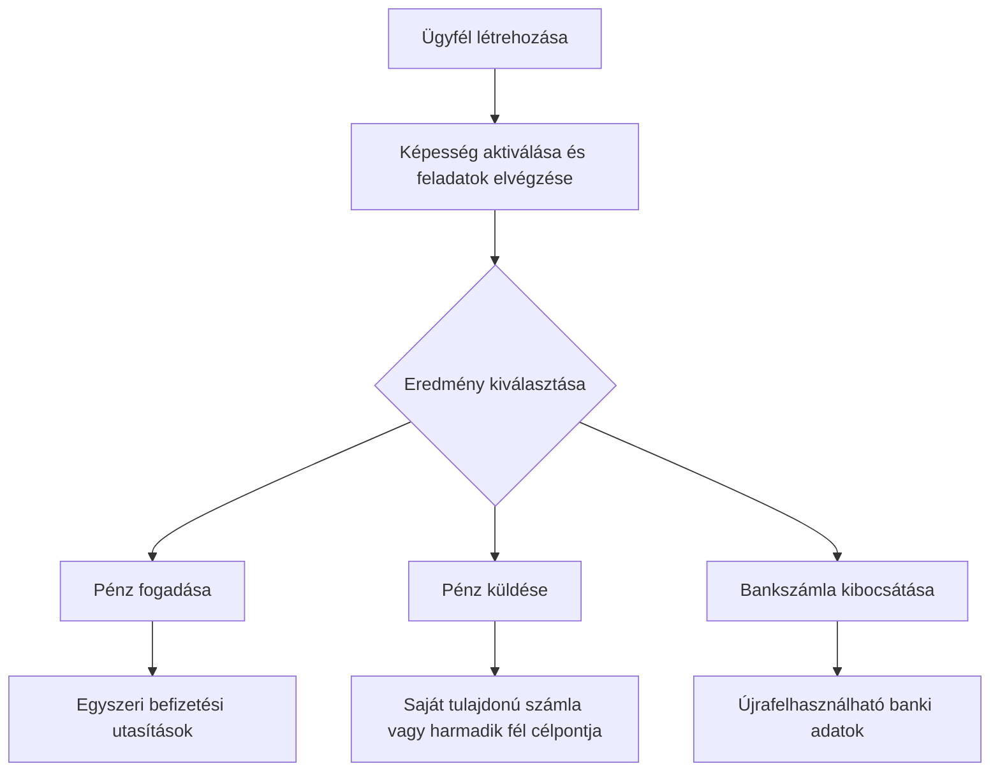

Induljon ki az ügyfél kívánt eredményéből. Minden folyamat ugyanazt az onboarding modellt használja, majd különböző számlákra és pénzmozgásra ágazik.

## A folyamatok összehasonlítása

| Eredmény | Előkészítés | Amit kap |
| --- | --- | --- |
| Pénzbefizetés | Kész pénzbefizetési képesség és kibocsátott céltárca | Átutalás-specifikus utasítások és stablecoin rendezés |
| Kifizetés | Kész kifizetési képesség, feltöltött kibocsátott tárca és kész számla vagy célpont | Egy átutalás a kiválasztott címzett végpontra |
| Kibocsátott bankszámla | Kész banki képesség és kibocsátott rendezési tárca | Újrafelhasználható banki adatok a provisioning után |

Egy árazott pénzbefizetés egy átutalásra vonatkozó utasításokat hoz létre. Egy kibocsátott bankszámla újrafelhasználható részleteket hoz létre későbbi betétekhez. Egy kifizetés a kibocsátott tárcán már elérhető pénzből indul.

## Válassza ki a folyamatát

<CardGroup cols={3}>
  <Card title="Pénz fogadása" icon="arrow-down-to-line" href="/hu/integration/receive-funds">
    Hozzon létre és kövessen egy fiat-stablecoin pénzbefizetést.
  </Card>
  <Card title="Pénz küldése" icon="arrow-up-from-line" href="/hu/integration/send-funds">
    Építsen ki egy saját tulajdonú vagy harmadik félnek szóló kifizetést.
  </Card>
  <Card title="Bankszámla kibocsátása" icon="building-columns" href="/hu/integration/issue-bank-account">
    Bocsásson ki egy tárcához kötött, újrafelhasználható banki adatokat.
  </Card>
</CardGroup>
