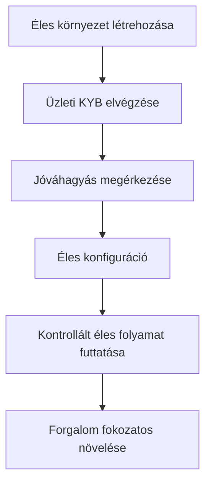

Az éles aktiválás ellenőrzi az integráló vállalkozását. Ez elkülönül a termékéhez létrehozott API-ügyfelektől.

## Az éles környezet aktiválása

1. Jelentkezzen be a Swipelux Dashboardba és válassza a **Create a production space** lehetőséget.
2. Nyissa meg a KYB fület vagy menjen az [Üzleti ellenőrzés](https://www.swipelux.app/kyb) oldalra.
3. Töltsön ki minden kért mezőt és töltse fel a szükséges dokumentumokat.
4. Küldje el az integráló vállalkozását ellenőrzésre és várja meg a jóváhagyást.

Éles API-ügyfeleket és tranzakciókat csak akkor hozhat létre, ha az integráló vállalkozását és éles környezetét jóváhagyták.

## Tartsa függetlenül az éles környezetet

Hozzon létre éles erőforrásokat kifejezetten. Az API-kulcs megváltoztatása nem migrálja a sandbox állapotot.

- Tárolja az éles hitelesítő adatokat külön titkos kulcskezelői bejegyzésben.
- Használjon csak élesre vonatkozó telepítési konfigurációt és erőforrás-azonosítókat.
- Regisztráljon külön éles webhook végpontot és aláíró titkot.
- Hozza létre újra a szükséges ügyfeleket, képességeket, számlákat, címzetteket és célpontokat az éles környezetben.
- Korlátozza az éles hozzáférést azokra a szolgáltatásokra és operátorokra, amelyeknek szükségük van rá.

A sandbox és az éles környezet `https://platform.swipelux.com` címet használ; az API-kulcs választja ki a környezetet.

## Az indítási ellenőrzőlista elvégzése

- [ ] Tesztelje a boldog és a várható hibás útvonalakat sandboxban.
- [ ] Küldjön `Idempotency-Key` fejlécet minden olyan íráshoz, amely megkívánja, és őrizze meg a biztonságos újrapróbáláshoz.
- [ ] Ellenőrizze a webhook aláírásokat elemzés előtt, tárolja tartósan az esemény ID-ket, és tesztelje az újrajátszást.
- [ ] Kezelje az elérhetetlen képességeket, nyitott feladatokat és megváltozott feladat-revíziókat.
- [ ] Jelenítse meg az átutalási hibákat és a cselekvésre alkalmas utasításokat az operátorai számára.
- [ ] Erősítse meg, hogy a naplók megőrzik az `X-Request-Id` vagy `correlationId` értéket titkok vagy érzékeny pénzügyi adatok felfedése nélkül.

## Egy kontrollált éles folyamat futtatása

Kezdje egy ismert ügyféllel és egy alacsony értékű tranzakcióval. Rögzítse:

| Kontroll | A teszt előtt meghatározandó |
| --- | --- |
| Terjedelem | Ügyfél, képesség, számla vagy célpont, összeg és módszer. |
| Várt eredmény | API-állapot, egyenleg vagy utasítások, és a várható webhook esemény. |
| Felelős | A teljes folyamatot figyelő személy. |
| Leállási feltétel | Bármilyen váratlan állapot, hiányzó webhook, hibás összeg vagy megoldatlan feladat. |

Ellenőrizze mind az aktuális API erőforrást, mind a hitelesített webhook kézbesítést. Ha bármelyik eltér a várt eredménytől, álljon meg és vizsgálja ki, mielőtt több forgalmat küld.

Miután a teljes folyamat sikeres, fokozatosan növelje a volument, miközben figyeli a képesség-, számla-, célpont- és átutalási állapotokat.

Térjen vissza a [Gyakori folyamatok](/hu/integration/common-flows) oldalra a termékútvonalért, vagy használja az [API referenciát](/hu/api-reference/introduction) a pontos szerződésekhez.
