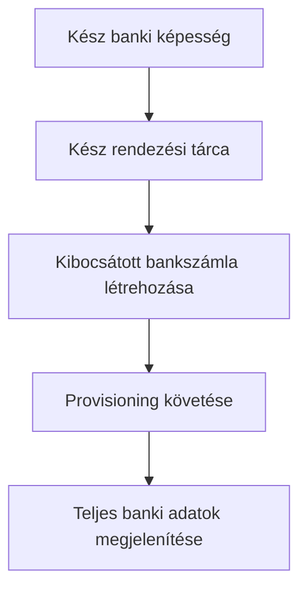

Kibocsátott bankszámlát akkor használjon, amikor az ügyfélnek újrafelhasználható banki adatokra van szüksége. Egy adott összeghez kötött egyszeri befizetési utasításokért használja inkább a [Pénz fogadása](/hu/integration/receive-funds) útmutatót.



## Mielőtt kezdi

Szüksége van egy ügyfélazonosítóra, egy kész banki képességre a szándékolt módszerre és devizára, valamint egy ugyanahhoz az ügyfélhez tartozó kész kibocsátott tárcára. A nyitott munkát végezze el a [Képességek és feladatok](/hu/integration/onboarding/capabilities-and-requirements) alapján.

## 1. Rendezési tárca létrehozása vagy kiválasztása

Hozzon létre egy kibocsátott tárcát a [Számlák és tárcák](/hu/integration/accounts#create-the-account) alapján, majd olvassa be újra. Csak akkor folytassa, ha az aktuális státusza engedi a rendezést.

Tárolja a válaszból származó `data.id` értéket `SETTLEMENT_WALLET_ID`-ként. Ne használjon külső tárcát a `settlement.accountId` mezőhöz.

## 2. Kibocsátott bankszámla létrehozása

Használja a [`POST /v3/customers/{customerId}/accounts`](/api-reference/accounts/post-v3-customers-by-customer-id-accounts) műveletet az alábbi fejlécekkel:

```http
X-API-Key: ${SWIPELUX_API_KEY}
Idempotency-Key: issued-bank-account-001
Content-Type: application/json
```

Küldje el ezt a kérés-törzset:

```json
{
  "origin": "issued",
  "type": "bank",
  "method": "ach",
  "country": "US",
  "currency": "USD",
  "settlement": {
    "accountId": "${SETTLEMENT_WALLET_ID}"
  },
  "label": "USD account"
}
```

Tárolja a visszakapott `data.id` értéket `BANK_ACCOUNT_ID`-ként. Őrizze meg a `data.status`, `data.openTaskIds`, `data.details` értékeket és a rendezési kapcsolatot is.

A bankszámla azonosítójának és a tárca azonosítójának eltérő szerepük van. A provisioning és a banki adatok olvasása a bankszámla azonosítón keresztül történik. A rendezési tárca azonosítóját arra használja, hogy azonosítsa, hová íródnak jóvá a betétek.

## 3. Provisioning követése

Olvassa be a [`GET /v3/customers/{customerId}/accounts/{accountId}`](/api-reference/accounts/get-v3-customers-by-customer-id-accounts-by-account-id) műveletet a létrehozás után és minden releváns webhook után.

Tartsa függőben az ügyfélfelületet, amíg a `details` hiányzik. Ha az `openTaskIds` nem üres, végezze el a legfrissebb feladatokat és olvassa be újra a számlát. Ne következtessen készenlétre az eltelt időből.

Ha a legfrissebb `statusReason.code` értéke `awaiting_assignment`, hozza létre az első pénzbefizetést ugyanahhoz az ügyfélhez, képességhez és rendezési tárcához a [Pénz fogadása](/hu/integration/receive-funds) alapján, majd olvassa be újra a bankszámlát. Csak akkor kövesse ezt az ágat, ha az aktuális számla kéri.

## 4. Banki adatok biztonságos megjelenítése

Csak a legfrissebb számla olvasása által visszaadott teljes részleteket jelenítse meg. Ha a `details.referenceRequired` értéke true, mutassa a pontos `details.reference` értéket és tegye másolhatóvá. Ha false, ne találjon ki hivatkozást.

Ezek a banki adatok újrafelhasználhatók. Ne cserélje őket árazott pénzbefizetésből származó befizetési koordinátákra, amelyek csak arra az átutalásra vonatkoznak.

Ezután adjon hozzá [Webhookokat](/hu/integration/webhooks), hogy a provisioning frissítései eljussanak az alkalmazásához anélkül, hogy az ügyfelet lekérdezési képernyőn tartaná.
