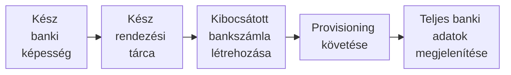

Kibocsátott bankszámlát akkor használjon, amikor az ügyfélnek újrafelhasználható banki adatokra van szüksége. Egy adott összeghez kötött egyszeri befizetési utasításokért használja inkább a [Pénz fogadása](/hu/integration/receive-funds) útmutatót.


```mermaid
%%{init: {"flowchart": {"rankSpacing": 20, "nodeSpacing": 16, "wrappingWidth": 80, "padding": 8}}}%%
flowchart LR
  A["Kész banki képesség"] --> B["Kész rendezési tárca"]
  B --> C["Kibocsátott bankszámla létrehozása"]
  C --> D["Provisioning követése"]
  D --> E["Teljes banki adatok megjelenítése"]
```

## Mielőtt kezdi

Szüksége van egy ügyfélazonosítóra, egy kész banki képességre a szándékolt módszerre és devizára, valamint egy ugyanahhoz az ügyfélhez tartozó kész kibocsátott tárcára. Az `allowPending` segítségével elmentheti a kérést, amíg a kiválasztott bank még felülvizsgálja az ügyfelet. A nyitott munkát végezze el a [Képességek és feladatok](/hu/integration/onboarding/capabilities-and-requirements) alapján.

## 1. Rendezési tárca létrehozása vagy kiválasztása

Hozzon létre egy kibocsátott tárcát a [Számlák és tárcák](/hu/integration/accounts#create-the-account) alapján, majd olvassa be újra. Csak akkor folytassa, ha az aktuális státusza engedi a rendezést.

Tárolja a válaszból származó `data.id` értéket `SETTLEMENT_WALLET_ID`-ként. Ne használjon külső tárcát a `settlement.accountId` mezőhöz.

## 2. Kibocsátott bankszámla létrehozása

Használja a [`POST /v3/customers/{customerId}/accounts`](/api-reference/accounts/post-v3-customers-by-customer-id-accounts) műveletet az alábbi fejlécekkel:

```http Request headers
X-API-Key: ${SWIPELUX_API_KEY}
Idempotency-Key: issued-bank-account-001
Content-Type: application/json
```

Küldje el ezt a kérés-törzset:

```json Request body
{
  "origin": "issued",
  "type": "bank",
  "method": "ach",
  "country": "US",
  "currency": "USD",
  "settlement": {
    "accountId": "${SETTLEMENT_WALLET_ID}"
  },
  "label": "USD account"
}
```

Tárolja a visszakapott `data.id` értéket `BANK_ACCOUNT_ID`-ként. Őrizze meg a `data.status`, `data.openTaskIds`, `data.details` értékeket és a rendezési kapcsolatot is.

Opcionális kérésmezők:

| Mező | Érvényes | Működés |
| --- | --- | --- |
| `institution` | Kibocsátott `ach`, `wire` és `swift` | Pontosan ezt a bankot választja ki. A Swipelux nem tér át másik bankra. Használjon a támogatott képességek válaszában visszaadott intézményazonosítót. |
| `allowPending` | Kibocsátott `ach`, `wire` és `swift` | Állítsa `true` értékre, ha menteni szeretné a kérést, amíg a kiválasztott bankhoz benyújtott kérelem jóváhagyásra vár. Az `institution` megadása szükséges. |
| `settlement.currency` | Kibocsátott bankszámlák | `USDC` vagy `USDT`. Meghatározza a rendezési tárcába jóváírt stablecoint. |

### A bank kiválasztása {#choose-the-bank}

Küldje el az `institution` mezőt, ha az ügyfélnek egy adott bank banki adataira van szüksége. A Swipelux ügyfelenként, módszerenként, devizánként és intézményenként egy kibocsátott számlát foglal le. Az `institution` mező nélküli kérés `409 conflict` hibát ad vissza, ha az ügyfélnek már van kibocsátott számlája az adott módszerre és devizára bármelyik banknál. Az `institution` mezőt tartalmazó kérés csak akkor ad vissza `409 conflict` hibát, ha az adott bankhoz már létezik számla.

A számla olvasásai a kiválasztott bankot `institution` értékként adják vissza, `id`, `name` és `bic` mezőkkel. A `bic` értéke lehet `null`.

Az idempotencia a kiválasztott bankra vonatkozik. Ugyanannak a kérésnek az ismételt elküldése az eredeti számlát adja vissza. Az `institution` módosítása ugyanazzal az `Idempotency-Key` értékkel `409 idempotency_conflict` hibát ad vissza.

### A kérés mentése a banki jóváhagyás előtt {#save-the-request-before-bank-approval}

Alapértelmezés szerint a Swipelux csak akkor fogad el kibocsátott bankszámlára vonatkozó kérést, ha a banki képesség már kész. Ha korábban szeretné rögzíteni az ügyfél számlabeállítását, küldje el az `allowPending: true` értéket az `institution` mezővel együtt:

```json Request body with allowPending
{
  "origin": "issued",
  "type": "bank",
  "method": "wire",
  "country": "US",
  "currency": "USD",
  "institution": "${INSTITUTION_ID}",
  "allowPending": true,
  "settlement": {
    "accountId": "${SETTLEMENT_WALLET_ID}"
  },
  "label": "USD wire account"
}
```

Amíg a bankhoz benyújtott kérelem felülvizsgálat alatt áll, a számla `status: "in_review"` értéket ad vissza, a `statusReason.code` értéke pedig `waiting_for_approval`. A válasz tartalmazza az `applicationId` értéket és a kérelem `openTaskIds` listáját is. Ezeket a feladatokat a [Képességek és feladatok](/hu/integration/onboarding/capabilities-and-requirements) alapján végezze el.

A mentett kérés megtartja a számlaazonosítóját, a rendezési tárcáját és a számlahelyét. Amikor a kérelem és a képesség kész, a Swipelux ugyanazon a `BANK_ACCOUNT_ID` azonosítón hozza létre a banki adatokat. Továbbra is ezt az azonosítót olvassa. Ne hozzon létre újabb kérést.

Ha a kérelmet előbb elutasítják, visszavonják vagy archiválják, a számla `rejected` állapotba kerül. Ekkor már nem foglalja a számlahelyet.

### A rendezési deviza kiválasztása {#choose-the-settlement-currency}

Alapértelmezés szerint a betétek a rendezési tárca devizájában kerülnek rendezésre. Állítsa a `settlement.currency` értékét `USDC` vagy `USDT` értékre, ha a tárca devizájától függetlenül szeretné kiválasztani a jóváírt eszközt:

```json Request body with settlement currency
{
  "settlement": {
    "accountId": "${SETTLEMENT_WALLET_ID}",
    "currency": "USDT"
  }
}
```

Az `USDT` használatához egy `USD` számlára és egy olyan hálózaton lévő rendezési tárcára van szükség, amely támogatja az USDT jóváírását. Ellenkező esetben a kérés `400 invalid_settlement_target` hibát ad vissza. A számla olvasásai visszaadják a mentett választást, a provisioning ideje alatt is.

A bankszámla azonosítójának és a tárca azonosítójának eltérő szerepük van. A provisioning és a banki adatok olvasása a bankszámla azonosítón keresztül történik. A rendezési tárca azonosítóját arra használja, hogy azonosítsa, hová íródnak jóvá a betétek.

## 3. Provisioning követése

Olvassa be a [`GET /v3/customers/{customerId}/accounts/{accountId}`](/api-reference/accounts/get-v3-customers-by-customer-id-accounts-by-account-id) műveletet a létrehozás után és minden releváns webhook után.

Tartsa függőben az ügyfélfelületet, amíg a `details` hiányzik. Ha az `openTaskIds` nem üres, végezze el a legfrissebb feladatokat és olvassa be újra a számlát. Ne következtessen készenlétre az eltelt időből.

Ha a számlát `allowPending: true` értékkel mentette, `in_review` állapotban marad `waiting_for_approval` értékű `statusReason.code` mellett, amíg a bank jóvá nem hagyja a kérelmet.

Ha a legfrissebb `statusReason.code` értéke `awaiting_assignment`, hozza létre az első pénzbefizetést ugyanahhoz az ügyfélhez, képességhez és rendezési tárcához a [Pénz fogadása](/hu/integration/receive-funds) alapján, majd olvassa be újra a bankszámlát. Csak akkor kövesse ezt az ágat, ha az aktuális számla kéri.

## 4. Banki adatok biztonságos megjelenítése

Csak a legfrissebb számla olvasása által visszaadott teljes részleteket jelenítse meg. Ha a `details.referenceRequired` értéke true, mutassa a pontos `details.reference` értéket és tegye másolhatóvá. Ha false, ne találjon ki hivatkozást.

Kibocsátott `swift` számlák esetén jelenítse meg a `details.bankName`, a `details.swiftCode` (a fogadó bank BIC-kódja), a `details.accountNumber`, a `details.accountHolderName` és a `details.accountHolderAddress` értékét, ha a válasz tartalmazza őket. A küldőknek pontosan át kell másolniuk a kedvezményezett címét a nemzetközi átutalásba. Jelenítse meg a `details.bankAddress` értékét és a számla által visszaadott esetleges közvetítő banki mezőket is.

Ezek a banki adatok újrafelhasználhatók. Ne cserélje őket árazott pénzbefizetésből származó befizetési koordinátákra, amelyek csak arra az átutalásra vonatkoznak.

Ezután adjon hozzá [Webhookokat](/hu/integration/webhooks), hogy a provisioning frissítései eljussanak az alkalmazásához anélkül, hogy az ügyfelet lekérdezési képernyőn tartaná.
