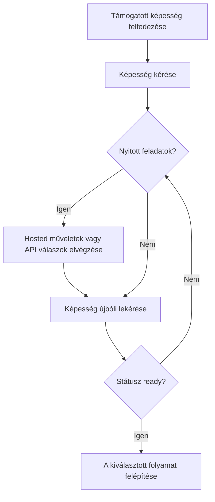

Egy képesség jelzi, hogy egy ügyfél képes-e használni egy adott eredményt, fizetési módot és irányt. A nyitott feladatok megmondják, mi kell ahhoz, hogy a képesség vagy egy kapcsolódó erőforrás előrehaladhasson.



```bash
export API_BASE='https://platform.swipelux.com'
export SWIPELUX_API_KEY='replace-with-your-api-key'
```

## Támogatott képességek felfedezése

Olvassa be az ügyfél aktuális lehetőségeit a [`GET /v3/customers/{customerId}/capabilities/supported`](/api-reference/capabilities/get-v3-customers-by-customer-id-capabilities-supported) művelettel:

```bash
curl --request GET \
  "${API_BASE}/v3/customers/${CUSTOMER_ID}/capabilities/supported" \
  --header "X-API-Key: ${SWIPELUX_API_KEY}"
```

Válasszon egy válaszelemet, amely megfelel a szándékolt `directions`, `method` és `accountType` értékeknek. Csak akkor folytassa, ha az `availability` értéke `available` vagy `beta`, és az `eligibility.eligible` értéke `true`. Ha `institutions` értéket ad vissza, csak abból a válaszból válasszon azonosítót.

Tárolja a kiválasztott `data[].id` értéket `CAPABILITY_ID`-ként. Soha ne másoljon képességazonosítót másik ügyféltől vagy környezetből.

### Közös és dedikált számlatípusok

A banki képességek két változatban léteznek, amelyeket az `accountType` mező és a képességazonosító utótagja kódol (például `ach_pooled`, `wire_named`):

- **`pooled`**: közös Swipelux bankszámla. Minden pénzbefizetés egyedi hivatkozást használ a pénz irányítására. Egyszeri átutalásokhoz válassza ezt.
- **`named`**: dedikált banki adatok az ügyfélnek (virtuális IBAN, dedikált ACH számla). Újrafelhasználható és megosztható bármely fizetővel. [Kibocsátott bankszámlákhoz](/hu/integration/issue-bank-account) szükséges.

Alapértelmezés szerint válassza a `pooled` opciót. `named`-et csak akkor használjon, ha az ügyfélnek újrafelhasználható banki adatok szükségesek. Ellenőrizze a `supported` válaszban, hogy mely változatok érhetők el.

## A képesség kérése

Kérje a kiválasztott opciót a [`POST /v3/customers/{customerId}/capabilities/{capabilityId}`](/api-reference/capabilities/post-v3-customers-by-customer-id-capabilities-by-capability-id) művelettel:

```bash
curl --request POST \
  "${API_BASE}/v3/customers/${CUSTOMER_ID}/capabilities/${CAPABILITY_ID}" \
  --header "X-API-Key: ${SWIPELUX_API_KEY}" \
  --header "Idempotency-Key: capability-request-001" \
  --header "Content-Type: application/json" \
  --data '{}'
```

Csak akkor használjon explicit `institutions` tömböt, ha a támogatott képesség válasza által visszaadott azonosítókból kell választania.

Tárolja a `data.status` értéket `CAPABILITY_STATUS`-ként, a `data.openTaskIds` értéket `OPEN_TASK_IDS`-ként, és minden `data.applications[].id` értéket az `APPLICATION_IDS` alatt.

## Aktuális feladatok elvégzése {#complete-current-tasks}

Sorolja fel a feladatokat a [`GET /v3/customers/{customerId}/tasks`](/api-reference/tasks/list-customer-tasks) művelettel, válassza ki az azonosítókat az `OPEN_TASK_IDS`-ből, majd olvassa be minden aktuális feladatot a [`GET /v3/customers/{customerId}/tasks/{taskId}`](/api-reference/tasks/get-customer-task) művelettel:

```bash
curl --request GET \
  "${API_BASE}/v3/customers/${CUSTOMER_ID}/tasks/${TASK_ID}" \
  --header "X-API-Key: ${SWIPELUX_API_KEY}"
```

Használja a legfrissebb `data.revision` és `data.requirements` értékeit. Frissítse le a feladatot közvetlenül a beküldés előtt, ha bármelyik megváltozhatott.

### Hosted műveletek

Ha a feladat `verificationSessions` vagy `tosSessions` értékeket ad vissza, tárolja minden munkamenet `id` és aktuális `url` értékét. Küldje el az ügyfelet a visszaadott URL-re, majd olvassa be újra a feladatot. Ezek feladathoz kötött műveletek, nem egy külön ügyfél-ellenőrzési életciklus.

### Dokumentumok feltöltése {#upload-documents}

Ha egy követelmény dokumentumot kér, töltse fel a [`POST /v3/customers/{customerId}/documents`](/api-reference/documents/post-v3-customers-by-customer-id-documents) művelettel:

```bash
export DOCUMENT_PATH='/absolute/path/to/requested-document.pdf'

curl --request POST \
  "${API_BASE}/v3/customers/${CUSTOMER_ID}/documents" \
  --header "X-API-Key: ${SWIPELUX_API_KEY}" \
  --header "Idempotency-Key: customer-document-001" \
  --form "file=@${DOCUMENT_PATH}"
```

Tárolja a visszakapott `data.id` értéket `DOCUMENT_ID`-ként, mielőtt beküldi a rá hivatkozó választ.

### API válaszok

Küldjön el egy teljes válaszcsomagot az aktuális revízióhoz a [`POST /v3/customers/{customerId}/tasks/{taskId}/submissions`](/api-reference/task-submissions/create-customer-task-submission) művelettel:

```bash
curl --request POST \
  "${API_BASE}/v3/customers/${CUSTOMER_ID}/tasks/${TASK_ID}/submissions" \
  --header "X-API-Key: ${SWIPELUX_API_KEY}" \
  --header "Idempotency-Key: task-submission-001" \
  --header "Content-Type: application/json" \
  --data @- <<'JSON'
{
  "taskRevision": 3,
  "answers": [
    {
      "requirementId": "req_from_current_task",
      "answer": {
        "type": "text",
        "value": "Current answer"
      }
    }
  ]
}
JSON
```

Vegyen minden követelményazonosítót és válaszreprezentációt a legfrissebb feladatból. Ha az API jelzi, hogy a feladat megváltozott, olvassa be újra és állítsa össze a beküldést az új revízió alapján.

## Folytatás, amikor a képesség kész

Olvassa be újra a képességet a [`GET /v3/customers/{customerId}/capabilities/{capabilityId}`](/api-reference/capabilities/get-v3-customers-by-customer-id-capabilities-by-capability-id) művelettel:

```bash
curl --request GET \
  "${API_BASE}/v3/customers/${CUSTOMER_ID}/capabilities/${CAPABILITY_ID}" \
  --header "X-API-Key: ${SWIPELUX_API_KEY}"
```

Cserélje ki a tárolt státuszt és a feladatazonosítókat a legfrissebb válasz értékeire. Csak akkor folytassa, ha az aktuális képesség státusza engedi a számla, árajánlat vagy átutalás létrehozását.

Ezután válassza ki a megfelelő útvonalat a [Gyakori folyamatok](/hu/integration/common-flows) oldalon.