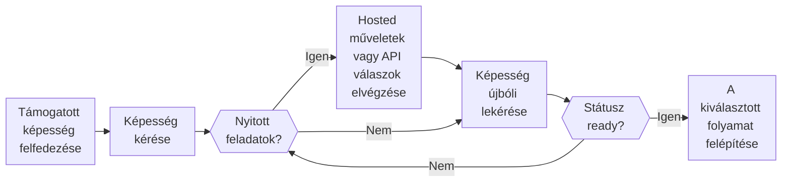

Egy képesség jelzi, hogy egy ügyfél képes-e használni egy adott eredményt, fizetési módot és irányt. A nyitott feladatok megmondják, mi kell ahhoz, hogy a képesség vagy egy kapcsolódó erőforrás előrehaladhasson.


```mermaid
%%{init: {"flowchart": {"rankSpacing": 20, "nodeSpacing": 16, "wrappingWidth": 80, "padding": 8}}}%%
flowchart LR
  A["Támogatott képesség felfedezése"] --> B["Képesség kérése"]
  B --> C{{"Nyitott feladatok?"}}
  C -->|"Igen"| D["Hosted műveletek vagy API válaszok elvégzése"]
  D --> E["Képesség újbóli lekérése"]
  C -->|"Nem"| E
  E --> F{{"Státusz ready?"}}
  F -->|"Nem"| C
  F -->|"Igen"| G["A kiválasztott folyamat felépítése"]
```

```bash Environment variables
export API_BASE='https://platform.swipelux.com'
export SWIPELUX_API_KEY='replace-with-your-api-key'
```

## Támogatott képességek felfedezése

Olvassa be az ügyfél aktuális lehetőségeit a [`GET /v3/customers/{customerId}/capabilities/supported`](/api-reference/capabilities/get-v3-customers-by-customer-id-capabilities-supported) művelettel:

```bash List supported capabilities
curl --request GET \
  "${API_BASE}/v3/customers/${CUSTOMER_ID}/capabilities/supported" \
  --header "X-API-Key: ${SWIPELUX_API_KEY}"
```

Válasszon egy válaszelemet, amely megfelel a szándékolt `directions`, `method` és `accountType` értékeknek. Csak akkor folytassa, ha az `availability` értéke `available` vagy `beta`, és az `eligibility.eligible` értéke `true`. Ha `institutions` értéket ad vissza, csak abból a válaszból válasszon azonosítót.

Minden intézménybejegyzés tartalmaz egy `logoUrl` mezőt és egy `isDefault` jelzőt. A `logoUrl` segítségével jelenítse meg a bank logóját a bankválasztó felületen, és ha értéke `null`, jelenítse meg saját általános bankikonját. Az `isDefault` csak erre az ügyfélre és képességre vonatkozik, nem globálisan az intézményre. A [`GET /v3/institutions`](/api-reference/institutions/get-v3-institutions) ugyanezt a nullázható `logoUrl` mezőt adja vissza. Az intézményazonosítók átlátszatlanok, ezért kezelje az új azonosítókat kódmódosítás nélkül.

```json Institution entry
{
  "institutions": [
    {
      "id": "jpmorgan",
      "name": "JPMorgan Chase",
      "bic": "CHASUS33",
      "logoUrl": "https://wallet.swipelux.com/bank-logos/jpmorgan.png",
      "countries": ["US"],
      "isDefault": true
    }
  ]
}
```

Tárolja a kiválasztott `data[].id` értéket `CAPABILITY_ID`-ként. Soha ne másoljon képességazonosítót másik ügyféltől vagy környezetből.

### Közös és dedikált számlatípusok

A banki képességek két változatban léteznek, amelyeket az `accountType` mező és a képességazonosító utótagja kódol (például `ach_pooled`, `wire_named`):

- **`pooled`**: közös Swipelux bankszámla. Minden pénzbefizetés egyedi hivatkozást használ a pénz irányítására. Egyszeri átutalásokhoz válassza ezt.
- **`named`**: dedikált banki adatok az ügyfélnek (virtuális IBAN, dedikált ACH számla). Újrafelhasználható és megosztható bármely fizetővel. [Kibocsátott bankszámlákhoz](/hu/integration/issue-bank-account) szükséges.

Alapértelmezés szerint válassza a `pooled` opciót. `named`-et csak akkor használjon, ha az ügyfélnek újrafelhasználható banki adatok szükségesek. Ellenőrizze a `supported` válaszban, hogy mely változatok érhetők el.

SWIFT betétek fogadásához vagy SWIFT banki adatok kibocsátásához használja a `swift_named` opciót. A `swift_pooled` csak kifizetéseket támogat, ezért ellenőrizze az egyes opciók `directions` értékét a támogatott képesség válaszában. Egy dedikált SWIFT számla újrafelhasználható fogadási adatokat ad vissza, beleértve a bank BIC-kódját, szükség esetén egy hivatkozást, valamint a kedvezményezett címét, ha a bank megadja.

Kibocsátott ACH, Wire és SWIFT számlák esetén az `institution` mezővel kiválaszthat egy pontos bankot, és elmentheti a számlakérést, mielőtt a bank jóváhagyja az ügyfelet. Lásd: [Bankszámla kibocsátása](/hu/integration/issue-bank-account#choose-the-bank).

## A képesség kérése

Kérje a kiválasztott opciót a [`POST /v3/customers/{customerId}/capabilities/{capabilityId}`](/api-reference/capabilities/post-v3-customers-by-customer-id-capabilities-by-capability-id) művelettel:

```bash Request capability
curl --request POST \
  "${API_BASE}/v3/customers/${CUSTOMER_ID}/capabilities/${CAPABILITY_ID}" \
  --header "X-API-Key: ${SWIPELUX_API_KEY}" \
  --header "Idempotency-Key: capability-request-001" \
  --header "Content-Type: application/json" \
  --data '{}'
```

Csak akkor használjon explicit `institutions` tömböt, ha a támogatott képesség válasza által visszaadott azonosítókból kell választania.

Tárolja a `data.status` értéket `CAPABILITY_STATUS`-ként, a `data.accountProvisioning` értéket `ACCOUNT_PROVISIONING_STATUS`-ként, a `data.openTaskIds` értéket `OPEN_TASK_IDS`-ként, és minden `data.applications[].id` értéket az `APPLICATION_IDS` alatt.

### Megosztott alkalmazások bankonként {#shared-applications-per-bank}

Dedikált (named) banki képességek esetén minden ügyfélnek bankonként egy alkalmazási esete van. A közös (pooled) és platformképességek bank nélküli eseteket használnak. A Swipelux egy esetet megoszt az Ön által kért összes kompatibilis képesség között:

- Egyetlen jóváhagyás több képességet is lefedhet. Például egy banknál jóváhagyott eset egy ACH és egy wire képességet is `ready` állapotba hozhat.
- Egy későbbi kérés, amely egy meglévő esetnek megfelel, azt újrahasznosítja. A Swipelux nem nyit második alkalmazást, és nem ad hozzá duplikált feladatokat.
- A különböző bankoknál lévő esetek függetlenek. Az egyik banknál történt elutasítás nem érinti a másik banknál lévő esetet.

A kérésre adott válasz megmutatja, melyik esetet használta a Swipelux:

- A `201` azt jelenti, hogy a kérés új alkalmazási esetet nyitott.
- A `200` azt jelenti, hogy a kérés egy, az ügyfélnél már meglévő alkalmazási esetre oldódott fel, például egy olyan banki képesség ismételt kérésekor, amellyel az ügyfél már rendelkezik, vagy egy törölt képesség kérésekor. A `card` vagy `stablecoin_transfers` ismételt kérése továbbra is [`409 capability_already_exists`](/integration/errors#capability-already-exists) hibát ad vissza.
- A `selectedApplicationId` egy legfelső szintű mező a `data` mellett, amely a kérés által kiválasztott vagy megnyitott eset azonosítóját tartalmazza. A Swipelux kihagyja, ha a kérés nem választott ki esetet. Egy idempotens ismétlés ugyanazt az értéket adja vissza.

Rövidített válasz:

```json Response (abbreviated)
{
  "data": {
    "id": "ach_named",
    "status": "pending",
    "openTaskIds": ["tsk_000000000000000002"],
    "applications": [{ "id": "apl_000000000000000005", "status": "in_review" }]
  },
  "selectedApplicationId": "apl_000000000000000005"
}
```

Dedikált képességek esetén küldje el újra ugyanazt az `institutions` listát ugyanazon eset kiválasztásához, vagy küldjön egyetlen intézményazonosítót az adott bank megcélzásához. A Swipelux kihagyja azt a bankot, amely véglegesen elutasította az ügyfelet. Ha csak ezt a bankot nevezi meg, vagy minden jogosult bank elutasította az ügyfelet, a kérés [`409 capability_terminally_rejected`](/integration/errors#capability-terminally-rejected) hibát ad vissza. Ha elutasítás után egy másik bankkal szeretne próbálkozni, kérje újra a képességet az adott bank intézményazonosítójával.

Egy képesség státusza az ügyfél összes kapcsolódó esetét tükrözi. Dedikált képesség esetén egyetlen `ready` eset, amelynek jóváhagyása lefedi a képességet, elegendő ahhoz, hogy az `ready` legyen, függetlenül attól, mit jeleznek más bankok. A közös képesség a módszerellenőrzését is megvárja, amelyet az ügyfél alkalmazáslistájában a `probes` jelez.

#### Az ügyfél alkalmazásainak listázása {#list-the-customers-applications}

Listázza az ügyfél összes alkalmazási esetét a [`GET /v3/customers/{customerId}/applications`](/api-reference/capabilities/get-v3-customers-by-customer-id-applications) művelettel. Az eredmények lapozása a `nextCursor` és `hasMore` mezőkkel történik, és elfogadják az `updatedAfter` paramétert:

```bash List applications
curl --request GET \
  "${API_BASE}/v3/customers/${CUSTOMER_ID}/applications" \
  --header "X-API-Key: ${SWIPELUX_API_KEY}"
```

Minden bejegyzés tartalmazza a képesség `applications[]` tömbjében visszaadott alkalmazásmezőket, továbbá:

- `scope`: `named` egy banknál lévő esethez, `provider_pooled` vagy `platform` bank nélküli esetekhez, vagy `null` egy besorolatlan korábbi esethez. Az `institution` hiányzik a `provider_pooled` és `platform` eseteknél.
- `requestedScope[]`: az esethez kért képességkulcsok, mindegyik az első `requestedAt` értékével. A bejegyzések soha nem törlődnek.
- `coverage[]`: az eset jóváhagyása által lefedett képességkulcsok, mindegyik `grantedAt` és `source` értékkel. A lefedettség a hatókört rögzíti, nem az engedélyezést. Az aktuális státuszért olvassa be a képességet.
- `probes[]`: módszerellenőrzések az eset által lefedett közös képességkulcsokhoz, mindegyik `capabilityKey`, `status` és `reason` értékkel. A dedikált kulcsokhoz soha nem szükséges ellenőrzés.
- `generation`, `predecessorApplicationId` és `supersededByApplicationId`: utódlási hivatkozások. Ha a `supersededByApplicationId` be van állítva, az esetet lecserélték. Kövesse ezt az azonosítót az aktuális esethez. Egy képesség `applications[]` listája csak az aktuális eseteket tartalmazza, így a lecserélt eset csak ebben a listában jelenik meg.

Rövidített válasz:

```json Response (abbreviated)
{
  "data": [
    {
      "id": "apl_000000000000000005",
      "status": "ready",
      "scope": "named",
      "institution": { "id": "jpmorgan", "name": "JPMorgan Chase", "bic": "CHASUS33" },
      "requestedScope": [
        { "capabilityKey": "ach_named", "requestedAt": "2026-09-20T10:00:00.000Z" }
      ],
      "coverage": [
        { "capabilityKey": "ach_named", "grantedAt": "2026-09-22T12:00:00.000Z", "source": "approval" },
        { "capabilityKey": "wire_named", "grantedAt": "2026-09-22T12:00:00.000Z", "source": "approval" }
      ],
      "probes": [],
      "generation": 1,
      "predecessorApplicationId": null,
      "supersededByApplicationId": null
    }
  ],
  "nextCursor": null,
  "hasMore": false
}
```

## Aktuális feladatok elvégzése {#complete-current-tasks}

Sorolja fel a feladatokat a [`GET /v3/customers/{customerId}/tasks`](/api-reference/tasks/list-customer-tasks) művelettel, válassza ki az azonosítókat az `OPEN_TASK_IDS`-ből, majd olvassa be minden aktuális feladatot a [`GET /v3/customers/{customerId}/tasks/{taskId}`](/api-reference/tasks/get-customer-task) művelettel:

```bash List open tasks
curl --request GET \
  "${API_BASE}/v3/customers/${CUSTOMER_ID}/tasks/${TASK_ID}" \
  --header "X-API-Key: ${SWIPELUX_API_KEY}"
```

Használja a legfrissebb `data.revision` és `data.requirements` értékeit. Frissítse le a feladatot közvetlenül a beküldés előtt, ha bármelyik megváltozhatott.

### Újrahasznosított profilbizonyítékok {#reused-profile-evidence}

A közvetlen API-beküldést elfogadó alkalmazási adatfelvételi feladatoknál a Swipelux újrahasznosítja az ügyfél által már megadott információkat. Amikor egy ilyen feladat létrejön vagy egyeztetésre kerül, a Swipelux ellenőrzi az ügyfélprofilt és az ügyfél saját feltöltött dokumentumait. Azok a jogosult követelmények, amelyeket már egy használható profilérték vagy dokumentum alátámaszt, `in_review` állapotba kerülnek ahelyett, hogy cselekvést igénylők maradnának. A profilfrissítések és az új dokumentumfeltöltések ugyanezt az ellenőrzést indítják el a meglévő feladatoknál.

Csak a hiányzó vagy nem kompatibilis értékek maradnak cselekvést igénylők. Az újrahasznosítás nem hagyja jóvá a bizonyítékot. A Swipelux továbbra is felülvizsgálja azt. Az explicit javítási kérések és a korábban megválaszolt követelmények cselekvést igénylők maradnak. A tulajdonosi és kapcsolt féltől származó dokumentumokat a Swipelux nem hasznosítja újra, és a csak hosted munkamenetben gyűjtött követelmények a szokásos folyamatukat követik.

### Követelmények megjelenítése {#render-requirements}

Az űrlapokat az egyes követelmények által visszaadott metaadatokból építse fel, ne a követelménykulcsokból. Egy követelmény tartalmazhat opcionális rövid `title` értéket, és minden `request` tartalmaz egy `prompt` szöveget, amelyet a címsor alatt kell megjeleníteni.

A `request.type: "profile"` típusú követelmények a `profilePointer` segítségével azonosítják a profilmezőt, és beviteli metaadatokat adnak hozzá:

- `allowedValues`: a megengedett értékek egy skaláris mezőhöz, vagy egy tömbmező minden eleméhez. Ezeket az értékeket küldje be, ne a lefordított megjelenítési címkéket.
- `valueSchema`: önálló JSON Schema Draft 7 dokumentum, amely leírja a bevitel alakját, a beágyazott tulajdonságokat, a kötelező mezőket és a szerkezeti megkötéseket. Az objektumokon lévő enumok a megfelelő tulajdonságon jelennek meg, például adóazonosítóknál a `valueSchema.items.properties.type.enum` helyen. A Swipelux a beküldés után továbbra is alkalmaz mezők közötti és felülvizsgálati validációt, így a sémának megfelelő érték is elutasításra kerülhet.
- `valueType: "country"`, vagy tömbök esetén `itemValueType: "country"`: a mező nagybetűs ISO 3166-1 alpha-2 kódokat fogad. A `valueSchema` beágyazott országtulajdonságai a `format: "iso-3166-1-alpha-2"` értéket használják. A lokalizált címkékhez használjon szabványos országlistát.

```json Requirement
{
  "id": "req_000000000000000010",
  "key": "account_purposes",
  "title": "Account purpose",
  "status": "action_required",
  "request": {
    "type": "profile",
    "prompt": "Select every purpose that applies.",
    "required": true,
    "profilePointer": "/financialProfile/accountPurposes",
    "valueType": "array",
    "itemValueType": "string",
    "allowedValues": ["business_expenses", "ecommerce", "payroll"],
    "valueSchema": {
      "$schema": "http://json-schema.org/draft-07/schema#",
      "type": "array",
      "items": { "enum": ["business_expenses", "ecommerce", "payroll"] }
    }
  }
}
```

Ez a példa lerövidíti az értékkatalógust; az API minden megengedett értéket visszaad. Egyes profilkövetelményeknek nincs közzétett sémája, és kihagyják a `valueSchema` és `allowedValues` mezőket. Ezeket a `prompt` és `valueType` alapján jelenítse meg.

Minden nyitott feladat tartalmaz egy `dueAt` időbélyeget. Amikor a Swipelux explicit határidő nélkül hoz létre egy feladatot, a `dueAt` alapértelmezés szerint pontosan 31 nappal a feladat `createdAt` értéke utánra kerül. Kezelje a `dueAt` mezőt tájékoztató jellegűként: nem állíthatja be az API-n keresztül, és nem vált ki automatikus életciklus-átmenetet. Csak a különálló `deadline` mező okoz automatikus átmenetet, ha meg van adva.

### Hosted műveletek {#hosted-actions}

A feladat részletes válaszában a `verificationSessions` és `tosSessions` minden bejegyzése tartalmaz egy `action` objektumot. A feladatlisták válaszai nem tartalmazzák ezeket a műveleti hivatkozásokat. Tárolja minden munkamenet `id` értékét, majd olvassa be az `action.kind` értékét, mielőtt az ügyfelet továbbküldi; ne következtessen a hivatkozás elérhetőségére a munkamenet `status` értékéből.

- Az `action.kind: "available"` tartalmazza az `action.url` és `action.expiresAt` mezőket (jelenleg mindig `null`). Tárolja az `action.url` értékét, küldje oda az ügyfelet, majd olvassa be újra a feladatot. A munkamenetszintű `url` és `expiresAt` mezők ugyanezeket az értékeket tartalmazzák.
- Az `action.kind: "unavailable"` azt jelenti, hogy nem szabad hivatkozást megjeleníteni. A munkamenetszintű `url` és `expiresAt` mezők hiányoznak. A munkamenet `status` értéke önmagában nem határozza meg, melyik művelettípust kapja.

```json Verification session
{
  "data": {
    "verificationSessions": [
      {
        "id": "vfy_000000000000000003",
        "key": "identity_verification",
        "type": "identity_verification",
        "status": "action_required",
        "action": {
          "kind": "available",
          "url": "https://platform.swipelux.com/kyc/redirect/cus_000000000000000001/tsk_000000000000000002/vfy_000000000000000003",
          "expiresAt": null
        },
        "url": "https://platform.swipelux.com/kyc/redirect/cus_000000000000000001/tsk_000000000000000002/vfy_000000000000000003",
        "expiresAt": null
      }
    ],
    "tosSessions": [
      {
        "id": "vfy_000000000000000004",
        "key": "terms_of_service",
        "type": "terms_of_service",
        "status": "completed",
        "action": { "kind": "unavailable" }
      }
    ]
  }
}
```

Ezek feladathoz kötött műveletek, nem egy külön ügyfél-ellenőrzési életciklus.

### Dokumentumok feltöltése {#upload-documents}

Ha egy követelmény dokumentumot kér, töltse fel a [`POST /v3/customers/{customerId}/documents`](/api-reference/documents/post-v3-customers-by-customer-id-documents) művelettel:

```bash Upload document
export DOCUMENT_PATH='/absolute/path/to/requested-document.pdf'

curl --request POST \
  "${API_BASE}/v3/customers/${CUSTOMER_ID}/documents" \
  --header "X-API-Key: ${SWIPELUX_API_KEY}" \
  --header "Idempotency-Key: customer-document-001" \
  --form "file=@${DOCUMENT_PATH}"
```

Tárolja a visszakapott `data.id` értéket `DOCUMENT_ID`-ként, mielőtt beküldi a rá hivatkozó választ.

Egy tárolt fájl későbbi lekéréséhez hívja meg a [`GET /v3/customers/{customerId}/documents/{documentId}/download`](/api-reference/documents/get-v3-customers-by-customer-id-documents-by-document-id-download) műveletet. A Swipelux egy `url`-t ad vissza, amely a fájlt mellékletként tölti le, és egy óra után lejár. Az archivált dokumentumok `404`-et adnak vissza.

### API válaszok

Küldjön el egy teljes válaszcsomagot az aktuális revízióhoz a [`POST /v3/customers/{customerId}/tasks/{taskId}/submissions`](/api-reference/task-submissions/create-customer-task-submission) művelettel:

```bash Submit task answers
curl --request POST \
  "${API_BASE}/v3/customers/${CUSTOMER_ID}/tasks/${TASK_ID}/submissions" \
  --header "X-API-Key: ${SWIPELUX_API_KEY}" \
  --header "Idempotency-Key: task-submission-001" \
  --header "Content-Type: application/json" \
  --data @- <<'JSON'
{
  "taskRevision": 3,
  "answers": [
    {
      "requirementId": "req_from_current_task",
      "answer": {
        "type": "text",
        "value": "Current answer"
      }
    }
  ]
}
JSON
```

Vegyen minden követelményazonosítót és válaszreprezentációt a legfrissebb feladatból. Ha az API jelzi, hogy a feladat megváltozott, olvassa be újra és állítsa össze a beküldést az új revízió alapján.

### Haszonhúzó előfeltétel vállalkozásoknál {#beneficial-owner-prerequisite-for-businesses}

Egy haszonhúzói bizonyítékot igénylő üzleti képesség kérése akkor is sikeres, ha az ügyfélnek még nincs megfelelő tulajdonosa. A képesség `restricted` státusszal jön létre, `statusReason.code: tasks_due` értékkel, és az üzleti adatfelvételi feladat kéri a hiányzó tulajdonlási tényeket, beleértve a tulajdonlási struktúrát.

Ugyanez a feladat tartalmaz egy `resource_reference` követelményt, amelynek kérése tartalmazza a `qualification: "beneficial_owner"` értéket:

```json Beneficial owner requirement
{
  "type": "resource_reference",
  "prompt": "Add or select a qualifying beneficial owner.",
  "required": true,
  "resourceType": "related_party",
  "qualification": "beneficial_owner"
}
```

Egy kapcsolt fél akkor felel meg, ha ugyanazon ügyfél aktív `person` fele, és legalább 25 megadott tulajdonlási százalékkal rendelkezik, vagy megadott százalék nélkül `ownership.declared: true` értékkel rendelkezik.

A követelmény az aktuális kapcsolt fél listából származik, így általában nem válaszolja meg közvetlenül:

- Egy megfelelő kapcsolt fél létrehozása vagy frissítése ugyanabban az újraértékelésben teljesíti a követelményt, és megnyitja az adott tulajdonos saját profil- és dokumentummunkáját. Lásd az [Üzleti kapcsolt felek hozzáadása](/hu/integration/onboarding/customers#add-business-related-parties) oldalt.
- Hivatkozhat egy megfelelő félre explicit módon is egy `resource_reference` válasszal, amely tartalmazza annak `relatedPartyId` értékét.
- A követelmény a teljesítése után is listázva marad az aktuális feladatban. Amikor más nyitott kötelezettség nem marad, a feladat `satisfied` státuszba kerül.
- Az utolsó megfelelő fél archiválása, vagy az őt minősítő tények eltávolítása újranyitja a követelményt, még azután is, hogy a feladat `satisfied` lett.

## Folytatás, amikor a képesség kész {#continue-when-the-capability-is-ready}

Olvassa be újra a képességet a [`GET /v3/customers/{customerId}/capabilities/{capabilityId}`](/api-reference/capabilities/get-v3-customers-by-customer-id-capabilities-by-capability-id) művelettel:

```bash Refetch capability
curl --request GET \
  "${API_BASE}/v3/customers/${CUSTOMER_ID}/capabilities/${CAPABILITY_ID}" \
  --header "X-API-Key: ${SWIPELUX_API_KEY}"
```

Cserélje ki a tárolt státuszt, a számlakiadási státuszt és a feladatazonosítókat a legfrissebb válasz értékeire. A képesség `status` értéke azt jelzi, hogy a jogosultságot jóváhagyták-e. Számlát kibocsátó képesség esetén az `accountProvisioning` külön jelzi, hogy a számla `not_started`, `in_progress`, `issued` vagy `failed` állapotú-e; a számlát nem kibocsátó képesség `not_applicable` értéket ad vissza.

Amíg a képesség `pending` állapotú, az általa jelezhető `statusReason.code` értékek közül kettő azt mutatja, hogy folyamatban van-e felülvizsgálat. A `preparing_submission` azt jelenti, hogy a Swipelux még benyújtásra készít elő egy kérelmet, és nincs folyamatban felülvizsgálat, még akkor sem, ha egy másik bank kérelme `rejected` vagy beavatkozást igényel. A `review_in_progress` azt jelenti, hogy felülvizsgálat van folyamatban, például amíg egy kérelem `in_review` állapotú, vagy egy [hosted ellenőrzés](#hosted-actions) nyitva van. Mindkettő `resolution: wait` értéket használ. Az ezen kódok közötti váltás `pending` állapotban hagyja a státuszt, így nem küld `capability.status_changed` eseményt. Olvassa le a képességet az aktuális kód megtekintéséhez.

Csak akkor folytassa, ha az aktuális képességstátusz engedélyezi a létrehozni kívánt számlát, árajánlatot vagy átutalást. Ha a folyamathoz kibocsátott számla szükséges, várja meg azt is, hogy az `accountProvisioning` értéke `issued` legyen.

Ezután válassza ki a megfelelő útvonalat a [Gyakori folyamatok](/hu/integration/common-flows) oldalon.
