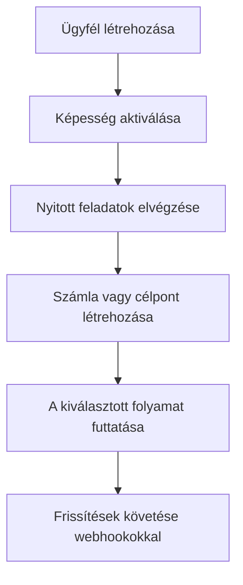

A Swipelux megadja a backendjének azokat az építőelemeket, amelyekkel ügyfeleket onboardolhat és pénzt mozgathat anélkül, hogy fizetési infrastruktúrát tárna fel a termékében.

## Mit építhet

<CardGroup cols={3}>
  <Card title="Pénz fogadása" icon="arrow-down-to-line" href="/hu/integration/receive-funds">
    Hozzon létre egyszeri fiat befizetési utasításokat és rendezzen stablecoint egy tárcába.
  </Card>
  <Card title="Pénz küldése" icon="arrow-up-from-line" href="/hu/integration/send-funds">
    Küldjön egy ügyféltárcából egy saját tulajdonú számlára vagy harmadik fél célpontjára.
  </Card>
  <Card title="Bankszámla kibocsátása" icon="building-columns" href="/hu/integration/issue-bank-account">
    Bocsásson ki újrafelhasználható banki adatokat, egy rendezési tárcához kötve.
  </Card>
</CardGroup>

## Hogyan működik egy integráció

Az ügyfél az a magánszemély vagy vállalkozás, amely az áramláshoz tartozik. A képességek azt írják le, hogy az ügyfél mely eredményeket használhatja. A nyitott feladatok megmondják, mit kell elvégezni, mielőtt a képesség vagy erőforrás továbbléphet.

## Nézze meg működés közben

Fedezze fel a [demo.swipelux.com](https://demo.swipelux.com) oldalt, hogy kipróbáljon egy szimulált neobank élményt. [Klónozhatja a startert](https://github.com/swipelux/neobank-starter) is, és testre szabhatja a termékfelületét.

A demó és a starter termék- és felhasználói felület-referenciák. Nem helyettesítik ezeket az útmutatókat vagy az aktuális API szerződést.

## Kezdje az építést

<CardGroup cols={3}>
  <Card title="Gyorsindító" icon="rocket" href="/hu/integration/quickstart">
    Hozzon létre egy ügyfelet és futtasson egy sandbox folyamatot.
  </Card>
  <Card title="Gyakori folyamatok" icon="route" href="/hu/integration/common-flows">
    Hasonlítsa össze az egyes eredményekhez szükséges beállítást.
  </Card>
  <Card title="API referencia" icon="code" href="/hu/api-reference/introduction">
    Olvassa el a kéréskonvenciókat és tekintse át az összes API műveletet.
  </Card>
</CardGroup>
