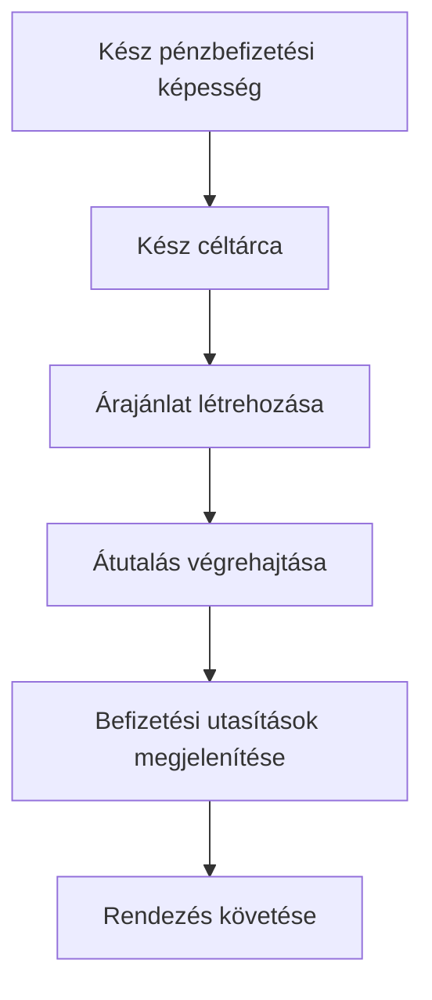

Árazott pénzbefizetést akkor használjon, amikor az ügyfélnek adott összeget kell befizetnie. Az átutalás stablecoint rendez egy kibocsátott tárcába.



## Mielőtt kezdi

Szüksége van egy kész pénzbefizetési képességre és egy ugyanahhoz az ügyfélhez tartozó kész kibocsátott céltárcára. A nyitott munkát végezze el a [Képességek és feladatok](/hu/integration/onboarding/capabilities-and-requirements) alapján, majd olvassa be újra mindkét erőforrást.

## 1. Árajánlat létrehozása

Hozza létre az árat a [`POST /v3/quotes`](/api-reference/money-movement/post-v3-quotes) művelettel. Küldje el ezeket a fejléceket:

```http
X-API-Key: ${SWIPELUX_API_KEY}
Idempotency-Key: payin-quote-001
Content-Type: application/json
```

```json
{
  "customerId": "${CUSTOMER_ID}",
  "capabilityId": "${CAPABILITY_ID}",
  "externalId": "payin-order-123",
  "in": {
    "amount": "150.00",
    "currency": "USD"
  },
  "destinationId": "${SETTLEMENT_WALLET_ID}",
  "out": {
    "currency": "USDC"
  }
}
```

Tárolja a `data.id` értéket `QUOTE_ID`-ként. Jelenítse meg a visszaadott összegeket és díjakat, ne építse újra őket az árfolyamból.

## 2. Az árajánlat végrehajtása

Hajtsa végre az aktuális árajánlatot a lejárat előtt a [`POST /v3/transfers`](/api-reference/money-movement/post-v3-transfers) művelettel. Használjon új kulcsot ehhez a szándékolt átutaláshoz:

```http
X-API-Key: ${SWIPELUX_API_KEY}
Idempotency-Key: payin-transfer-001
Content-Type: application/json
```

```json
{
  "quoteId": "${QUOTE_ID}"
}
```

Tárolja az átutalás `data.id` értékét `TRANSFER_ID`-ként, és őrizze meg az aktuális állapotát.

## 3. Befizetési utasítások lekérése

Olvassa be a [`GET /v3/transfers/{transferId}/instructions`](/api-reference/money-movement/get-v3-transfers-by-transfer-id-instructions) műveletet. Jelenítse meg a visszaadott `data.instructions` változatot annak típusának feltételezése nélkül.

Ezek az adatok az átutalásra specifikusak. Soha ne használja fel újra egyik átutalás banki koordinátáit, kódját, hosted URL-jét, összegét, hivatkozását vagy lejárati idejét másik pénzbefizetéshez.

Banki utasításokhoz, ha a `reference.required` értéke true, jelenítse meg a pontos `reference.value` értéket a banki koordináták mellett és tegye másolhatóvá. Mutassa a visszaadott összeget és devizát ugyanabból az utasításkészletből.

A banki utasítások az `ach`, `wire`, `rtp` és `swift` módszereknél opcionális `bankName`, `bankAddress`, `accountHolderName` és `accountHolderAddress` mezőket is tartalmazhatnak. Minden visszaadott mezőt jelenítsen meg a többi banki koordináta mellett. A küldő bankok gyakran megkövetelik a fogadó bank címét a `swift` és más nemzetközi átutalásoknál, ezért mindig jelenítse meg a `bankAddress` mezőt, ha visszaadásra kerül.

```json
{
  "type": "bank",
  "method": "swift",
  "amount": { "amount": "150.00", "currency": "USD" },
  "accountHolderName": "Swipelux FBO Customer",
  "accountHolderAddress": "8 The Green, Dover, DE",
  "bankName": "JPMorgan Chase",
  "bankAddress": "383 Madison Avenue, New York, NY",
  "details": {
    "swiftCode": "CHASUS33",
    "accountNumber": "123456789"
  },
  "reference": { "value": "SWIFTMEMO1", "required": true }
}
```

Egy kibocsátott bankszámla más: újrafelhasználható részleteket biztosít későbbi betétekhez. Lásd a [Bankszámla kibocsátása](/hu/integration/issue-bank-account) útmutatót, ha ez a szándékolt élmény.

## 4. Rendezés követése

Olvassa be a [`GET /v3/transfers/{transferId}`](/api-reference/money-movement/get-v3-transfers-by-transfer-id) műveletet a végrehajtás után és minden esemény után. Az ügyfél-oldali státuszt a legfrissebb `data.state` alapján vezérelje.

Használja a `data.stateDetail` és `data.openTaskIds` mezőket, amikor az átutalás további műveletet igényel. Ne jelölje befejezettnek várható ütemterv alapján.

Ezután adjon hozzá [Webhookokat](/hu/integration/webhooks) és tartsa szinkronban az átutalás státuszát, amíg el nem éri egy olyan kimenetet, amelyet a termék kezel.
